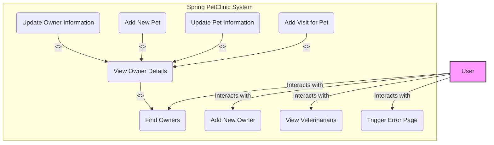
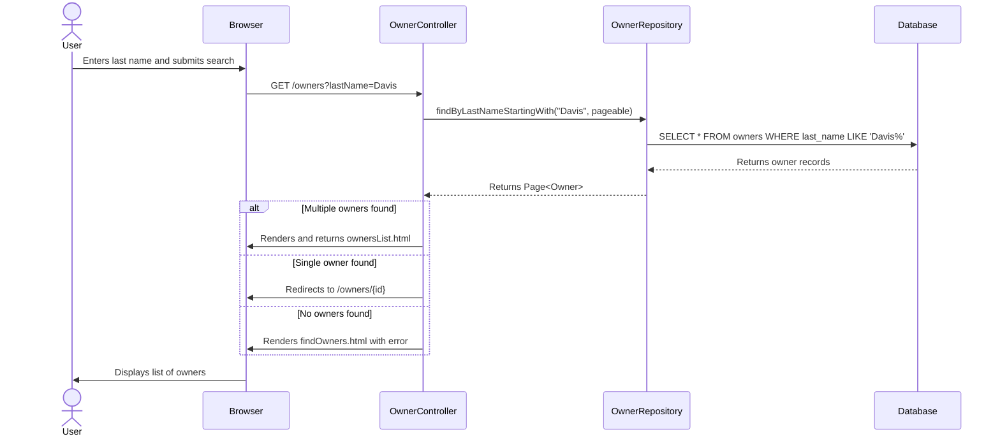
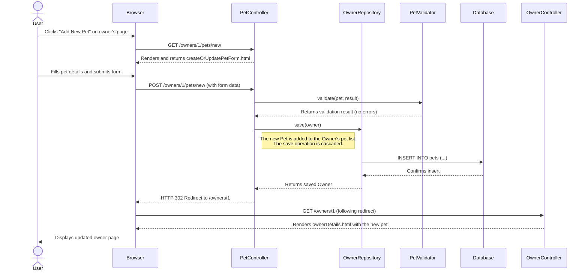
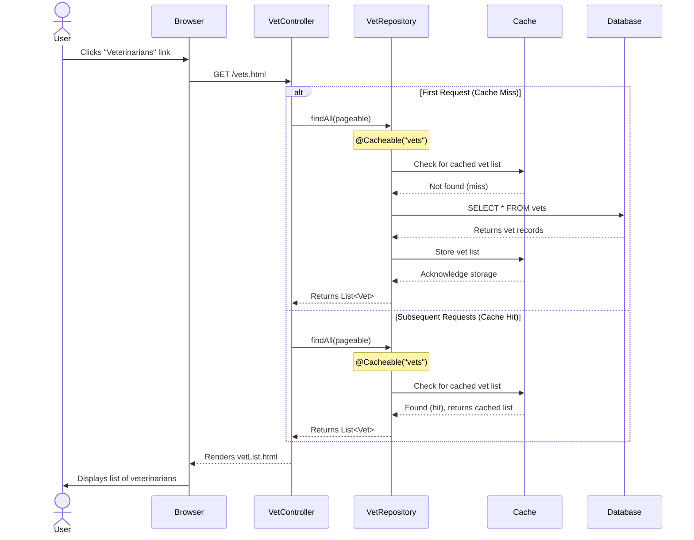

### 1. Use Case Diagram

This diagram provides a high-level overview of the main functionalities (use cases) available to a user of the PetClinic application. It shows what the system does from an external actor's perspective.

**Rationale:**
The application does not have distinct roles or authentication, so a single `User` actor is sufficient to represent anyone interacting with the system. The use cases cover all the primary features found in the controllers, such as managing owners, pets, visits, and viewing veterinarians.



### 2. Sequence Diagrams

Sequence diagrams are excellent for showing the step-by-step interactions between different components for a specific scenario.

---

#### a) Scenario: Finding an Owner

This diagram illustrates the process of a user searching for an owner by their last name, resulting in a list of multiple owners.

**Rationale:**
This is a core read-operation of the application. The diagram shows the flow from the user's browser to the `OwnerController`, which then queries the `OwnerRepository`. It correctly depicts the role of Spring Data JPA in abstracting the direct database interaction. The decision logic for handling single, multiple, or no results is also captured.



---

#### b) Scenario: Adding a New Pet to an Owner

This diagram shows the workflow for adding a new pet, including form display, submission, validation, and persistence.

**Rationale:**
This sequence demonstrates a key write-operation. It highlights the two-step process (GET for the form, POST for submission), the involvement of the `PetValidator` for business rule checks, and how the `OwnerRepository` is used to persist the new `Pet` by cascading the save from the parent `Owner` entity.



---

#### c) Scenario: Viewing Veterinarians (with Caching)

This diagram illustrates how the application fetches the list of veterinarians, showing both a cache miss (first request) and a cache hit (subsequent requests).

**Rationale:**
This scenario is important for demonstrating a non-functional requirement: performance optimization through caching. The diagram uses an `alt` block to clearly distinguish between the flow when data is not in the cache (requiring a database query) and when it is served directly from the cache, which is a key feature of the `VetRepository`.



### 3. Activity Diagram

This diagram models the business workflow or process flow of a complete user journey, focusing on the decisions and actions involved.

---

#### Workflow: Find an Owner and Add a Visit

This diagram shows the end-to-end process a user follows to find a specific owner and then add a new clinic visit for one of their pets.

**Rationale:**
Unlike a sequence diagram, this activity diagram focuses on the flow of control rather than message passing between objects. It's effective at showing user decision points (`if/else` logic) and loops (e.g., re-submitting a form after a validation error), providing a clear picture of the user experience and application logic from a process perspective.

```mermaid
graph TD
    subgraph "User Journey"
        A[Start] --> B{Navigate to 'Find Owners'};
        B --> C[Enter Last Name];
        C --> D{Submit Search};
        D --> E{System Searches for Owners};
        E --> F{Owner(s) Found?};
        F -- No --> G[Display 'Not Found' Message];
        G --> C;
        F -- Yes --> H{One or Multiple?};
        H -- One --> J[Display Owner Details];
        H -- Multiple --> I[Display Owner List];
        I --> K{Select an Owner};
        K --> J;
        J --> L{Click 'Add Visit' for a Pet};
        L --> M[Display 'New Visit' Form];
        M --> N[Enter Visit Details];
        N --> O{Submit Form};
        O --> P{Validate Data};
        P -- Invalid --> Q[Display Form with Errors];
        Q --> N;
        P -- Valid --> R[Save Visit to Database];
        R --> S[Redirect to Owner Details Page];
        S --> T[End];
    end

    style A fill:#8f8,stroke:#333,stroke-width:2px
    style T fill:#f88,stroke:#333,stroke-width:2px
```

### 4. State Machine Diagram

This diagram describes the different states an object can be in and the transitions between those states.

---

#### State: JPA Entity Lifecycle (Owner)

This diagram shows the lifecycle of an `Owner` entity as managed by the Java Persistence API (JPA) provider (e.g., Hibernate).

**Rationale:**
While the application logic itself is simple, the underlying persistence framework has a complex behavioral model. This diagram clarifies the states of an entity object (`Transient`, `Managed`, `Detached`, `Removed`) and how repository method calls (`save`, `delete`) cause transitions between these states. This is crucial for understanding how data is managed and persisted.

```mermaid
stateDiagram-v2
    direction LR
    [*] --> Transient: new Owner()

    state "In Memory" as Transient {
        note right of Transient
            The object has just been instantiated.
            It is not associated with any
            database session or record.
        end note
    }
    
    state "In Persistence Context" as Managed {
        note right of Managed
            The object is associated with a
            JPA session and maps to a
            database record. Changes are tracked.
        end note
    }

    state "Out of Context" as Detached {
        note right of Detached
            The object was once managed, but the
            JPA session it was attached to
            has closed. Changes are not tracked.
        end note
    }

    state "Marked for Deletion" as Removed {
         note right of Removed
            The object is still managed but
            is scheduled for deletion from the
            database when the transaction commits.
        end note
    }

    Transient --> Managed: ownerRepository.save(newOwner)
    Managed --> Detached: Transaction commits / Session closes
    Detached --> Managed: ownerRepository.save(detachedOwner) [merge]
    Managed --> Managed: Entity is modified within a transaction
    Managed --> Removed: ownerRepository.delete(owner)
    Removed --> [*]: Transaction commits
```