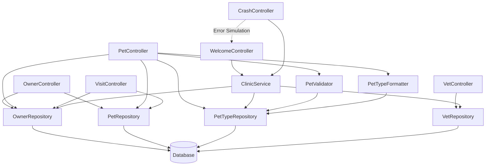

The component boundaries follow Spring MVC layered architecture with clear separation between presentation (Controllers), business logic (Service/Validators), and data access (Repositories) layers. Communication patterns are primarily synchronous request-response through Spring's dependency injection, with controllers handling web requests and delegating to service/repository layers. The database acts as a central shared resource with repositories providing data access abstraction through Spring Data JPA.