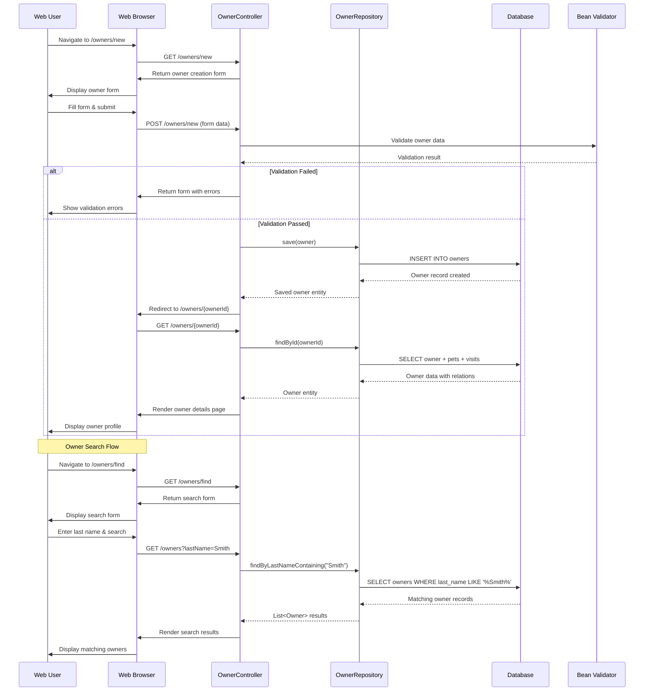
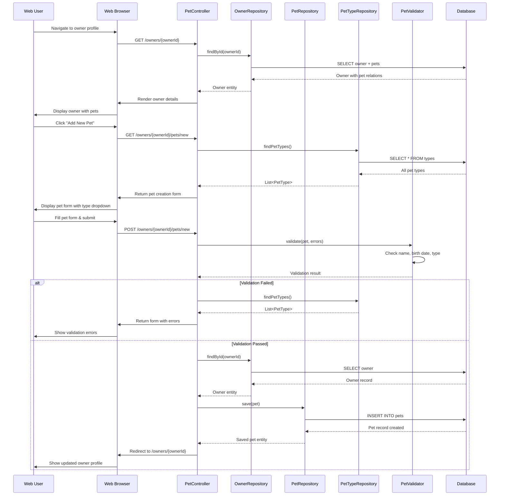
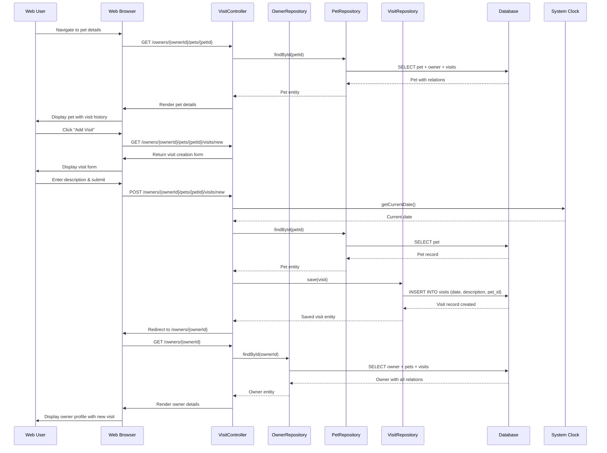
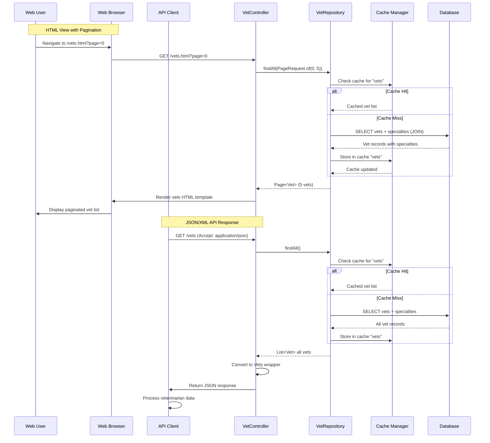
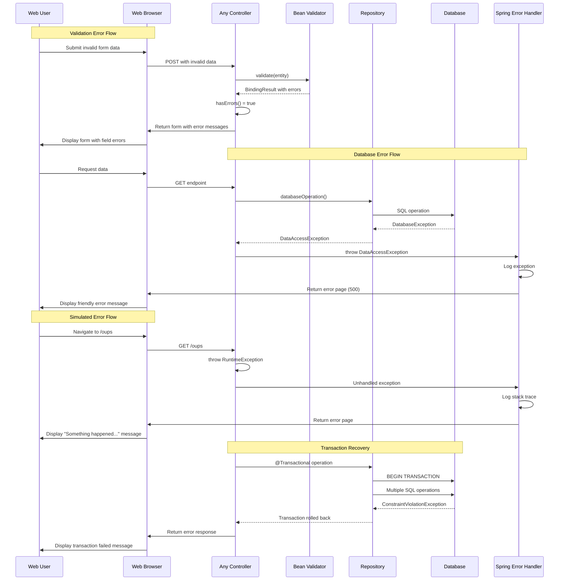
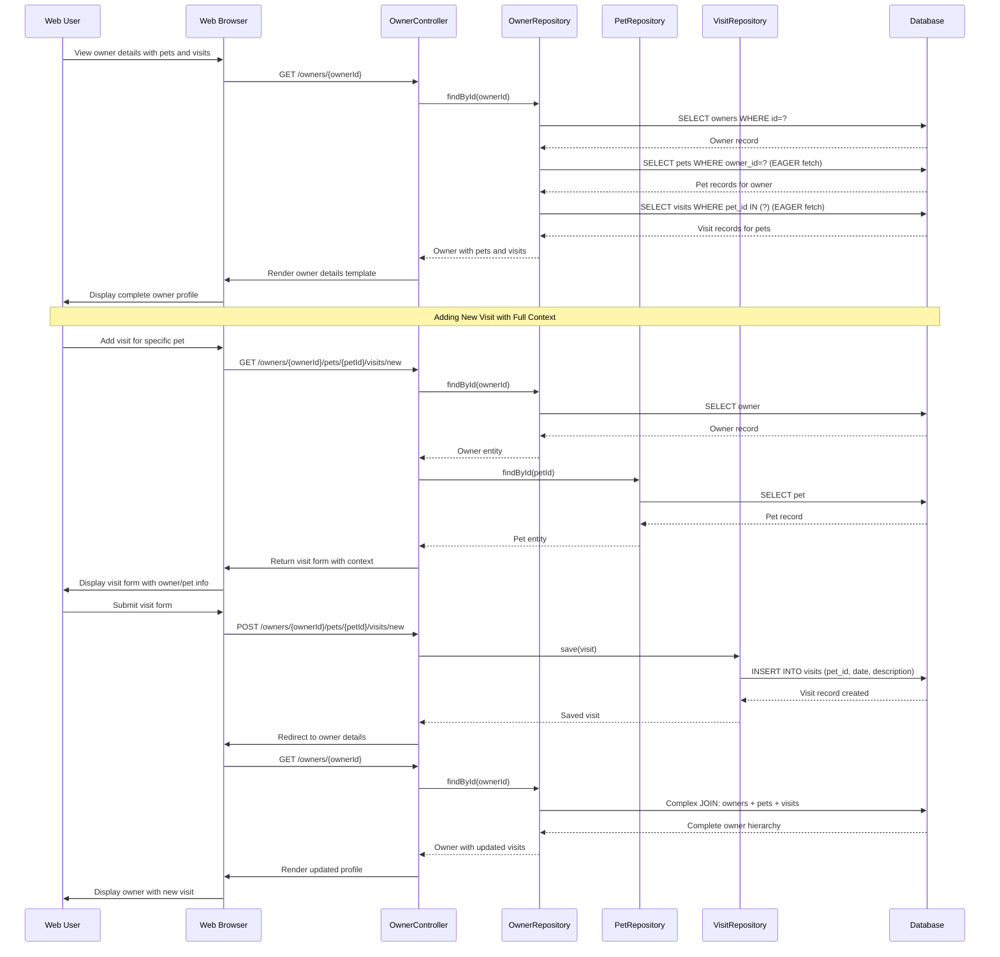
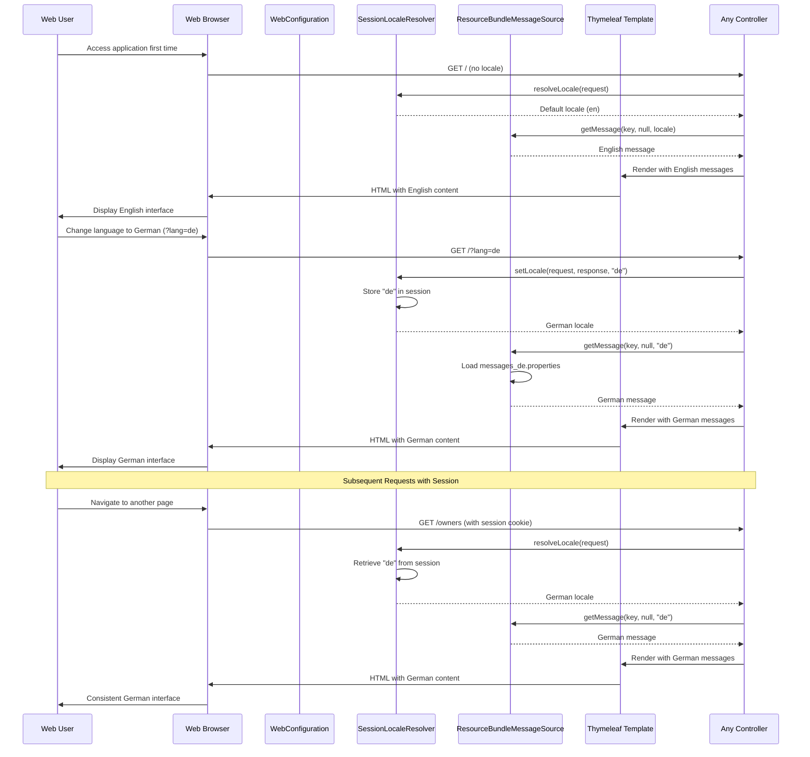

```markdown
# Spring PetClinic Dynamic Interaction Flows

## 1. Owner Registration and Management Workflow

### Workflow Description
**Purpose**: Complete lifecycle management of pet owners including creation, search, and profile updates
**Triggers**: User accesses owner management features through web interface
**Communication Patterns**: Synchronous REST calls, form submissions, database transactions

### Sequence Diagram


## 2. Pet Registration and Management Workflow

### Workflow Description
**Purpose**: Register new pets for existing owners and manage pet information
**Triggers**: Owner wants to add a new pet or update existing pet details
**Communication Patterns**: Form submissions with custom validation, database transactions with cascading operations

### Sequence Diagram


## 3. Veterinary Visit Scheduling Workflow

### Workflow Description
**Purpose**: Schedule and record veterinary visits for pets with automatic date assignment
**Triggers**: Owner schedules a new veterinary appointment for their pet
**Communication Patterns**: Form processing with automatic date population, database transactions with entity relationships

### Sequence Diagram


## 4. Veterinarian Information Retrieval Workflow

### Workflow Description
**Purpose**: Display veterinarian lists with specialties in multiple formats with caching
**Triggers**: User requests veterinarian information through web interface or API
**Communication Patterns**: Cached repository calls, multi-format response handling, paginated results

### Sequence Diagram


## 5. Error Handling and Recovery Workflow

### Workflow Description
**Purpose**: Handle system errors, validation failures, and provide graceful degradation
**Triggers**: System exceptions, validation errors, or simulated errors via /oups endpoint
**Communication Patterns**: Exception handling, error page rendering, validation feedback

### Sequence Diagram


## 6. Data Flow During Owner-Pet-Visit Relationship Management

### Workflow Description
**Purpose**: Demonstrate complex data flow when managing interrelated owner, pet, and visit entities
**Triggers**: Complete lifecycle operations involving multiple entity types
**Communication Patterns**: Eager loading of relationships, cascading operations, complex database queries

### Sequence Diagram


## 7. Internationalization and Localization Flow

### Workflow Description
**Purpose**: Handle multi-language support with session-based locale resolution
**Triggers**: User changes language preference or accesses application with locale headers
**Communication Patterns**: Session management, message bundle resolution, template localization

### Sequence Diagram
