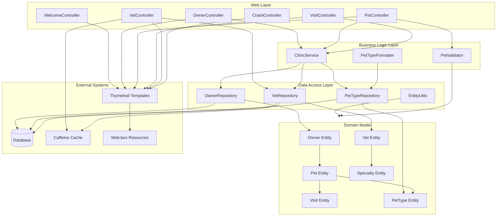

The component boundaries follow a traditional layered architecture with clear separation between web, business logic, data access, and domain layers. Communication patterns are primarily synchronous and request-driven, with controllers handling web requests, services coordinating business logic, and repositories managing data persistence. The architecture demonstrates strong domain cohesion within each layer while maintaining loose coupling through dependency injection and interface-based abstractions.