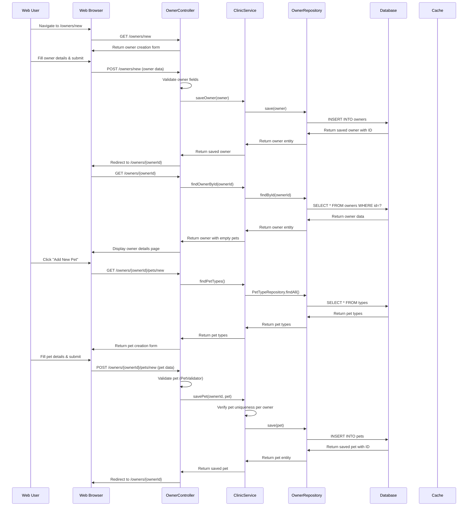
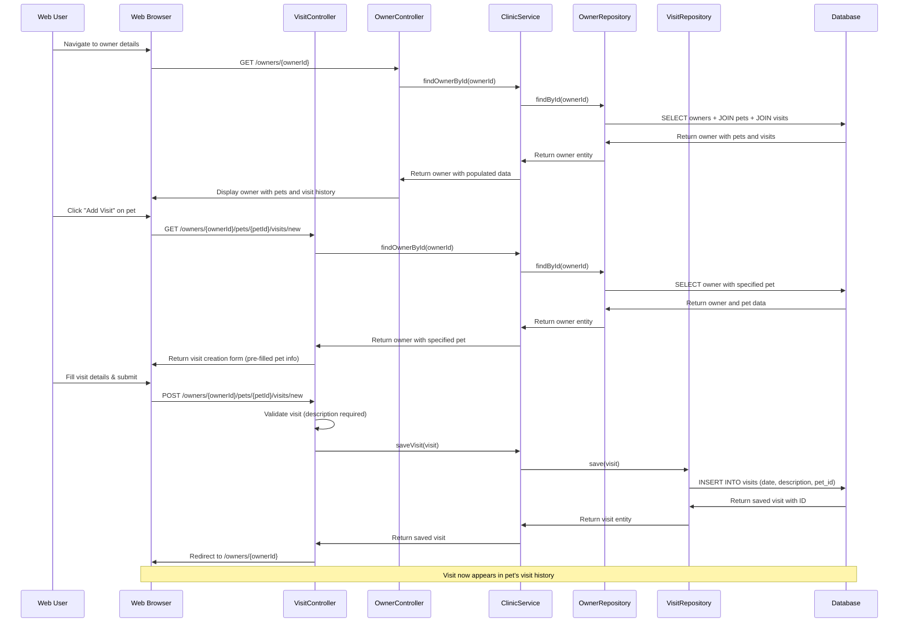
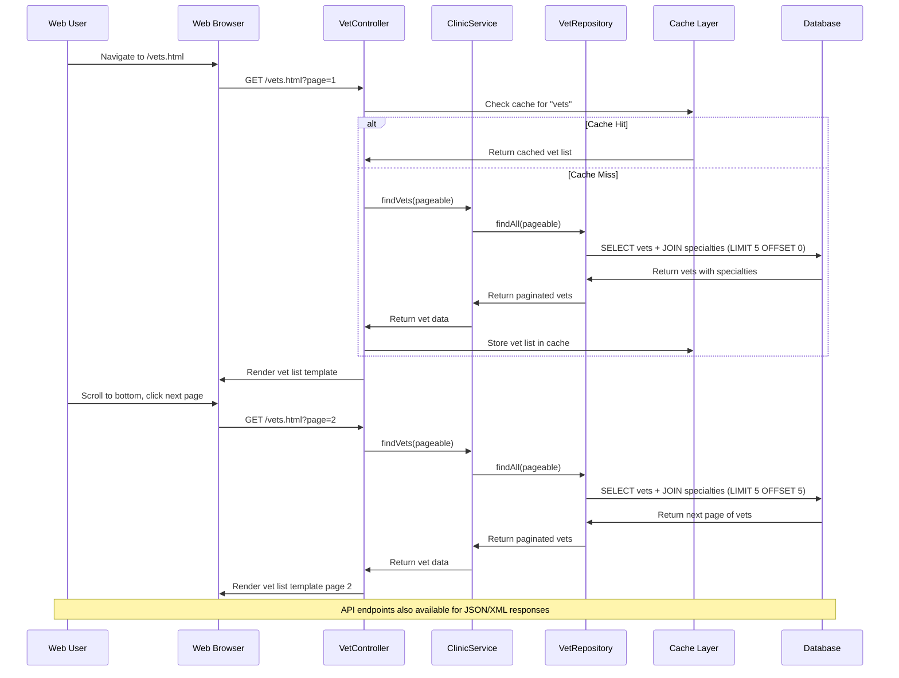
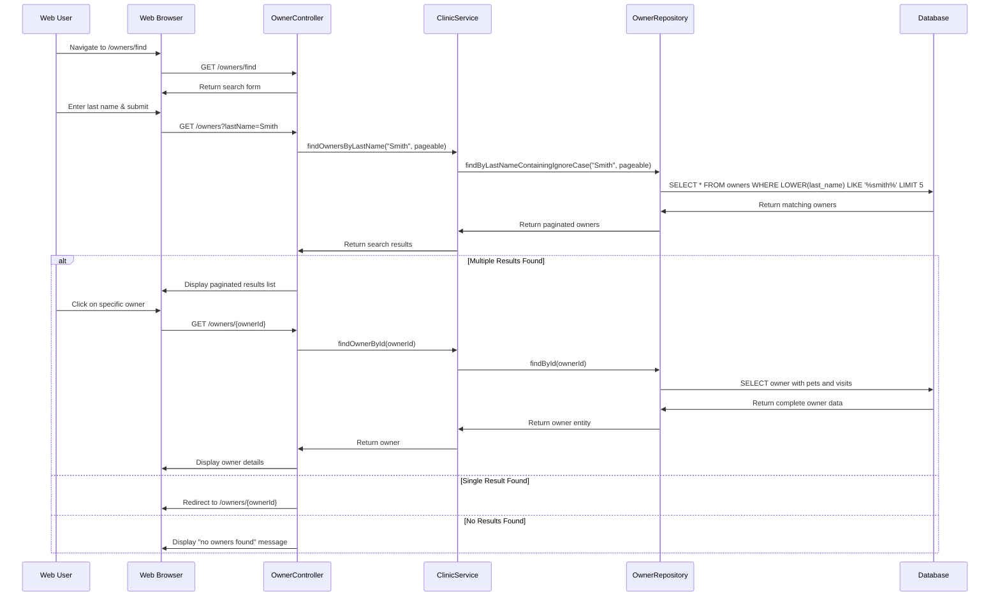
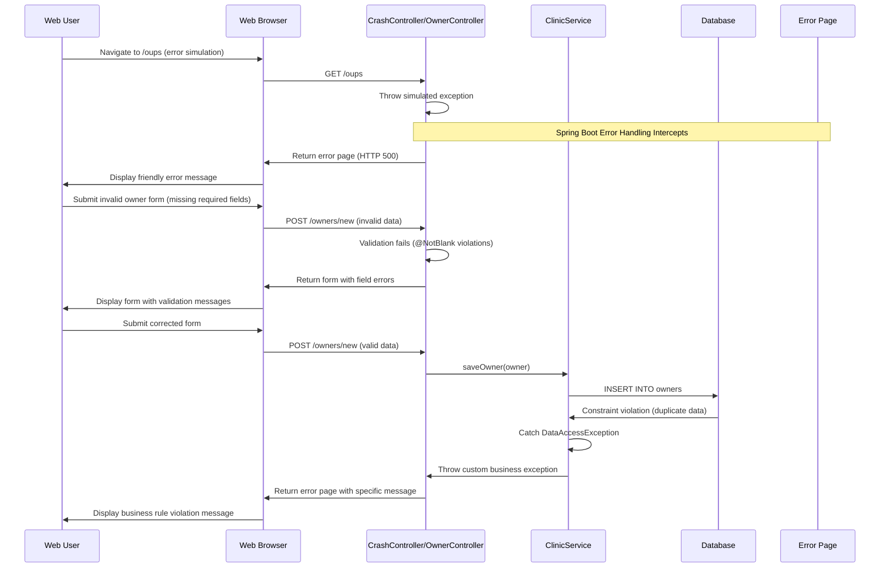

```markdown
## Dynamic Interaction Flows for Spring PetClinic

### Workflow 1: Owner Registration and Pet Management

**Purpose**: Complete workflow for registering a new owner and adding pets to their account
**Triggers**: User accesses owner registration form via `/owners/new`



**Communication Patterns**: 
- Synchronous REST calls for form submissions
- Database transactions for data persistence
- Server-side validation with custom validators
- Redirect-after-POST pattern to prevent duplicate submissions

---

### Workflow 2: Veterinary Visit Scheduling

**Purpose**: Schedule and record veterinary visits for pets
**Triggers**: User navigates to visit creation form for specific pet



**Communication Patterns**:
- Form-based synchronous HTTP requests
- Eager fetching of related entities (Owner → Pets → Visits)
- Transactional database operations
- Automatic date population (defaults to current date)

---

### Workflow 3: Veterinarian Directory Access

**Purpose**: Display paginated list of veterinarians with their specialties
**Triggers**: User navigates to veterinarian listing page



**Communication Patterns**:
- Cache-aside pattern for performance optimization
- Database pagination with Spring Data Pageable
- Eager fetching of vet specialties
- Multi-format response support (HTML/JSON/XML)

---

### Workflow 4: Owner Search and Discovery

**Purpose**: Search for owners by last name with paginated results
**Triggers**: User accesses owner search functionality



**Communication Patterns**:
- Case-insensitive search with database-level filtering
- Pagination with fixed page size (5 results per page)
- Automatic redirect for single-result searches
- Eager loading of related data for detailed views

---

### Workflow 5: Error Handling and Recovery

**Purpose**: Demonstrate system error handling and user experience
**Triggers**: User accesses error simulation endpoint or validation fails



**Communication Patterns**:
- Global exception handling with Spring Boot
- Bean validation for input sanitization
- Database constraint violation handling
- Graceful degradation with user-friendly error messages
- Form re-display with validation feedback
```