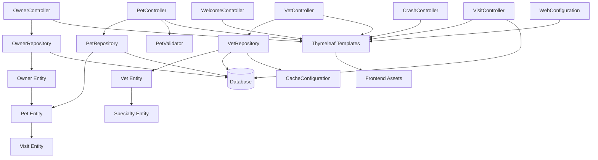

The component boundaries follow domain-driven design principles with clear separation between presentation, business logic, and data access layers. Communication patterns are primarily synchronous request-response via Spring MVC controllers, with repository abstractions handling database interactions. Cross-cutting concerns like caching and internationalization are managed through centralized configuration components that integrate with the domain layers.