```markdown
# Spring PetClinic Dynamic Interaction Flows

## Workflow 1: Owner Registration and Pet Management

### Description
This workflow covers the complete lifecycle of registering a new pet owner and managing their pets. It starts with owner registration, followed by pet registration, and potentially visit scheduling.

### Communication Patterns
- **Synchronous**: REST form submissions, database transactions
- **Database**: JPA/Hibernate entity persistence
- **Validation**: Bean validation with custom validators

### Sequence Diagram


## Workflow 2: Owner Search and Profile Management

### Description
This workflow handles searching for existing owners, viewing their profiles, and updating owner information. It demonstrates pagination and search functionality.

### Communication Patterns
- **Synchronous**: REST GET/POST requests
- **Database**: JPA query methods with pagination
- **Caching**: None (owner data not cached)

### Sequence Diagram


## Workflow 3: Veterinarian Directory Access

### Description
This workflow covers accessing the veterinarian directory, which demonstrates caching and API content negotiation patterns.

### Communication Patterns
- **Synchronous**: REST requests with content negotiation
- **Caching**: JCache with Caffeine provider
- **Database**: Repository with @Cacheable annotation

### Sequence Diagram


## Workflow 4: Error Handling and Validation

### Description
This workflow demonstrates the system's error handling and validation patterns, including custom validation logic and error page rendering.

### Communication Patterns
- **Synchronous**: Form validation and error responses
- **Validation**: Bean Validation with custom validators
- **Error Handling**: Spring MVC error resolution

### Sequence Diagram


## Workflow 5: Internationalization and Localization

### Description
This workflow shows how the application handles internationalization, including locale resolution and message bundle management.

### Communication Patterns
- **Synchronous**: HTTP request with locale context
- **Localization**: Spring MessageSource with property files
- **Templating**: Thymeleaf with i18n expressions

### Sequence Diagram



```mermaid
sequenceDiagram
    participant User as Client Browser
    participant WebConfig as WebConfiguration
    participant LocaleRes as LocaleResolver
    participant MessageSrc as MessageSource
    participant View as Thymeleaf Templates
    participant OwnerCtrl as OwnerController

    User->>OwnerCtrl: GET /owners/find (Accept-Language: fr)
    OwnerCtrl->>LocaleRes: resolveLocale(request)
    LocaleRes-->>OwnerCtrl: Locale.FRENCH
    
    OwnerCtrl->>View: owners/findOwners.html
    View->>MessageSrc: getMessage("welcome", null, locale)
    MessageSrc-->>View: "Bienvenue" from messages_fr.properties
    View->>MessageSrc: getMessage("find.owners", null, locale)
    MessageSrc-->>View: "Trouver des propriétaires"
    View->>MessageSrc: getMessage("error.required", null, locale)
    MessageSrc-->>View: "Ce champ est obligatoire"
    
    View-->>User: Rendered French HTML page
    
    Note over User,View: Validation Messages
    User->>OwnerCtrl: POST /owners/new (invalid - French locale)
    OwnerCtrl->>OwnerCtrl: @Valid with binding result
    OwnerCtrl->>MessageSrc: getMessage(bindingError, locale)
    MessageSrc-->>OwnerCtrl: French error message
    OwnerCtrl-->>User: Form with French validation errors
```

## Workflow 6: Database Integration and Transaction Management

### Description
This workflow demonstrates the database interaction patterns, including transaction management and repository operations across multiple entities.

### Communication Patterns
- **Synchronous**: JPA/Hibernate entity operations
- **Transactions**: Spring @Transactional management
- **Database**: Connection pooling and ORM mapping

### Sequence Diagram


## Workflow 7: Caching Strategy Implementation

### Description
This workflow illustrates the caching mechanism used for veterinarian data, demonstrating cache-aside pattern with JCache and Caffeine.

### Communication Patterns
- **Caching**: JCache API with Caffeine provider
- **Pattern**: Cache-Aside (Lazy Loading)
- **Monitoring**: JMX cache statistics

### Sequence Diagram

