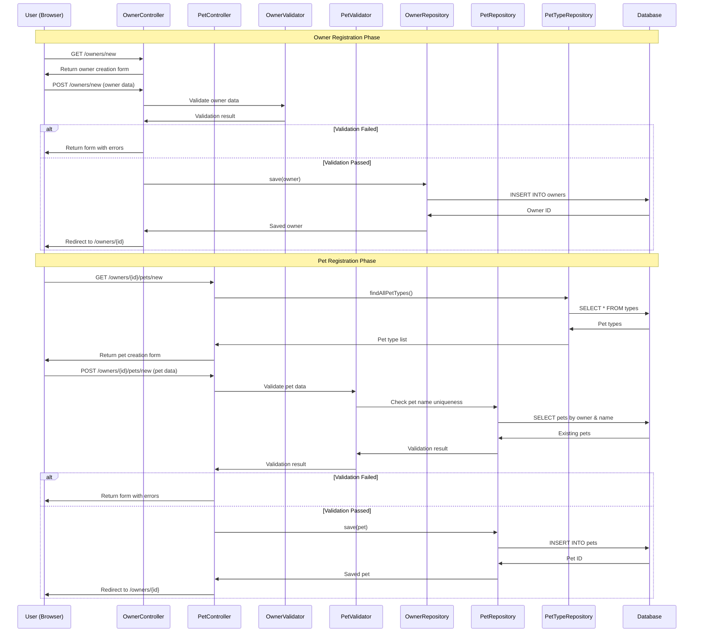
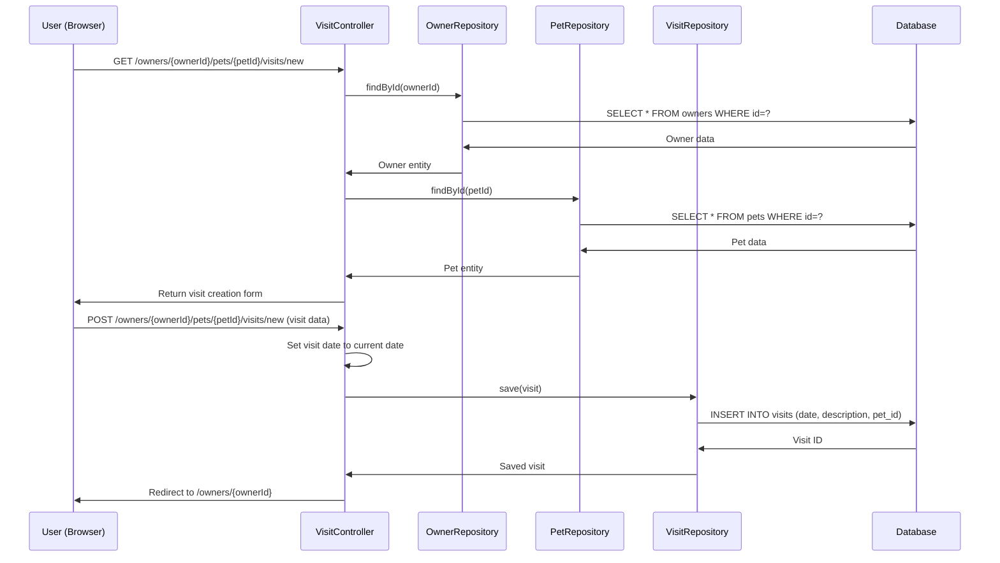
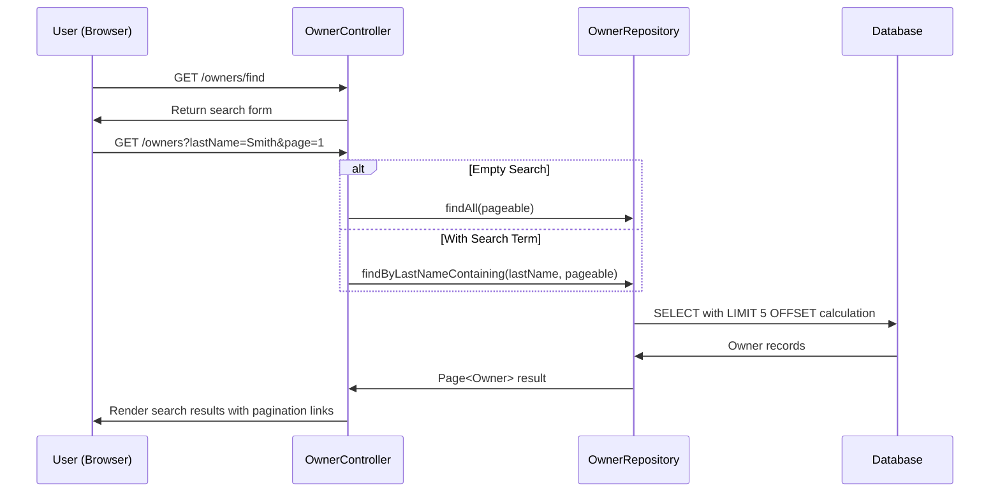
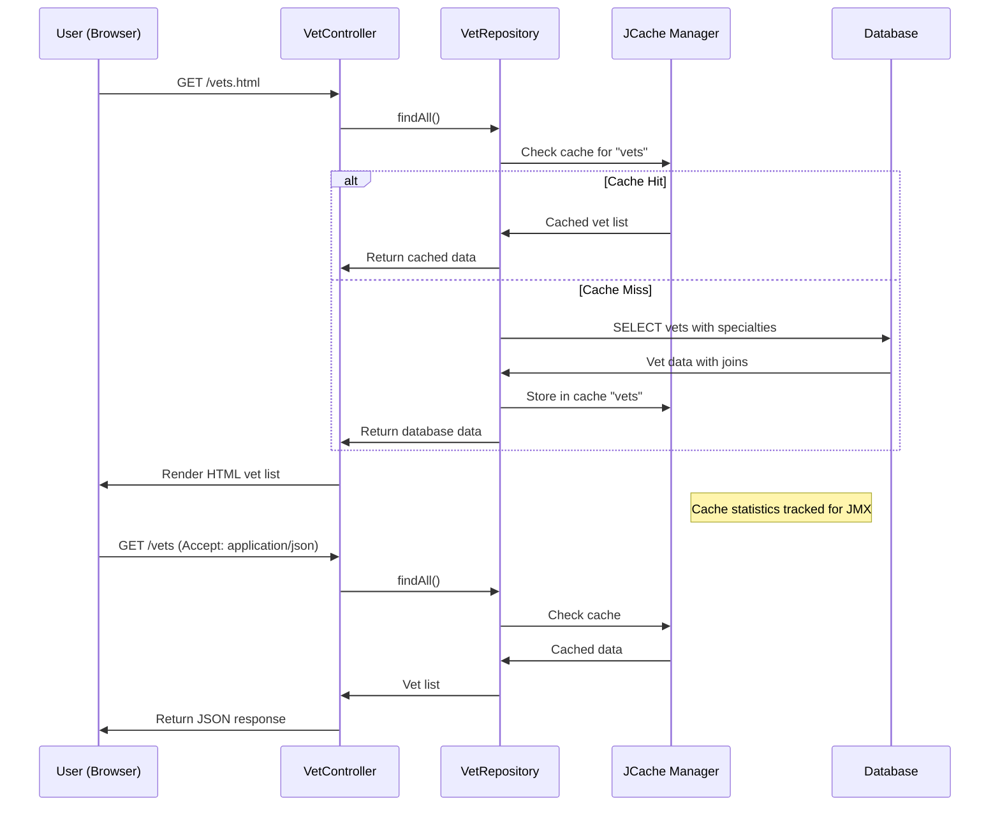
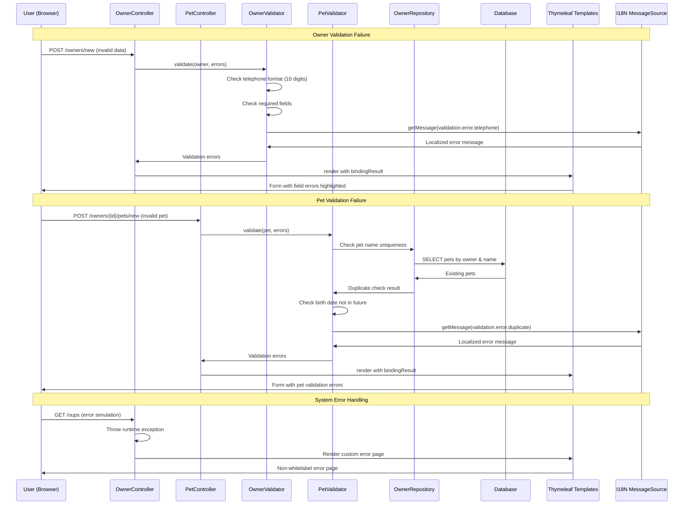
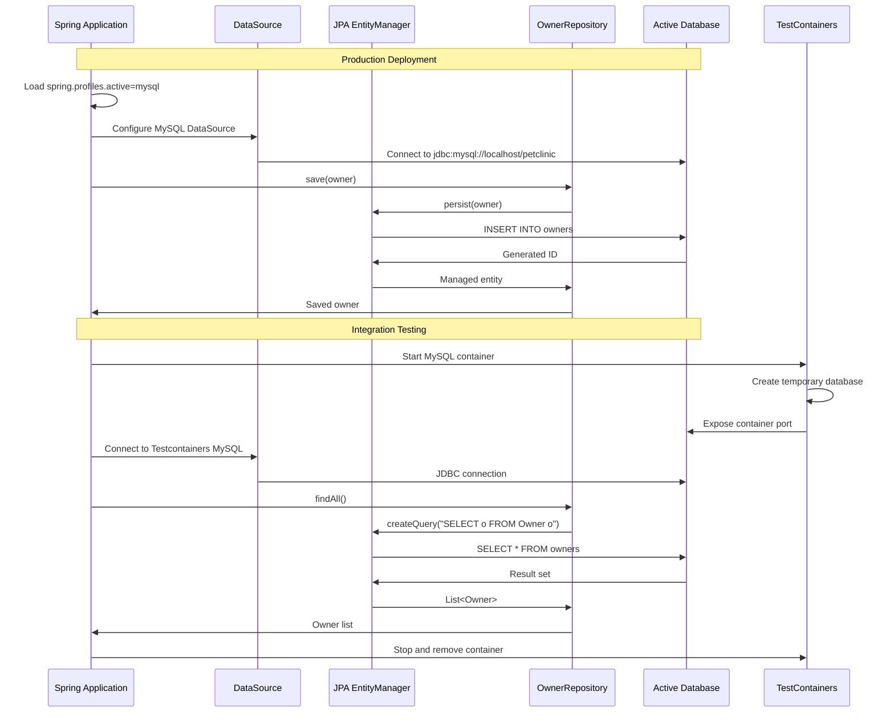
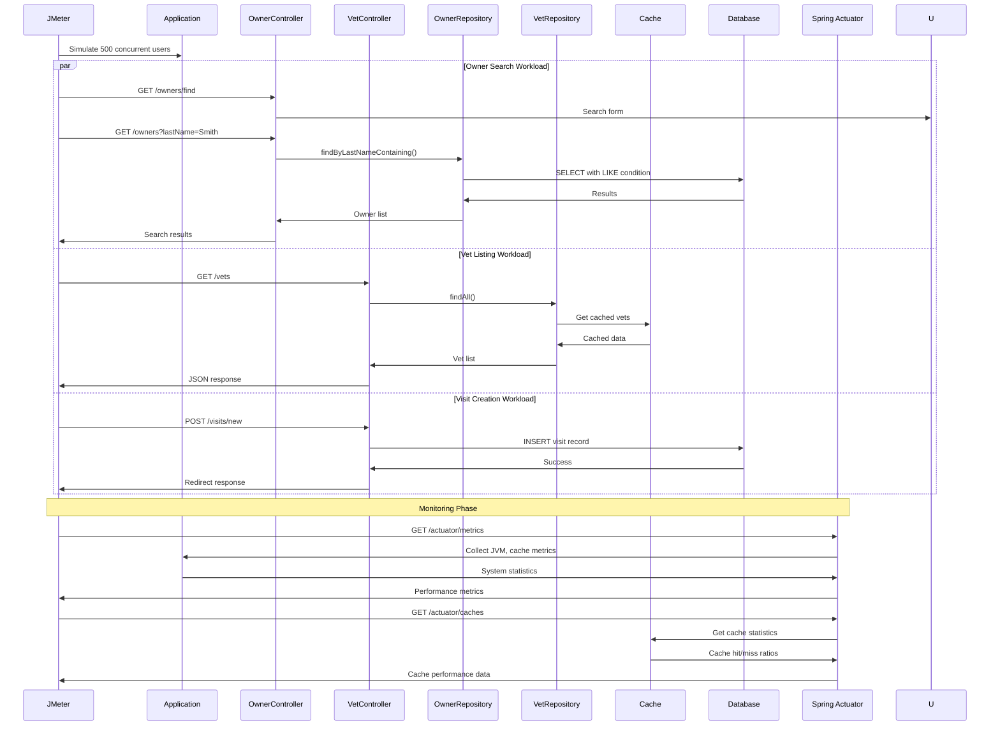

```markdown
# Spring PetClinic Dynamic Interaction Flows

## Workflow 1: Owner Registration and Pet Management

### Description
This workflow captures the complete process of registering a new owner and managing their pets. It's triggered when a new client visits the veterinary clinic and needs to be added to the system along with their pets.

### Communication Patterns
- Synchronous REST calls for form submissions
- Database transactions for data persistence
- Server-side validation with custom validators
- Form-based navigation with redirects



## Workflow 2: Veterinary Visit Scheduling

### Description
This workflow handles the scheduling and recording of veterinary visits for pets. It's triggered when a pet owner brings their animal for a medical checkup or treatment.

### Communication Patterns
- Form-based data submission
- Automatic date handling (current date)
- Database transactions with entity relationships
- Redirect-after-POST pattern



## Workflow 3: Owner Search and Pagination

### Description
This workflow handles the search functionality for finding owners by last name with pagination support. It's triggered when clinic staff needs to locate a client's record.

### Communication Patterns
- Search form submission
- Database queries with LIKE conditions
- Pagination handling (5 records per page)
- Server-side rendering with Thymeleaf



## Workflow 4: Veterinarian Information Retrieval

### Description
This workflow handles the retrieval of veterinarian information with caching support. It's triggered when displaying the clinic staff information on the website.

### Communication Patterns
- Cached data access with JCache/Caffeine
- Multiple response formats (HTML/JSON/XML)
- Asynchronous cache population
- JMX monitoring integration



## Workflow 5: Error Handling and Validation

### Description
This workflow demonstrates the comprehensive error handling and validation patterns throughout the application, including custom validators and internationalized error messages.

### Communication Patterns
- Bean validation with custom validators
- Internationalized error messages
- Form re-rendering with error display
- Custom error page handling



## Workflow 6: Multi-Database Deployment and Testing

### Description
This workflow shows the database interaction patterns across different deployment scenarios, including profile-based database selection and Testcontainers-based integration testing.

### Communication Patterns
- Profile-based data source configuration
- Testcontainers for isolated database testing
- JPA repository abstraction
- Transaction management



## Workflow 7: Performance Testing and Monitoring

### Description
This workflow demonstrates the performance testing patterns and monitoring capabilities, including JMeter load testing and Actuator endpoints for system observability.

### Communication Patterns
- JMeter-based load testing
- Spring Boot Actuator monitoring
- Database connection pooling
- Caffeine cache statistics

