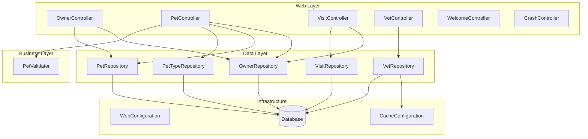

The component boundaries follow domain-driven design principles with clear separation between web presentation, business logic, and data access layers. Communication patterns are primarily synchronous request-response through Spring MVC controllers calling repository interfaces, with VetRepository using cached data access for performance optimization. The architecture maintains clean separation of concerns while enabling clear migration paths to microservices along domain boundaries.