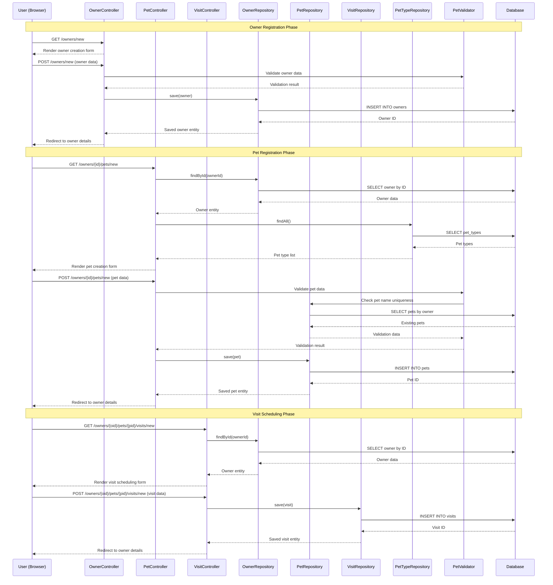
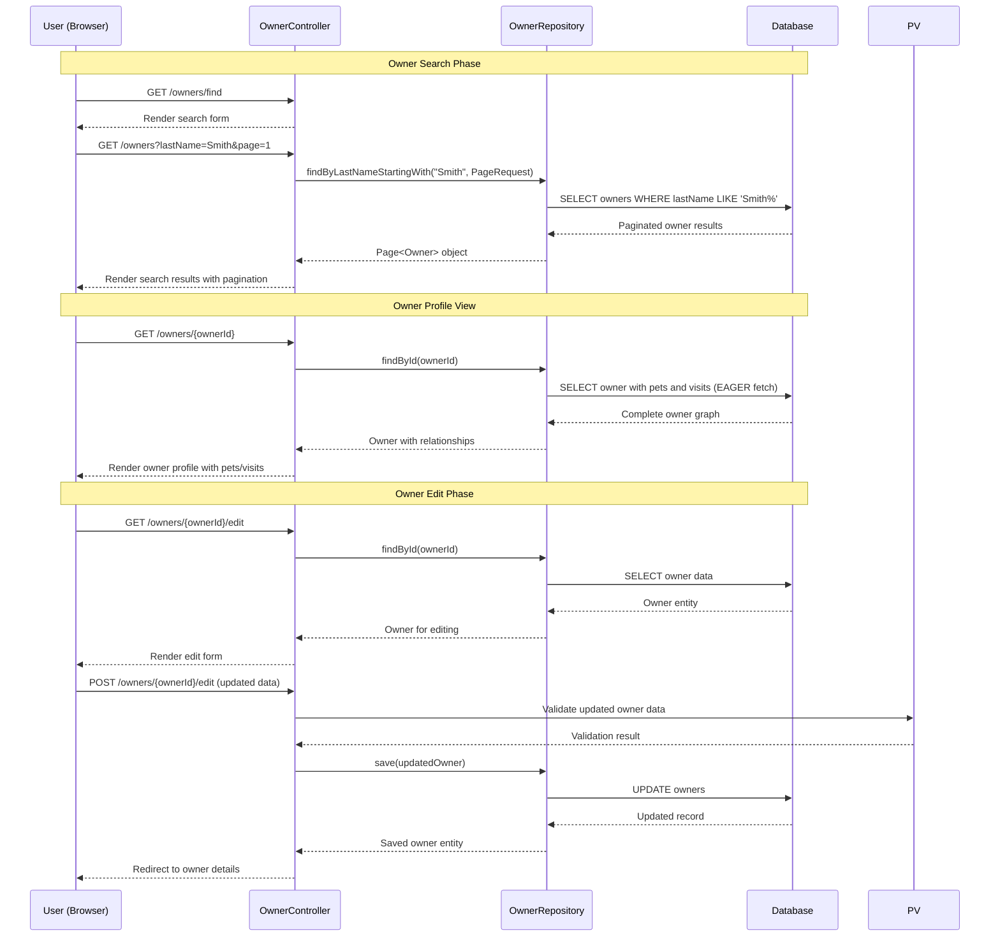
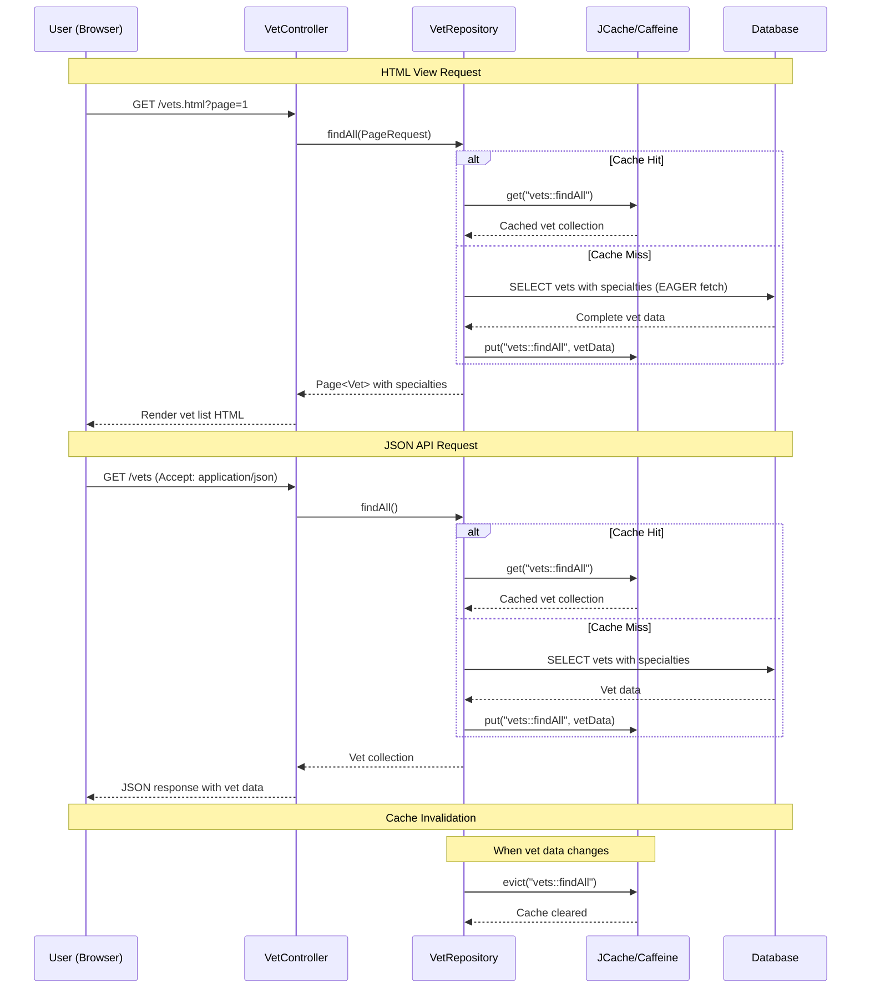
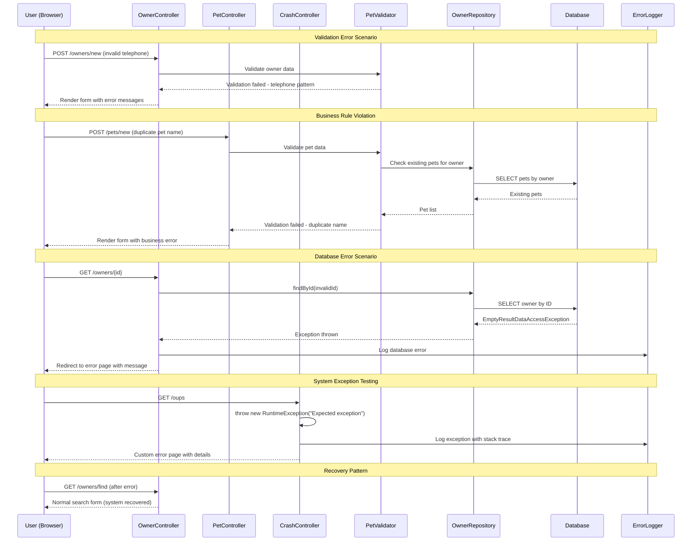
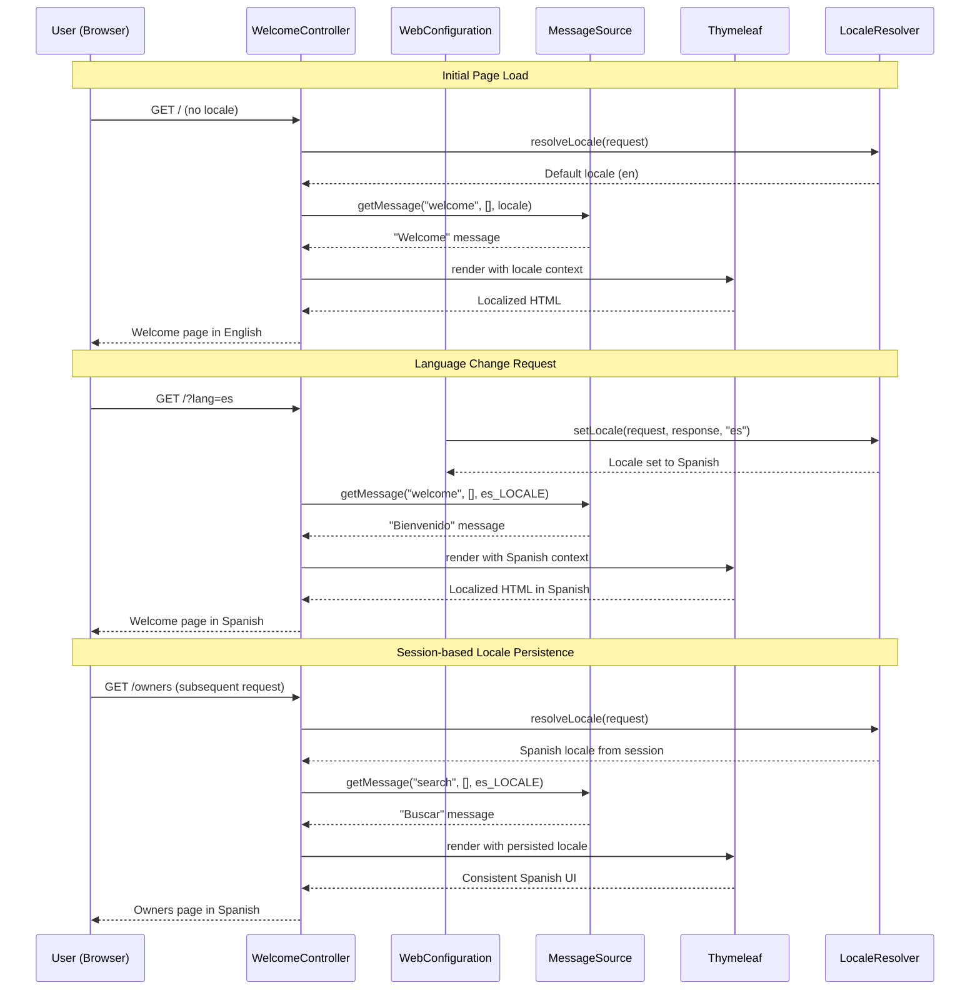
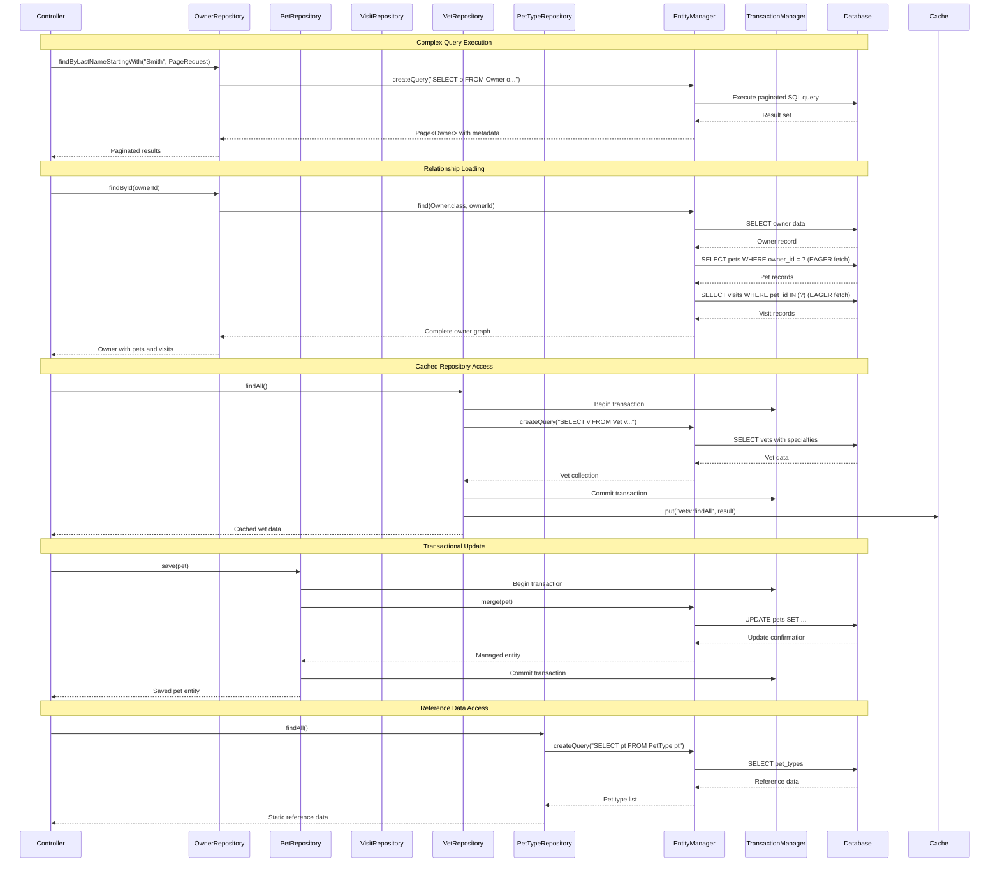

```markdown
# Spring PetClinic Dynamic Interaction Flows

## Workflow 1: Owner Registration and Pet Management

### Description
Complete workflow for registering a new owner, adding pets, and scheduling veterinary visits. This represents the core customer journey through the application.

### Sequence Diagram



### Communication Patterns
- **Synchronous HTTP**: Form submissions and redirects
- **Database Transactions**: JPA-managed transactions for data consistency
- **Server-Side Validation**: Bean validation and custom business rules
- **Repository Pattern**: Data access abstraction through Spring Data JPA

---

## Workflow 2: Owner Search and Profile Management

### Description
Workflow for searching owners by last name with pagination and managing owner profiles through edit operations.

### Sequence Diagram



### Communication Patterns
- **Pagination**: Database-level pagination with Spring Data
- **Eager Fetching**: Owner-pet-visit relationship loading
- **Form Validation**: Server-side validation before persistence
- **Optimistic Locking**: JPA versioning for concurrent updates

---

## Workflow 3: Veterinarian Directory with Caching

### Description
High-performance veterinarian listing workflow demonstrating caching strategies and multi-format API responses.

### Sequence Diagram



### Communication Patterns
- **Caching Strategy**: JCache with Caffeine backend for performance
- **Multi-format Responses**: Content negotiation (HTML/JSON/XML)
- **Eager Loading**: Vet-specialty relationship loading
- **Cache Invalidation**: Manual eviction on data changes

---

## Workflow 4: Error Handling and System Resilience

### Description
Comprehensive error handling workflow showing validation failures, exception scenarios, and recovery patterns.

### Sequence Diagram



### Communication Patterns
- **Declarative Validation**: Bean Validation with custom constraints
- **Exception Handling**: Spring MVC @ExceptionHandler for graceful degradation
- **Error Logging**: Structured logging for operational visibility
- **User Feedback**: Meaningful error messages with recovery guidance

---

## Workflow 5: Internationalization and Configuration

### Description
Dynamic locale resolution and configuration management workflow supporting multi-language deployment.

### Sequence Diagram



### Communication Patterns
- **Session-based Localization**: Persistent locale storage across requests
- **Message Source Abstraction**: Externalized message properties
- **Content Negotiation**: Dynamic language switching via URL parameters
- **Template Resolution**: Thymeleaf integration with locale context

---

## Workflow 6: Data Access Patterns and Repository Interactions

### Description
Comprehensive data access workflow showing repository patterns, relationship loading, and transaction management.

### Sequence Diagram



### Communication Patterns
- **Repository Abstraction**: Spring Data JPA repository pattern
- **Eager/Lazy Loading**: Configurable relationship fetching strategies
- **Transaction Management**: JPA transaction boundaries
- **Cached Access**: Performance optimization for read-heavy operations
- **Pagination**: Database-level result set pagination
```