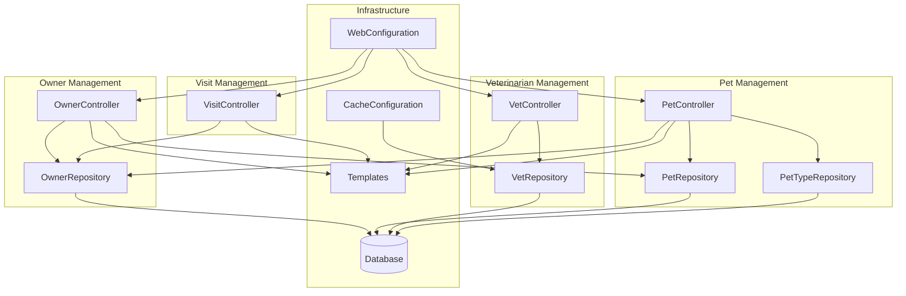

The component boundaries follow domain-driven design principles, with each domain aggregate (Owner, Pet, Vet, Visit) forming a natural cohesion boundary. Communication patterns are primarily synchronous HTTP requests from controllers to repositories, with the Vet component utilizing caching for performance optimization. The architecture maintains clear separation between web presentation, business logic, and data access layers while sharing a common database infrastructure.