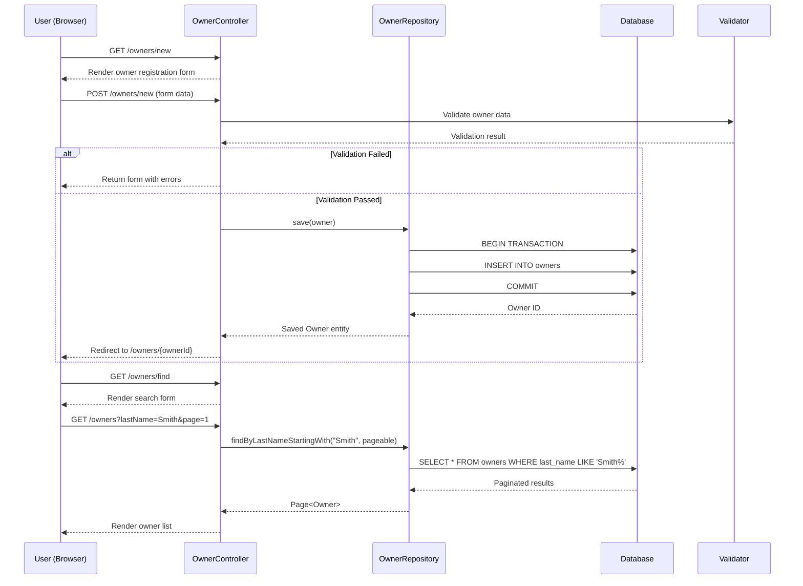
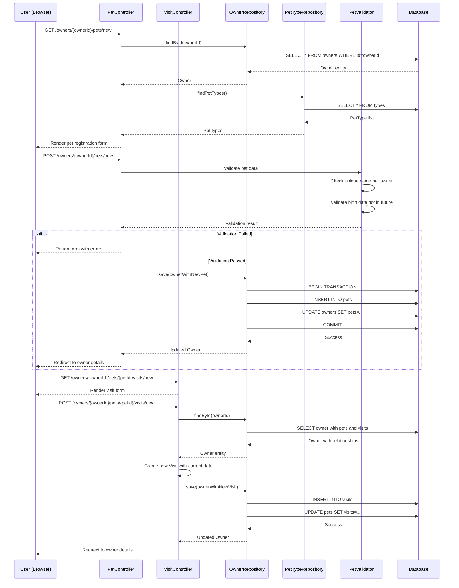
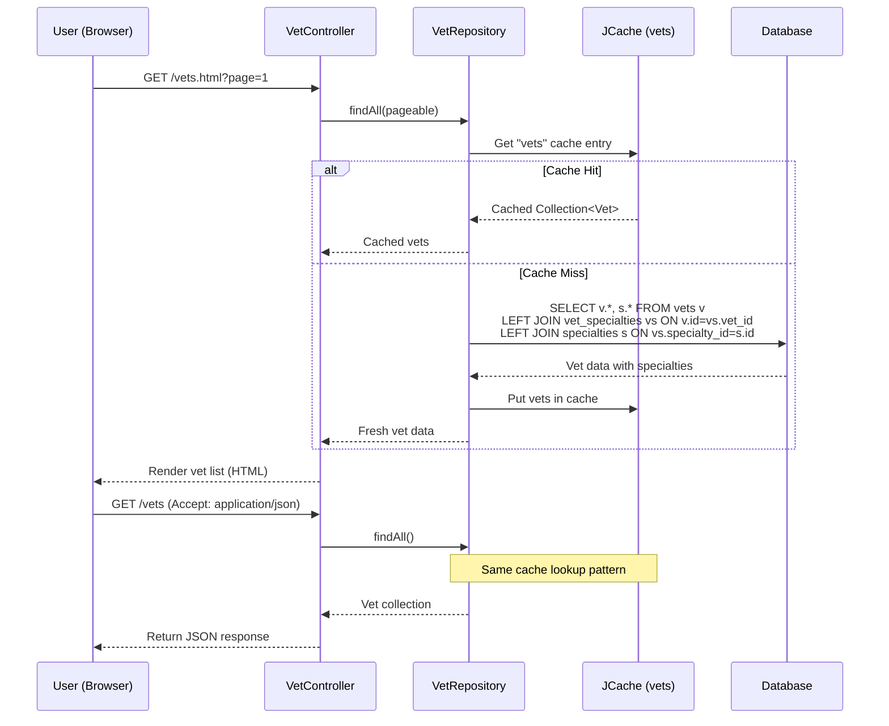
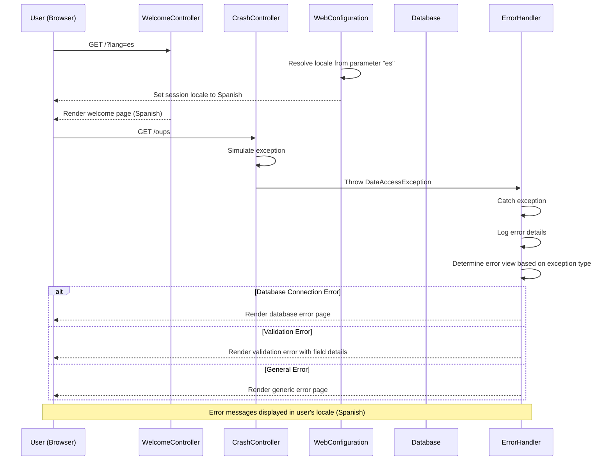
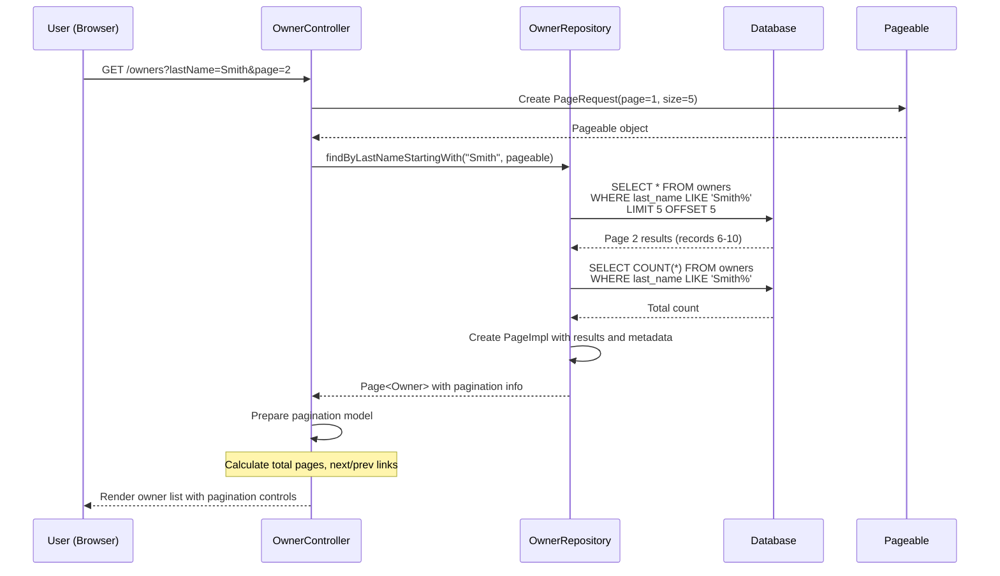
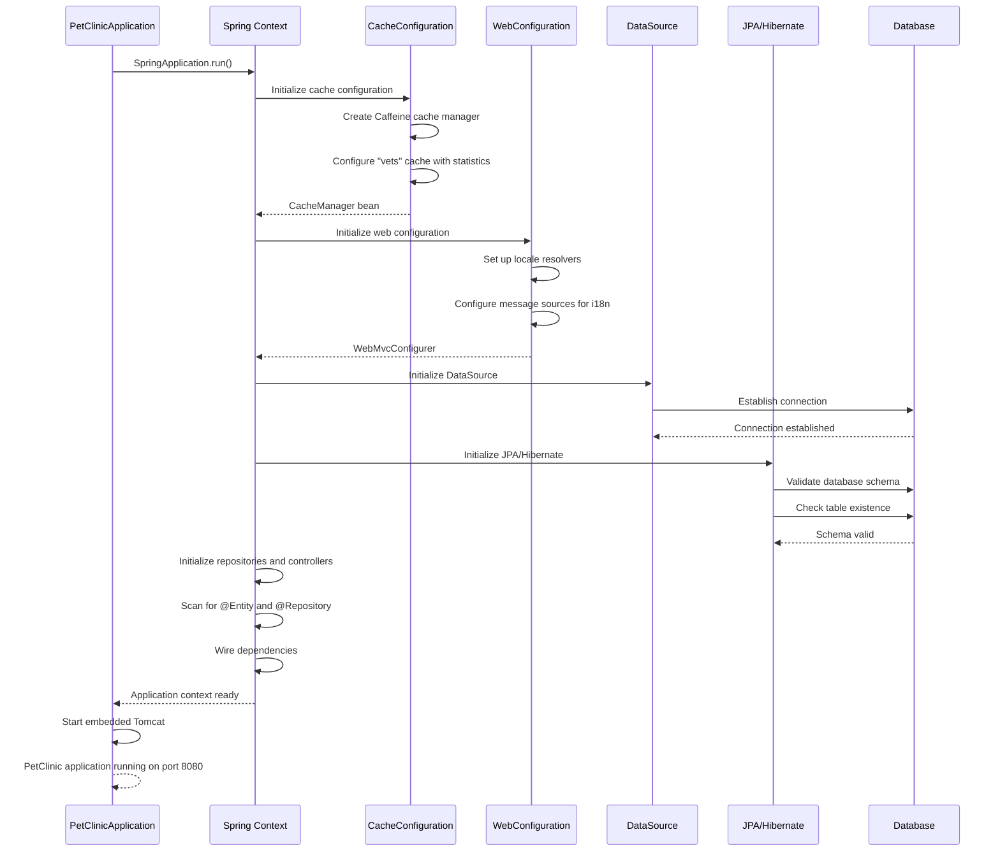

# Spring PetClinic Dynamic Interaction Flows

## Workflow 1: Owner Registration and Management

### Description
This workflow handles the complete lifecycle of owner management including registration, search, and profile updates. It's triggered when users need to register new pet owners or manage existing ones.

### Sequence Diagram

### Communication Patterns
- **Synchronous HTTP**: Form submissions and page navigation
- **Database Transactions**: ACID transactions for data consistency
- **Server-side Validation**: Bean validation with custom business rules
- **Pagination**: Database-level pagination for performance

---

## Workflow 2: Pet Registration and Medical History

### Description
This workflow manages pet registration, updates, and maintains the complete medical history through visit tracking. It's triggered when pets are registered or when medical visits occur.

### Sequence Diagram

### Communication Patterns
- **Eager Loading**: Owner with pets and visits loaded in single query
- **Cascade Operations**: JPA cascade saves for related entities
- **Business Validation**: Custom validation rules for pet data
- **Transaction Management**: Atomic operations for data consistency

---

## Workflow 3: Veterinarian Directory Access

### Description
This workflow handles the display of veterinarian information with caching for performance optimization. It's triggered when users view the vet directory.

### Sequence Diagram

### Communication Patterns
- **Caching Strategy**: JCache with Caffeine for vet data
- **Eager Fetching**: Vets with specialties loaded together
- **Content Negotiation**: HTML and JSON responses from same endpoint
- **Cache-Aside Pattern**: Check cache first, then database

---

## Workflow 4: Error Handling and Internationalization

### Description
This workflow demonstrates the system's error handling capabilities and internationalization support across different user locales.

### Sequence Diagram

### Communication Patterns
- **Locale Resolution**: Session-based and parameter-based locale switching
- **Exception Handling**: Spring MVC exception handlers with specific error views
- **Graceful Degradation**: User-friendly error pages instead of stack traces
- **Internationalization**: Error messages in user's preferred language

---

## Workflow 5: Search and Pagination Operations

### Description
This workflow handles search operations with pagination for large datasets, ensuring performance and user experience for data browsing.

### Sequence Diagram

### Communication Patterns
- **Database Pagination**: LIMIT/OFFSET queries at database level
- **Count Queries**: Separate count queries for pagination metadata
- **Pageable Abstraction**: Spring Data pagination interface
- **Stateless Pagination**: URL parameters maintain pagination state

---

## Workflow 6: System Startup and Configuration

### Description
This workflow shows the application startup process including configuration loading, cache initialization, and database connection setup.

### Sequence Diagram

### Communication Patterns
- **Dependency Injection**: Spring container wiring components
- **Lazy Initialization**: Components initialized on first use
- **Connection Pooling**: Database connection management
- **Configuration Profiles**: Environment-specific configuration loading