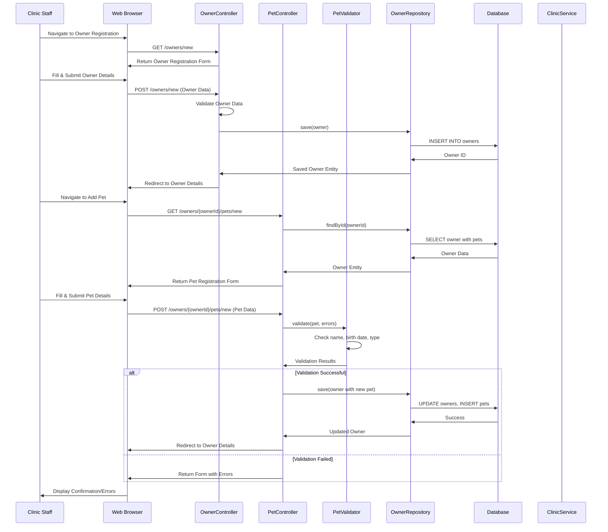
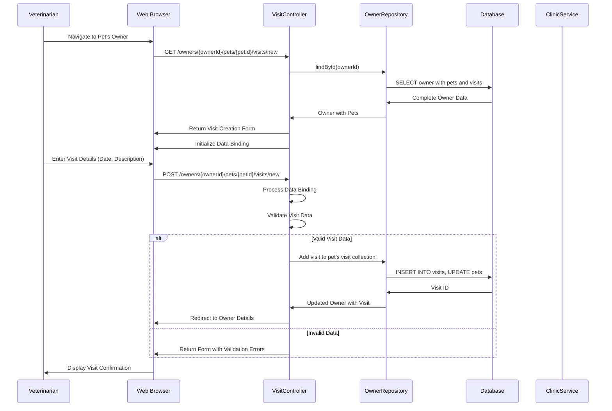
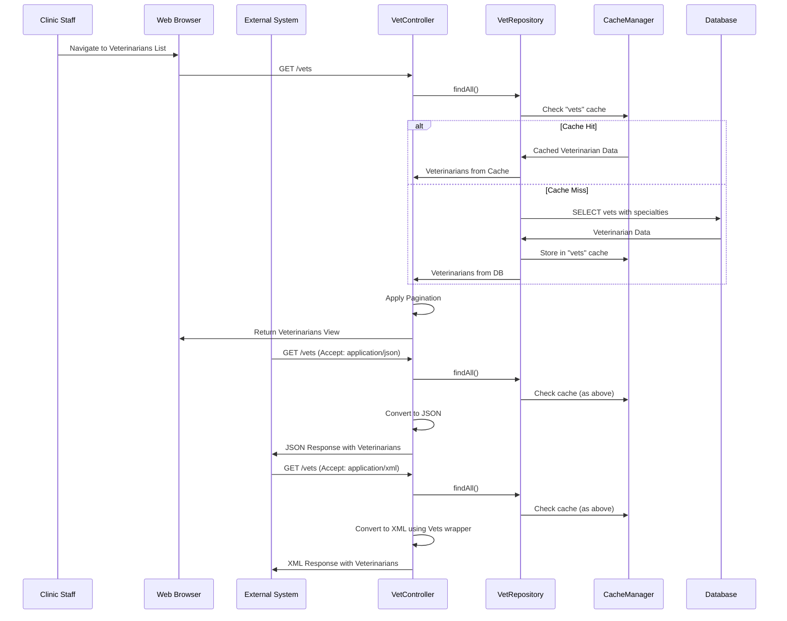
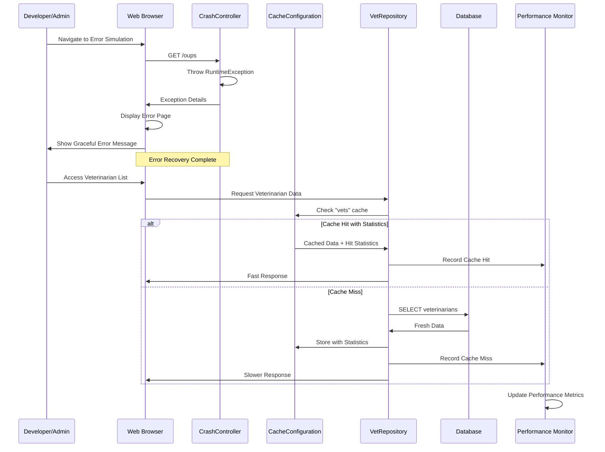
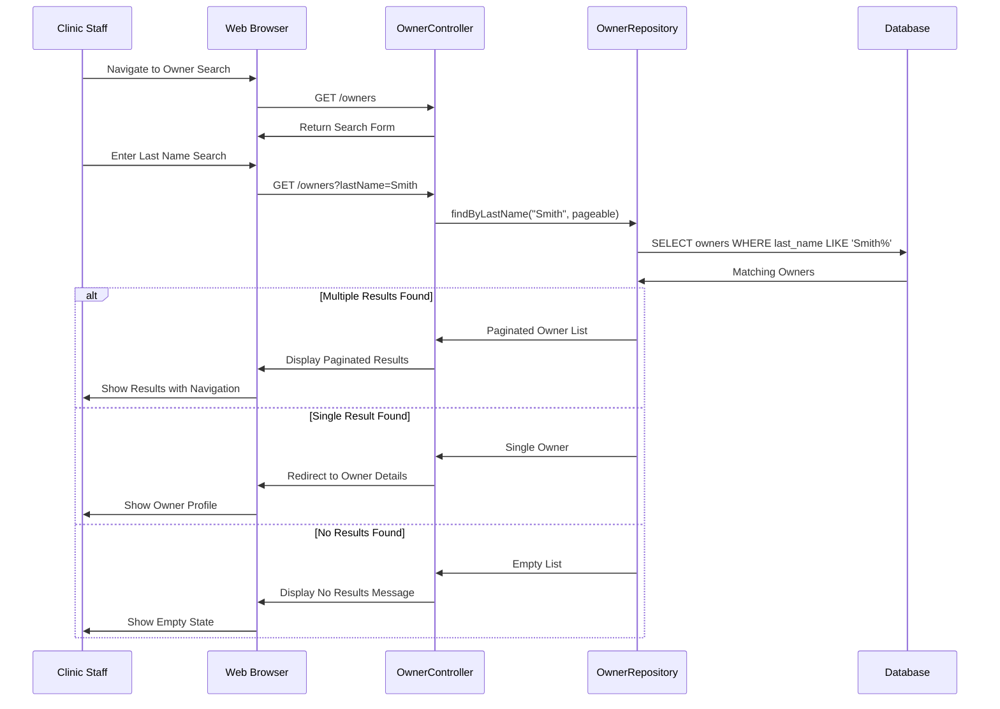
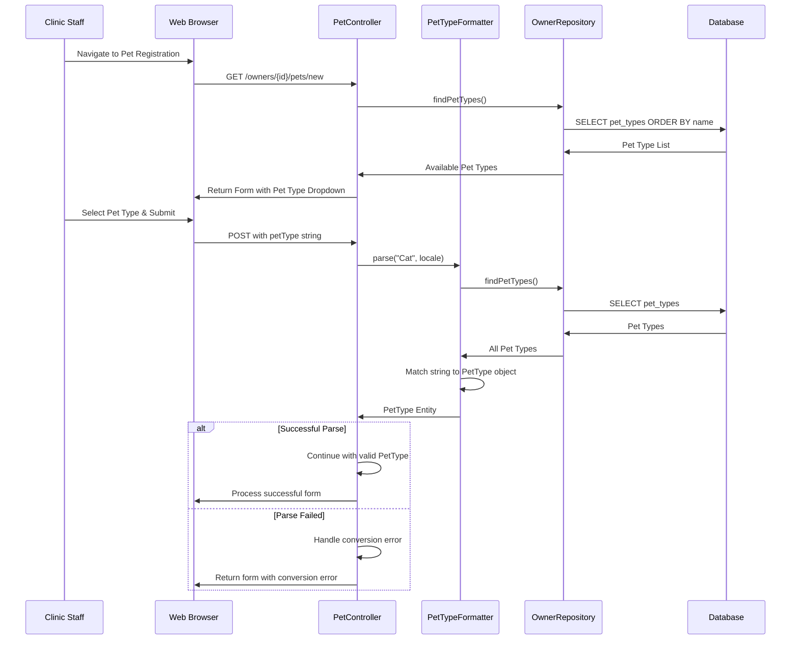
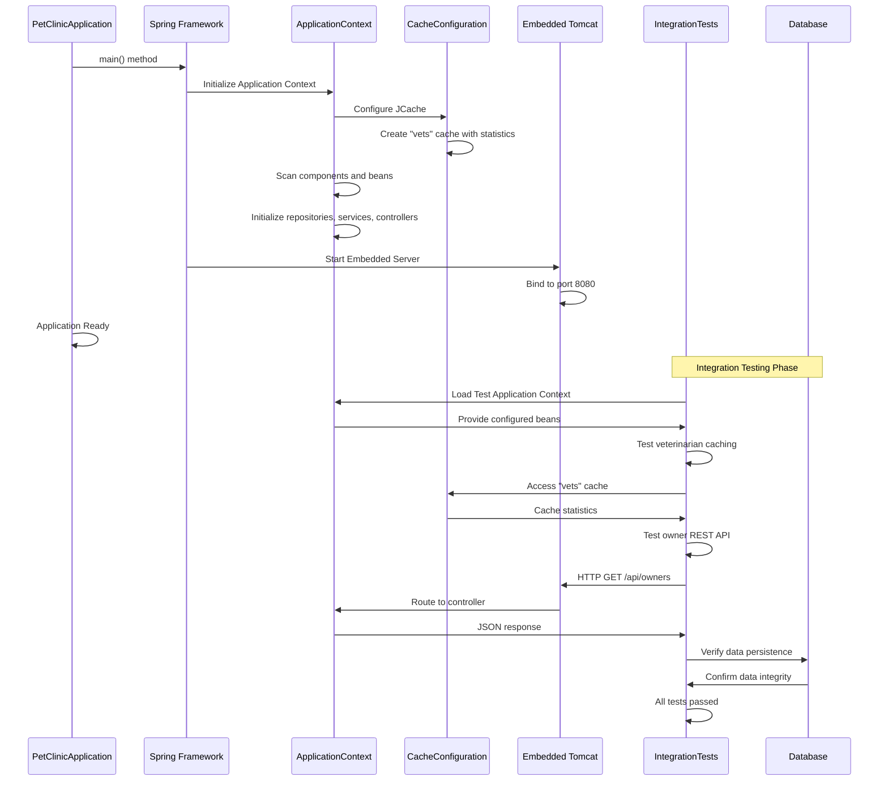

```markdown
# Spring PetClinic Dynamic Interaction Flows

## 1. Owner Registration and Pet Management Workflow

### Workflow Description
This workflow handles the complete lifecycle of pet owner registration and pet management, including creating new owners, adding pets, and managing owner information. It's triggered when a new client visits the veterinary clinic or when existing owners need to update their information.

**Communication Patterns:** REST calls, form submissions, database transactions, validation checks



## 2. Veterinary Visit Recording Workflow

### Workflow Description
This workflow manages the process of recording veterinary visits, including scheduling appointments, documenting treatments, and updating medical histories. It's triggered when a pet visits the clinic for medical care.

**Communication Patterns:** Form submissions, database transactions, entity relationships, data binding



## 3. Veterinarian Management and Listing Workflow

### Workflow Description
This workflow handles the display and management of veterinarian information, including listing all veterinarians with their specialties. It supports both web interface display and REST API access.

**Communication Patterns:** REST calls, caching, pagination, XML/JSON serialization



## 4. System Error Handling and Recovery Workflow

### Workflow Description
This workflow demonstrates the system's error handling capabilities, including controlled error simulation for testing and performance optimization through caching. It ensures system stability during unexpected conditions.

**Communication Patterns:** Exception handling, caching configuration, performance monitoring



## 5. Search and Navigation Workflow

### Workflow Description
This workflow handles owner search operations with pagination support, enabling clinic staff to quickly locate pet owners by last name. It demonstrates efficient data retrieval patterns.

**Communication Patterns:** Search queries, pagination, database optimization



## 6. Pet Type Management and Form Handling Workflow

### Workflow Description
This workflow manages the conversion between pet type entities and their string representations for form handling, ensuring proper species classification during pet registration.

**Communication Patterns:** Type conversion, formatter patterns, reference data access



## 7. Application Bootstrap and Integration Testing Workflow

### Workflow Description
This workflow shows the application startup process and integration testing validation, ensuring all components work together correctly in production-like environments.

**Communication Patterns:** Spring context initialization, dependency injection, integration testing

