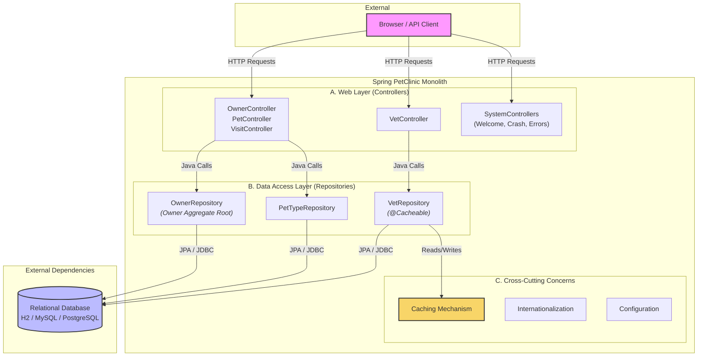

The component boundaries are drawn along the primary business domains of Owner Management and Veterinarian Management, which exhibit high internal cohesion and are distinctly separate from each other. The communication pattern follows a classic layered monolith, where external HTTP requests are handled by controllers that make synchronous, in-process Java method calls directly to Spring Data repositories, which abstract all JDBC/JPA communication with the external database. Notably, the Owner component is tightly coupled around the `Owner` aggregate, while the Vet component is decoupled and leverages caching due to its read-heavy nature.