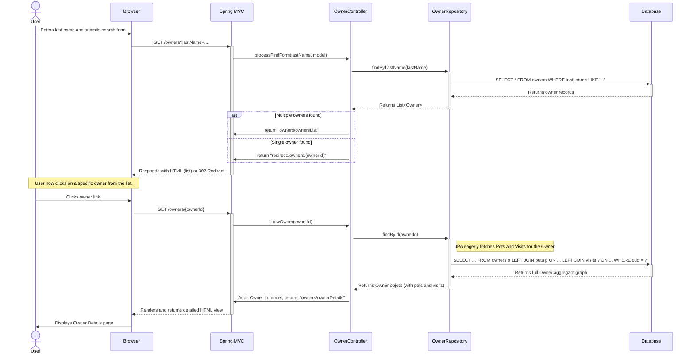
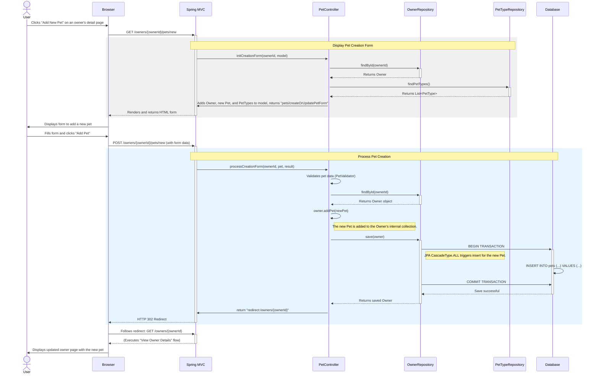
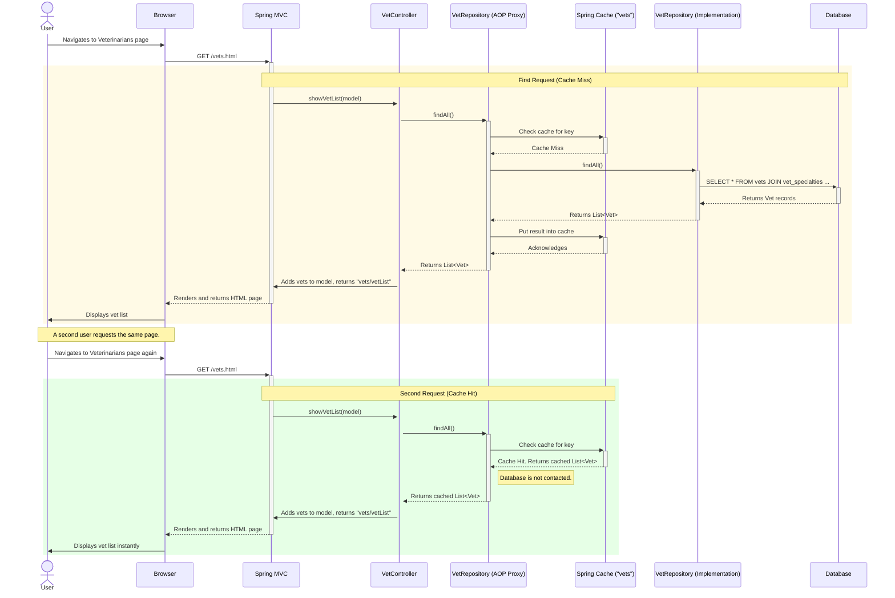
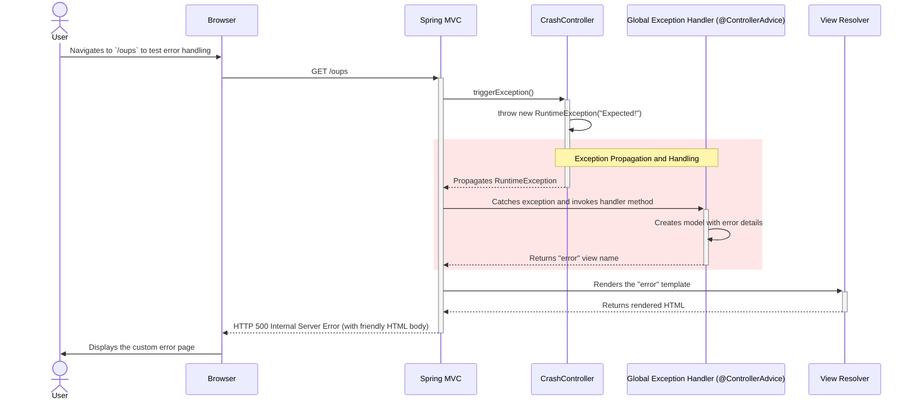

### Workflow 1: Find and View an Owner

**Description:**
This workflow is triggered when a user searches for a pet owner by their last name. The system displays a list of matching owners. The user can then select a specific owner to view their detailed information, including their registered pets and the visit history for each pet. This demonstrates a core read-only operation involving the primary `Owner` aggregate.

**Communication Patterns:**
*   **Protocol:** HTTP/S (GET requests)
*   **Style:** Synchronous Request/Response
*   **Data Access:** Synchronous database queries via Spring Data JPA. The fetch of owner details is an example of loading an aggregate root (`Owner`) along with its child entities (`Pet`, `Visit`).
*   **View Rendering:** Server-side rendering using Thymeleaf.



### Workflow 2: Add a New Pet to an Existing Owner

**Description:**
This workflow begins when a user decides to add a new pet to an existing owner's record. It involves two steps: displaying the creation form and processing the form submission. This flow is critical as it shows a write operation on the `Owner` aggregate, where adding a `Pet` is managed through the `Owner` entity and persisted in a single transaction.

**Communication Patterns:**
*   **Protocol:** HTTP/S (GET for form display, POST for submission)
*   **Style:** Synchronous Request/Response, utilizing the Redirect-after-Post pattern.
*   **Data Access:** A mix of read (to get owner context and pet types) and write (to save the new pet). The save operation is transactional.
*   **Coupling:** Demonstrates tight coupling within the `Owner` bounded context, as the `PetController` orchestrates the operation by fetching an `Owner`, modifying it, and saving it via the `OwnerRepository`.



### Workflow 3: View Veterinarian List with Caching

**Description:**
This workflow is initiated when a user navigates to the "Veterinarians" page. It is a read-only operation designed for high performance by caching the full list of vets after the first request. Subsequent requests for the same data are served directly from the cache, avoiding database interaction.

**Communication Patterns:**
*   **Protocol:** HTTP/S (GET requests)
*   **Style:** Synchronous Request/Response
*   **Caching:** Utilizes Spring's Cache abstraction (`@Cacheable`) to store and retrieve data. This demonstrates a cache-aside pattern implemented declaratively.
*   **Data Access:** Synchronous database query only on a cache miss.



### Workflow 4: Add a New Visit for a Pet

**Description:**
This workflow allows clinic staff to record a new medical visit for a specific pet. It is triggered from the owner's detail page. Like adding a pet, this is a transactional write operation managed through the `Owner` aggregate root, ensuring data integrity.

**Communication Patterns:**
*   **Protocol:** HTTP/S (GET for form, POST for submission)
*   **Style:** Synchronous Request/Response with Redirect-after-Post.
*   **Data Access:** Transactional database write. The operation cascades from the `Owner` entity, demonstrating the DDD Aggregate pattern.
*   **Coupling:** The `VisitController` depends on the `OwnerRepository` to fetch the aggregate and persist changes, reinforcing the boundaries of the Owner Management context.

```mermaid
sequenceDiagram
    actor User
    participant Browser
    participant SpringMVC as Spring MVC
    participant VisitController
    participant OwnerRepository
    participant Database

    User->>Browser: Clicks "Add Visit" for a specific pet
    Browser->>+SpringMVC: GET /owners/{ownerId}/pets/{petId}/visits/new

    rect rgb(240, 240, 240)
        note over SpringMVC, OwnerRepository: Display Visit Creation Form
        SpringMVC->>+VisitController: initNewVisitForm(petId, model)
        VisitController->>+OwnerRepository: findById(ownerId) // Fetches owner and their pets
        OwnerRepository-->>-VisitController: Returns Owner aggregate
        VisitController->>VisitController: Finds Pet with petId in Owner's pet list
        VisitController->>SpringMVC: Adds Pet and new Visit to model, returns "pets/createOrUpdateVisitForm"
        SpringMVC-->>-Browser: Renders and returns HTML form
    end
    Browser->>User: Displays form to add a new visit

    User->>Browser: Fills form and clicks "Add Visit"
    Browser->>+SpringMVC: POST /owners/{ownerId}/pets/{petId}/visits/new (with form data)

    rect rgb(230, 245, 255)
        note over SpringMVC, Database: Process Visit Creation
        SpringMVC->>+VisitController: processNewVisitForm(visit, result, petId, ownerId)
        VisitController->>VisitController: Validates visit data
        alt Validation fails
            VisitController->>SpringMVC: return "pets/createOrUpdateVisitForm"
            SpringMVC-->>-Browser: Re-renders form with error messages
        else Validation succeeds
            VisitController->>+OwnerRepository: findById(ownerId)
            OwnerRepository-->>-VisitController: Returns Owner aggregate
            VisitController->>VisitController: Finds correct Pet and calls pet.addVisit(visit)
            note right of VisitController: The new Visit is added to the Pet's collection.
            VisitController->>+OwnerRepository: save(owner)
            OwnerRepository->>+Database: BEGIN TRANSACTION
            note right of OwnerRepository: JPA CascadeType.ALL from Owner->Pet->Visit triggers insert.
            Database->>Database: INSERT INTO visits (...) VALUES (...)
            OwnerRepository->>Database: COMMIT TRANSACTION
            Database-->>-OwnerRepository: Save successful
            OwnerRepository-->>-VisitController: Returns saved Owner
            VisitController->>SpringMVC: return "redirect:/owners/{ownerId}"
            SpringMVC-->>-Browser: HTTP 302 Redirect
        end
    end

    Browser->>+SpringMVC: Follows redirect: GET /owners/{ownerId}
    SpringMVC-->>-Browser: (Executes "View Owner Details" flow)
    Browser->>User: Displays updated owner page with the new visit
```

### Workflow 5: Global Error Handling

**Description:**
This flow demonstrates the system's resilience when an unexpected error occurs. It is triggered by navigating to a special endpoint designed to throw an exception. The application's global error handler intercepts the exception and presents a user-friendly error page instead of a raw stack trace.

**Communication Patterns:**
*   **Protocol:** HTTP/S
*   **Style:** Synchronous Request/Response
*   **Error Handling:** Centralized exception handling via a Spring `@ControllerAdvice`. This pattern separates error handling logic from business logic.
*   **Control Flow:** Shows exception propagation from a controller to a global handler.

