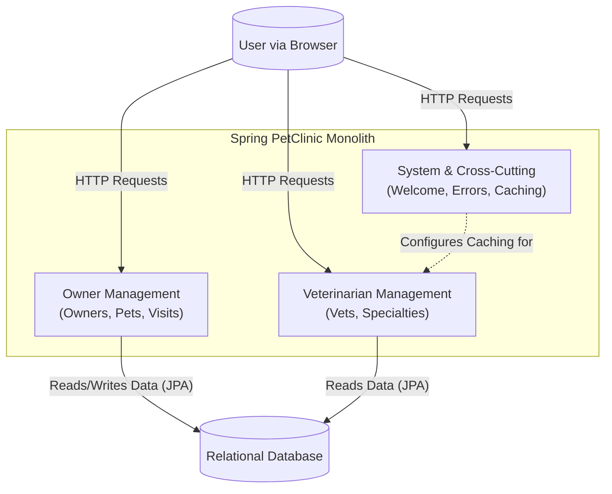

```markdown


The architecture is decomposed into three primary components reflecting the application's core domains: Owner Management (handling owners, pets, and visits), Veterinarian Management (vets and specialties), and a System component for cross-cutting concerns. As a monolith, all communication is via synchronous, in-process method calls, with both domain components sharing a single relational database for persistence and the System component providing configurations like caching to other components.
```