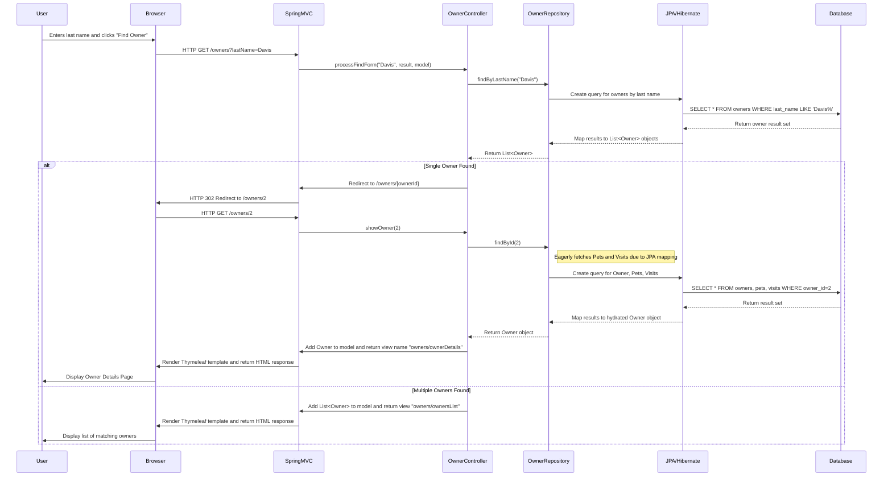
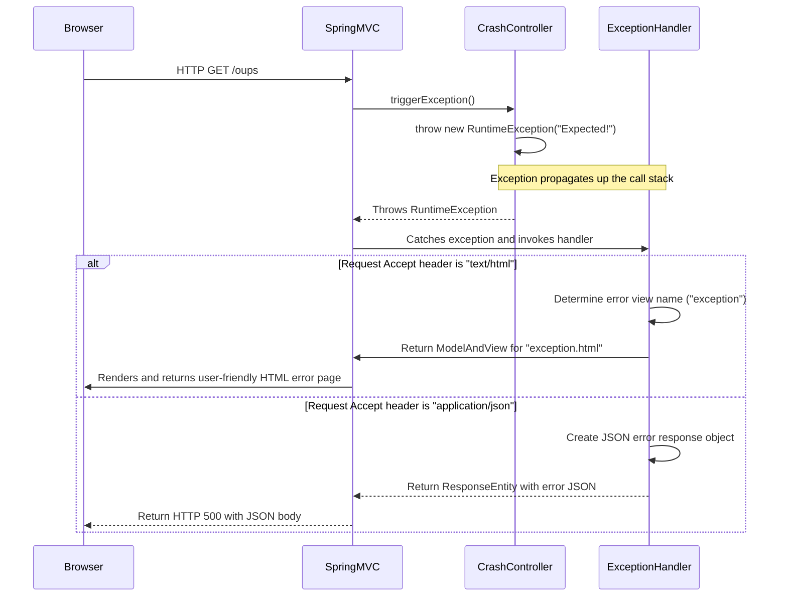

### 1. Workflow: Find and Display Owner Details

#### Workflow Description

**Purpose:** This workflow allows a user to search for a pet owner by their last name and then view the detailed information for a specific owner, including their pets and associated medical visits.

**Triggers:**
1.  A user navigates to the "Find Owners" page and submits the search form.
2.  The user clicks on an owner's name from the search results list.

**Communication Patterns:**
*   **Protocol:** HTTP GET
*   **Style:** Synchronous Request-Response
*   **Interactions:**
    *   Browser-to-Server RESTful-style web requests.
    *   Synchronous, in-process method calls from the Controller to the Repository layer.
    *   Database transaction (read-only) executed via JDBC by the JPA provider.

#### Sequence Diagram



---

### 2. Workflow: Add a New Pet to an Owner

#### Workflow Description

**Purpose:** This workflow enables a user to add a new pet to an existing owner's record. It involves fetching data to populate the form (e.g., pet types), validating the submitted data, and persisting the new pet within a database transaction.

**Triggers:** The user clicks the "Add New Pet" button on an owner's detail page.

**Communication Patterns:**
*   **Protocol:** HTTP GET (for the form), HTTP POST (for submission)
*   **Style:** Synchronous Request-Response
*   **Interactions:**
    *   Synchronous method calls from `PetController` to `OwnerRepository` and `PetTypeRepository`.
    *   Server-side validation using a custom `PetValidator`.
    *   A single database transaction for the write operation, demonstrating the **Aggregate pattern** where the `Owner` entity manages the lifecycle of its `Pet` entities. The save operation cascades from the owner to the new pet.

#### Sequence Diagram

```mermaid
sequenceDiagram
    participant Browser
    participant SpringMVC
    participant PetController
    participant PetValidator
    participant OwnerRepository
    participant PetTypeRepository
    participant JPA/Hibernate
    participant Database

    %% Step 1: Display the "Add Pet" form
    Browser->>SpringMVC: HTTP GET /owners/{ownerId}/pets/new
    SpringMVC->>PetController: initCreationForm(ownerId, model)
    PetController->>OwnerRepository: findById(ownerId)
    OwnerRepository-->>PetController: Return Owner object
    PetController->>PetTypeRepository: findAll()
    PetTypeRepository-->>PetController: Return Collection<PetType>
    PetController->>SpringMVC: Add Owner, Pet, PetTypes to model; return view "pets/createOrUpdatePetForm"
    SpringMVC->>Browser: Render HTML form

    %% Step 2: User submits the form
    Browser->>SpringMVC: HTTP POST /owners/{ownerId}/pets/new (with form data)
    SpringMVC->>PetController: processCreationForm(ownerId, pet, result)
    PetController->>OwnerRepository: findById(ownerId)
    OwnerRepository-->>PetController: Return Owner object
    Note over PetController: Set Owner on Pet object: owner.addPet(pet)
    PetController->>PetValidator: validate(pet, result)
    alt Validation Fails
        PetValidator-->>PetController: BindingResult has errors
        PetController->>SpringMVC: Return view "pets/createOrUpdatePetForm" with error messages
        SpringMVC->>Browser: Re-render form with errors
    else Validation Succeeds
        PetValidator-->>PetController: No errors in BindingResult
        PetController->>OwnerRepository: save(owner)
        OwnerRepository->>JPA/Hibernate: Persist Owner and cascade to new Pet
        activate JPA/Hibernate
        Note over JPA/Hibernate: Transaction Starts
        JPA/Hibernate->>Database: INSERT INTO pets (name, birth_date, type_id, owner_id) VALUES (...)
        Database-->>JPA/Hibernate: Confirm insertion
        Note over JPA/Hibernate: Transaction Commits
        deactivate JPA/Hibernate
        OwnerRepository-->>PetController: Return saved Owner
        PetController->>SpringMVC: Return redirect string "redirect:/owners/{ownerId}"
        SpringMVC->>Browser: HTTP 302 Redirect
        Browser->>SpringMVC: Follows redirect to owner detail page
    end

```

---

### 3. Workflow: Add a Medical Visit for a Pet

#### Workflow Description

**Purpose:** This workflow allows a user to record a new medical visit for a specific pet. The visit information is added to the pet's history.

**Triggers:** A user clicks the "Add Visit" button next to a pet's name on the owner detail page.

**Communication Patterns:**
*   **Protocol:** HTTP GET (for form), HTTP POST (for submission)
*   **Style:** Synchronous Request-Response
*   **Interactions:**
    *   Synchronous method calls from `VisitController` to `OwnerRepository` (which handles Pet lookup).
    *   Server-side data binding and validation.
    *   Write operation within a single database transaction, again demonstrating the Aggregate pattern as the visit is added via the `Pet` entity.

#### Sequence Diagram

```mermaid
sequenceDiagram
    participant Browser
    participant SpringMVC
    participant VisitController
    participant OwnerRepository
    participant JPA/Hibernate
    participant Database

    %% Step 1: Display the "Add Visit" form
    Browser->>SpringMVC: HTTP GET /owners/{ownerId}/pets/{petId}/visits/new
    SpringMVC->>VisitController: initNewVisitForm(petId, model)
    VisitController->>OwnerRepository: findPetById(petId)
    OwnerRepository-->>VisitController: Return Pet object
    VisitController->>SpringMVC: Add Pet & new Visit to model; return view "pets/createOrUpdateVisitForm"
    SpringMVC->>Browser: Render HTML form

    %% Step 2: User submits the form
    Browser->>SpringMVC: HTTP POST /owners/{ownerId}/pets/{petId}/visits/new (with visit data)
    SpringMVC->>VisitController: processNewVisitForm(petId, visit, result)
    alt Validation Fails (e.g., empty description)
        VisitController->>OwnerRepository: findPetById(petId)
        OwnerRepository-->>VisitController: Return Pet object
        VisitController->>SpringMVC: Add Pet & Visit to model; return view "pets/createOrUpdateVisitForm"
        SpringMVC->>Browser: Re-render form with validation errors
    else Validation Succeeds
        VisitController->>OwnerRepository: findPetById(petId)
        OwnerRepository-->>VisitController: Return Pet object
        Note over VisitController: Add visit to pet: pet.addVisit(visit)
        VisitController->>OwnerRepository: save(pet)
        OwnerRepository->>JPA/Hibernate: Persist Pet and cascade to new Visit
        activate JPA/Hibernate
        Note over JPA/Hibernate: Transaction Starts
        JPA/Hibernate->>Database: INSERT INTO visits (pet_id, visit_date, description) VALUES (...)
        Database-->>JPA/Hibernate: Confirm insertion
        Note over JPA/Hibernate: Transaction Commits
        deactivate JPA/Hibernate
        OwnerRepository-->>VisitController: Return saved Pet
        VisitController->>SpringMVC: Return redirect string "redirect:/owners/{ownerId}"
        SpringMVC->>Browser: HTTP 302 Redirect
    end

```

---

### 4. Workflow: List Veterinarians with Caching

#### Workflow Description

**Purpose:** To display a list of all veterinarians and their specialties. This data is considered relatively static, so it is cached to improve performance and reduce database load on subsequent requests.

**Triggers:** A user navigates to the "Veterinarians" page or an API client requests the `/vets` endpoint.

**Communication Patterns:**
*   **Protocol:** HTTP GET
*   **Style:** Synchronous Request-Response
*   **Interactions:**
    *   In-process method calls.
    *   **Event-driven (AOP):** Spring's caching is implemented using Aspect-Oriented Programming. The `@Cacheable` annotation triggers an interceptor that manages cache interaction before the actual repository method is called.
    *   Database transaction (read-only) on cache miss.

#### Sequence Diagram

```mermaid
sequenceDiagram
    participant Browser
    participant SpringMVC
    participant VetController
    participant SpringCacheAOP
    participant VetRepository
    participant Database

    Browser->>SpringMVC: HTTP GET /vets.html
    SpringMVC->>VetController: showVetList(model)
    VetController->>VetRepository: findAll()

    %% AOP Interceptor checks the cache before calling the real method
    VetRepository->>SpringCacheAOP: Intercepts call due to @Cacheable("vets")
    
    alt Cache Miss (First Request)
        SpringCacheAOP->>VetRepository: Cache empty, proceed with method execution
        VetRepository->>Database: SELECT * FROM vets, specialties, vet_specialties
        Database-->>VetRepository: Return Vet result set
        VetRepository-->>SpringCacheAOP: Return List<Vet>
        SpringCacheAOP->>SpringCacheAOP: Store List<Vet> in "vets" cache
        SpringCacheAOP-->>VetController: Return List<Vet>
    else Cache Hit (Subsequent Requests)
        SpringCacheAOP-->>VetController: Found key in "vets" cache. Return cached List<Vet>
    end
    
    VetController->>SpringMVC: Add List<Vet> to model; return view "vets/vetList"
    SpringMVC->>Browser: Render HTML response

```

---

### 5. Workflow: Application Error Handling

#### Workflow Description

**Purpose:** To gracefully handle unexpected exceptions during request processing. The system provides a user-friendly error page for browser requests and a structured JSON error response for API requests.

**Triggers:** An unhandled exception is thrown from any controller, or a user explicitly hits the `/oups` test endpoint.

**Communication Patterns:**
*   **Protocol:** HTTP GET
*   **Style:** Synchronous Request-Response with Exception Handling
*   **Interactions:**
    *   Standard synchronous controller logic.
    *   Java Exception propagation.
    *   Spring MVC's centralized exception handling mechanism (`@ControllerAdvice` or `ErrorController`) intercepts the exception and routes the flow to a dedicated error-rendering process.

#### Sequence Diagram

