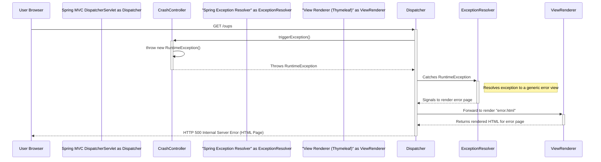

### 1. Find and View Owner Details

-   **Workflow Purpose and Trigger**: This workflow is triggered when a user wants to find a pet owner. The user navigates to the "Find Owners" page and submits a search form with the owner's last name. The system displays a list of matching owners or, if only one owner matches, redirects directly to their detailed information page.

-   **Communication Patterns**:
    -   **Synchronous HTTP**: The user's browser communicates with the server via synchronous HTTP GET requests.
    -   **In-Process Method Calls**: `OwnerController` directly calls methods on the `OwnerRepository`.
    -   **Database Transaction**: The repository method call initiates a read-only database transaction managed by Spring Data JPA.

```mermaid
sequenceDiagram
    participant User Browser
    participant Spring MVC DispatcherServlet as Dispatcher
    participant OwnerController
    participant OwnerRepository
    participant JPA/Hibernate
    participant Database

    User Browser->>+Dispatcher: GET /owners?lastName=Davis
    Dispatcher->>+OwnerController: processFindForm("Davis", result, model)
    OwnerController->>+OwnerRepository: findByLastName("Davis")
    OwnerRepository->>+JPA/Hibernate: Create Query (LIKE 'Davis%')
    JPA/Hibernate->>+Database: SELECT * FROM owners WHERE last_name LIKE 'Davis%'
    Database-->>-JPA/Hibernate: Returns ResultSet (1 owner record)
    JPA/Hibernate-->>-OwnerRepository: Maps ResultSet to Owner object
    OwnerRepository-->>-OwnerController: Returns List<Owner> with 1 element

    alt Single Owner Found
        OwnerController->>OwnerController: Checks list size, finds 1 result
        OwnerController-->>-Dispatcher: Returns redirect view: "redirect:/owners/123"
        Dispatcher-->>-User Browser: HTTP 302 Redirect to /owners/123
        User Browser->>+Dispatcher: GET /owners/123
        Dispatcher->>+OwnerController: showOwner(123)
        OwnerController->>+OwnerRepository: findById(123)
        OwnerRepository->>+JPA/Hibernate: Create Query
        JPA/Hibernate->>+Database: SELECT * FROM owners WHERE id=123
        Database-->>-JPA/Hibernate: Returns Owner record
        JPA/Hibernate-->>-OwnerRepository: Maps to Owner object
        OwnerRepository-->>-OwnerController: Returns Owner object
        OwnerController->>OwnerController: Adds Owner to Model
        OwnerController-->>-Dispatcher: Returns view name: "owners/ownerDetails"
        Dispatcher->>Dispatcher: Renders Thymeleaf template with model data
        Dispatcher-->>-User Browser: HTTP 200 OK (HTML Page)
    else Multiple Owners Found
        OwnerController->>OwnerController: Checks list size, finds multiple results
        OwnerController->>OwnerController: Adds List<Owner> to Model
        OwnerController-->>-Dispatcher: Returns view name: "owners/ownersList"
        Dispatcher->>Dispatcher: Renders Thymeleaf template with model data
        Dispatcher-->>-User Browser: HTTP 200 OK (HTML Page)
    end
```

### 2. Add a New Owner

-   **Workflow Purpose and Trigger**: This workflow allows a user to add a new owner to the system. It starts when the user navigates to the "Add Owner" page, fills in the form, and submits it. The system validates the input and, if successful, saves the new owner to the database and redirects to the new owner's detail page.

-   **Communication Patterns**:
    -   **Synchronous HTTP**: Two-step process involving a `GET` to display the form and a `POST` to submit the data.
    -   **In-Process Method Calls**: `OwnerController` calls `OwnerRepository`.
    -   **Database Transaction**: The `save()` method call is executed within a read-write database transaction.

```mermaid
sequenceDiagram
    participant User Browser
    participant Spring MVC DispatcherServlet as Dispatcher
    participant OwnerController
    participant OwnerRepository
    participant JPA/Hibernate
    participant Database

    Note over User Browser, Dispatcher: Step 1: Displaying the creation form
    User Browser->>+Dispatcher: GET /owners/new
    Dispatcher->>+OwnerController: initCreationForm(model)
    OwnerController->>OwnerController: Puts new Owner object in model
    OwnerController-->>-Dispatcher: Returns view name: "owners/createOrUpdateOwnerForm"
    Dispatcher->>Dispatcher: Renders Thymeleaf template
    Dispatcher-->>-User Browser: HTTP 200 OK (HTML Form)

    Note over User Browser, Dispatcher: Step 2: User fills form and submits
    User Browser->>+Dispatcher: POST /owners/new (with form data)
    Dispatcher->>Dispatcher: Binds form data to Owner object
    Dispatcher->>+OwnerController: processCreationForm(owner, result)
    OwnerController->>OwnerController: Performs Bean Validation on Owner object

    alt Validation Fails
        OwnerController->>OwnerController: result.hasErrors() is true
        OwnerController-->>-Dispatcher: Returns view name: "owners/createOrUpdateOwnerForm"
        Dispatcher->>Dispatcher: Renders Thymeleaf template with error messages
        Dispatcher-->>-User Browser: HTTP 200 OK (HTML Form with Errors)
    else Validation Succeeds
        OwnerController->>OwnerController: result.hasErrors() is false
        OwnerController->>+OwnerRepository: save(owner)
        OwnerRepository->>+JPA/Hibernate: Persist Owner entity
        JPA/Hibernate->>+Database: INSERT INTO owners (...) VALUES (...)
        Database-->>-JPA/Hibernate: Returns generated ID
        JPA/Hibernate-->>-OwnerRepository: Populates Owner object with ID
        OwnerRepository-->>-OwnerController: Returns saved Owner object
        OwnerController->>OwnerController: Constructs redirect URL
        OwnerController-->>-Dispatcher: Returns redirect view: "redirect:/owners/124"
        Dispatcher-->>-User Browser: HTTP 302 Redirect to /owners/124
    end
```

### 3. Add a New Pet for an Existing Owner

-   **Workflow Purpose and Trigger**: This workflow enables a user to add a new pet to a specific owner's record. It is triggered when the user, viewing an owner's details, clicks the "Add New Pet" button, fills out the pet information form, and submits it. The system validates the pet's details (including custom validation rules) before saving.

-   **Communication Patterns**:
    -   **Synchronous HTTP**: A `GET` request to show the form, followed by a `POST` to submit the pet data.
    -   **In-Process Method Calls**: The `PetController` interacts with the `OwnerRepository`, `PetTypeRepository`, and a custom `PetValidator`.
    -   **Database Transaction**: The transaction involves fetching the owner and pet types (read) and then saving the updated owner, which cascades the save to the new pet (write).

```mermaid
sequenceDiagram
    participant User Browser
    participant Spring MVC DispatcherServlet as Dispatcher
    participant PetController
    participant OwnerRepository
    participant PetTypeRepository
    participant PetValidator
    participant Database

    User Browser->>+Dispatcher: POST /owners/123/pets/new (with form data)
    Dispatcher->>Dispatcher: Binds form data to Pet object
    Dispatcher->>+PetController: processCreationForm(owner, pet, result)

    PetController->>+OwnerRepository: findById(123)
    OwnerRepository-->>-PetController: Returns Owner object

    PetController->>+PetTypeRepository: findPetTypes()
    PetTypeRepository-->>-PetController: Returns List<PetType>

    PetController->>PetController: Associates Pet with Owner
    PetController->>+PetValidator: validate(pet, result)
    Note right of PetValidator: Checks for required fields, unique name for owner, etc.
    PetValidator-->>-PetController: Populates BindingResult object

    alt Validation Fails
        PetController->>PetController: result.hasErrors() is true
        PetController-->>-Dispatcher: Returns view name: "pets/createOrUpdatePetForm"
        Dispatcher->>Dispatcher: Renders Thymeleaf template with error messages
        Dispatcher-->>-User Browser: HTTP 200 OK (HTML Form with Errors)
    else Validation Succeeds
        PetController->>PetController: result.hasErrors() is false
        PetController->>+OwnerRepository: save(owner)
        Note right of OwnerRepository: JPA cascades the save operation to the new Pet in the Owner's collection
        OwnerRepository->>+Database: INSERT INTO pets (...) VALUES (...)
        Database-->>-OwnerRepository: Commit successful
        OwnerRepository-->>-PetController: Returns saved Owner
        PetController-->>-Dispatcher: Returns redirect view: "redirect:/owners/123"
        Dispatcher-->>-User Browser: HTTP 302 Redirect to /owners/123
    end
```

### 4. View Veterinarians with Caching

-   **Workflow Purpose and Trigger**: This workflow is triggered when a user requests the list of veterinarians. The system is designed to be efficient by caching the vet list, as this data does not change frequently. The diagram shows both a "cache miss" (the first request) and a "cache hit" (subsequent requests).

-   **Communication Patterns**:
    -   **Synchronous HTTP**: A standard `GET` request for the veterinarians page.
    -   **In-Process Method Calls**: `VetController` calls `VetRepository`.
    -   **Caching**: A `JCache` compliant cache manager intercepts the call to `VetRepository.findAll()`.
    -   **Database Transaction**: A database query is only executed on a cache miss.

```mermaid
sequenceDiagram
    participant User Browser
    participant Spring MVC DispatcherServlet as Dispatcher
    participant VetController
    participant "JCache Manager" as Cache
    participant VetRepository
    participant Database

    alt First Request (Cache Miss)
        User Browser->>+Dispatcher: GET /vets.html
        Dispatcher->>+VetController: showVetList(model)
        VetController->>+Cache: VetRepository.findAll()
        Cache->>Cache: Check "vets" cache for key
        Note right of Cache: Not found (miss)
        Cache->>+VetRepository: findAll()
        VetRepository->>+Database: SELECT * FROM vets
        Database-->>-VetRepository: Returns List of Vets
        VetRepository-->>-Cache: Returns List of Vets
        Cache->>Cache: Stores result in "vets" cache
        Cache-->>-VetController: Returns List of Vets
        VetController->>VetController: Adds Vets to Model
        VetController-->>-Dispatcher: Returns view name: "vets/vetList"
        Dispatcher->>Dispatcher: Renders Thymeleaf template
        Dispatcher-->>-User Browser: HTTP 200 OK (HTML Page)
    end

    alt Subsequent Request (Cache Hit)
        User Browser->>+Dispatcher: GET /vets.html
        Dispatcher->>+VetController: showVetList(model)
        VetController->>+Cache: VetRepository.findAll()
        Cache->>Cache: Check "vets" cache for key
        Note right of Cache: Found (hit)
        Cache-->>-VetController: Returns cached List of Vets
        deactivate Cache
        VetController->>VetController: Adds Vets to Model
        VetController-->>-Dispatcher: Returns view name: "vets/vetList"
        Dispatcher->>Dispatcher: Renders Thymeleaf template
        Dispatcher-->>-User Browser: HTTP 200 OK (HTML Page)
    end
```

### 5. Application Error Handling

-   **Workflow Purpose and Trigger**: This flow demonstrates the system's centralized exception handling. It's triggered by a request to a special endpoint (`/oups`) designed to intentionally throw an exception. The Spring MVC framework catches the unhandled exception and routes the request to a generic, user-friendly error page.

-   **Communication Patterns**:
    -   **Synchronous HTTP**: A `GET` request triggers the error.
    -   **Exception Handling**: The flow demonstrates the standard Spring Boot exception handling mechanism, which intercepts runtime exceptions from controllers.
    -   **Internal Forward**: The `DispatcherServlet` internally forwards the request to the error page renderer rather than issuing an HTTP redirect.

