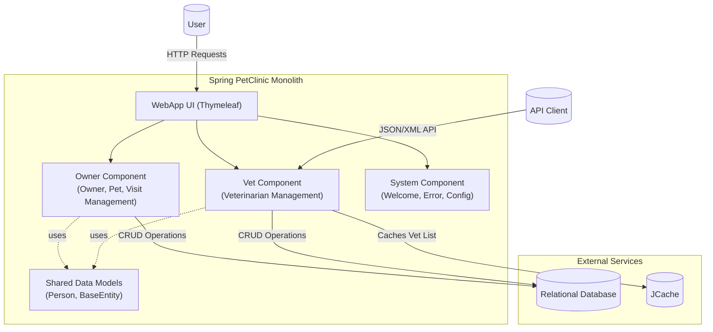

The architecture is a classic monolith where component boundaries are logically defined by business domains (`Owner` and `Vet`) within the same deployment unit. Communication is primarily synchronous and in-process, with a central UI layer delegating requests to the appropriate domain component. While both components share a common database and data model, the `Vet` component is more decoupled, utilizing its own cache and exposing an independent data API for external clients.