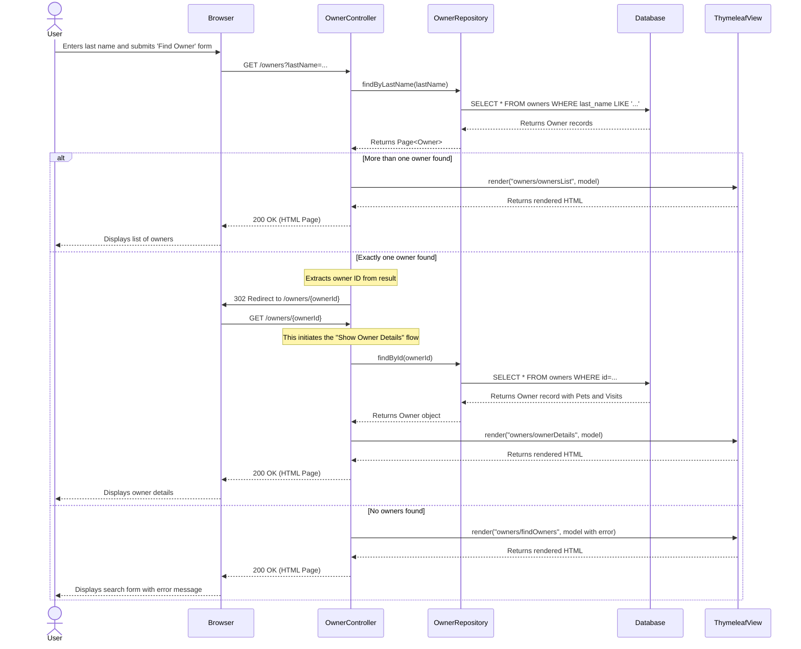
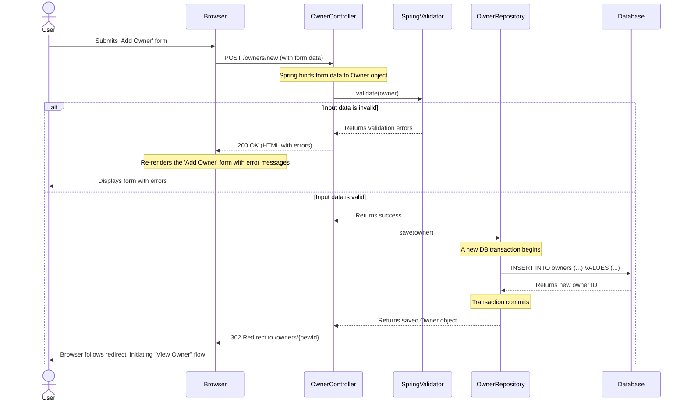
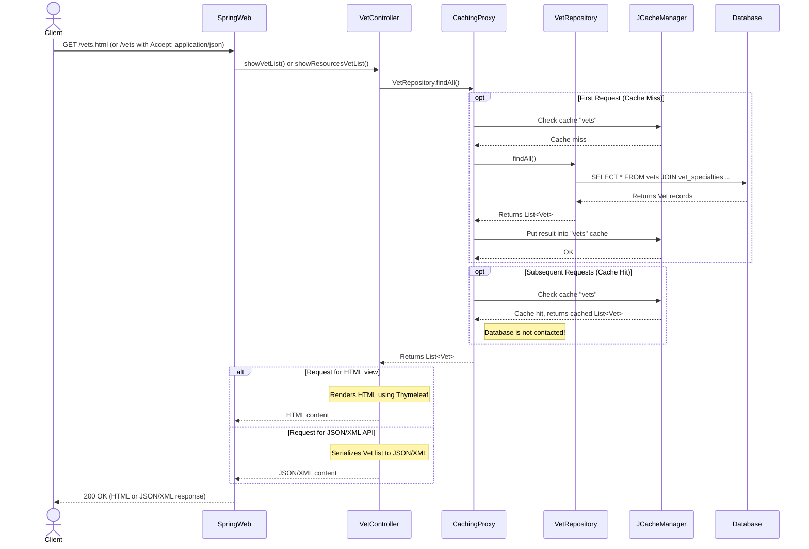
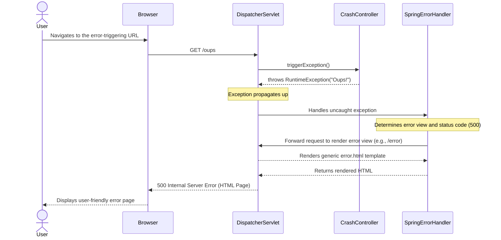

### 1. Workflow: Find and View an Owner

**Description:** This workflow is triggered when a user searches for a pet owner by their last name. The system queries the database and displays a list of matching owners. If only one owner matches the search criteria, the system redirects the user directly to that owner's detailed information page. This interaction is a synchronous, read-only operation.

**Communication Patterns:**
*   **Client-Server:** Synchronous HTTP GET request.
*   **Internal:** In-process Java method calls (`Controller` -> `Repository`).
*   **Data Access:** Database transaction (read-only `SELECT` query) via Spring Data JPA.



### 2. Workflow: Add a New Owner

**Description:** This workflow allows a user to create a new pet owner. The user submits a form with the owner's details. The system validates the input and, if successful, persists the new owner to the database. Upon success, it uses the Post-Redirect-Get (PRG) pattern to prevent duplicate form submissions.

**Communication Patterns:**
*   **Client-Server:** Synchronous HTTP POST request.
*   **Internal:** In-process method calls with data binding and validation.
*   **Data Access:** Database transaction (`INSERT` statement).
*   **Pattern:** Post-Redirect-Get (PRG).



### 3. Workflow: Add a New Pet to an Owner

**Description:** This workflow allows a user to add a new pet to an existing owner's record. The system validates the pet's details (e.g., name, birth date) and ensures the name is unique for that specific owner. The `Owner` entity acts as the aggregate root, and saving the `Owner` cascades the persistence to the new `Pet`.

**Communication Patterns:**
*   **Client-Server:** Synchronous HTTP POST request.
*   **Internal:** In-process method calls, custom validation logic (`PetValidator`).
*   **Data Access:** Database transaction (`INSERT` into `pets` table, potentially `UPDATE` on `owners`). The operation is cascaded from the `Owner` aggregate.
*   **Pattern:** Post-Redirect-Get (PRG).

```mermaid
sequenceDiagram
    actor User
    participant Browser
    participant PetController
    participant OwnerRepository
    participant PetValidator
    participant Database

    User->>Browser: Submits 'Add Pet' form for a specific owner
    Browser->>PetController: POST /owners/{ownerId}/pets/new (with form data)
    
    PetController->>OwnerRepository: findById(ownerId)
    OwnerRepository->>Database: SELECT * FROM owners WHERE id = {ownerId}
    Database-->>OwnerRepository: Returns Owner record
    OwnerRepository-->>PetController: Returns Owner object

    Note over PetController: Spring binds form data to new Pet object
    PetController->>PetValidator: validate(pet)
    
    alt Pet data is invalid
        PetValidator-->>PetController: Returns validation errors
        PetController-->>Browser: 200 OK (HTML with Pet form and errors)
        Browser-->>User: Displays form with errors
    else Pet data is valid
        PetValidator-->>PetController: Returns success
        PetController->>OwnerRepository: owner.addPet(pet); save(owner)
        Note over OwnerRepository: A new DB transaction begins
        OwnerRepository->>Database: INSERT INTO pets (name, birth_date, type_id, owner_id) VALUES (...)
        Note over Database: Hibernate cascades the save from the Owner entity
        Database-->>OwnerRepository: Success
        Note over OwnerRepository: Transaction commits
        OwnerRepository-->>PetController: Returns saved Owner
        PetController->>Browser: 302 Redirect to /owners/{ownerId}
        Browser->>User: Browser follows redirect, displaying updated Owner details
    end
```

### 4. Workflow: View Veterinarian List (with Caching)

**Description:** A user or API client requests the list of veterinarians. The system uses a cache to avoid repeated database queries for this relatively static data. The first request fetches data from the database and populates the cache. Subsequent requests are served directly from the cache, improving performance and reducing database load.

**Communication Patterns:**
*   **Client-Server:** Synchronous HTTP GET request.
*   **Internal:** In-process method calls, AOP-based caching via JCache.
*   **Data Access:** Conditional database transaction (`SELECT` query) only on cache miss.
*   **API:** Supports content negotiation for HTML (web UI) and JSON/XML (data API).



### 5. Workflow: General Error Handling

**Description:** This workflow demonstrates how the system handles unexpected runtime exceptions. A dedicated controller endpoint is used to trigger an error intentionally. Spring Boot's centralized error handling mechanism catches the exception and renders a user-friendly error page instead of a raw stack trace.

**Communication Patterns:**
*   **Client-Server:** Synchronous HTTP GET request.
*   **Internal:** Exception propagation up the call stack.
*   **Framework:** Handled by Spring Boot's `BasicErrorController` or a custom `@ControllerAdvice`.

