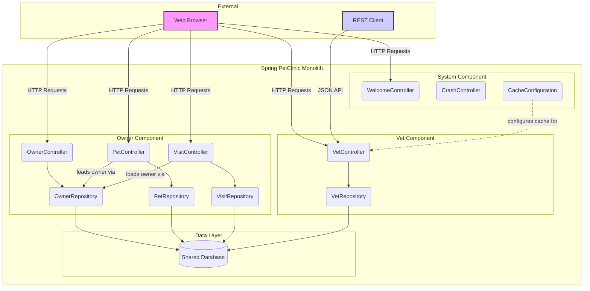

```markdown


The diagram shows a classic monolithic architecture with component boundaries defined by logical business domains (`Owner`, `Vet`) and cross-cutting concerns (`System`). Communication is handled via in-process method calls, following a pattern where controllers directly interact with data repositories, bypassing a dedicated service layer. The single, shared database acts as the central point of data integration and coupling between all components.
```