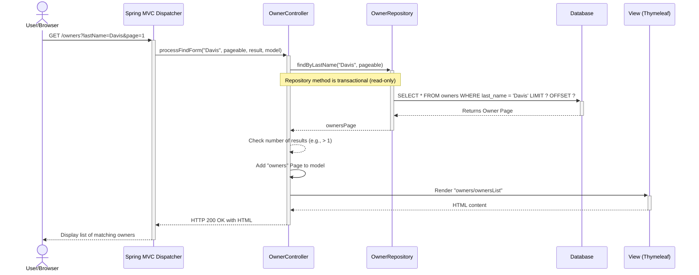
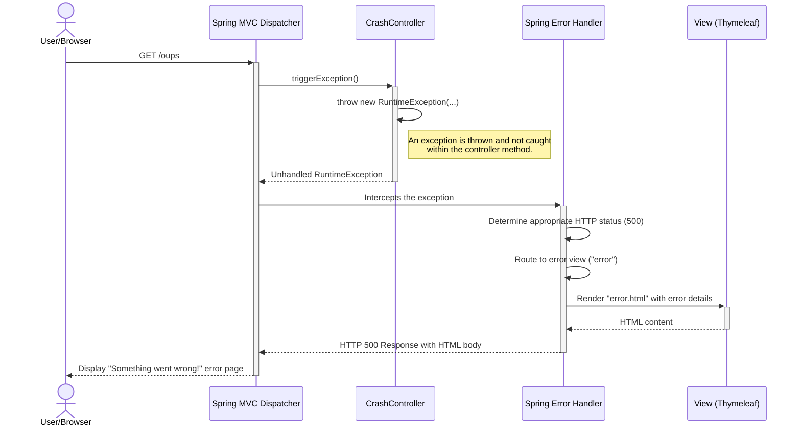

### 1. Workflow: Find Owner by Last Name

*   **Workflow Purpose and Trigger**: This workflow is triggered when a user submits the "Find Owner" form to search for pet owners by their last name. The system handles the search, including cases where the last name is empty (listing all owners) and when a single owner is found (redirecting to their detail page). It also supports pagination.
*   **Communication Patterns**: This is a synchronous workflow initiated by an HTTP GET request. It involves a direct method call from the `OwnerController` to the `OwnerRepository`, which executes a SELECT query against the database within a transaction. The result is then rendered server-side by Thymeleaf.



### 2. Workflow: Add a New Owner

*   **Workflow Purpose and Trigger**: This workflow allows a user to create a new pet owner. It starts when the user submits the "Add Owner" form. The system validates the submitted data; if it's valid, the new owner is persisted to the database.
*   **Communication Patterns**: The workflow uses a synchronous HTTP POST request. It involves data binding and validation by Spring MVC. A successful validation leads to a database INSERT operation within a single transaction, followed by an HTTP 302 Redirect to the new owner's detail page.

```mermaid
sequenceDiagram
    actor User/Browser
    participant C as Spring MVC Dispatcher
    participant OC as OwnerController
    participant O as Owner (Entity)
    participant OR as OwnerRepository
    participant DB as Database

    User/Browser->>+C: POST /owners/new (with form data)
    C->>+OC: processCreationForm(owner, result)

    alt Validation Fails
        OC-->>OC: result.hasErrors() is true
        OC->>C: Return "owners/createOrUpdateOwnerForm" view name
        C-->>-User/Browser: HTTP 200 OK with form redisplayed (with errors)
    else Validation Succeeds
        OC-->>OC: result.hasErrors() is false
        OC->>+OR: save(owner)
        Note over OC,OR: save() method is transactional
        OR->>+DB: INSERT INTO owners (...) VALUES (...)
        DB-->>-OR: Returns new Owner with generated ID
        OR-->>-OC: savedOwner
        OC->>C: Return "redirect:/owners/" + savedOwner.getId()
        C-->>-User/Browser: HTTP 302 Redirect to /owners/{id}
    end
```

### 3. Workflow: Add a New Visit for a Pet

*   **Workflow Purpose and Trigger**: This workflow is triggered when a user submits the form to add a new visit for a pet. The system loads the associated owner and pet, validates the new visit information, and saves it to the database.
*   **Communication Patterns**: This is a synchronous workflow initiated by an HTTP POST. It demonstrates strong data coupling, requiring the `OwnerRepository` to be called first to fetch the parent `Owner` and its associated `Pet`. The entire operation (read parent, insert child) is executed within a single database transaction.

```mermaid
sequenceDiagram
    actor User/Browser
    participant C as Spring MVC Dispatcher
    participant VC as VisitController
    participant OR as OwnerRepository
    participant V as Visit (Entity)
    participant DB as Database

    User/Browser->>+C: POST /owners/{ownerId}/pets/{petId}/visits/new (with form data)
    C->>+VC: processNewVisitForm(ownerId, petId, visit, result)

    VC->>+OR: findById(ownerId)
    OR->>+DB: SELECT * FROM owners WHERE id = ?
    DB-->>-OR: Owner entity (with pets)
    OR-->>-VC: owner
    VC->>VC: Get Pet from Owner's pet list

    alt Validation Fails
        VC-->>VC: result.hasErrors() is true
        VC->>C: Return "pets/createOrUpdateVisitForm" view name
        C-->>-User/Browser: HTTP 200 OK with form redisplayed (with errors)
    else Validation Succeeds
        VC-->>VC: result.hasErrors() is false
        VC->>VC: Set Pet on Visit entity
        VC->>+OR: save(owner)
        Note over VC,OR: save() is transactional. It cascades the save<br/>operation to the new Visit entity in the Pet's collection.
        OR->>+DB: INSERT INTO visits (pet_id, visit_date, description) VALUES (...)
        DB-->>-OR: Commit transaction
        OR-->>-VC:
        VC->>C: Return "redirect:/owners/" + ownerId
        C-->>-User/Browser: HTTP 302 Redirect to /owners/{ownerId}
    end
```

### 4. Workflow: View Veterinarians (with Caching)

*   **Workflow Purpose and Trigger**: This workflow displays the list of veterinarians. It is triggered when a user navigates to `/vets.html` (HTML) or an API client requests `/vets` (JSON/XML). The key feature is the use of a cache to improve performance.
*   **Communication Patterns**: This is a synchronous HTTP GET request. The interaction highlights an event-driven pattern in a limited sense: a cache miss "event" triggers a database call. It involves a cache lookup, a potential database query (on miss), and then populating the cache.

```mermaid
sequenceDiagram
    actor Client/Browser
    participant C as Spring MVC Dispatcher
    participant VC as VetController
    participant Cache as JCache (Caffeine)
    participant VR as VetRepository
    participant DB as Database

    Client/Browser->>+C: GET /vets (or /vets.html)
    C->>+VC: showResourcesVetList() / showVetList(pageable, model)
    Note over VC: Method is annotated with @Cacheable("vets")

    VC->>+Cache: Check cache "vets" for key
    opt Cache Hit
        Cache-->>-VC: Return cached Vets DTO
    else Cache Miss
        Cache-->>-VC: Not found
        VC->>+VR: findAll(pageable)
        VR->>+DB: SELECT * FROM vets
        DB-->>-VR: List of Vet entities
        VR-->>-VC: vetPage
        VC->>VC: Map Vet entities to Vets DTO
        VC->>+Cache: Store Vets DTO in "vets" cache
        Cache-->>-VC:
    end

    alt Request is for JSON (/vets)
        VC->>C: Return Vets DTO
        C-->>-Client/Browser: HTTP 200 OK with JSON payload
    else Request is for HTML (/vets.html)
        VC->>VC: Add vetPage to model
        VC->>C: Return "vets/vetList" view name
        C-->>-Client/Browser: HTTP 200 OK with rendered HTML
    end
```

### 5. Workflow: Error Handling and Recovery

*   **Workflow Purpose and Trigger**: This workflow demonstrates the application's global exception handling. It is triggered when a user intentionally navigates to a URL (`/oups`) designed to throw an exception.
*   **Communication Patterns**: A standard synchronous HTTP GET request leads to an exception within a controller. Spring Boot's error handling mechanism (e.g., via `@ControllerAdvice` or default `ErrorController`) intercepts the unhandled exception and routes the request to a dedicated error view, preventing a server crash and providing a graceful failure response to the user.

