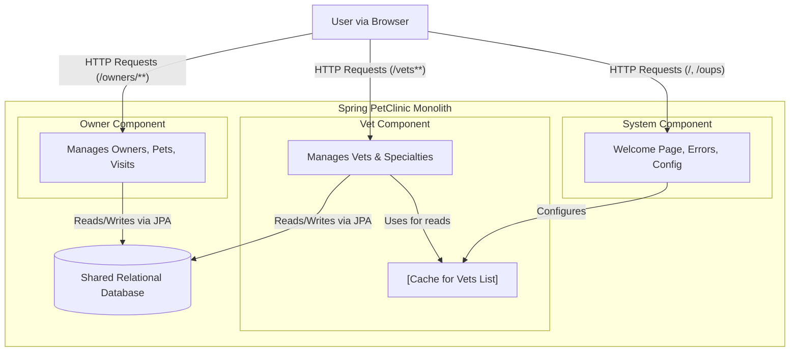

```markdown


The architecture is a classic monolith with three primary logical components (Owner, Vet, System) that all share a single relational database. Communication is initiated by user HTTP requests routed to specific controllers within each component, while all internal interactions, such as data access and cache configuration, occur via direct, in-process Java method calls.
```