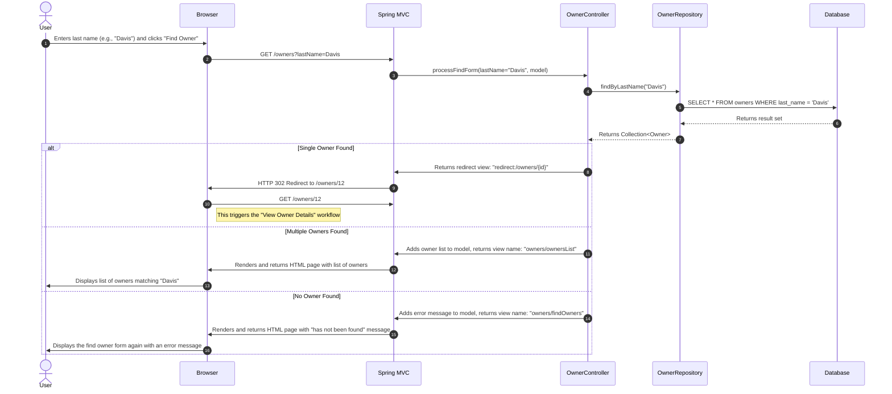
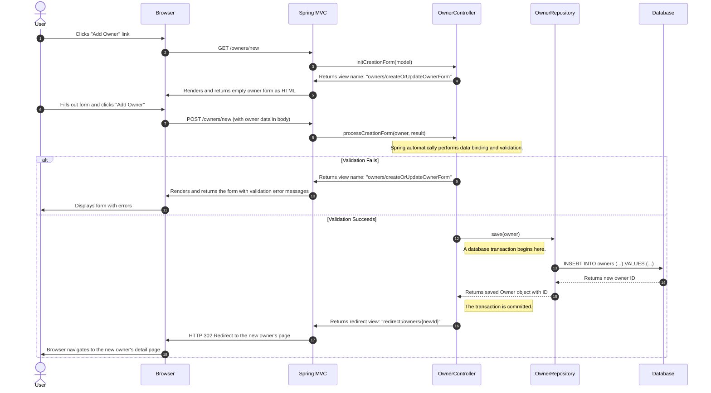
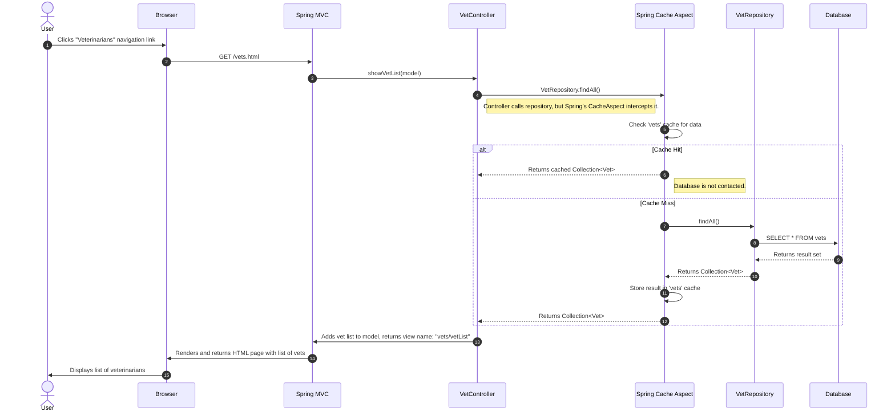
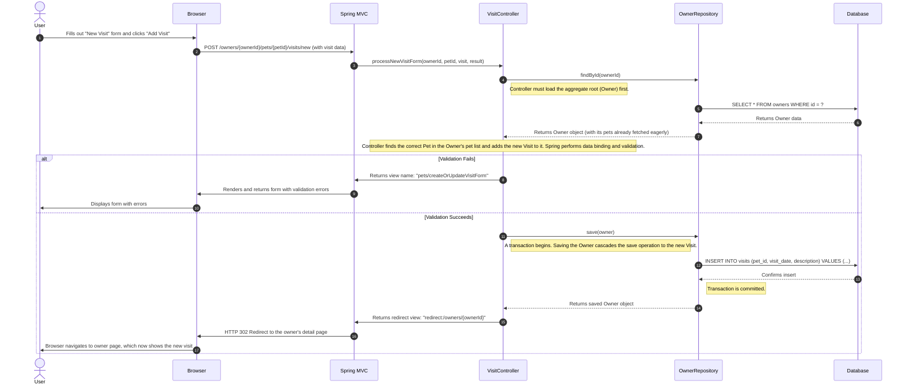
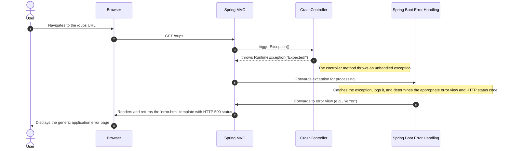

### Workflow: Find Owner by Last Name

*   **Description**: This workflow is triggered when a user searches for a pet owner using their last name via the "Find owners" form. The system handles three scenarios: no owners found, a single owner found, or multiple owners found.
*   **Communication Patterns**:
    *   **User Interaction**: HTTP Form Submission (GET request).
    *   **Internal Communication**: Synchronous Java method calls within the monolithic application.
    *   **Data Access**: Spring Data JPA repository method call (`findByLastName`).
    *   **Database**: A single SQL SELECT query is executed within an implicit read-only transaction.
    *   **Response**: Server-side rendered HTML view or an HTTP redirect.

### Workflow: Add a New Owner

*   **Description**: This workflow starts when a user decides to add a new owner to the system. It involves displaying a creation form, processing the submitted data, validating it, and persisting the new owner to the database.
*   **Communication Patterns**:
    *   **User Interaction**: HTTP GET to display the form, HTTP POST to submit the new owner data.
    *   **Internal Communication**: Synchronous method calls. The controller interacts directly with the repository.
    *   **Data Access**: Spring Data JPA repository method call (`save`).
    *   **Database**: An `INSERT` statement is executed within a database transaction.
    *   **Validation**: Bean Validation (JSR 303) is applied automatically by Spring MVC before the controller method is executed.

### Workflow: View Veterinarians List (with Caching)

*   **Description**: This workflow is triggered when a user requests the list of veterinarians. It demonstrates a read-through caching pattern. The system first checks a cache for the vet list; if the data isn't in the cache (a "cache miss"), it queries the database and populates the cache for subsequent requests.
*   **Communication Patterns**:
    *   **User Interaction**: HTTP GET request.
    *   **Internal Communication**: Synchronous method calls.
    *   **Caching**: JCache (JSR-107) with Spring's cache abstraction. An aspect intercepts the repository call to manage cache interactions.
    *   **Data Access**: Spring Data JPA repository method call (`findAll`).
    *   **Response**: Server-side rendered HTML. A separate JSON endpoint also exists (`/vets`).

### Workflow: Add a New Visit for a Pet

*   **Description**: This workflow allows a user to record a new visit for a specific pet. It highlights the strong data coupling within the monolith, as adding a visit requires loading the parent `Owner` entity first and then saving it to trigger cascading persistence for the new `Visit`.
*   **Communication Patterns**:
    *   **User Interaction**: HTTP POST with form data.
    *   **Internal Communication**: Synchronous method calls.
    *   **Data Access**: Spring Data JPA with `@Transactional` behavior. The `save` call on the `OwnerRepository` cascades to the `Visit` entity.
    *   **Database**: An `INSERT` into the `visits` table is executed as part of the transaction that updates the owner-pet-visit aggregate.

### Workflow: System Error Handling

*   **Description**: This sequence demonstrates the application's generic error handling mechanism. When a controller method throws an unhandled exception, Spring Boot's error handling infrastructure catches it and renders a user-friendly error page. The `/oups` endpoint is designed specifically to trigger this flow.
*   **Communication Patterns**:
    *   **User Interaction**: HTTP GET request to a problematic endpoint.
    *   **Internal Communication**: Synchronous method call leading to a `RuntimeException`.
    *   **Error Handling**: The exception propagates up to the Spring MVC framework, which then invokes its configured error handling logic (e.g., `BasicErrorController`).
    *   **Response**: Server-side rendered HTML error page with an appropriate HTTP status code (e.g., 500 Internal Server Error).

