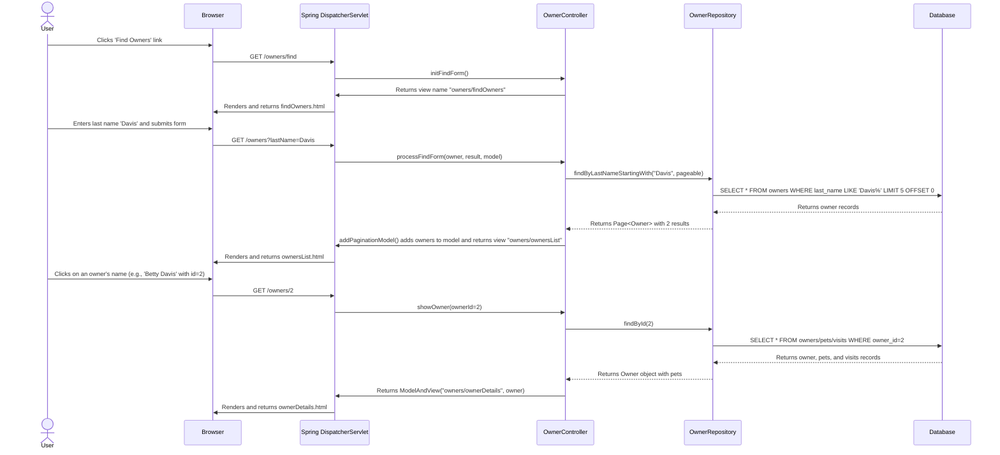
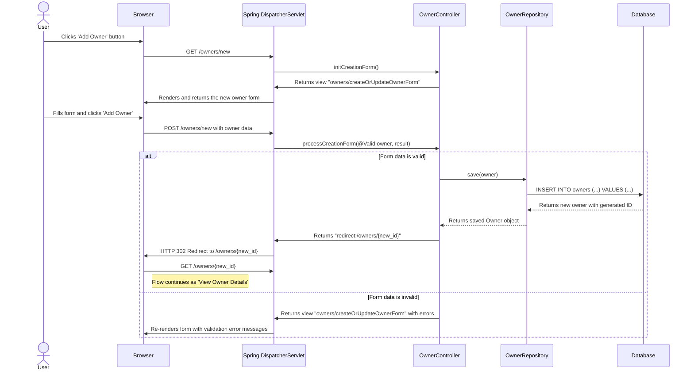
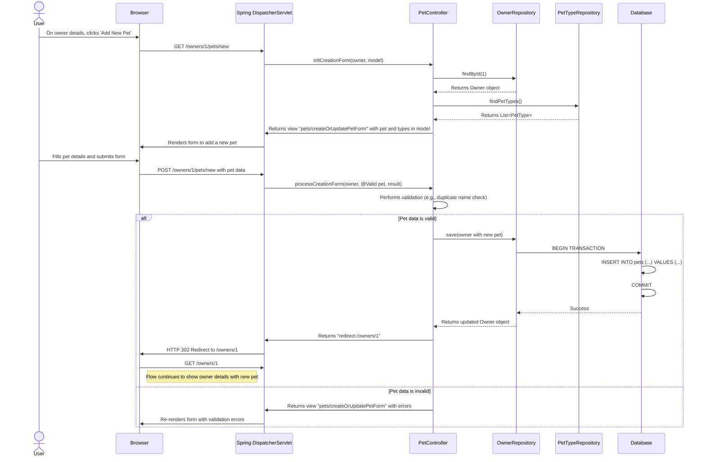
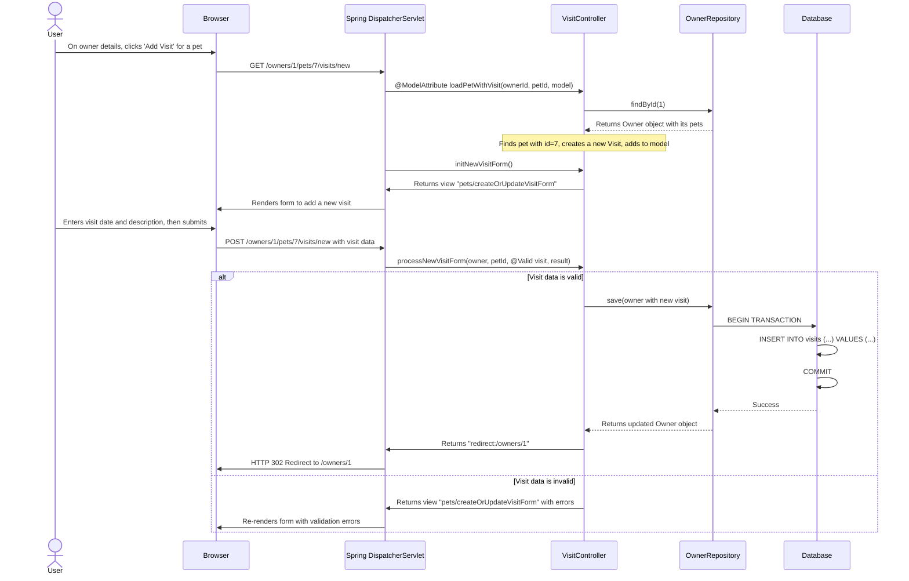
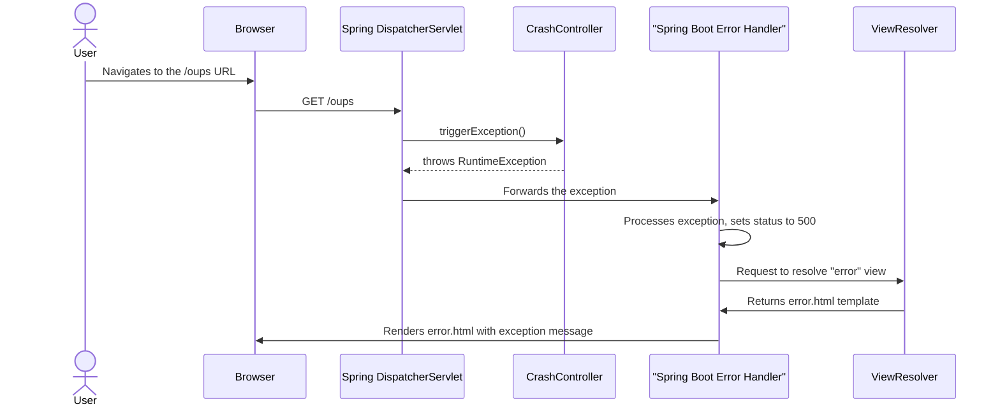

### 1. Find and View Owner Details

-   **Workflow Purpose and Triggers**: This workflow allows a user to search for pet owners by their last name. The trigger is the user submitting the "Find Owners" form. The system displays a list of matching owners, or if only one match is found, redirects directly to that owner's detail page.
-   **Communication Patterns**:
    -   **Browser to Server**: Synchronous HTTP GET requests.
    -   **Server to Database**: Synchronous JDBC calls via Spring Data JPA repositories within a database transaction.
    -   **Pattern**: Request-Response, Redirect after GET (for single-result search).



### 2. Add a New Owner

-   **Workflow Purpose and Triggers**: This workflow enables the creation of a new pet owner. It is triggered when a user clicks the "Add Owner" button and submits the new owner form.
-   **Communication Patterns**:
    -   **Browser to Server**: Synchronous HTTP GET (for form) and POST (for submission).
    -   **Server-Side**: Spring MVC validation (`@Valid`, `BindingResult`).
    -   **Server to Database**: Synchronous JDBC write operation via Spring Data JPA within a transaction.
    -   **Pattern**: Request-Response, Redirect-after-Post.



### 3. Add a New Pet to an Existing Owner

-   **Workflow Purpose and Triggers**: This workflow allows a user to add a new pet for an existing owner. It is triggered when a user, on an owner's detail page, clicks "Add New Pet".
-   **Communication Patterns**:
    -   **Browser to Server**: Synchronous HTTP GET (for form) and POST (for submission).
    -   **Server-Side**: Custom validation (`PetValidator`).
    -   **Server to Database**: Synchronous read (`findById`) and write (`save`) operations. Adding a pet is cascaded from saving the owner object.
    -   **Pattern**: Request-Response, Redirect-after-Post.



### 4. Add a Visit for a Pet

-   **Workflow Purpose and Triggers**: This workflow is for scheduling a new visit for a pet. A user triggers it by clicking "Add Visit" for a specific pet on the owner's detail page.
-   **Communication Patterns**:
    -   **Browser to Server**: Synchronous HTTP GET and POST.
    -   **Server-Side**: Form backing object creation using `@ModelAttribute`.
    -   **Server to Database**: Read (`findById`) and write (`save`) operations. The new visit is persisted by cascading from the owner entity.
    -   **Pattern**: Request-Response, Redirect-after-Post.



### 5. View Veterinarians List (with Caching)

-   **Workflow Purpose and Triggers**: This workflow displays a list of all veterinarians in the clinic. It is triggered by clicking the "Veterinarians" link. This interaction demonstrates the use of caching to improve performance.
-   **Communication Patterns**:
    -   **Browser to Server**: Synchronous HTTP GET.
    -   **Server-Side**: Caching (`@Cacheable`) is applied at the repository level.
    -   **Server to Database**: A synchronous database query is executed only if the data is not in the cache.
    -   **Pattern**: Request-Response, Cache-Aside pattern (managed by Spring).

```mermaid
sequenceDiagram
    actor User
    participant Browser
    participant SpringMVC as Spring DispatcherServlet
    participant VetController
    participant VetRepository
    participant Cache as "JCache (vets)"
    participant Database

    User->>Browser: Clicks 'Veterinarians' link
    Browser->>SpringMVC: GET /vets.html
    SpringMVC->>VetController: showVetList(page=1, model)
    VetController->>VetRepository: findAll(pageable)

    alt Cache Miss (First Request)
        VetRepository->>Cache: Check for 'vets' page 1 data
        Cache-->>VetRepository: Data not found
        VetRepository->>Database: SELECT * FROM vets LIMIT 5 OFFSET 0
        Database-->>VetRepository: Returns Vet records
        VetRepository->>Cache: Store result in cache
        Cache-->>VetRepository: Acknowledge storage
        VetRepository-->>VetController: Returns Page<Vet>
        VetController->>SpringMVC: Adds vets to model, returns "vets/vetList"
        SpringMVC->>Browser: Renders and returns vetList.html
    end

    User->>Browser: Navigates away and back to 'Veterinarians'
    Browser->>SpringMVC: GET /vets.html
    SpringMVC->>VetController: showVetList(page=1, model)
    VetController->>VetRepository: findAll(pageable)

    alt Cache Hit (Second Request)
        VetRepository->>Cache: Check for 'vets' page 1 data
        Cache-->>VetRepository: Returns cached Page<Vet> object
        deactivate VetRepository
        VetRepository-->>VetController: Returns Page<Vet> from cache
        VetController->>SpringMVC: Adds vets to model, returns "vets/vetList"
        SpringMVC->>Browser: Renders and returns vetList.html
    end
```

### 6. System Error Handling

-   **Workflow Purpose and Triggers**: This demonstrates the application's global exception handling mechanism. It is triggered when a user accesses a specific URL (`/oups`) designed to throw an unhandled exception.
-   **Communication Patterns**:
    -   **Browser to Server**: Synchronous HTTP GET.
    -   **Server-Side**: Spring Boot's default error handling mechanism intercepts the `RuntimeException`.
    -   **Pattern**: Exception Handling, renders a custom error view instead of the default "Whitelabel Error Page".

