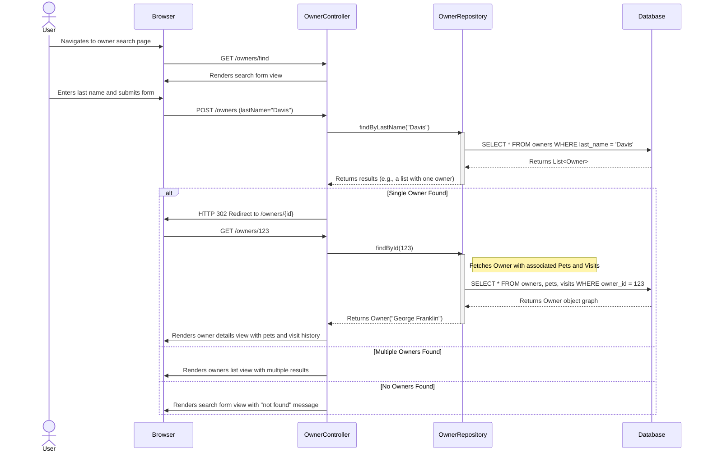
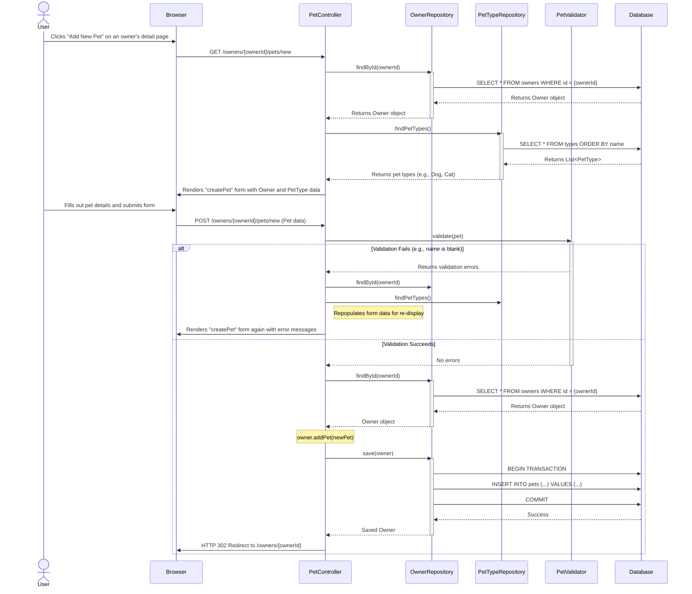
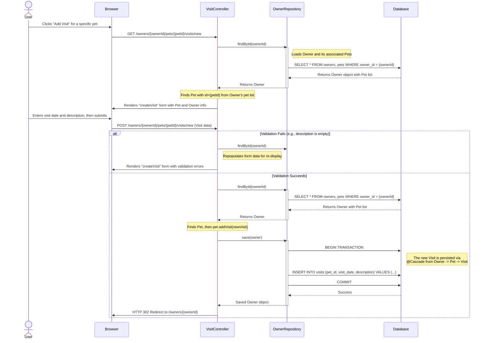
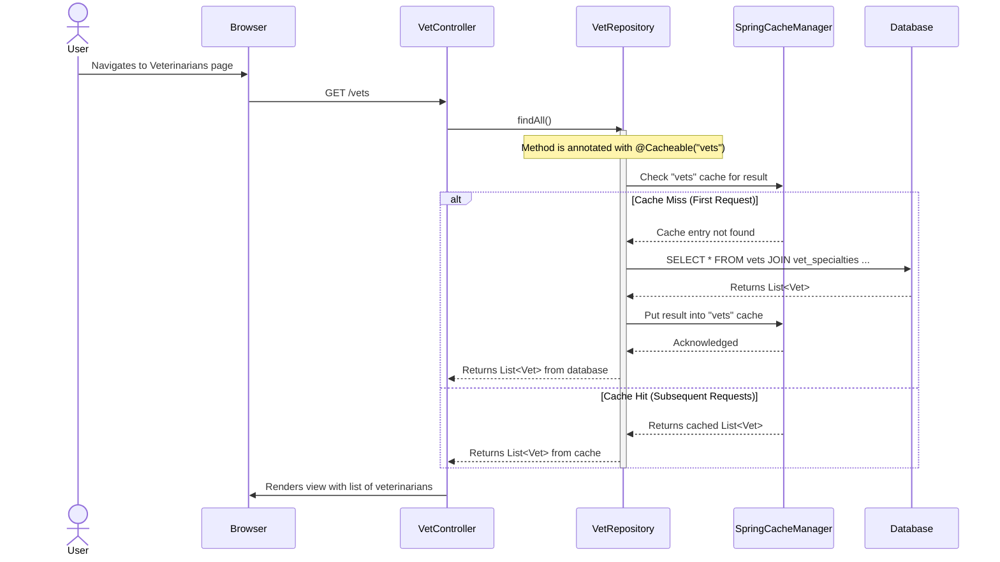
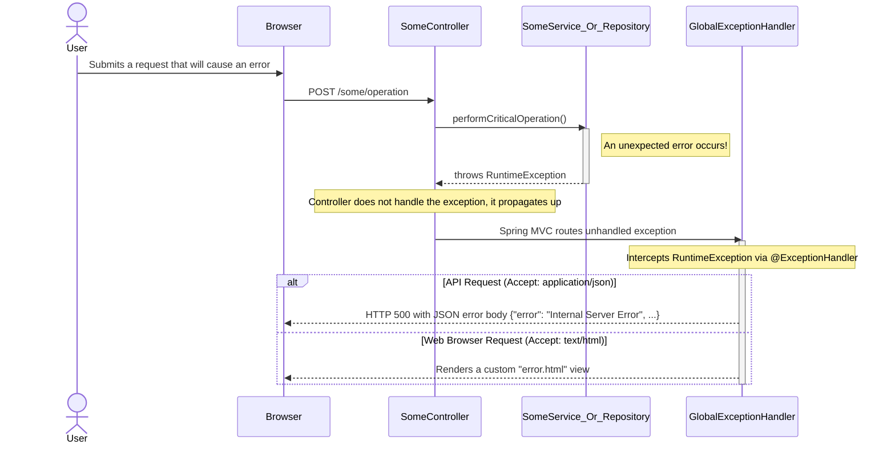

### Workflow 1: Find and View a Pet Owner

-   **Workflow Purpose and Trigger**: This workflow is triggered when a clinic staff member needs to find an existing pet owner's record. They initiate a search using the owner's last name. The system either displays a list of matching owners, directly shows the owner's detailed profile if only one is found, or indicates that no owner was found.
-   **Communication Patterns**: The workflow primarily uses synchronous **HTTP GET/POST** requests for user interaction. The backend uses synchronous method calls to the data access layer, which in turn executes **SQL SELECT queries** within a database transaction managed by Spring Data JPA.

### Workflow 2: Add a New Pet to an Existing Owner

-   **Workflow Purpose and Trigger**: This workflow starts when a clinic staff member needs to register a new pet for an existing owner. The user navigates from the owner's detail page to the "Add Pet" form.
-   **Communication Patterns**: This flow involves synchronous **HTTP GET/POST** requests. It includes multiple database reads (**SQL SELECT**) to prepare the form (fetching the owner and pet types) and a transactional database write (**SQL INSERT**) to save the new pet. It also demonstrates server-side validation.

### Workflow 3: Add a Medical Visit for a Pet

-   **Workflow Purpose and Trigger**: A clinic staff member records a new medical visit for a specific pet. This is triggered by clicking an "Add Visit" button on the owner's detail page next to the relevant pet.
-   **Communication Patterns**: The workflow uses synchronous **HTTP GET/POST** calls. Data is fetched using **SQL SELECT** to prepare the form, and a new visit is recorded via a transactional **SQL INSERT**. Server-side validation ensures the visit description is not empty.

### Workflow 4: View Veterinarian List with Caching

-   **Workflow Purpose and Trigger**: This workflow is initiated when a user wants to see the list of all veterinarians available at the clinic. It is designed for high performance by caching the vet list.
-   **Communication Patterns**: This demonstrates a synchronous **HTTP GET** request enhanced with a **Cache-Aside** pattern. The initial request triggers a **SQL SELECT** query, but subsequent requests are served directly from an in-memory cache, avoiding database access.

### Workflow 5: System-wide Error Handling

-   **Workflow Purpose and Trigger**: This flow illustrates how the system gracefully handles unexpected runtime exceptions that can occur during any operation. It's triggered when an unhandled error propagates up from a lower layer.
-   **Communication Patterns**: This is an example of an **AOP (Aspect-Oriented Programming)** cross-cutting concern. A global exception handler (`@ControllerAdvice`) intercepts exceptions from the synchronous request-response flow. The system then responds differently based on the client's `Accept` header (e.g., JSON for API clients, HTML for web browsers).

