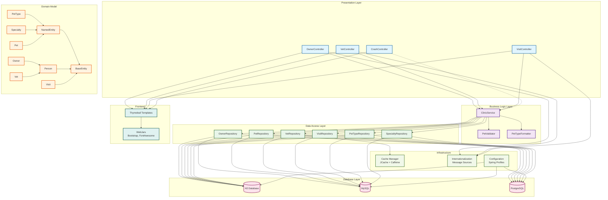

```mermaid
graph TB
    subgraph "Presentation Layer"
        OwnerController[OwnerController]
        VetController[VetController]
        VisitController[VisitController]
        CrashController[CrashController]
    end

    subgraph "Business Logic Layer"
        ClinicService[ClinicService]
        PetValidator[PetValidator]
        DataFormatter[PetTypeFormatter]
    end

    subgraph "Data Access Layer"
        OwnerRepository[OwnerRepository]
        PetRepository[PetRepository]
        VetRepository[VetRepository]
        VisitRepository[VisitRepository]
        PetTypeRepository[PetTypeRepository]
        SpecialtyRepository[SpecialtyRepository]
    end

    subgraph "Domain Model"
        BaseEntity[BaseEntity]
        NamedEntity[NamedEntity]
        Person[Person]
        Owner[Owner]
        Vet[Vet]
        Pet[Pet]
        Visit[Visit]
        PetType[PetType]
        Specialty[Specialty]
    end

    subgraph "Database Layer"
        H2[(H2 Database)]
        MySQL[(MySQL)]
        PostgreSQL[(PostgreSQL)]
    end

    subgraph "Infrastructure"
        CacheManager[Cache Manager<br/>JCache + Caffeine]
        I18n[Internationalization<br/>Message Sources]
        Config[Configuration<br/>Spring Profiles]
    end

    subgraph "Frontend"
        Thymeleaf[Thymeleaf Templates]
        WebJars[WebJars<br/>Bootstrap, FontAwesome]
    end

    %% Controller to Service connections
    OwnerController --> ClinicService
    VetController --> ClinicService
    VisitController --> ClinicService
    CrashController -.-> ClinicService

    %% Service to Repository connections
    ClinicService --> OwnerRepository
    ClinicService --> PetRepository
    ClinicService --> VetRepository
    ClinicService --> VisitRepository
    ClinicService --> PetTypeRepository
    ClinicService --> SpecialtyRepository

    %% Repository to Database connections
    OwnerRepository --> H2
    OwnerRepository --> MySQL
    OwnerRepository --> PostgreSQL
    PetRepository --> H2
    PetRepository --> MySQL
    PetRepository --> PostgreSQL
    VetRepository --> H2
    VetRepository --> MySQL
    VetRepository --> PostgreSQL
    VisitRepository --> H2
    VisitRepository --> MySQL
    VisitRepository --> PostgreSQL
    PetTypeRepository --> H2
    PetTypeRepository --> MySQL
    PetTypeRepository --> PostgreSQL
    SpecialtyRepository --> H2
    SpecialtyRepository --> MySQL
    SpecialtyRepository --> PostgreSQL

    %% Domain Model hierarchy
    NamedEntity --> BaseEntity
    Person --> BaseEntity
    Visit --> BaseEntity
    PetType --> NamedEntity
    Specialty --> NamedEntity
    Owner --> Person
    Vet --> Person
    Pet --> NamedEntity

    %% Infrastructure integration
    VetRepository --> CacheManager
    ClinicService --> PetValidator
    ClinicService --> DataFormatter
    Config --> H2
    Config --> MySQL
    Config --> PostgreSQL

    %% Frontend connections
    OwnerController --> Thymeleaf
    VetController --> Thymeleaf
    VisitController --> Thymeleaf
    CrashController --> Thymeleaf
    Thymeleaf --> WebJars
    OwnerController --> I18n
    VetController --> I18n
    VisitController --> I18n

    %% Styling
    classDef controller fill:#e1f5fe,stroke:#01579b,stroke-width:2px
    classDef service fill:#f3e5f5,stroke:#4a148c,stroke-width:2px
    classDef repository fill:#e8f5e9,stroke:#1b5e20,stroke-width:2px
    classDef entity fill:#fff3e0,stroke:#e65100,stroke-width:2px
    classDef database fill:#fce4ec,stroke:#880e4f,stroke-width:2px
    classDef infrastructure fill:#f1f8e9,stroke:#33691e,stroke-width:2px
    classDef frontend fill:#e0f2f1,stroke:#004d40,stroke-width:2px

    class OwnerController,VetController,VisitController,CrashController controller
    class ClinicService,PetValidator,DataFormatter service
    class OwnerRepository,PetRepository,VetRepository,VisitRepository,PetTypeRepository,SpecialtyRepository repository
    class BaseEntity,NamedEntity,Person,Owner,Vet,Pet,Visit,PetType,Specialty entity
    class H2,MySQL,PostgreSQL database
    class CacheManager,I18n,Config infrastructure
    class Thymeleaf,WebJars frontend
```