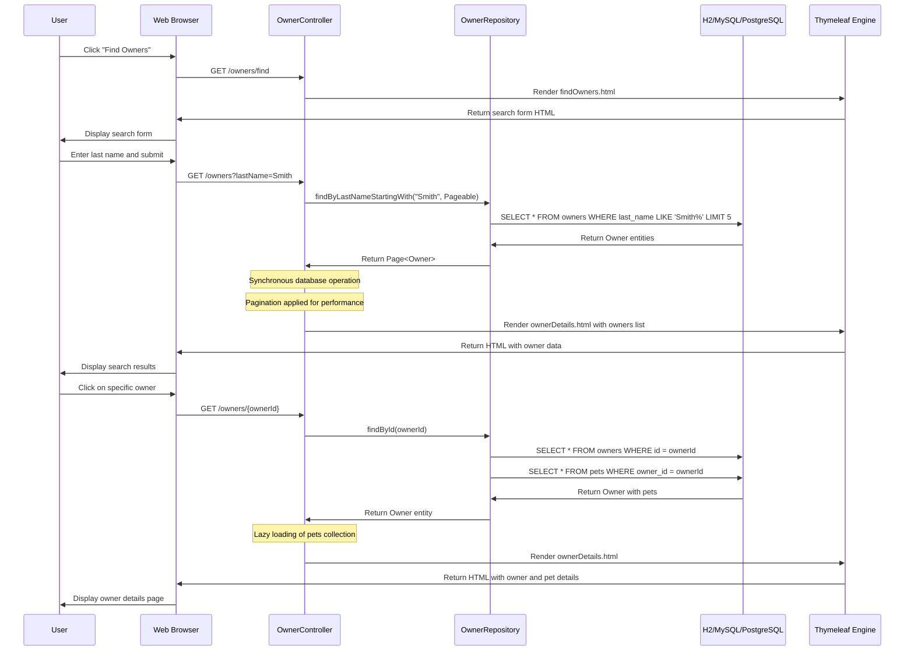
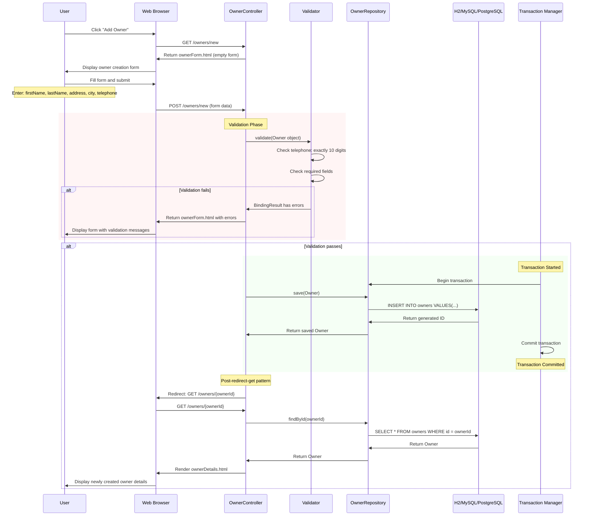
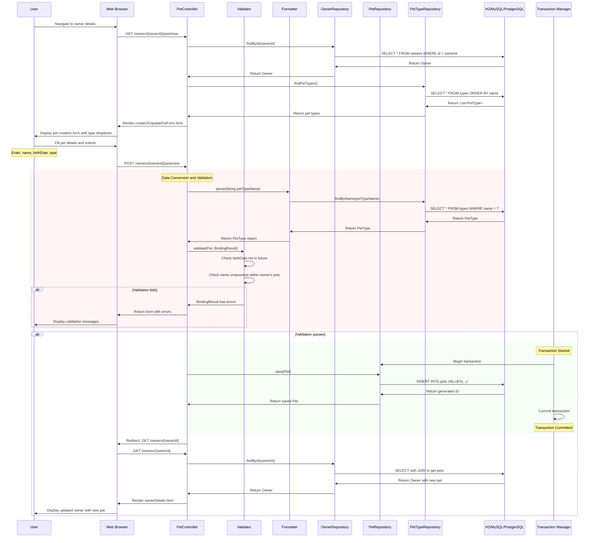
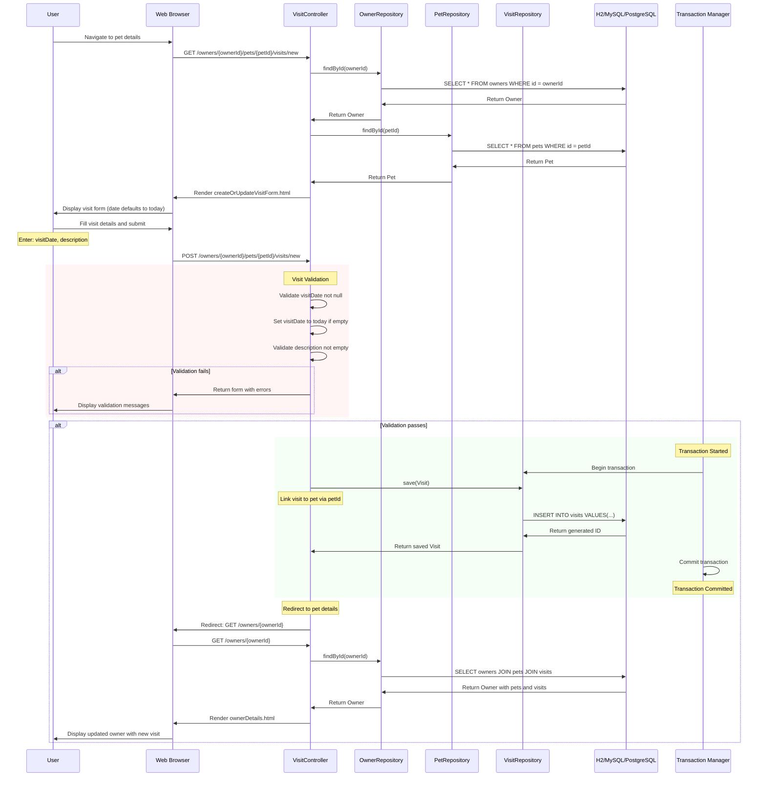
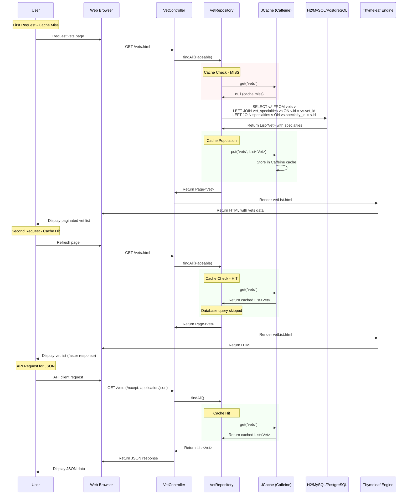
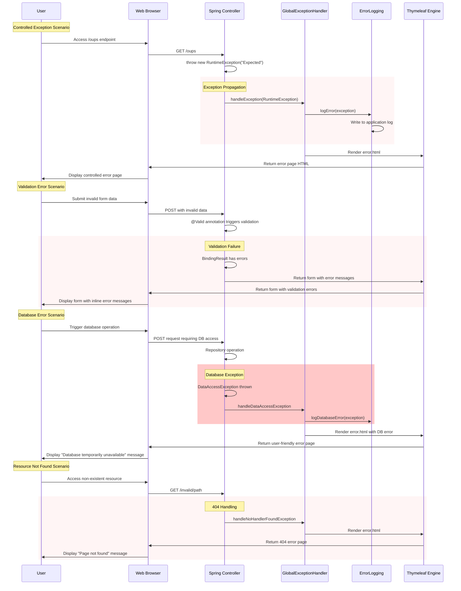
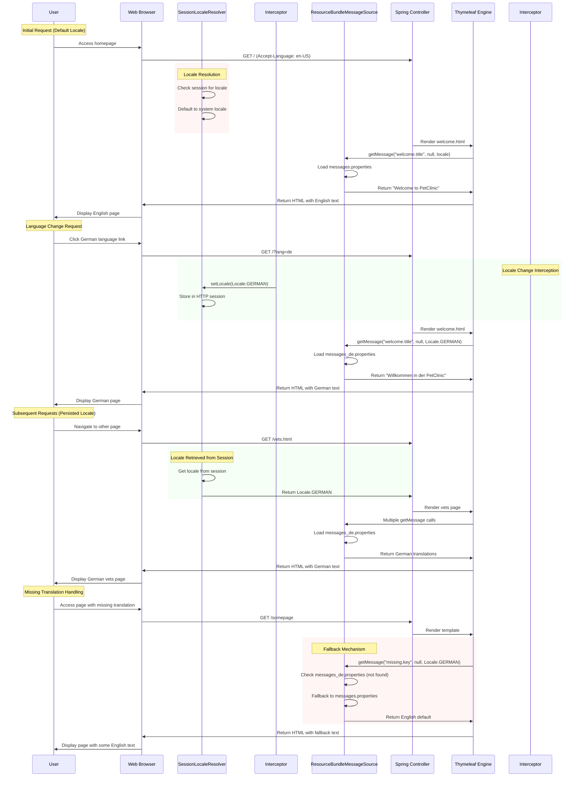
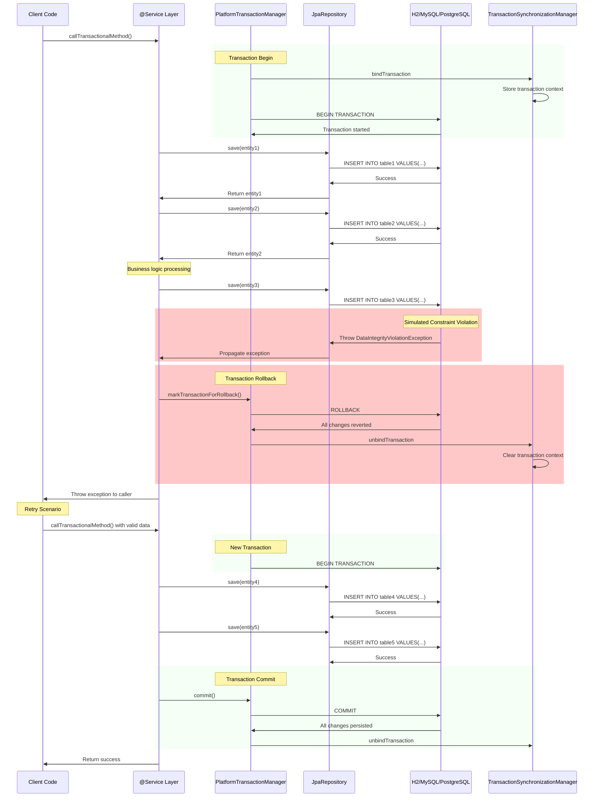

# Spring PetClinic - Dynamic Interaction Flows

## 1. Owner Search and Retrieval Workflow

**Workflow Purpose**: Enables users to search for owners by last name and view their details with associated pets.  
**Communication Patterns**: Synchronous HTTP requests, JPA database queries, server-side rendering with Thymeleaf.

## 2. Owner Creation Workflow

**Workflow Purpose**: Allows users to register new pet owners in the system with proper validation and transaction management.  
**Communication Patterns**: Form submission, server-side validation, database transaction, PRG (Post-Redirect-Get) pattern.

## 3. Pet Creation Workflow

**Workflow Purpose**: Enables adding new pets to existing owners with type selection, validation, and data consistency checks.  
**Communication Patterns**: Data formatting, custom validation, transaction management, foreign key relationships.

## 4. Visit Scheduling Workflow

**Workflow Purpose**: Records medical visits for pets with proper date handling and maintains medical history.  
**Communication Patterns**: Default value handling, cross-entity relationships, join queries for complete data retrieval.

## 5. Veterinarian List Retrieval with Caching

**Workflow Purpose**: Provides veterinarian listings with caching optimization for frequently accessed data.  
**Communication Patterns**: Caching layer with JCache/Caffeine, content negotiation (HTML/JSON), pagination, many-to-many relationship handling.

## 6. Error Handling and Recovery Flow

**Workflow Purpose**: Manages application errors gracefully with proper logging, user-friendly messages, and recovery mechanisms.  
**Communication Patterns**: Exception handling pipeline, error logging, user feedback without exposing internal details.

## 7. Internationalization Workflow

**Workflow Purpose**: Provides multi-language support with session-based locale persistence and fallback mechanisms.  
**Communication Patterns**: Locale resolution, message resource loading, session storage, fallback translation handling.

## 8. Database Transaction Management Flow

**Workflow Purpose**: Demonstrates Spring's declarative transaction management with proper rollback and commit scenarios.  
**Communication Patterns**: Transaction boundaries, rollback on exceptions, commit on successful completion, context management.