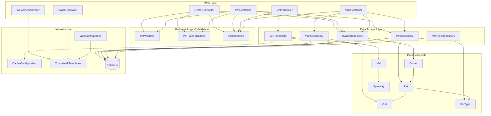

The architecture follows a traditional layered monolith pattern with clear separation between web controllers, business logic, data access, and domain models. Controllers directly interact with repositories following Spring's convention, with validation and formatting handled by dedicated components. The VetController demonstrates caching optimization while all repositories abstract database interactions, supporting multiple database backends through profile-based configuration.