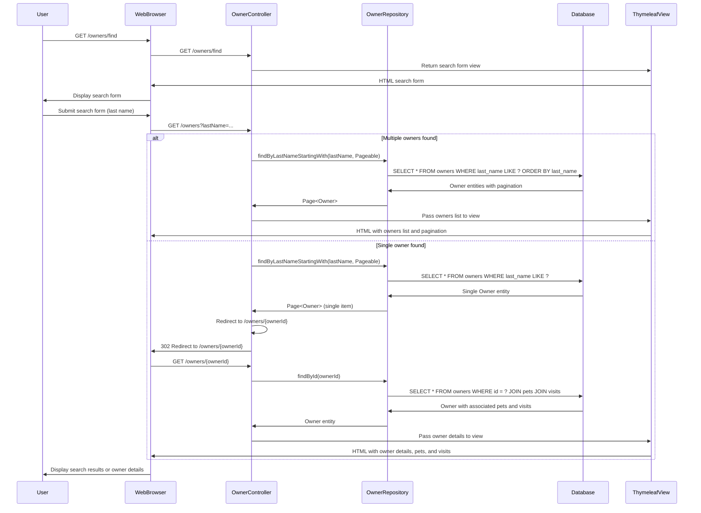
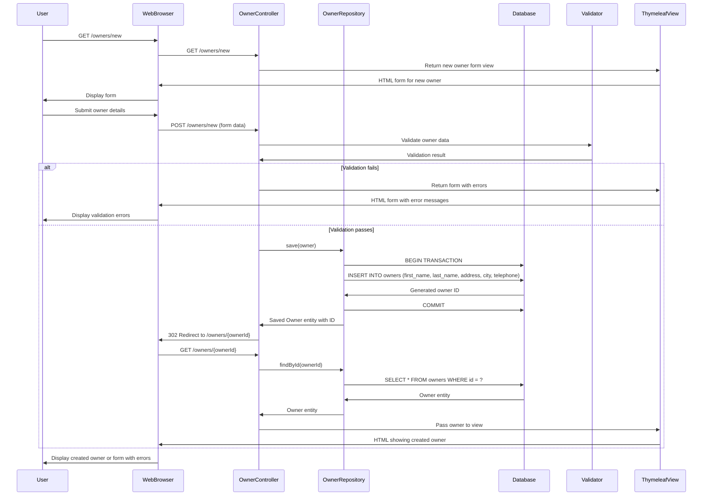
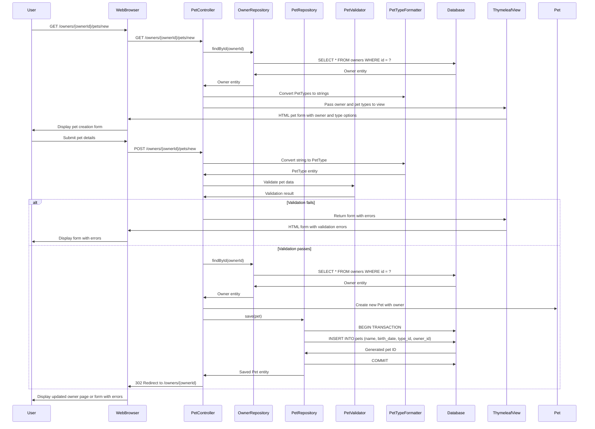
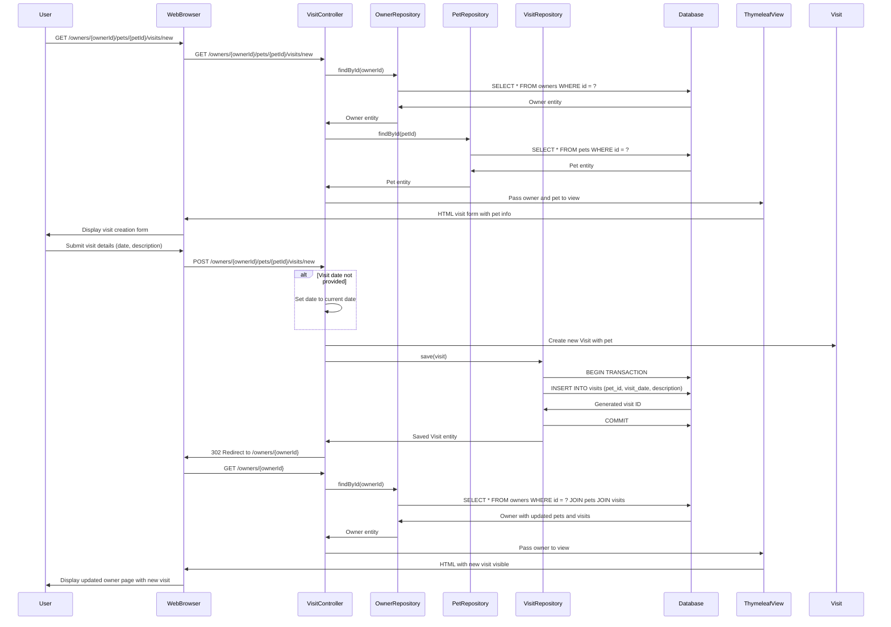
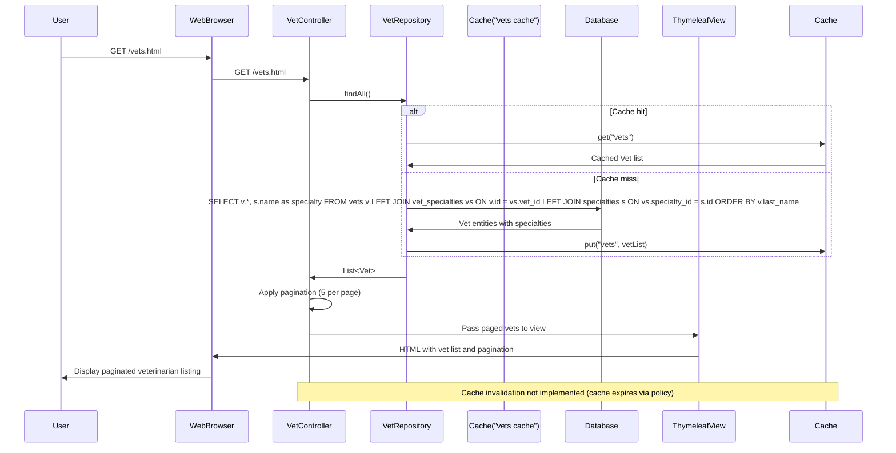
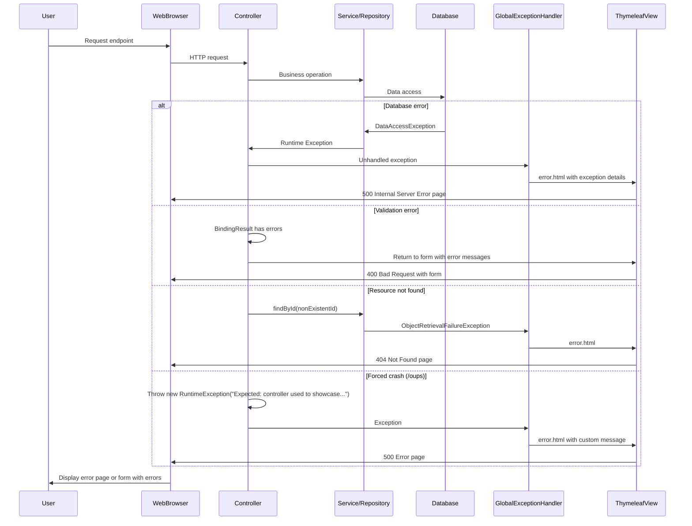
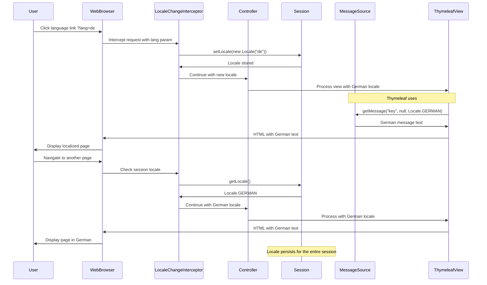

# Spring PetClinic Dynamic Interaction Flows

## 1. Owner Search and View Workflow

**Purpose:** Users search for owners by last name and view owner details with their pets.  
**Trigger:** User accesses `/owners/find` and submits a search form.  
**Communication Pattern:** Synchronous HTTP request/response with database queries.

## 2. Owner Creation Workflow

**Purpose:** Register a new owner in the system with validation.  
**Trigger:** User submits the new owner form.  
**Communication Pattern:** Synchronous HTTP POST with database transaction and validation.

## 3. Pet Addition Workflow

**Purpose:** Add a new pet to an existing owner with type and birth date validation.  
**Trigger:** User accesses pet creation form from owner details page.  
**Communication Pattern:** Synchronous operations with custom validation and type conversion.

## 4. Visit Scheduling Workflow

**Purpose:** Create a new veterinary visit for a pet with date and description.  
**Trigger:** User schedules a visit from pet details page.  
**Communication Pattern:** Synchronous with default date handling and database persistence.

## 5. Veterinarian Listing Workflow with Caching

**Purpose:** Display list of veterinarians with their specialties, using cache for performance.  
**Trigger:** User accesses vets listing page.  
**Communication Pattern:** Synchronous with cache layer for performance optimization.

## 6. Error Handling Workflow

**Purpose:** Handle exceptions and display appropriate error pages.  
**Trigger:** Application throws an exception or error occurs.  
**Communication Pattern:** Exception propagation with global error handling.

## 7. Language Switching Workflow

**Purpose:** Change application language for internationalization support.  
**Trigger:** User clicks language link with ?lang= parameter.  
**Communication Pattern:** Synchronous with session-based locale storage.

