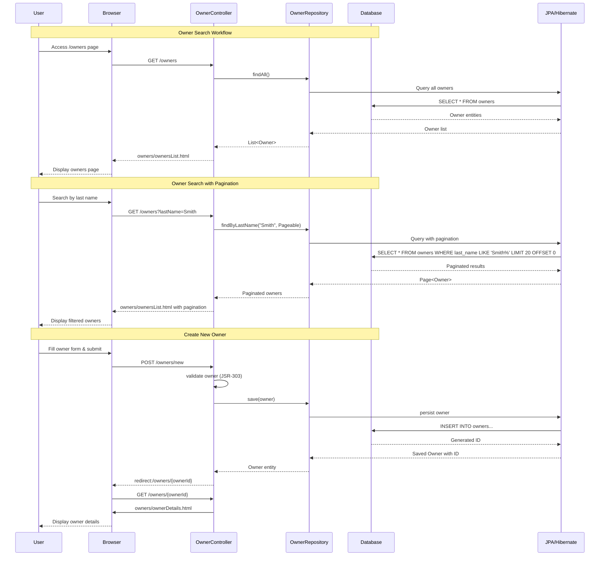
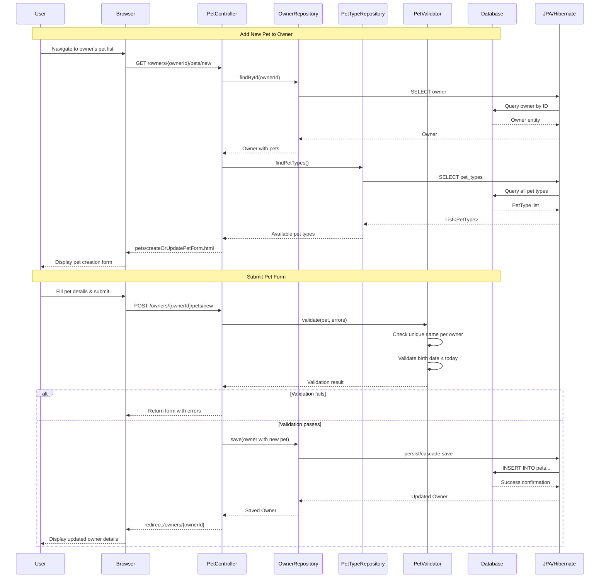
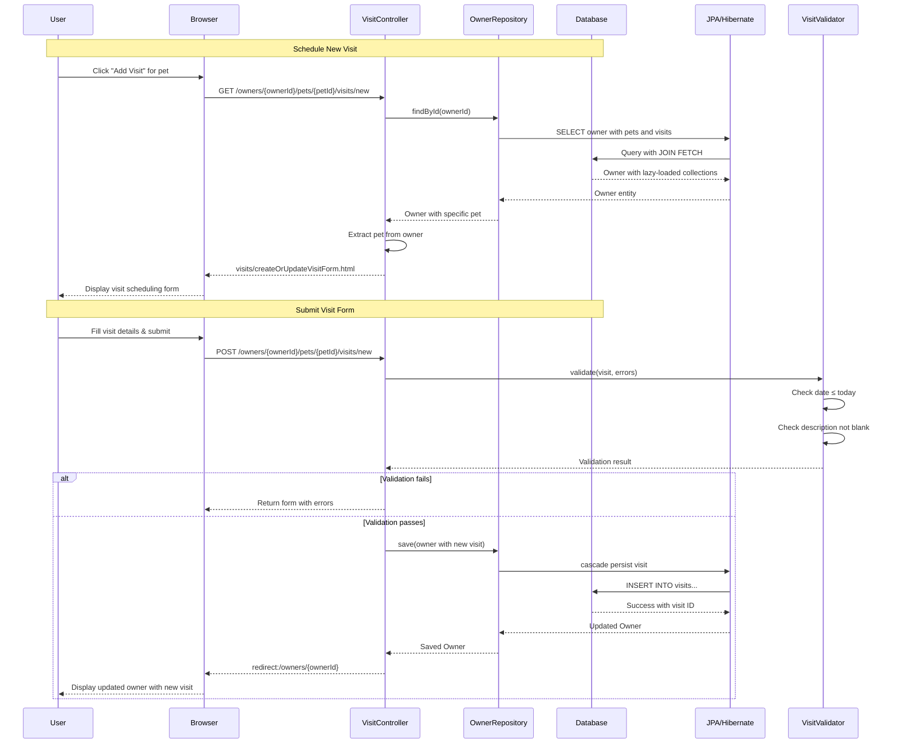
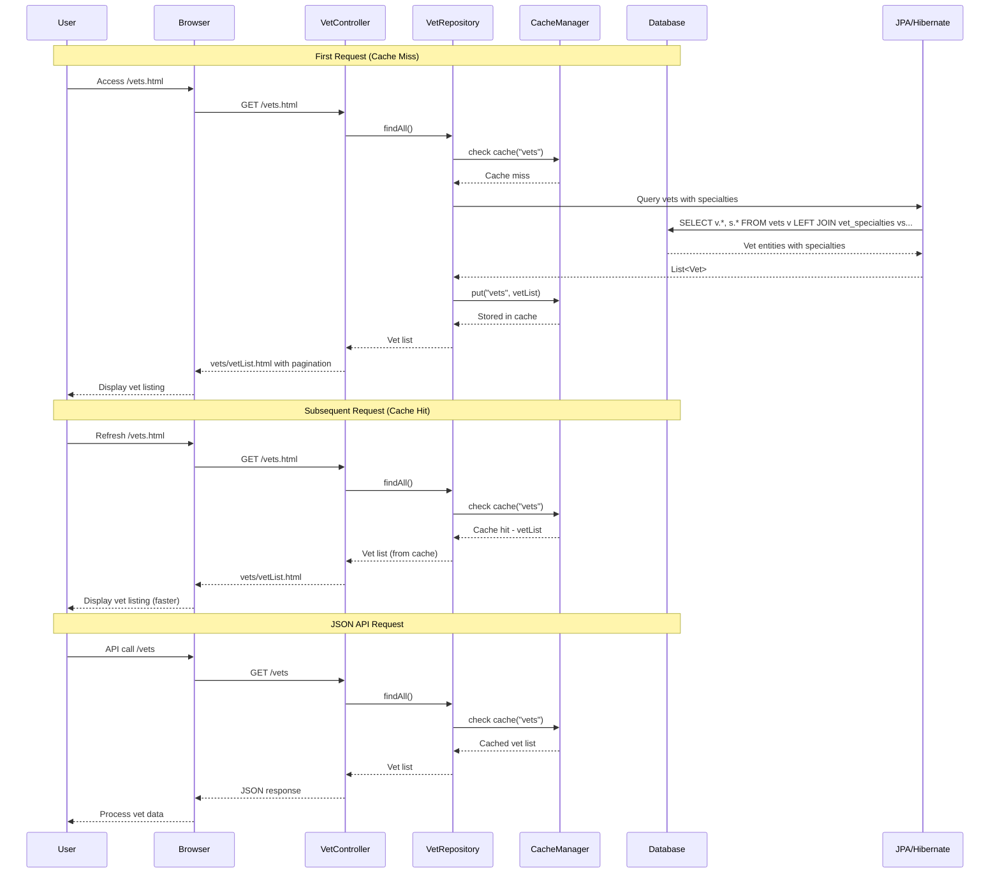
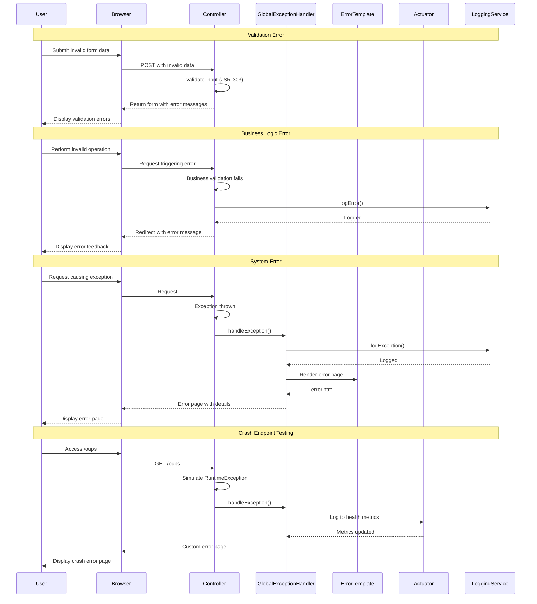
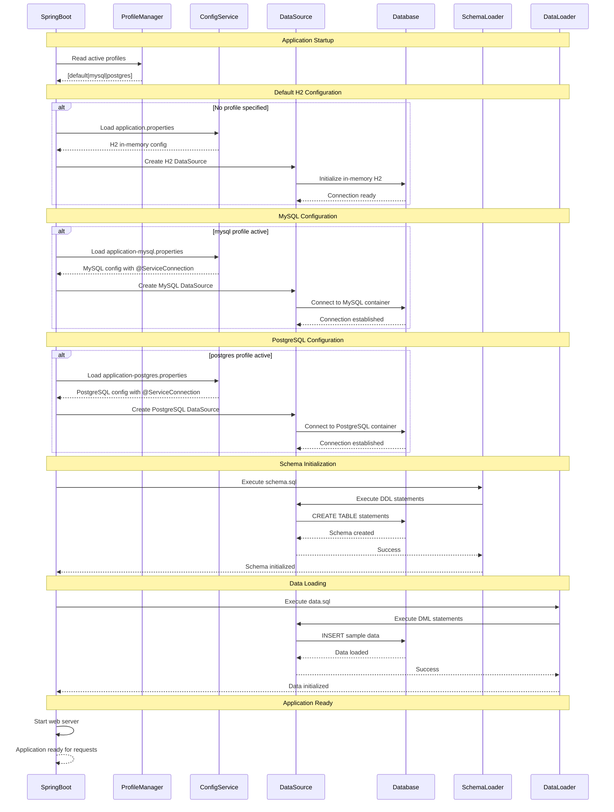
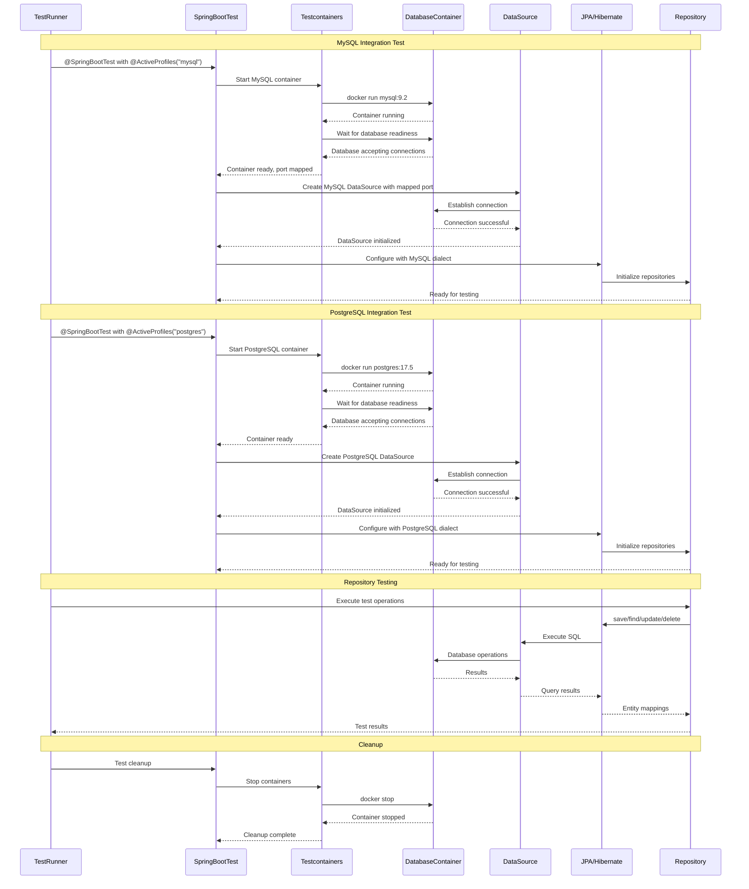

# Owner Management Workflow

# Pet Management Workflow

# Visit Scheduling Workflow

# Vet Listing Workflow with Caching

# Error Handling and Recovery Workflow

# Database Configuration and Initialization Workflow

# Multi-Database Support and Testcontainers Integration Workflow

