```mermaid
graph TB
    subgraph "Presentation Layer"
        WEB[Web Client]
        CONTROLLERS[Controllers]
        subgraph "Controller Components"
            OWNER_CTRL[OwnerController]
            PET_CTRL[PetController]
            VISIT_CTRL[VisitController]
            VET_CTRL[VetController]
            WELCOME_CTRL[WelcomeController]
            CRASH_CTRL[CrashController]
        end
        VIEWS[Thymeleaf Views]
    end

    subgraph "Business Logic"
        SERVICES[Service Layer]
        VALIDATION[Validation Layer]
        CACHE[Caching Layer]
    end

    subgraph "Data Access Layer"
        REPOSITORIES[Spring Data Repositories]
        subgraph "Repository Components"
            OWNER_REPO[OwnerRepository]
            PET_TYPE_REPO[PetTypeRepository]
            VET_REPO[VetRepository]
            SPECIALTY_REPO[SpecialtyRepository]
        end
    end

    subgraph "Database Layer"
        DB_CONFIG[Database Profiles]
        subgraph "Database Options"
            H2[(H2 In-Memory)]
            MYSQL[(MySQL)]
            POSTGRES[(PostgreSQL)]
        end
    end

    subgraph "Cross-Cutting Concerns"
        I18N[Internationalization]
        ERROR[Error Handling]
        BUILD[Build Tools]
    end

    subgraph "Domain Models"
        OWNER[Owner Entity]
        PET[Pet Entity]
        VISIT[Visit Entity]
        VET[Vet Entity]
        PET_TYPE[PetType]
        SPECIALTY[Specialty]
    end

    %% Interactions
    WEB --> CONTROLLERS
    CONTROLLERS --> VIEWS
    CONTROLLERS --> SERVICES
    CONTROLLERS --> VALIDATION
    
    OWNER_CTRL --> OWNER_REPO
    PET_CTRL --> OWNER_REPO
    PET_CTRL --> PET_TYPE_REPO
    VISIT_CTRL --> OWNER_REPO
    VET_CTRL --> VET_REPO
    VET_REPO --> CACHE
    
    REPOSITORIES --> DB_CONFIG
    DB_CONFIG --> H2
    DB_CONFIG --> MYSQL
    DB_CONFIG --> POSTGRES
    
    SERVICES --> VALIDATION
    SERVICES --> REPOSITORIES
    
    OWNER_REPO --> OWNER
    PET_TYPE_REPO --> PET_TYPE
    VET_REPO --> VET
    VET_REPO --> SPECIALTY
    SPECIALTY_REPO --> SPECIALTY
    
    OWNER --> PET
    PET --> VISIT
    VET --> SPECIALTY
    PET --> PET_TYPE
    
    VALIDATION --> ERROR
    CONTROLLERS --> I18N
    BUILD --> CONTROLLERS
```

The diagram reflects a classic Spring MVC layered architecture with clear separation of concerns. Controllers handle web requests and delegate to repositories, which abstract database access across multiple profile-configured databases. Cross-cutting concerns like caching (specifically for vet data), validation, and internationalization are integrated at appropriate layers, while domain entities maintain their relational mappings independent of the application layers.