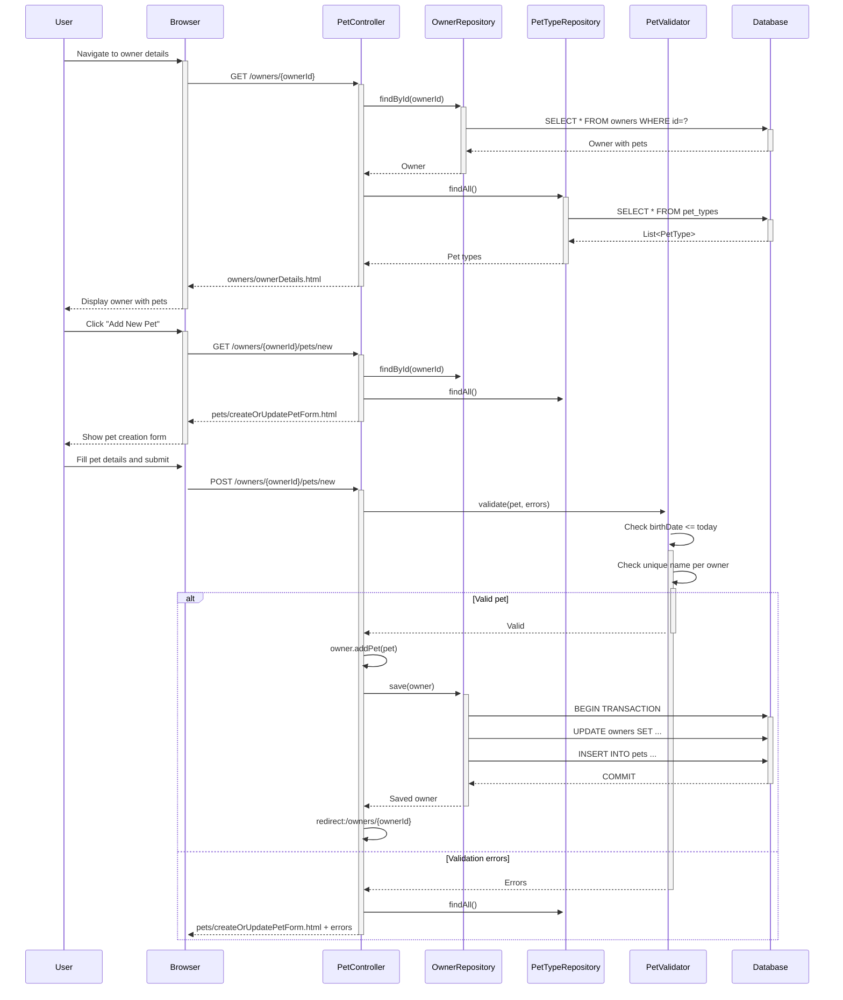
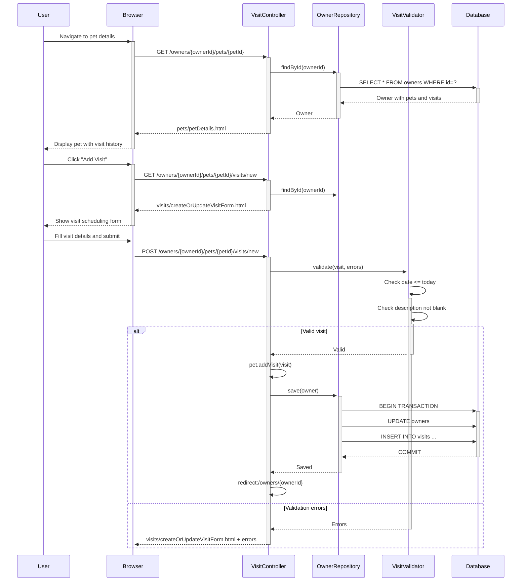
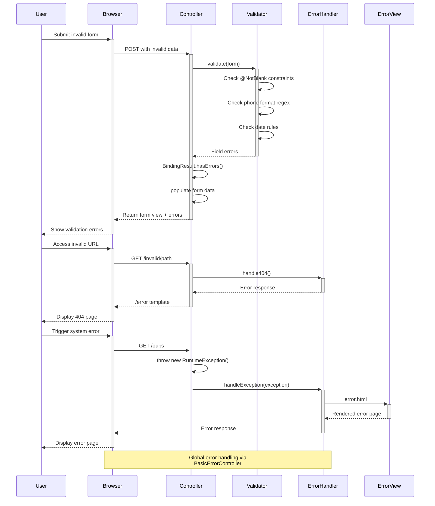
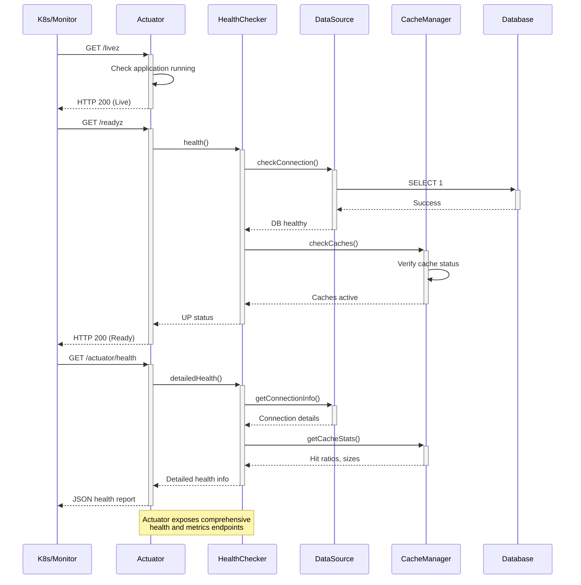

# Spring PetClinic Dynamic Interaction Flows

## 1. Owner Management Workflow

```mermaid
sequenceDiagram
    participant User
    participant Browser
    participant OwnerController
    participant OwnerRepository
    participant Database
    participant Validator
    
    User->>+Browser: Navigate to /owners
    Browser->>+OwnerController: GET /owners
    OwnerController->>+OwnerRepository: findAll()
    OwnerRepository->>+Database: SELECT * FROM owners
    Database-->>-OwnerRepository: Owner list
    OwnerRepository-->>-OwnerController: List<Owner>
    OwnerController-->>-Browser: owners/ownersList.html
    Browser-->>-User: Display owners list
    
    User->>+Browser: Click "Add Owner"
    Browser->>+OwnerController: GET /owners/new
    OwnerController-->>-Browser: owners/createOrUpdateOwnerForm.html
    Browser-->>-User: Show owner creation form
    
    User->>+Browser: Fill and submit form
    Browser->>+OwnerController: POST /owners/new
    OwnerController->>+Validator: validate(ownerForm)
    alt Valid data
        Validator-->>-OwnerController: Valid
        OwnerController->>+OwnerRepository: save(owner)
        OwnerRepository->>+Database: INSERT INTO owners
        Database-->>-OwnerRepository: Saved owner
        OwnerRepository-->>-OwnerController: Owner with ID
        OwnerController->>OwnerController: redirect:/owners/{ownerId}
    else Invalid data
        Validator-->>-OwnerController: Validation errors
        OwnerController-->>-Browser: owners/createOrUpdateOwnerForm.html + errors
    end
    
    User->>+Browser: Search for owner
    Browser->>+OwnerController: GET /owners?lastName=Smith
    OwnerController->>+OwnerRepository: findByLastName("Smith", Pageable)
    OwnerRepository->>+Database: SELECT * FROM owners WHERE last_name LIKE 'Smith%'
    Database-->>-OwnerRepository: Paged result
    OwnerRepository-->>-OwnerController: Page<Owner>
    OwnerController-->>-Browser: owners/ownersList.html
    Browser-->>-User: Display search results
```

## 2. Pet Management Workflow



## 3. Visit Scheduling Workflow



## 4. Vet Management Workflow with Caching

```mermaid
sequenceDiagram
    participant User
    participant Browser
    participant VetController
    participant VetRepository
    participant CacheManager
    participant Database
    
    User->>+Browser: Navigate to /vets.html
    Browser->>+VetController: GET /vets.html
    VetController->>+VetRepository: findAll()
    VetRepository->>+CacheManager: get("vets")
    alt Cache miss
        CacheManager-->>-VetRepository: null
        VetRepository->>+Database: SELECT v.*, s.* FROM vets v LEFT JOIN vet_specialties vs ON v.id = vs.vet_id LEFT JOIN specialties s ON vs.specialty_id = s.id
        Database-->>-VetRepository: List<Vet> with specialties
        VetRepository->>+CacheManager: put("vets", vetList)
        CacheManager-->>-VetRepository: Cached
    else Cache hit
        CacheManager-->>-VetRepository: cached Vet list
    end
    VetRepository-->>-VetController: List<Vet>
    VetController-->>-Browser: vets/vetList.html
    Browser-->>-User: Display vet list with specialties
    
    User->>+Browser: Request JSON vet list
    Browser->>+VetController: GET /vets
    VetController->>+VetRepository: findAll()
    VetRepository->>+CacheManager: get("vets")
    CacheManager-->>-VetRepository: cached Vet list
    VetRepository-->>-VetController: List<Vet>
    VetController-->>-Browser: JSON response
    Browser-->>-User: Process vet data
```

## 5. Error Handling and Validation Workflow



## 6. Database Transaction and Consistency Workflow

```mermaid
sequenceDiagram
    participant Client
    participant Service
    participant Repository
    participant TransactionManager
    participant Database
    
    Client->>+Service: updateOwnerWithPets(owner, pets)
    Service->>+TransactionManager: begin()
    TransactionManager->>TransactionManager: Open connection
    TransactionManager->>TransactionManager: BEGIN TRANSACTION
    
    Service->>+Repository: save(owner)
    Repository->>+Database: UPDATE owners SET ...
    Database-->>-Repository: Rows affected
    
    loop For each pet
        Service->>+Repository: save(pet)
        Repository->>+Database: INSERT/UPDATE pets ...
        Database-->>-Repository: Rows affected
    end
    
    loop For each visit
        Service->>+Repository: save(visit)
        Repository->>+Database: INSERT/UPDATE visits ...
        Database-->>-Repository: Rows affected
    end
    
    alt All operations successful
        Service->>+TransactionManager: commit()
        TransactionManager->>+Database: COMMIT
        Database-->>-TransactionManager: Success
        TransactionManager-->>-Service: Committed
        Service-->>-Client: Success response
    else Any operation fails
        Service->>+TransactionManager: rollback()
        TransactionManager->>+Database: ROLLBACK
        Database-->>-TransactionManager: Rolled back
        TransactionManager-->>-Service: Rolled back
        Service-->>-Client: Error response
    end
    
    Note over Service,Repository: @Transactional at repository layer<br/>ensures ACID properties
```

## 7. Multi-Database Configuration Workflow

```mermaid
sequenceDiagram
    participant Application
    participant ConfigLoader
    participant DataSource
    participant JPA
    participant Database
    
    Application->>+ConfigLoader: startup()
    ConfigLoader->>ConfigLoader: Read spring.profiles.active
    
    alt Profile = mysql
        ConfigLoader->>+DataSource: create MySQL datasource
        DataSource->>DataSource: URL: jdbc:mysql://localhost:3306/petclinic
        DataSource->>DataSource: Driver: MySQL Connector
        DataSource->>+Database: Test connection
        Database-->>-DataSource: Connected
        DataSource-->>-ConfigLoader: MySQL DataSource
    else Profile = postgres
        ConfigLoader->>+DataSource: create PostgreSQL datasource
        DataSource->>DataSource: URL: jdbc:postgresql://localhost:5432/petclinic
        DataSource->>DataSource: Driver: PostgreSQL Driver
        DataSource->>+Database: Test connection
        Database-->>-DataSource: Connected
        DataSource-->>-ConfigLoader: PostgreSQL DataSource
    else Profile = default (h2)
        ConfigLoader->>+DataSource: create H2 datasource
        DataSource->>DataSource: URL: jdbc:h2:mem:petclinic
        DataSource->>DataSource: Driver: H2 Driver
        DataSource->>+Database: Create in-memory DB
        Database-->>-DataSource: Ready
        DataSource-->>-ConfigLoader: H2 DataSource
    end
    
    ConfigLoader->>+JPA: configureEntityManager(dataSource)
    JPA->>JPA: Set Hibernate dialect
    JPA->>JPA: Configure schema generation
    JPA->>Database: Create/validate schema
    Database-->>-JPA: Schema ready
    JPA-->>-ConfigLoader: EntityManager configured
    ConfigLoader-->>-Application: Application ready
```

## 8. Performance Monitoring and Health Check Workflow

