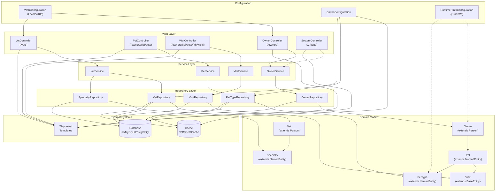

The component boundaries follow a classic layered architecture pattern with clear separation of concerns: Controllers handle web requests, Services encapsulate business logic, Repositories manage data access, and Domain Models represent core entities. Communication flows primarily top-down through synchronous method calls, with caching implemented at the repository layer for performance optimization and configuration classes providing cross-cutting concerns like internationalization and GraalVM support.