# Spring PetClinic Dynamic Interaction Flows

## 1. Owner Registration Workflow

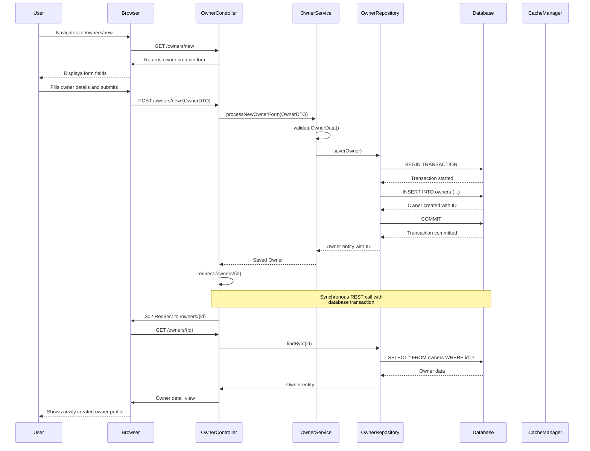

**Description**: User registers a new owner in the system. Triggered by accessing the owner creation form and submitting valid owner data. Uses synchronous REST calls with database transactions ensuring ACID properties.

## 2. Pet Addition Under Owner Workflow

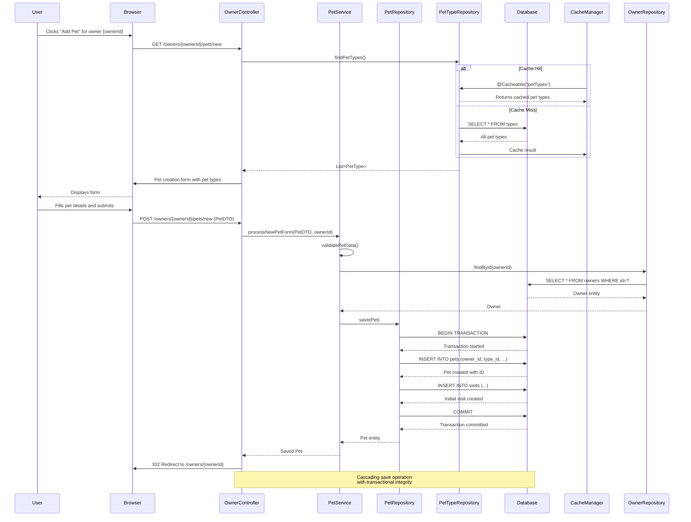

**Description**: User adds a new pet to an existing owner. Triggered from owner detail view. Involves cached pet types lookup and cascading database transaction for pet and initial visit creation.

## 3. Visit Scheduling Workflow

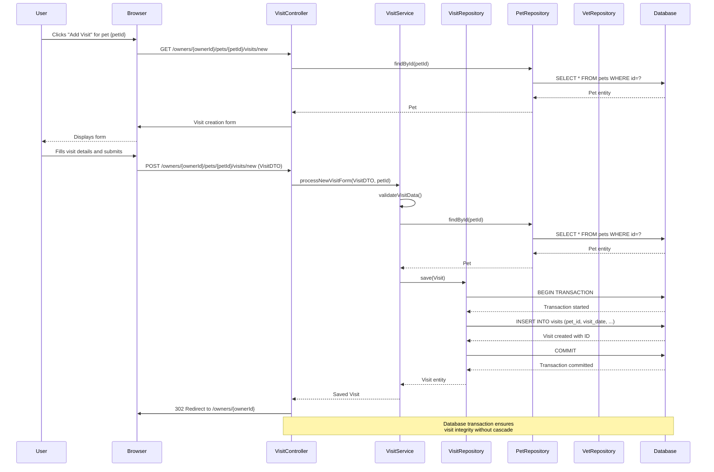

**Description**: User schedules a new visit for a specific pet. Triggered from pet detail view under owner context. Uses direct database transaction without cascade operations for visit creation.

## 4. Vet Directory with Caching Workflow

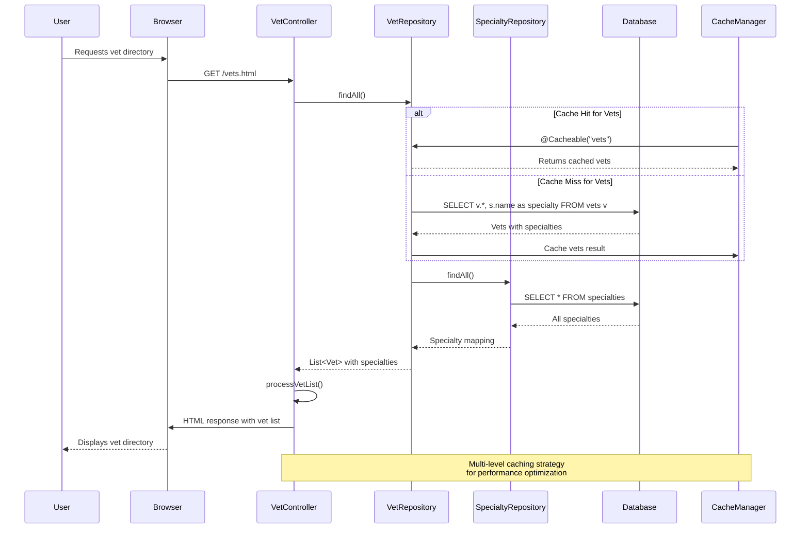

**Description**: User views the veterinarian directory. Triggered by accessing vets page. Implements multi-level caching with repository-level @Cacheable annotation for performance optimization.

## 5. Owner Search with Pagination Workflow

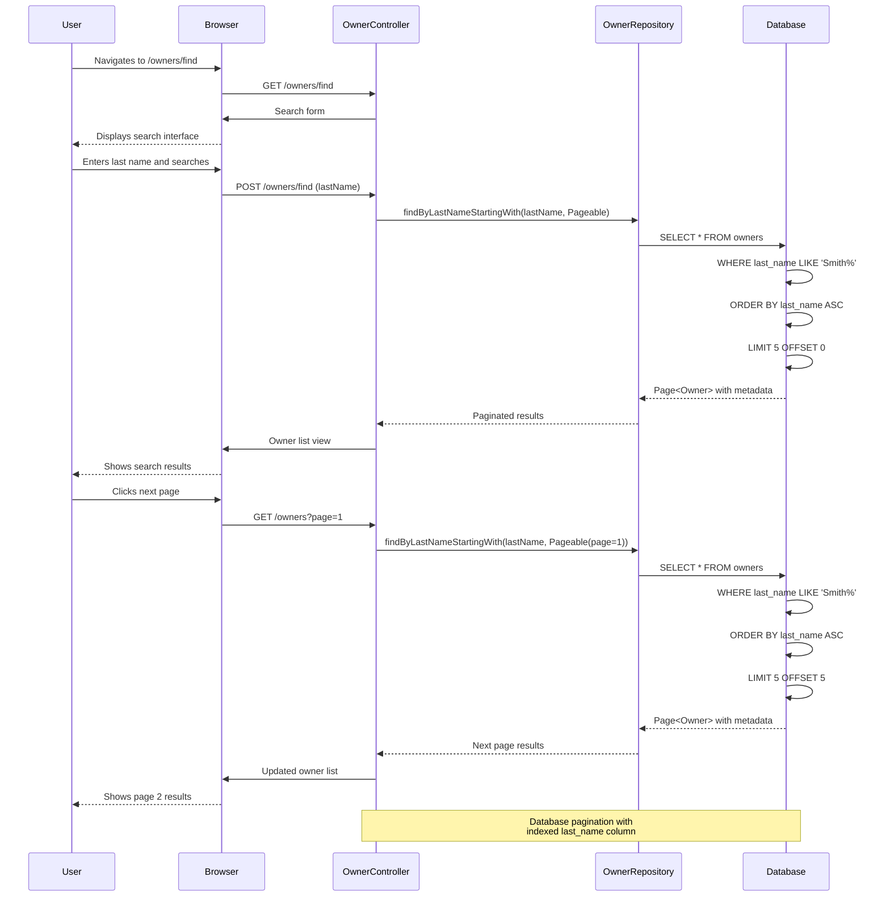

**Description**: User searches for owners by last name with pagination support. Triggered from search form. Uses database-level pagination with indexed queries for efficient result retrieval.

## 6. Global Error Handling Workflow

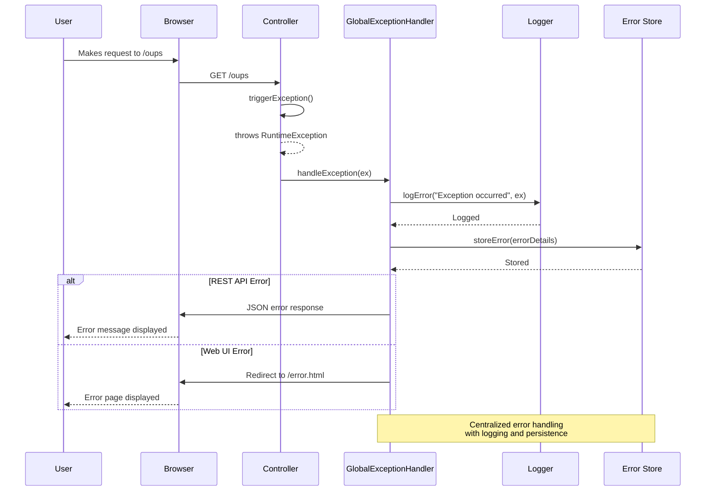

**Description**: System handles unexpected exceptions globally. Triggered by any unhandled exception. Provides centralized error handling with logging, error storage, and appropriate user feedback.

## 7. Language Switching Workflow

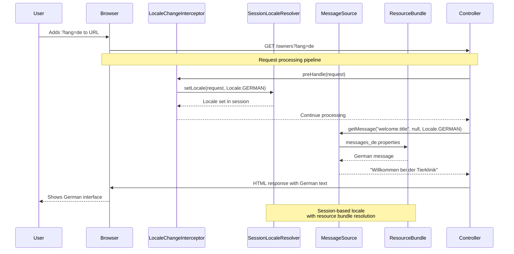

**Description**: User switches interface language. Triggered by adding lang parameter to URL. Uses interceptor pattern with session storage and resource bundle message resolution.

## 8. Microservice Orchestration - Owner Detail with Pets and Visits

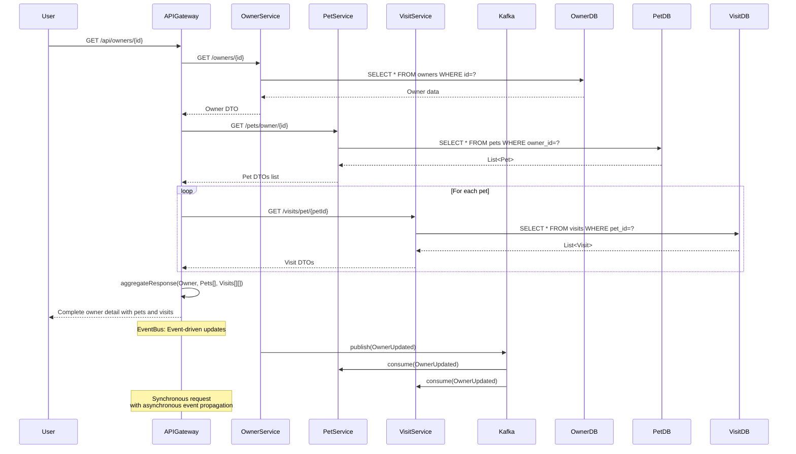

**Description**: Retrieves complete owner detail including all pets and visits in microservice architecture. Uses synchronous request aggregation with asynchronous event propagation for data consistency.

## 9. Saga Pattern for Visit Scheduling (Microservice)

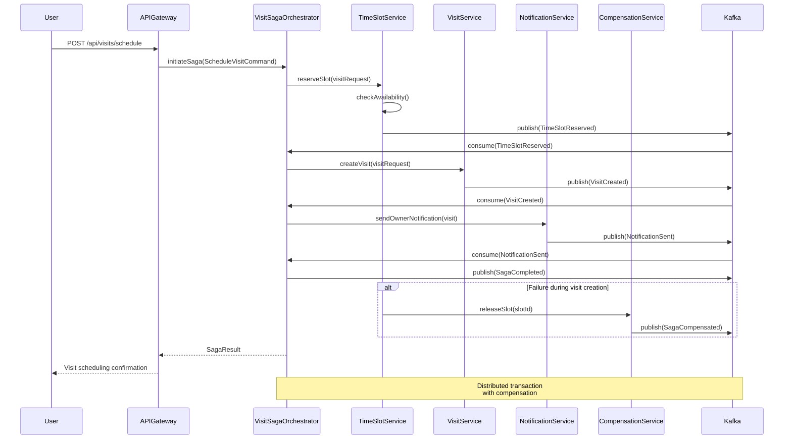

**Description**: Coordinates visit scheduling across multiple microservices using Saga pattern. Ensures eventual consistency with compensation for failed operations.

## 10. Circuit Breaker Pattern for Service Resilience

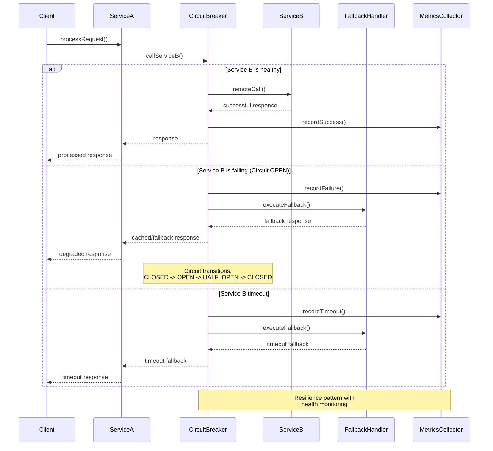

**Description**: Implements circuit breaker pattern for inter-service communication resilience. Provides fallback mechanisms and automatic service health monitoring with circuit state transitions.

## 11. Event-Driven Owner Data Synchronization

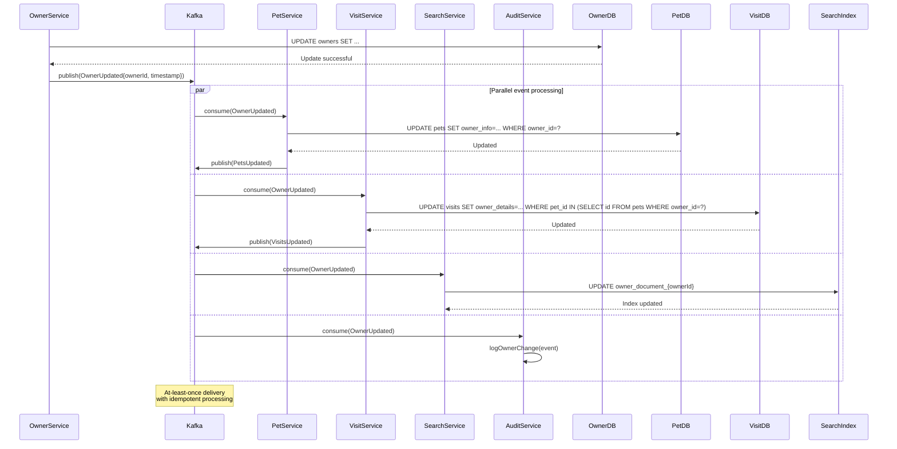

**Description**: Synchronizes owner data changes across multiple services using event-driven architecture. Ensures eventual consistency with parallel processing and audit logging.

## 12. Distributed Transaction with Outbox Pattern

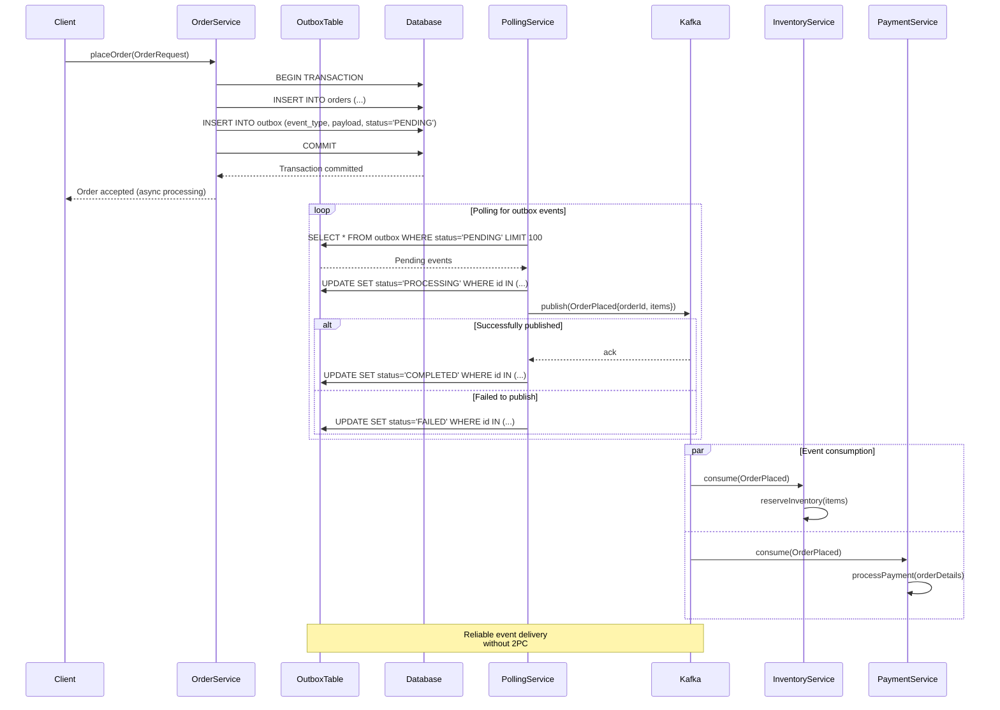

**Description**: Implements distributed transaction using outbox pattern for reliable event publishing. Ensures exactly-once semantics between database operations and event publishing.

## 13. API Request Flow with Distributed Tracing

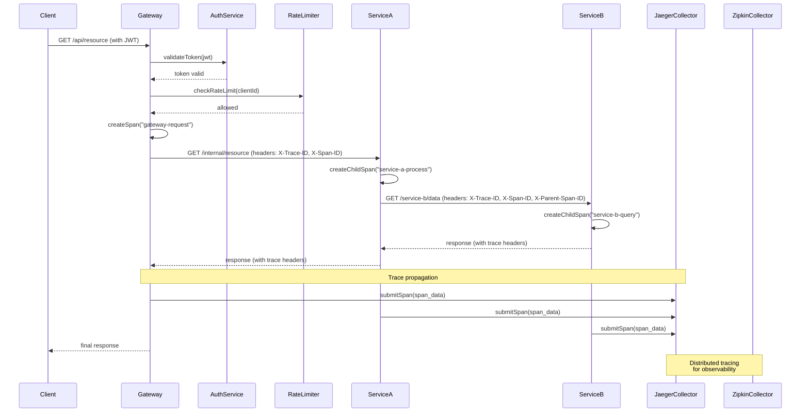

**Description**: Demonstrates complete request flow with distributed tracing across services. Shows span creation, propagation, and collection for end-to-end observability.

## 14. Cache Invalidation and Update Workflow

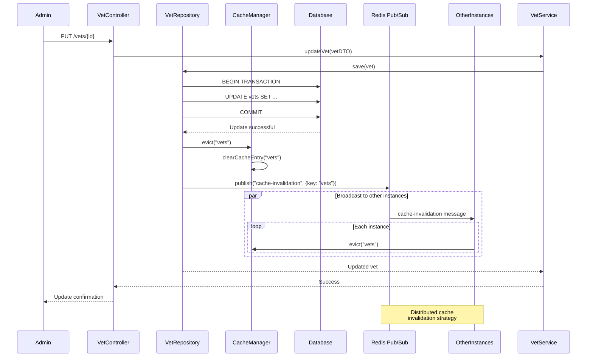

**Description**: Handles cache invalidation across multiple application instances when data changes. Uses distributed messaging to ensure cache consistency in cluster environment.

## 15. Database Migration and Schema Evolution

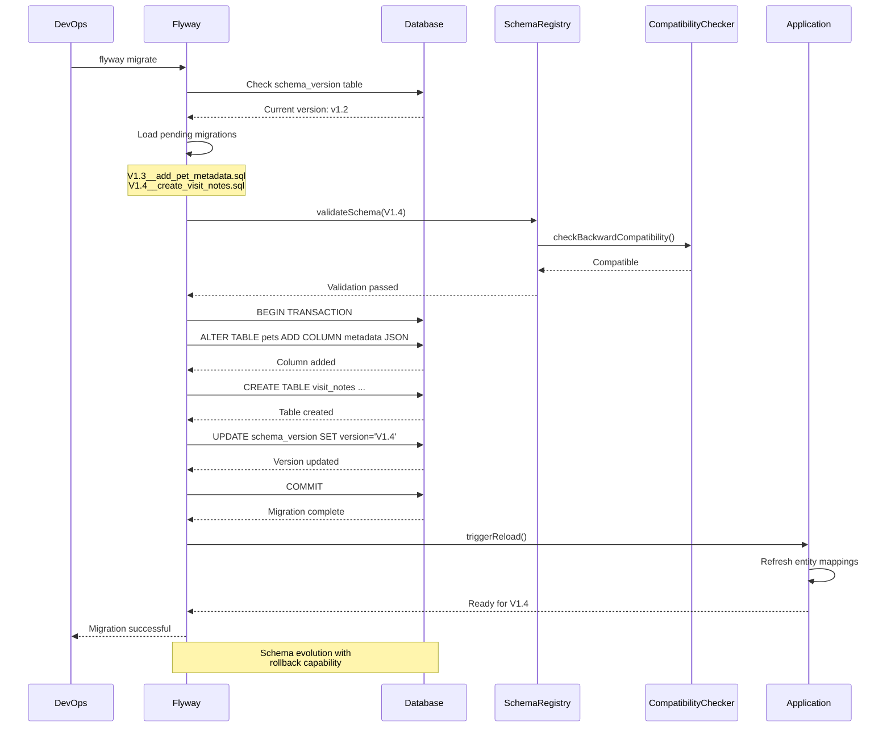

**Description**: Manages database schema evolution using migration tools. Includes validation, compatibility checking, and safe deployment of schema changes with rollback capability.