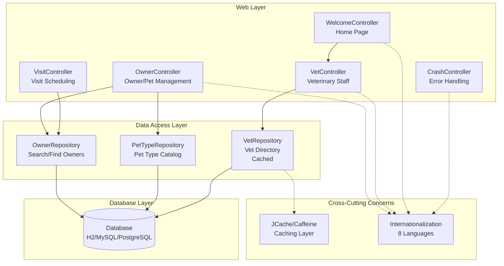

The architecture follows a classic three-tier pattern with clear separation between presentation, data access, and persistence layers. Controllers handle web requests and orchestrate business flows through repositories, which abstract database operations. Cross-cutting concerns like caching and internationalization are implemented as orthogonal services that integrate across multiple layers without tight coupling.