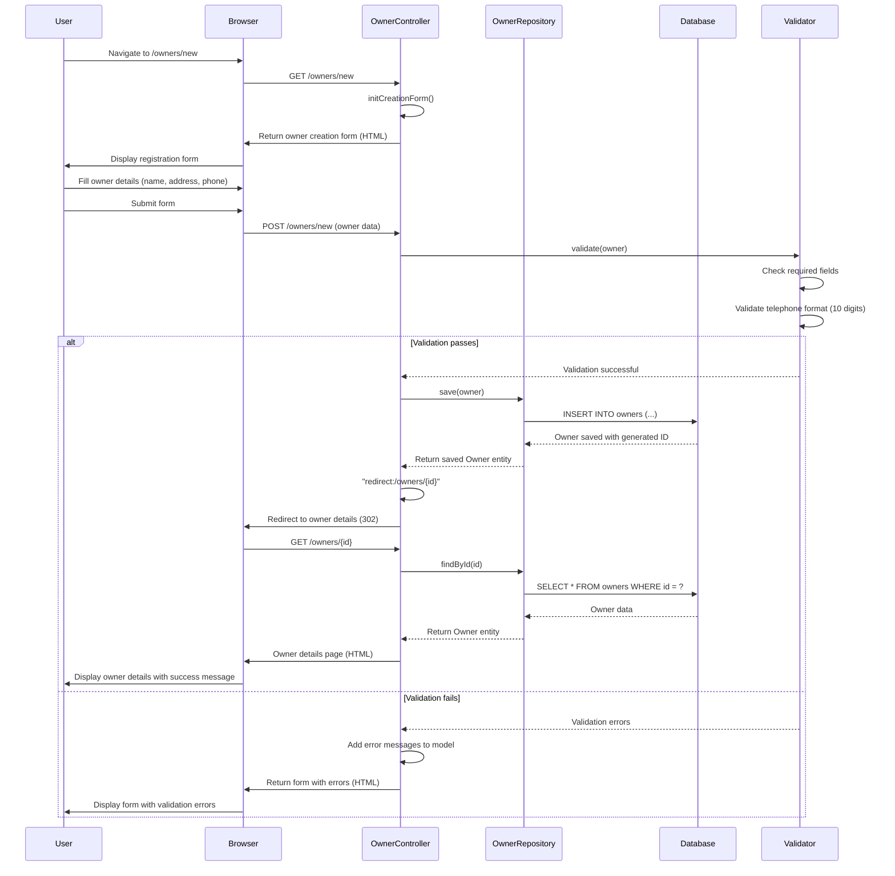
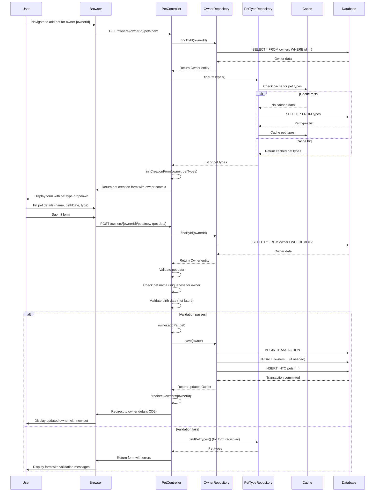
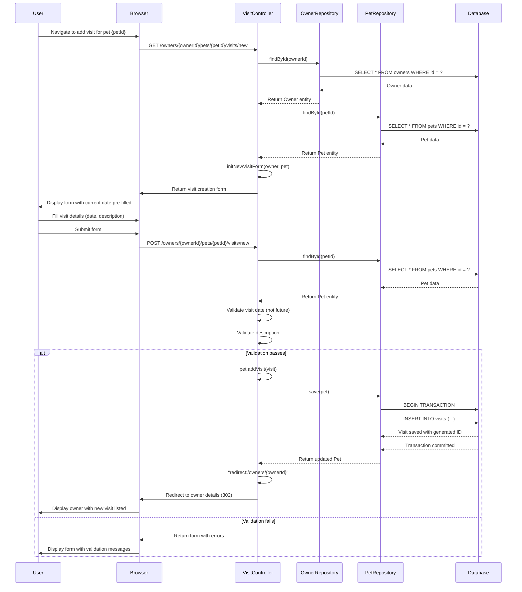
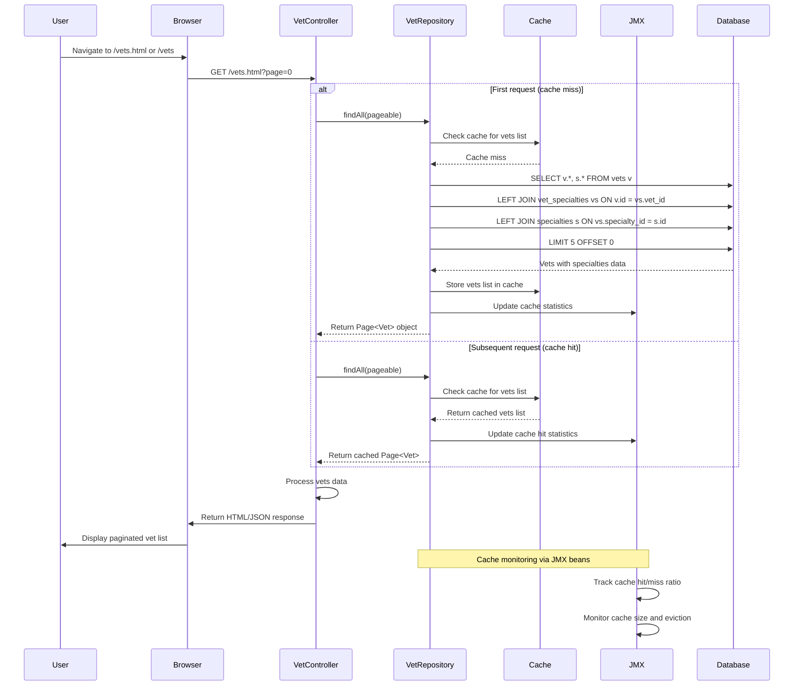
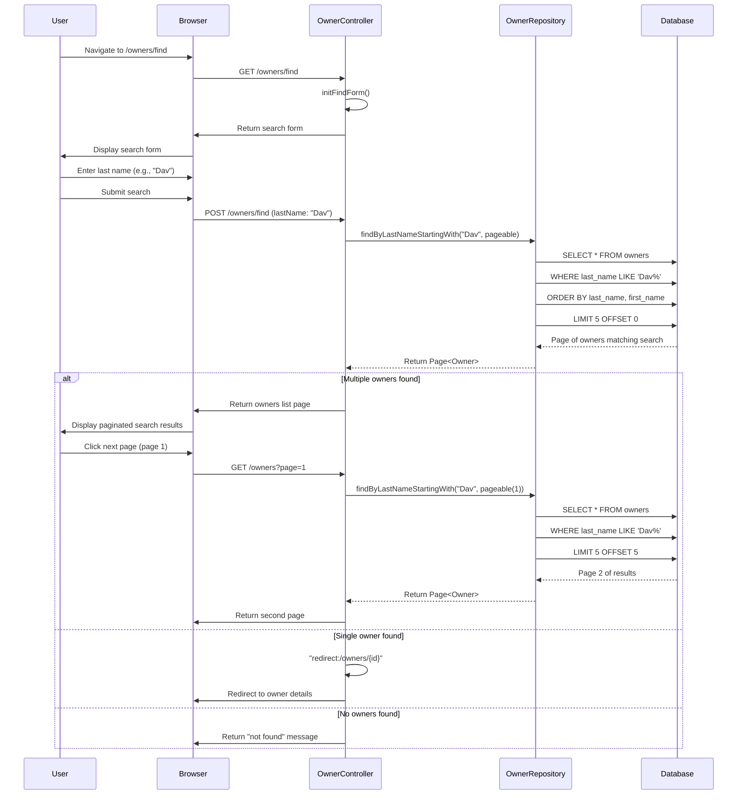
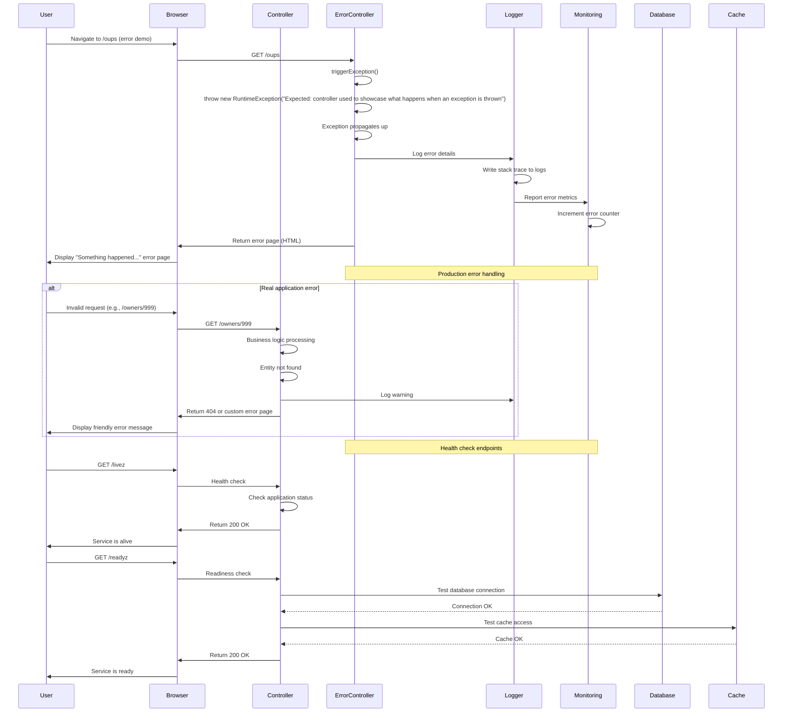
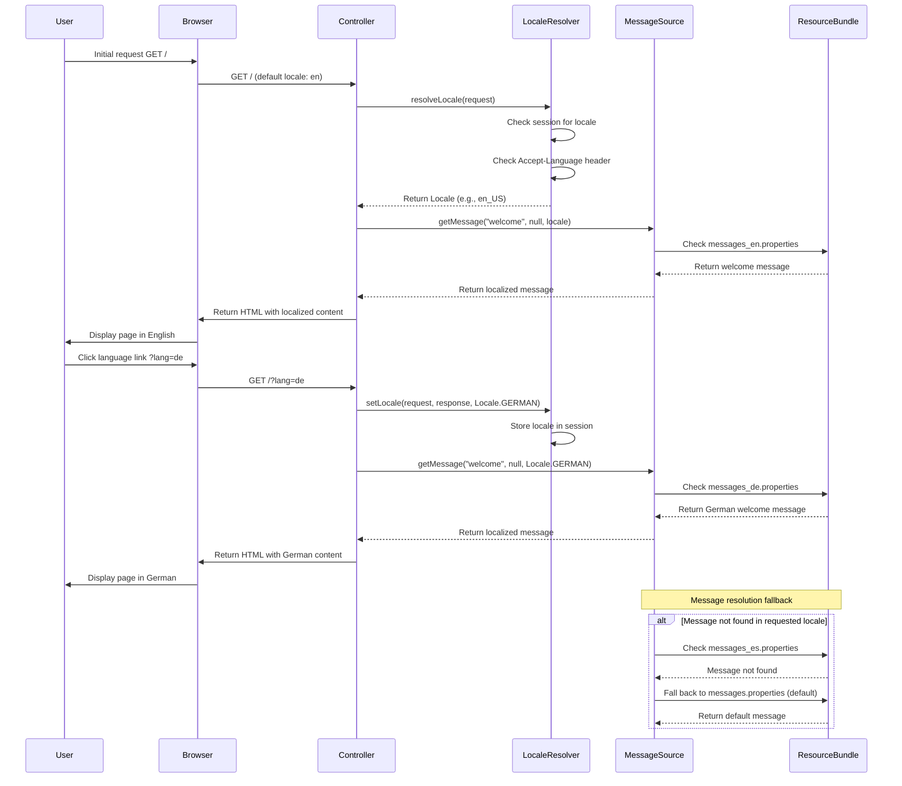
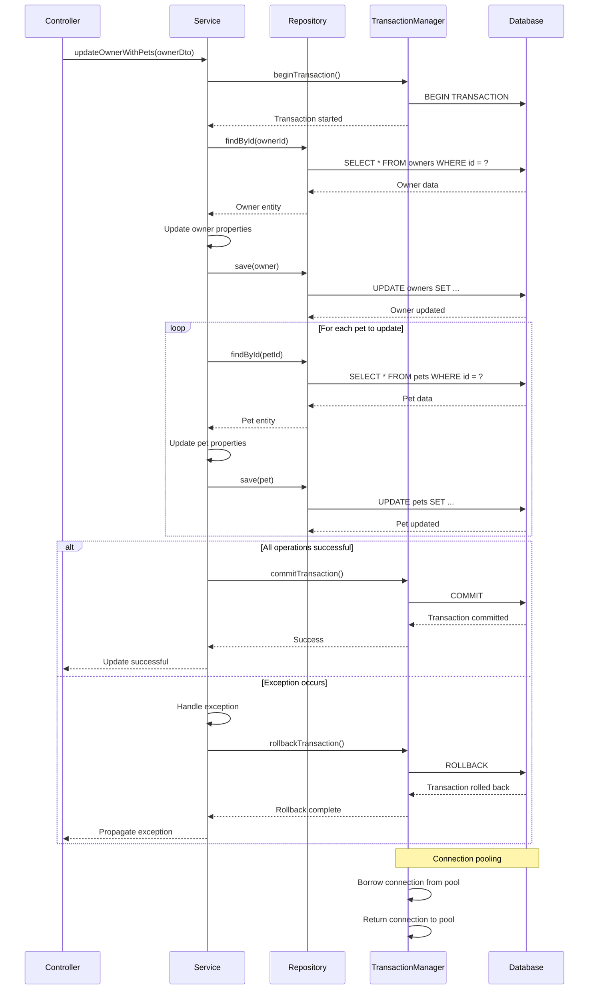

# Spring PetClinic - Dynamic Interaction Flows and Sequence Diagrams

## 1. Owner Registration Workflow

### Description
This workflow captures the process of registering a new owner in the system. It's triggered when a user accesses the owner creation form and submits the registration details. The flow involves validation, database persistence, and redirects to the owner's detail view.

## 2. Pet Management Workflow (Adding a Pet)

### Description
This workflow handles adding a new pet to an existing owner's profile. It demonstrates nested resource management and the parent-child relationship between Owner and Pet entities. The process includes fetching available pet types and validation of pet uniqueness within the owner's collection.

## 3. Visit Scheduling Workflow

### Description
This workflow captures the process of scheduling a veterinary visit for a pet. It demonstrates the three-level hierarchy (Owner -> Pet -> Visit) and includes validation of visit dates against current date.

## 4. Vet Listing with Caching Workflow

### Description
This workflow demonstrates retrieving the veterinarian list with pagination and caching. It showcases the caching strategy using JCache with Caffeine provider, showing both cache hit and miss scenarios.

## 5. Owner Search Workflow with Pagination

### Description
This workflow handles searching for owners by last name with pagination support. It demonstrates the searchable repository pattern and page navigation functionality.

## 6. Error Handling and Recovery Workflow

### Description
This workflow demonstrates the application's error handling mechanisms, including the crash controller for intentional error demonstration and global exception handling patterns.

## 7. Internationalization Workflow

### Description
This workflow demonstrates the internationalization (i18n) support in the application, showing how language switching works and how message bundles are resolved based on session locale.

## 8. Database Transaction Management Workflow

### Description
This workflow illustrates transaction boundaries during complex operations involving multiple entity modifications, particularly when updating an owner with multiple pets.

