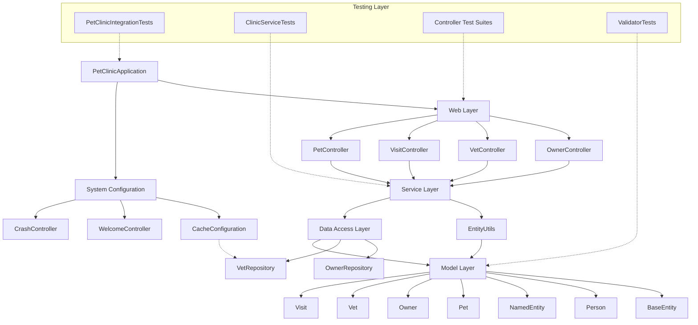

```mermaid
graph TB
    %% Application Entry Point
    App[PetClinicApplication] --> WebLayer[Web Layer]
    App --> SystemConfig[System Configuration]
    
    %% Web Layer Components
    WebLayer --> OwnerController[OwnerController]
    WebLayer --> VetController[VetController]
    WebLayer --> VisitController[VisitController]
    WebLayer --> PetController[PetController]
    
    %% Controllers to Service Layer
    OwnerController --> ServiceLayer[Service Layer]
    VetController --> ServiceLayer
    VisitController --> ServiceLayer
    PetController --> ServiceLayer
    
    %% Service Layer Components
    ServiceLayer --> EntityUtils[EntityUtils]
    ServiceLayer --> Repositories[Data Access Layer]
    
    %% Data Access Layer
    Repositories --> OwnerRepository[OwnerRepository]
    Repositories --> VetRepository[VetRepository]
    
    %% Model Layer
    Repositories --> ModelLayer[Model Layer]
    ModelLayer --> BaseEntity[BaseEntity]
    ModelLayer --> Person[Person]
    ModelLayer --> NamedEntity[NamedEntity]
    ModelLayer --> Pet[Pet]
    ModelLayer --> Owner[Owner]
    ModelLayer --> Vet[Vet]
    ModelLayer --> Visit[Visit]
    
    %% System Infrastructure
    SystemConfig --> CacheConfig[CacheConfiguration]
    SystemConfig --> WelcomeController[WelcomeController]
    SystemConfig --> CrashController[CrashController]
    
    %% Testing Components
    subgraph "Testing Layer"
        IntegrationTests[PetClinicIntegrationTests]
        ServiceTests[ClinicServiceTests]
        ControllerTests[Controller Test Suites]
        ModelTests[ValidatorTests]
    end
    
    %% Relationships between components
    EntityUtils --> ModelLayer
    CacheConfig -.-> VetRepository
    
    %% Testing connections
    IntegrationTests -.-> App
    ServiceTests -.-> ServiceLayer
    ControllerTests -.-> WebLayer
    ModelTests -.-> ModelLayer
```