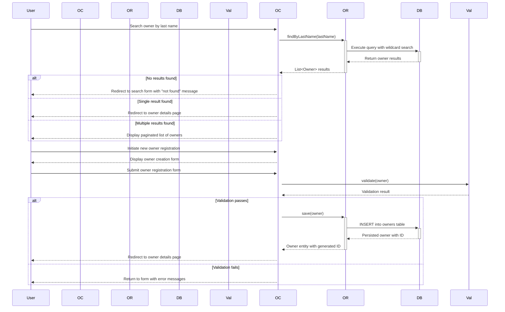
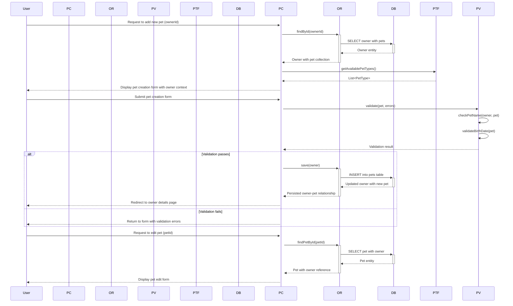
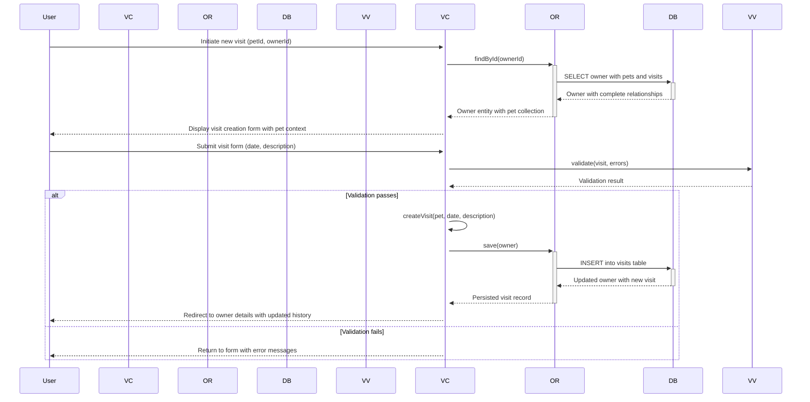
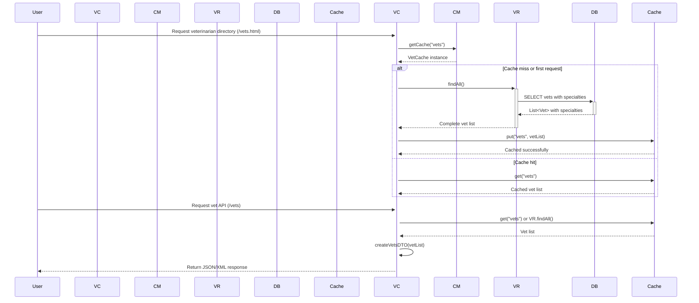
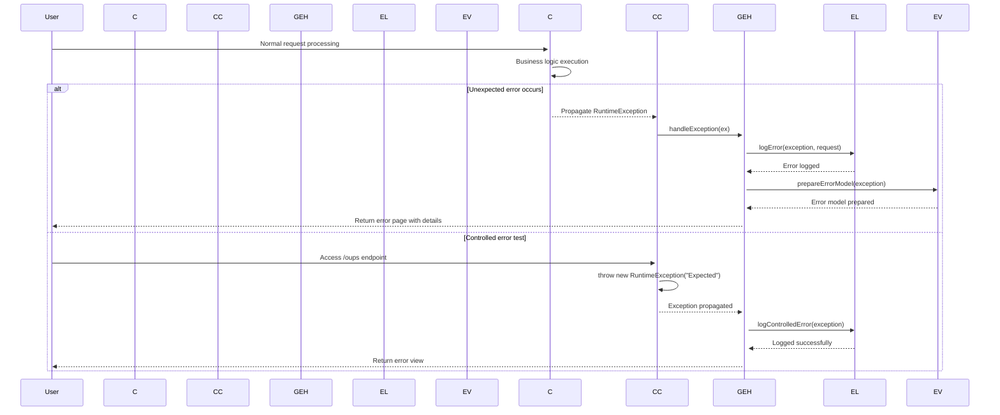
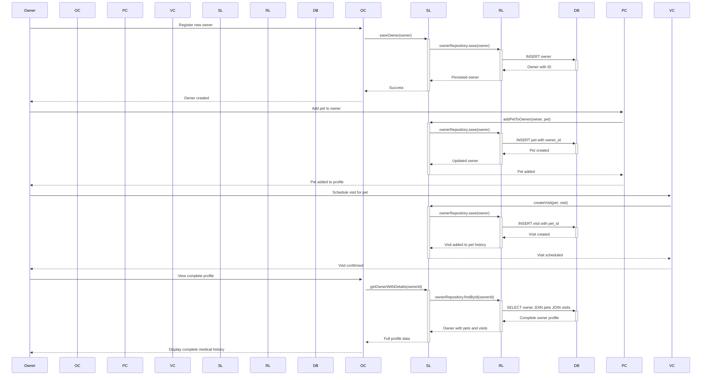

# Spring Pet Clinic - Dynamic Interaction Flows

## 1. Owner Registration and Search Workflow

**Description**: This workflow handles owner search functionality with intelligent routing (single result redirects to details, multiple results show list, no results show search form) and new owner registration with validation and persistence. Communication is synchronous REST-style with database transactions.

## 2. Pet Management Workflow

**Description**: Handles pet creation and editing within owner context, including duplicate name validation, birth date validation, and type formatting. Uses synchronous controller-service-repository pattern with transactional database operations.

## 3. Visit Scheduling Workflow

**Description**: Manages appointment scheduling for pets, creating chronological medical history. Includes form validation, date validation, and updates the pet-owner relationship with new visit records through synchronous database transactions.

## 4. Veterinarian Directory Access with Caching

**Description**: Demonstrates cached data retrieval for veterinarian directory, showing both web UI and REST API access patterns. Uses JCache for performance optimization, reducing database load for frequently accessed, infrequently changing data.

## 5. System Error Handling Flow

**Description**: Illustrates the application's error handling mechanism, including both unexpected errors and controlled testing scenarios. Shows global exception handling, logging, and graceful user feedback through error views.

## 6. Complete Owner-Pet-Visit Management Workflow

**Description**: Comprehensive workflow showing the complete lifecycle from owner registration through pet management to visit scheduling and profile viewing. Demonstrates transactional data persistence and the relationship management between entities in the veterinary clinic system.