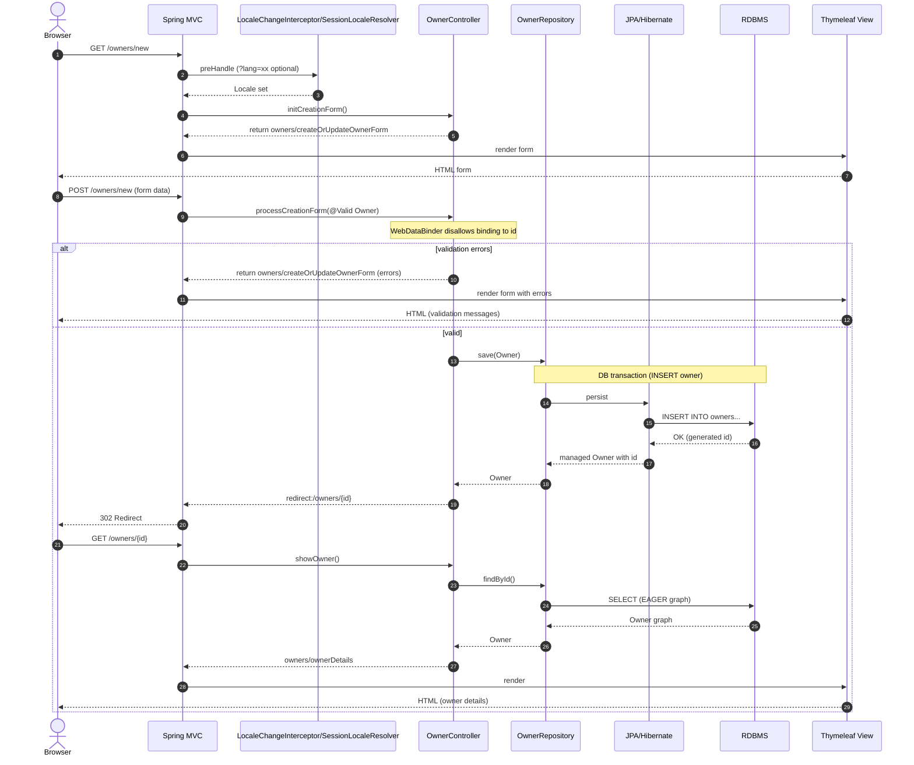
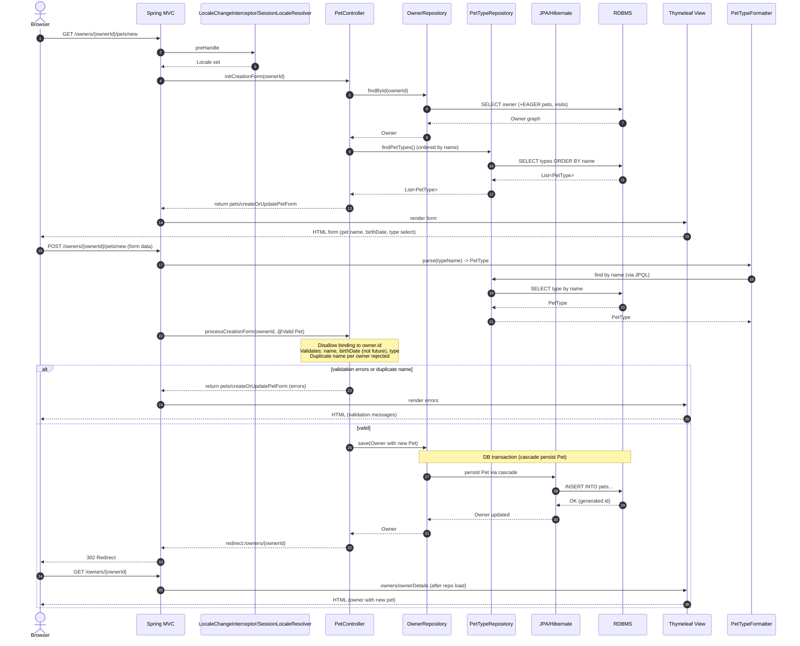
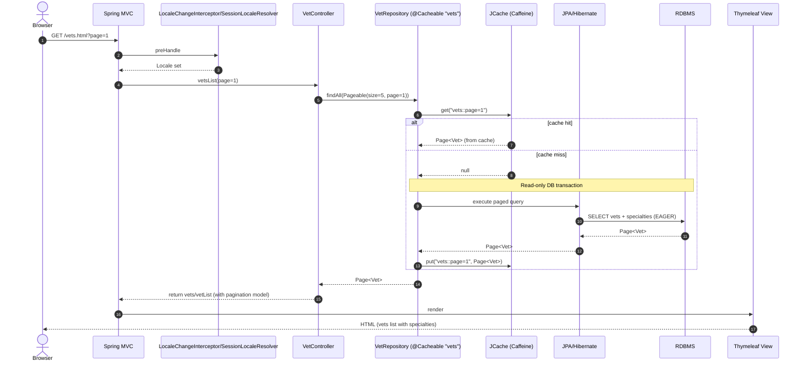
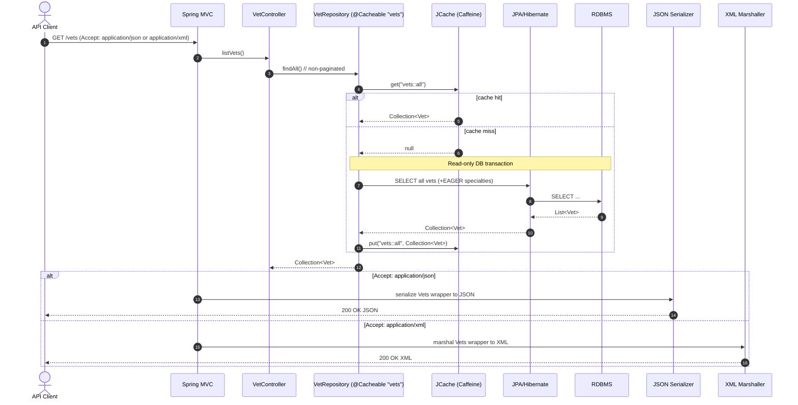
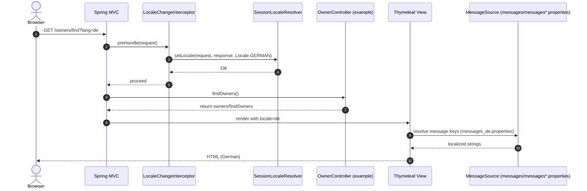
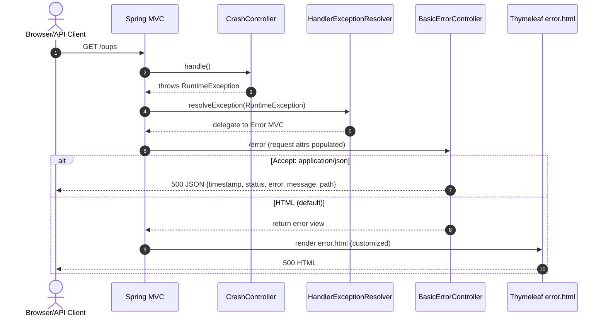
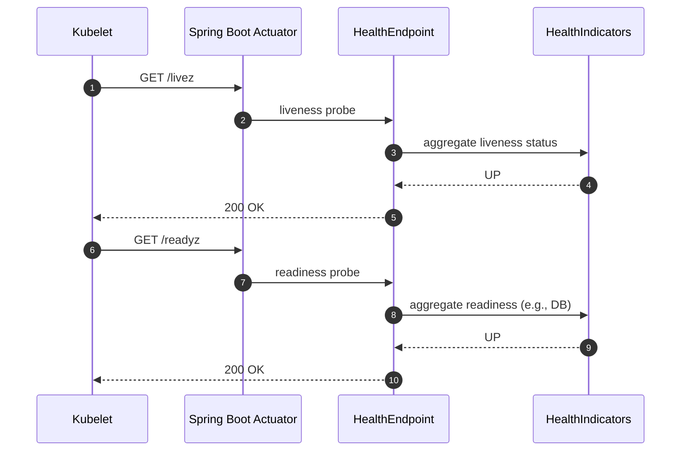

# Workflow 1: Owner Search and Navigation to Details

```mermaid
sequenceDiagram
  autonumber
  actor User as Browser
  participant MVC as Spring MVC (DispatcherServlet)
  participant I18N as LocaleChangeInterceptor/SessionLocaleResolver
  participant OwnerCtrl as OwnerController
  participant OwnerRepo as OwnerRepository (Spring Data JPA)
  participant JPA as JPA/Hibernate
  participant DB as RDBMS
  participant View as Thymeleaf View

  User->>MVC: GET /owners?lastName=Smith&page=0
  MVC->>I18N: preHandle (optional ?lang=xx)
  I18N-->>MVC: set/request Locale
  MVC->>OwnerCtrl: handleRequest()

  OwnerCtrl->>OwnerRepo: findByLastNameStartingWith("Smith", PageRequest(size=5))
  Note over OwnerRepo,DB: Read-only DB transaction
  OwnerRepo->>JPA: derive query and execute
  JPA->>DB: SELECT owners WHERE last_name LIKE 'Smith%'
  DB-->>JPA: Page<Owner>
  JPA-->>OwnerRepo: Page<Owner>
  OwnerRepo-->>OwnerCtrl: Page<Owner>

  alt zero matches
    OwnerCtrl-->>MVC: model error "notFound"; return view owners/findOwners
    MVC->>View: render owners/findOwners
    View-->>User: HTML (search form with error)
  else exactly one match
    OwnerCtrl-->>MVC: return redirect:/owners/{id}
    MVC-->>User: 302 Redirect
    User->>MVC: GET /owners/{id}
    MVC->>OwnerCtrl: showOwner(ownerId)
    OwnerCtrl->>OwnerRepo: findById(ownerId)
    Note over OwnerRepo,DB: Read-only DB transaction<br/>EAGER fetch pets and visits
    OwnerRepo->>JPA: SELECT owner by id (+pets +visits)
    JPA->>DB: queries (join/follow)
    DB-->>JPA: Owner graph
    JPA-->>OwnerRepo: Owner
    OwnerRepo-->>OwnerCtrl: Owner (with Pets and Visits)
    OwnerCtrl-->>MVC: return owners/ownerDetails
    MVC->>View: render owners/ownerDetails
    View-->>User: HTML (owner details incl. pets and visits)
  else multiple matches
    OwnerCtrl-->>MVC: return owners/ownersList (with Page metadata)
    MVC->>View: render owners/ownersList
    View-->>User: HTML (paginated list)
  end
```

- Purpose and triggers: User searches for owners by last name; navigates to details if a single result is found.
- Communication patterns:
  - HTTP (synchronous REST-like GET) from browser to server.
  - In-process synchronous calls: MVC → Controller → Repository → JPA → DB.
  - Database transaction: read-only during repository calls.
  - Server-side rendering via Thymeleaf.
  - Redirect (HTTP 302) on single match (PRG pattern not used here, but redirect for navigation).
- Error handling/recovery:
  - Zero matches: lastName field annotated with “notFound” error; form re-rendered.
  - EAGER fetch ensures data available with open-in-view=false; minimizes LazyInitializationException risk.


# Workflow 2: Create New Owner (PRG pattern)



- Purpose and triggers: Create a new owner via form; prevent overposting; redirect to details.
- Communication patterns:
  - HTTP GET/POST (synchronous).
  - Bean Validation; binding security (disallow id).
  - DB transaction on save (INSERT).
  - PRG (Post/Redirect/Get).
- Error handling:
  - Validation failures: re-render form with messages; user can retry.


# Workflow 3: Add New Pet to Owner (Validation + Duplicate Name Check)



- Purpose and triggers: Add a pet to an owner; validate fields; prevent duplicate pet names per owner.
- Communication patterns:
  - HTTP GET/POST; synchronous.
  - Formatter resolves PetType by name; PetValidator and additional rules in controller.
  - Single DB transaction saving Owner cascades to new Pet.
  - PRG redirect to owner details.
- Error handling:
  - Validation errors and duplicate-name rule re-render form with messages.


# Workflow 4: Add Visit to Pet (Aggregate-Cascade Save)

```mermaid
sequenceDiagram
  autonumber
  actor User as Browser
  participant MVC as Spring MVC
  participant I18N as LocaleChangeInterceptor/SessionLocaleResolver
  participant VisitCtrl as VisitController
  participant OwnerRepo as OwnerRepository
  participant JPA as JPA/Hibernate
  participant DB as RDBMS
  participant View as Thymeleaf View

  User->>MVC: GET /owners/{ownerId}/pets/{petId}/visits/new
  MVC->>I18N: preHandle
  I18N-->>MVC: Locale set
  MVC->>VisitCtrl: initNewVisitForm(ownerId, petId)
  Note over VisitCtrl: @ModelAttribute preloads Owner and Pet; creates Visit with default date
  VisitCtrl-->>MVC: return visits/createOrUpdateVisitForm
  MVC->>View: render form
  View-->>User: HTML (visit description, date)

  User->>MVC: POST /owners/{ownerId}/pets/{petId}/visits/new (form data)
  MVC->>VisitCtrl: processNewVisit(ownerId, petId, @Valid Visit)
  alt validation errors (e.g., missing description)
    VisitCtrl-->>MVC: return visits/createOrUpdateVisitForm (errors)
    MVC->>View: render errors
    View-->>User: HTML (validation messages)
  else valid
    Note over VisitCtrl: Owner.addVisit(petId, visit)
    VisitCtrl->>OwnerRepo: save(Owner)  // cascade persists Visit
    Note over OwnerRepo,DB: DB transaction (INSERT visit)
    OwnerRepo->>JPA: persist Visit via cascade
    JPA->>DB: INSERT INTO visits...
    DB-->>JPA: OK
    JPA-->>OwnerRepo: Owner updated
    OwnerRepo-->>VisitCtrl: Owner
    VisitCtrl-->>MVC: redirect:/owners/{ownerId}
    MVC-->>User: 302 Redirect
    User->>MVC: GET /owners/{ownerId}
    MVC->>View: owners/ownerDetails
    View-->>User: HTML (owner with new visit)
  end
```

- Purpose and triggers: Create a medical visit for a pet under an owner; ensure description required.
- Communication patterns:
  - HTTP GET/POST; synchronous.
  - Cascade persist of Visit via Owner aggregate in a single DB transaction.
  - PRG redirect to owner details.
- Error handling:
  - Missing description and other validation failures re-render form with messages.


# Workflow 5: Vets List (HTML, Paginated) with JCache/Caffeine



- Purpose and triggers: Display vets list in HTML with pagination; improve performance via caching.
- Communication patterns:
  - HTTP GET.
  - Cache-aside read with JCache/Caffeine at repository layer; read-only DB transactions on misses.
  - Server-side rendering via Thymeleaf.
- Error handling:
  - Cache miss gracefully falls back to DB; subsequent calls served from cache; cache stats enabled.


# Workflow 6: Vets API (JSON/XML) with Content Negotiation and Caching



- Purpose and triggers: Provide machine-consumable list of vets in JSON/XML; used by integrations.
- Communication patterns:
  - HTTP GET with content negotiation.
  - Cache-aside via JCache/Caffeine.
  - Serialization via Jackson (JSON) or JAXB (XML).
- Error handling:
  - Cache miss fallback to DB; standard HTTP error semantics if DB fails.


# Workflow 7: Internationalization (i18n) Switch via URL Parameter



- Purpose and triggers: User switches locale via ?lang=xx; server renders localized HTML.
- Communication patterns:
  - HTTP GET with query param.
  - Interceptor updates session locale; MessageSource resolves keys for view rendering.
- Error handling:
  - Missing locale bundle falls back to base messages.properties; tests ensure keys exist across locales.


# Workflow 8: Error Handling via CrashController and BasicErrorController



- Purpose and triggers: Demonstrate global error handling for unexpected exceptions.
- Communication patterns:
  - HTTP GET; exception propagated through MVC; BasicErrorController produces response.
  - Content negotiation determines JSON vs HTML.
- Error handling:
  - Structured JSON for APIs; custom error page for HTML; includes message and timestamp.


# Workflow 9: Health Probes (Kubernetes liveness/readiness)



- Purpose and triggers: Container orchestration checks app health for lifecycle management.
- Communication patterns:
  - HTTP GET to Actuator health endpoints.
  - In-process aggregation of health indicators; response is synchronous.
- Error handling:
  - Non-OK indicator yields 5xx for readiness/liveness; Kubernetes restarts or removes from endpoints list accordingly.