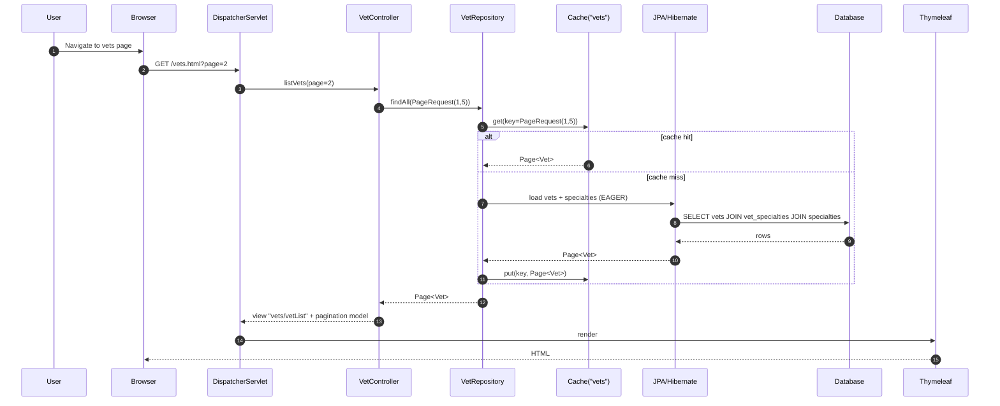
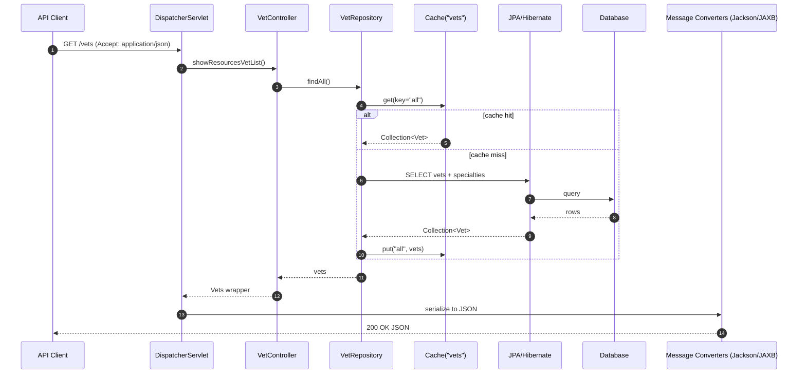
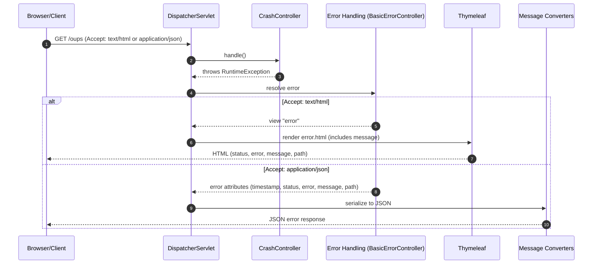
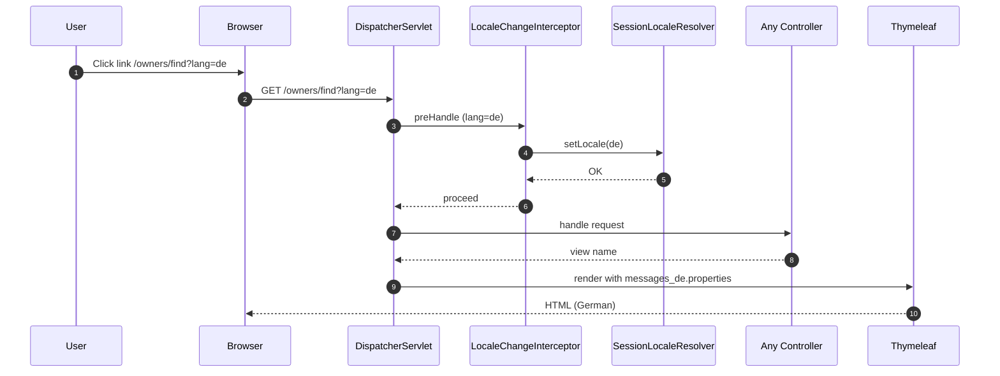
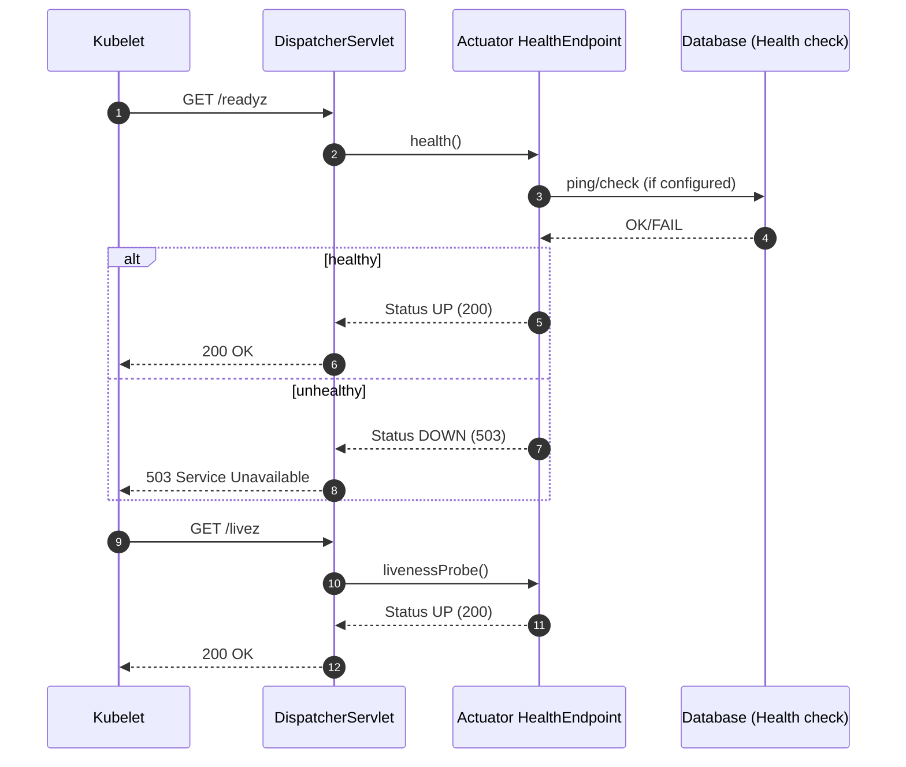

# Workflow 1: Owner search → results/redirect → owner details

Purpose and triggers
- Purpose: Allow users to find owners by last name and navigate to an owner's details.
- Trigger: User submits search from /owners/find or hits /owners?lastName=&page=.

Communication patterns
- Synchronous HTTP: Browser → Spring MVC.
- Repository: OwnerRepository.findByLastNameStartingWith, findById.
- Persistence: JPA/Hibernate → RDBMS (read-only).
- View rendering: Thymeleaf.
- No events or async messaging.

```mermaid
sequenceDiagram
  autonumber
  participant U as User
  participant B as Browser
  participant D as Spring MVC DispatcherServlet
  participant I18n as LocaleChangeInterceptor
  participant OC as OwnerController
  participant OR as OwnerRepository
  participant JPA as JPA/Hibernate
  participant DB as Database
  participant V as Thymeleaf ViewResolver

  U->>B: Navigate to /owners/find
  B->>D: GET /owners/find
  D->>I18n: preHandle(lang?)
  I18n-->>D: locale resolved (session)
  D->>OC: handleFindForm()
  OC-->>D: view "owners/findOwners" (form)
  D->>V: render view
  V-->>B: HTML

  U->>B: Submit lastName query
  B->>D: GET /owners?lastName=Smith&page=1
  D->>I18n: preHandle(lang?)
  I18n-->>D: locale resolved
  D->>OC: processFindForm(lastName, page)
  OC->>OR: findByLastNameStartingWith("Smith", Page(size=5))
  OR->>JPA: execute query
  JPA->>DB: SELECT owners WHERE last_name LIKE 'Smith%'
  DB-->>JPA: rows + pagination
  JPA-->>OR: Page<Owner>
  OR-->>OC: results

  alt zero matches
    OC-->>D: model error lastName:notFound + view "owners/findOwners"
    D->>V: render view with error
    V-->>B: HTML
  else exactly one match
    OC-->>D: redirect:/owners/{id}
    D-->>B: 302 Redirect
    B->>D: GET /owners/{id}
    D->>OC: showOwner(ownerId)
    OC->>OR: findById(id)
    OR->>JPA: load owner (EAGER pets + visits)
    JPA->>DB: SELECT owner; SELECT pets; SELECT visits (per strategy)
    DB-->>JPA: rows
    JPA-->>OR: Owner graph
    OR-->>OC: Owner(+pets+visits)
    OC-->>D: view "owners/ownerDetails"
    D->>V: render
    V-->>B: HTML
  else multiple matches
    OC-->>D: view "owners/ownersList" + pagination model
    D->>V: render
    V-->>B: HTML
  end
```


# Workflow 2: Create new Pet for an Owner (validation, formatter, cascade save)

Purpose and triggers
- Purpose: Add a pet to an existing owner.
- Trigger: User navigates to /owners/{ownerId}/pets/new and submits form.

Communication patterns
- Synchronous HTTP.
- Formatter: PetTypeFormatter.parse (String→PetType) via PetTypeRepository.
- Validation: Bean Validation + PetValidator; controller checks duplicate name and future birth date.
- Persistence: OwnerRepository.save(owner) cascades to Pet (JPA/Hibernate).
- View: Thymeleaf.

```mermaid
sequenceDiagram
  autonumber
  participant U as User
  participant B as Browser
  participant D as DispatcherServlet
  participant PC as PetController
  participant OR as OwnerRepository
  participant PTR as PetTypeRepository
  participant F as PetTypeFormatter
  participant VAL as PetValidator/BeanValidation
  participant JPA as JPA/Hibernate
  participant DB as Database
  participant V as Thymeleaf

  U->>B: Open new pet form
  B->>D: GET /owners/{ownerId}/pets/new
  D->>PC: initCreationForm(ownerId)
  PC->>OR: findById(ownerId)
  OR->>JPA: load owner (EAGER pets + visits)
  JPA->>DB: SELECT owner/pets/visits
  DB-->>JPA: rows
  JPA-->>OR: Owner graph
  OR-->>PC: Owner
  PC->>PTR: findPetTypes() (for dropdown)
  PTR->>JPA: SELECT types ORDER BY name
  JPA->>DB: query
  DB-->>JPA: types
  JPA-->>PTR: List<PetType>
  PTR-->>PC: types
  PC-->>D: view "pets/createOrUpdatePetForm"
  D->>V: render
  V-->>B: HTML

  U->>B: Submit pet form (name, birthDate, typeName)
  B->>D: POST /owners/{ownerId}/pets/new
  D->>PC: processCreationForm(ownerId, Pet)
  PC->>F: parse(typeName)
  F->>PTR: findPetTypes()
  PTR->>JPA: SELECT types
  JPA->>DB: query
  DB-->>JPA: types
  JPA-->>PTR: types
  PTR-->>F: types
  F-->>PC: PetType

  D->>VAL: validate(Pet)
  alt validation errors (missing name/type/birthDate) or future date or duplicate name
    PC-->>D: view "pets/createOrUpdatePetForm" with errors
    D->>V: render
    V-->>B: HTML
  else valid
    PC->>OR: save(owner.addPet(pet))
    OR->>JPA: begin TX; cascade persist Pet
    JPA->>DB: INSERT INTO pets (...)
    DB-->>JPA: OK
    JPA-->>OR: commit
    OR-->>PC: persisted Owner/Pet
    PC-->>D: redirect:/owners/{ownerId}
    D-->>B: 302 Redirect
    B->>D: GET /owners/{ownerId}
    D-->>B: HTML (owner details)
  end
```


# Workflow 3: Create a Visit for a Pet (preload, validate, cascade save)

Purpose and triggers
- Purpose: Record a visit for a given pet.
- Trigger: User navigates to /owners/{ownerId}/pets/{petId}/visits/new and submits form.

Communication patterns
- Synchronous HTTP.
- Preloading via @ModelAttribute: Owner (with pets/visits), Pet, and a new Visit pre-attached.
- Validation: Bean Validation (Visit.description NotBlank).
- Persistence: OwnerRepository.save(owner) cascades to Visit via Pet.
- View: Thymeleaf.

```mermaid
sequenceDiagram
  autonumber
  participant U as User
  participant B as Browser
  participant D as DispatcherServlet
  participant VC as VisitController
  participant OR as OwnerRepository
  participant JPA as JPA/Hibernate
  participant DB as Database
  participant V as Thymeleaf

  U->>B: Open new visit form
  B->>D: GET /owners/{ownerId}/pets/{petId}/visits/new
  D->>VC: initNewVisit(ownerId, petId)
  VC->>OR: findById(ownerId)
  OR->>JPA: load owner (EAGER pets + visits)
  JPA->>DB: SELECT owner/pets/visits
  DB-->>JPA: rows
  JPA-->>OR: Owner graph
  OR-->>VC: Owner
  VC->>VC: Owner.getPet(petId); Pet.addVisit(new Visit)
  VC-->>D: view "pets/createOrUpdateVisitForm"
  D->>V: render
  V-->>B: HTML

  U->>B: Submit visit form (date, description)
  B->>D: POST /owners/{ownerId}/pets/{petId}/visits/new
  D->>VC: processNewVisit(ownerId, petId, Visit)
  D->>D: Bean Validation (description NotBlank)
  alt validation errors
    VC-->>D: view "pets/createOrUpdateVisitForm" with errors
    D->>V: render
    V-->>B: HTML
  else valid
    VC->>OR: save(owner)  // Visit already attached to Pet
    OR->>JPA: begin TX; cascade persist Visit
    JPA->>DB: INSERT INTO visits (...)
    DB-->>JPA: OK
    JPA-->>OR: commit
    OR-->>VC: persisted Visit
    VC-->>D: redirect:/owners/{ownerId}
    D-->>B: 302 Redirect
    B->>D: GET /owners/{ownerId}
    D-->>B: HTML (owner details)
  end
```


# Workflow 4: Edit Owner (binding protection, validation, update)

Purpose and triggers
- Purpose: Update owner details with validation.
- Trigger: User navigates to /owners/{ownerId}/edit and submits form.

Communication patterns
- Synchronous HTTP.
- Binding: WebDataBinder disallows id field.
- Validation: Bean Validation (e.g., telephone pattern \d{10}).
- Persistence: OwnerRepository.save(owner) updates row.
- View: Thymeleaf.

```mermaid
sequenceDiagram
  autonumber
  participant U as User
  participant B as Browser
  participant D as DispatcherServlet
  participant OC as OwnerController
  participant OR as OwnerRepository
  participant JPA as JPA/Hibernate
  participant DB as Database
  participant V as Thymeleaf

  U->>B: Open edit form
  B->>D: GET /owners/{ownerId}/edit
  D->>OC: initUpdateForm(ownerId)
  OC->>OR: findById(ownerId)
  OR->>JPA: SELECT owner (EAGER pets + visits)
  JPA->>DB: query
  DB-->>JPA: row(s)
  JPA-->>OR: Owner graph
  OR-->>OC: Owner
  OC-->>D: view "owners/createOrUpdateOwnerForm"
  D->>V: render
  V-->>B: HTML

  U->>B: Submit owner changes
  B->>D: POST /owners/{ownerId}/edit
  D->>OC: processUpdateForm(ownerId, Owner)
  OC->>OC: WebDataBinder.setDisallowedFields("id")
  D->>D: Bean Validation (telephone pattern, NotBlank fields)
  alt validation errors
    OC-->>D: view "owners/createOrUpdateOwnerForm" with errors
    D->>V: render
    V-->>B: HTML
  else valid
    OC->>OR: save(owner)
    OR->>JPA: begin TX; UPDATE owners SET ...
    JPA->>DB: UPDATE
    DB-->>JPA: OK
    JPA-->>OR: commit
    OR-->>OC: updated Owner
    OC-->>D: redirect:/owners/{ownerId}
    D-->>B: 302 Redirect
    B->>D: GET /owners/{ownerId}
    D-->>B: HTML
  end
```


# Workflow 5: Vets HTML list with pagination and caching

Purpose and triggers
- Purpose: Display vets list in pages.
- Trigger: User hits /vets.html?page=N.

Communication patterns
- Synchronous HTTP.
- Caching: @Cacheable("vets") on VetRepository.findAll(Pageable).
- Persistence: JPA/Hibernate read.
- View: Thymeleaf.




# Workflow 6: Vets JSON endpoint with caching and content negotiation

Purpose and triggers
- Purpose: Provide API-friendly vets list (JSON/XML).
- Trigger: Client requests GET /vets with Accept: application/json (or XML).

Communication patterns
- Synchronous HTTP with content negotiation.
- Caching: @Cacheable("vets") on VetRepository.findAll().
- Marshalling: Jackson (JSON) or JAXB annotations (XML).




# Workflow 7: Crash endpoint and error handling (HTML vs JSON)

Purpose and triggers
- Purpose: Demonstrate error handling pipeline.
- Trigger: Request to /oups.

Communication patterns
- Synchronous HTTP.
- Error handling: Exception → BasicErrorController → view or JSON based on Accept.
- View: Thymeleaf error.html.




# Workflow 8: Locale switching via URL parameter

Purpose and triggers
- Purpose: Switch UI language.
- Trigger: Any request with ?lang=xx.

Communication patterns
- Synchronous HTTP.
- Interceptor: LocaleChangeInterceptor updates SessionLocaleResolver.
- View: Thymeleaf resolves messages_XX.properties.




# Workflow 9: Kubernetes health/readiness probes

Purpose and triggers
- Purpose: Operational liveness/readiness checks.
- Trigger: Kubelet probes GET /livez and /readyz.

Communication patterns
- Synchronous HTTP.
- Actuator HealthEndpoint; DB health indicator may be consulted.

