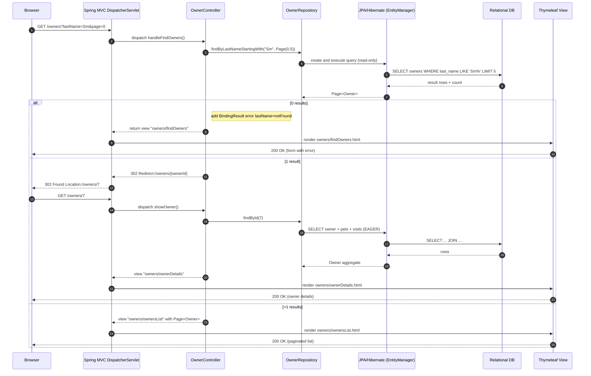
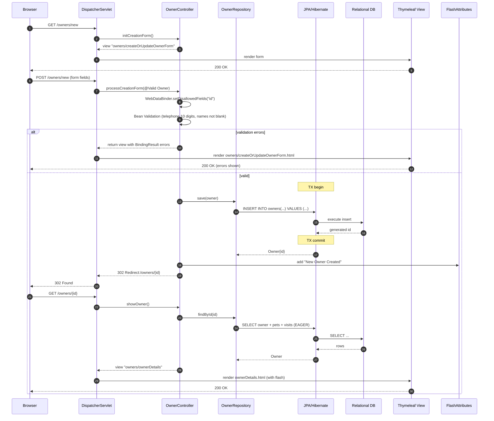
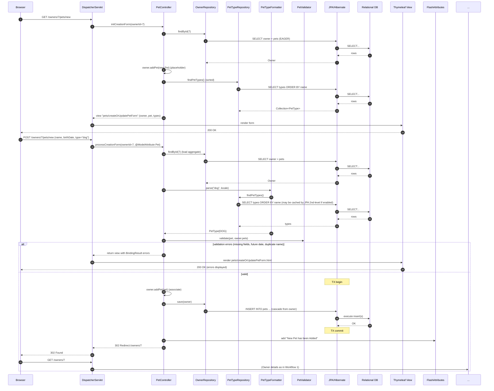
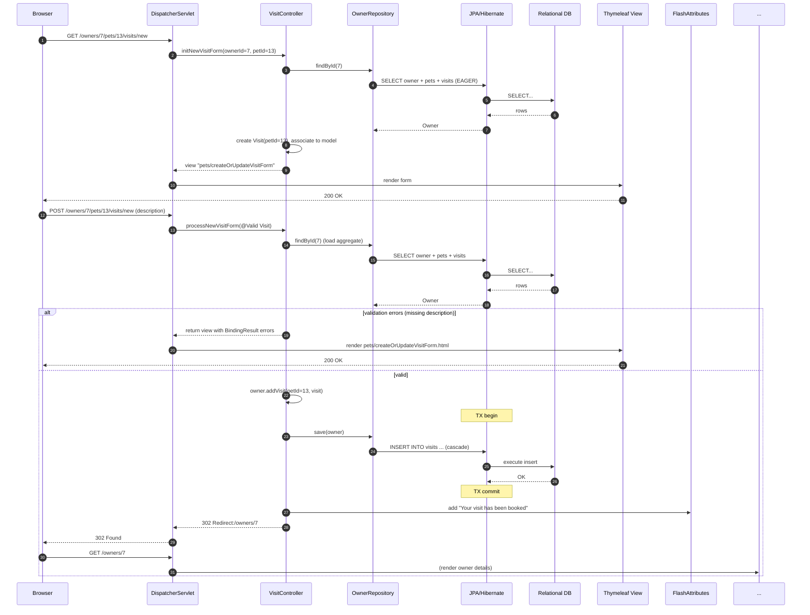
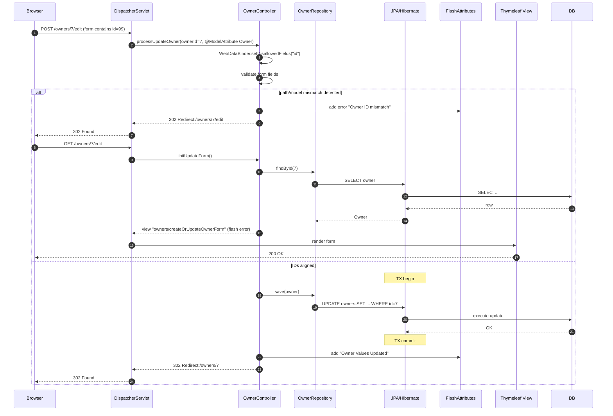
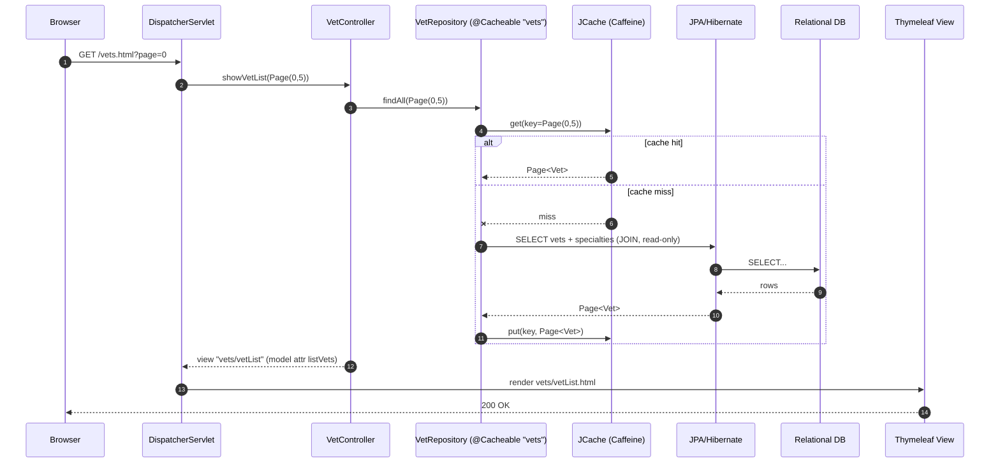
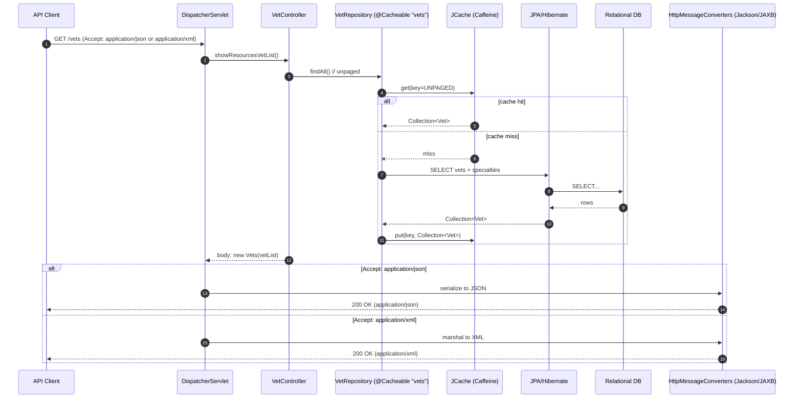
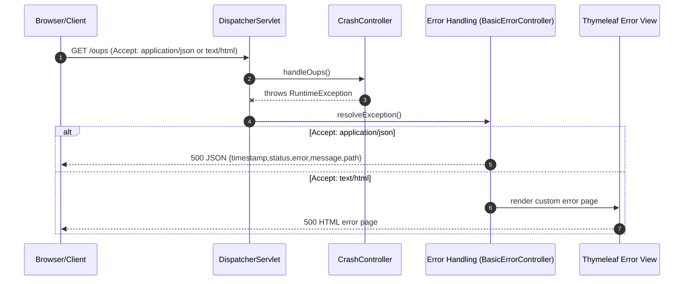
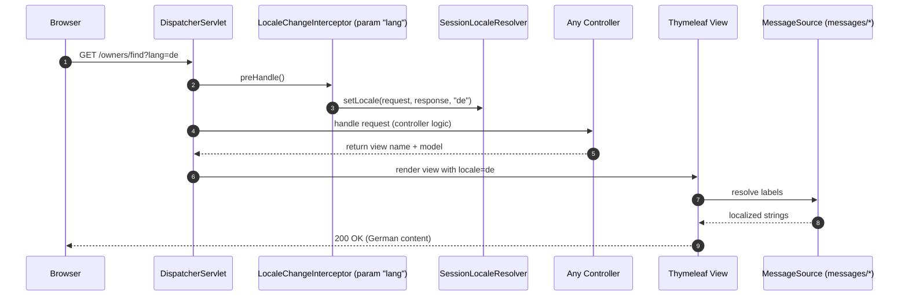
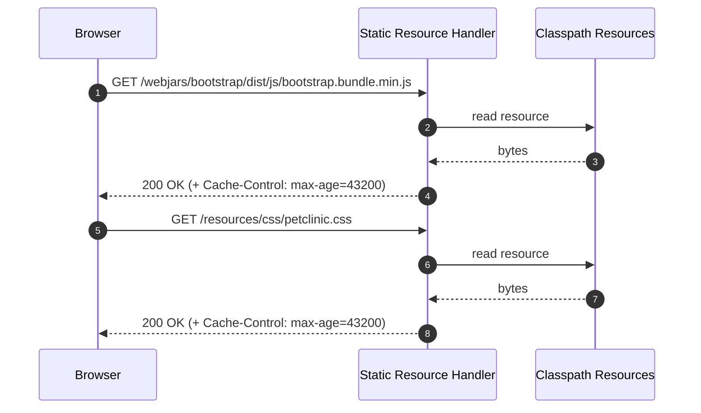

## Workflow 1: Owner search and navigation (cardinality-based outcomes)

- Purpose/trigger: User searches owners by last name prefix via /owners?lastName=... with pagination (5/page)
- Communication patterns:
  - Synchronous HTTP (Browser -> Spring MVC)
  - In-process controller -> repository calls
  - Synchronous JDBC via JPA/Hibernate (read-only)
  - Server-side HTML rendering (Thymeleaf)
- Notes:
  - OSIV disabled; EAGER fetch for aggregate display
  - Branching outcomes: 0, 1, or >1 results

---

## Workflow 2: Create Owner (/owners/new) with validation and redirect

- Purpose/trigger: User creates a new owner via form
- Communication patterns:
  - Synchronous HTTP (GET form, POST submit)
  - Bean Validation + WebDataBinder (disallow "id")
  - Synchronous JDBC write via JPA transaction
  - Redirect + Flash attributes
- Error handling:
  - Field errors return form with BindingResult
  - On success, redirect to details

---

## Workflow 3: Add Pet to Owner (validation, formatter, cascade save)

- Purpose/trigger: Owner adds a new pet via /owners/{ownerId}/pets/new
- Communication patterns:
  - Synchronous HTTP
  - PetTypeFormatter.parse() during data binding
  - PetValidator (required fields, future date, duplicate name per owner)
  - Cascade persist via OwnerRepository.save(owner)
- Notes:
  - Pet types loaded via PetTypeRepository
  - Duplicate name check uses owner's in-memory pets collection

---

## Workflow 4: Book a Visit for a Pet (aggregate save via Owner)

- Purpose/trigger: User books a visit for a specific pet via /owners/{ownerId}/pets/{petId}/visits/new
- Communication patterns:
  - Synchronous HTTP
  - Bean Validation on Visit (description required)
  - Aggregate write via owner.addVisit(...) and save(owner)
  - Redirect + Flash
- Notes:
  - Visit date defaults to now; EAGER visits fetch ensures view-ready aggregate

---

## Workflow 5: Edit Owner with path/model ID tampering protection

- Purpose/trigger: User submits edit form for an owner; controller protects against ID mismatch between path and form
- Communication patterns:
  - Synchronous HTTP
  - WebDataBinder disallows "id" binding; explicit path vs model ID check
  - Redirect with flash on mismatch
- Error handling:
  - On mismatch: redirect back to edit with flash error; no write executed

---

## Workflow 6: Vets list (HTML) with JCache/Caffeine look-aside caching

- Purpose/trigger: User views vets page /vets.html?page={n}
- Communication patterns:
  - Synchronous HTTP
  - @Cacheable("vets") look-aside cache (JCache -> Caffeine)
  - Synchronous JDBC on cache miss
  - Server-side HTML rendering
- Notes:
  - Cache key includes Pageable; cache stats available via provider/Actuator

---

## Workflow 7: Vets API (JSON/XML) with content negotiation and caching

- Purpose/trigger: Client fetches machine-readable vets at /vets with Accept JSON or XML
- Communication patterns:
  - Synchronous HTTP
  - Content negotiation (Jackson JSON, JAXB XML)
  - @Cacheable("vets") look-aside cache
  - No view rendering; direct serialization
- Notes:
  - Vets DTO wraps List<Vet> as property vetList

---

## Workflow 8: Error handling and content negotiation (/oups crash demo)

- Purpose/trigger: Demonstrate error handling path via CrashController GET /oups throwing RuntimeException
- Communication patterns:
  - Synchronous HTTP
  - Exception propagation to Spring Boot error handling
  - Content negotiation between JSON and HTML error representations

---

## Workflow 9: Internationalization (i18n) locale switch

- Purpose/trigger: User requests a different locale via ?lang=xx; views render using message bundles
- Communication patterns:
  - Synchronous HTTP
  - LocaleChangeInterceptor updates SessionLocaleResolver
  - Message resolution during view rendering (messages/*.properties)

---

## Workflow 10: Static web assets with caching headers

- Purpose/trigger: Browser fetches Bootstrap JS or compiled CSS; server serves static resources with Cache-Control
- Communication patterns:
  - Synchronous HTTP GET for static files
  - No controller; ResourceHttpRequestHandler serves from classpath
  - Cache-Control: max-age=12h

---

Global interaction summary

- Inter-component communication:
  - Controllers -> Repositories: in-process synchronous method calls
  - Repositories -> Database: synchronous JDBC via JPA/Hibernate; transaction boundaries around save/update
  - Caching: look-aside via JCache (Caffeine) for vets; synchronous cache get/put on repository calls
  - Views: Thymeleaf templates rendered server-side for HTML; HttpMessageConverters for JSON/XML
- Event-driven interactions:
  - None; no messaging or domain events emitted in runtime paths shown
- Error handling and recovery:
  - Validation/binding errors return forms with BindingResult
  - ID tampering results in redirect with flash error, no DB write
  - Global errors handled by Spring Boot error controller with content negotiation
  - OSIV disabled; eager associations ensure data for view is loaded within controller/repository scope