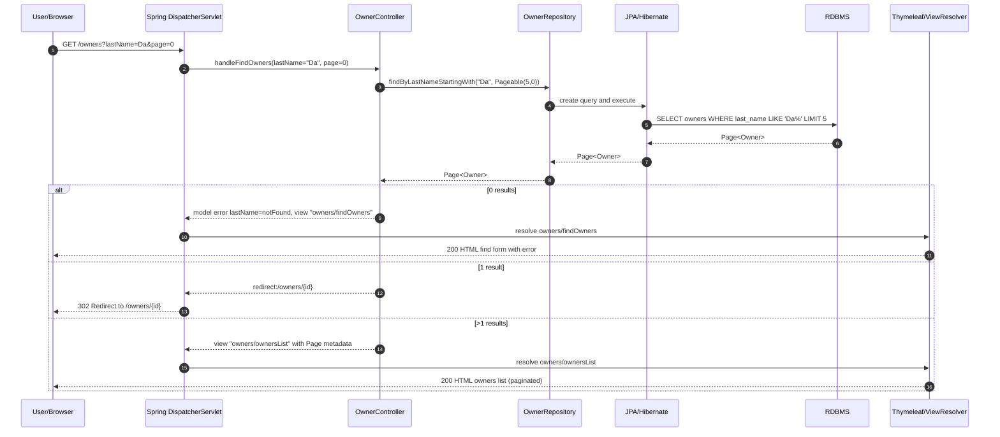
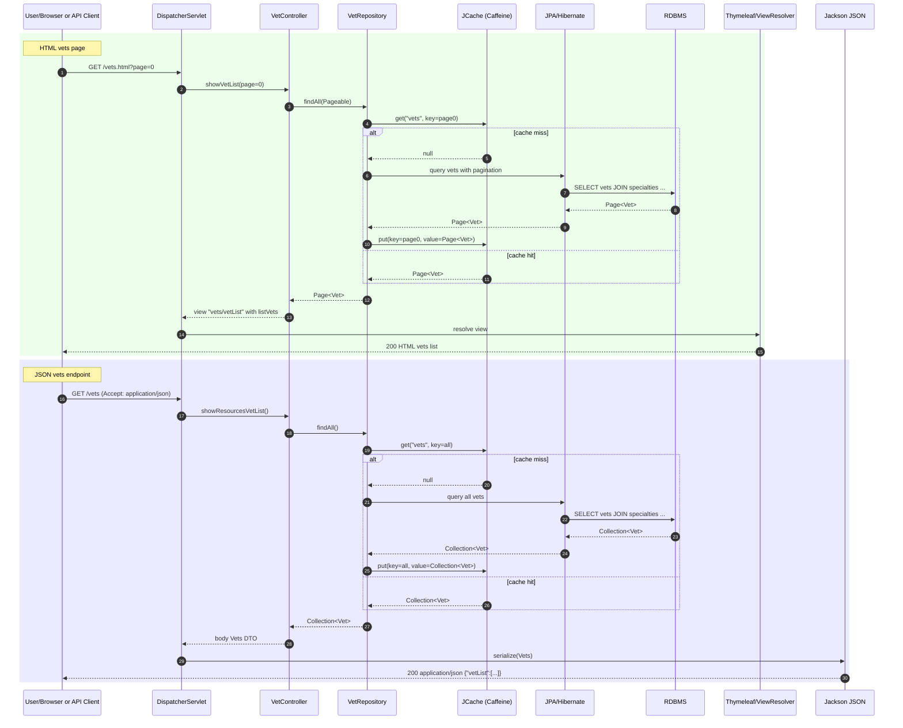
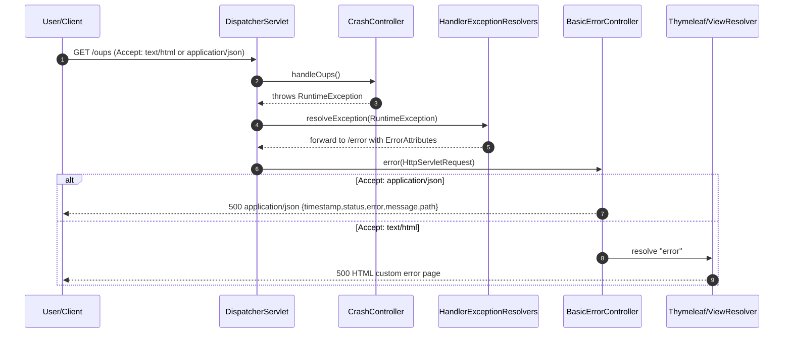
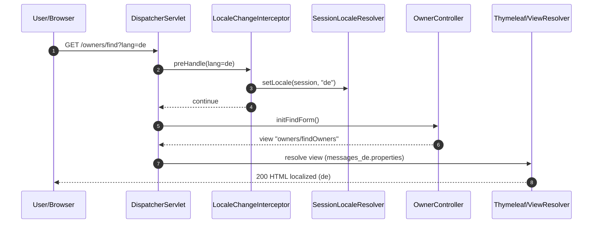
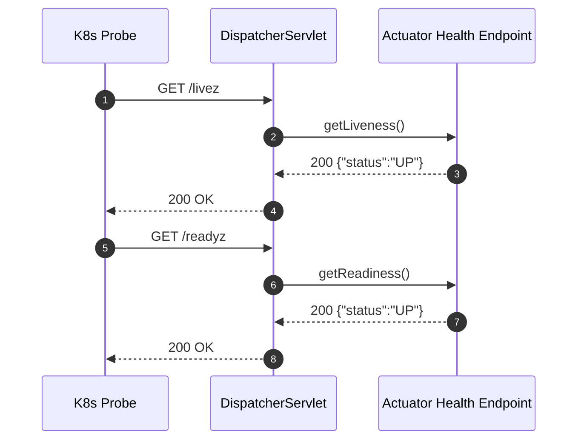
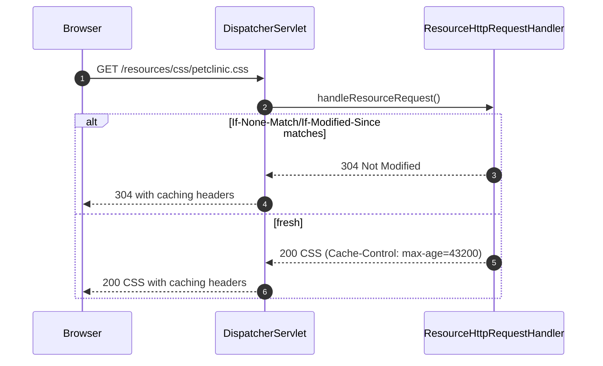

# Workflow 1: Owner search and navigation

Purpose and trigger
- User searches for owners by last name prefix to navigate to details or list.
- Trigger: GET /owners?lastName={prefix}&page={n}

Communication patterns
- HTTP: synchronous MVC request/response
- Data access: Spring Data JPA query (OwnerRepository.findByLastNameStartingWith)
- Database: JDBC to RDBMS (transactional read)
- View rendering: Thymeleaf HTML
- Error handling: Validation error on 0 results (lastName=notFound)
- No events or async messaging



# Workflow 2: Create a new owner

Purpose and trigger
- Create a new owner record and redirect to its detail page.
- Triggers:
  - GET /owners/new (form)
  - POST /owners/new (submission)

Communication patterns
- HTTP: synchronous MVC
- Validation: Bean Validation on Owner fields
- Data access: OwnerRepository.save (transactional write)
- View rendering: Thymeleaf HTML; Flash message on success
- No events or async messaging

```mermaid
sequenceDiagram
  autonumber
  participant U as User/Browser
  participant DS as DispatcherServlet
  participant OC as OwnerController
  participant OR as OwnerRepository
  participant JPA as JPA/Hibernate
  participant DB as RDBMS
  participant VR as Thymeleaf/ViewResolver
  participant Flash as FlashMap

  U->>DS: GET /owners/new
  DS->>OC: initCreationForm()
  OC-->>DS: view "owners/createOrUpdateOwnerForm"
  DS->>VR: resolve view
  VR-->>U: 200 HTML form

  U->>DS: POST /owners/new (Owner form data)
  DS->>OC: processCreationForm(@Valid Owner, BindingResult)
  alt validation errors
    OC-->>DS: view "owners/createOrUpdateOwnerForm" with errors
    DS->>VR: resolve view
    VR-->>U: 200 HTML with validation messages
  else valid
    OC->>OR: save(owner)
    Note over OR,JPA,DB: TX begin; INSERT into owners; TX commit
    OR->>JPA: persist
    JPA->>DB: INSERT owners(...)
    DB-->>JPA: generated id
    JPA-->>OR: Owner with id
    OR-->>OC: Owner with id
    OC->>Flash: put("message","New Owner Created")
    OC-->>DS: redirect:/owners/{id}
    DS-->>U: 302 Redirect
  end
```

# Workflow 3: Add a pet to an owner

Purpose and trigger
- Add a new pet for an existing owner; enforce validations and duplicate-name rule.
- Triggers:
  - GET /owners/{ownerId}/pets/new
  - POST /owners/{ownerId}/pets/new

Communication patterns
- HTTP: synchronous MVC
- Validation: PetValidator (name, type, birthDate, duplicate name per owner)
- Formatting: PetTypeFormatter to parse/print PetType by name
- Data access: OwnerRepository.findById, PetTypeRepository.findPetTypes, OwnerRepository.save (cascade persist Pet)
- Database: transactional write cascaded via Owner aggregate
- View: Thymeleaf HTML; Flash on success
- No events or async messaging

```mermaid
sequenceDiagram
  autonumber
  participant U as User/Browser
  participant DS as DispatcherServlet
  participant PC as PetController
  participant OR as OwnerRepository
  participant PTR as PetTypeRepository
  participant Val as PetValidator
  participant Fmt as PetTypeFormatter
  participant JPA as JPA/Hibernate
  participant DB as RDBMS
  participant VR as Thymeleaf/ViewResolver
  participant Flash as FlashMap

  U->>DS: GET /owners/7/pets/new
  DS->>PC: initCreationForm(ownerId=7)
  PC->>OR: findById(7)
  OR->>DB: SELECT * FROM owners WHERE id=7
  DB-->>OR: Owner
  OR-->>PC: Owner
  PC->>PTR: findPetTypes()
  PTR->>DB: SELECT * FROM types ORDER BY name
  DB-->>PTR: PetType list
  PTR-->>PC: PetType list
  PC-->>DS: view "pets/createOrUpdatePetForm" with owner+pet types
  DS->>VR: resolve view
  VR-->>U: 200 HTML form

  U->>DS: POST /owners/7/pets/new (name, type="dog", birthDate=...)
  DS->>PC: processCreationForm(ownerId=7, Pet form)
  DS->>Fmt: parse(type="dog", locale)
  Fmt-->>DS: PetType
  DS->>Val: validate(Pet, Errors, Owner)
  alt validation/duplicate errors
    Val-->>DS: errors present
    PC-->>DS: view "pets/createOrUpdatePetForm" with errors
    DS->>VR: resolve view
    VR-->>U: 200 HTML with errors
  else valid
    PC->>OR: save(Owner with new Pet)  <!-- cascade ALL -->
    Note over OR,JPA,DB: TX begin; INSERT into pets (owner_id=7); TX commit
    OR->>JPA: cascade persist Pet
    JPA->>DB: INSERT pets(...)
    DB-->>JPA: generated pet id
    JPA-->>OR: ok
    OR-->>PC: Owner
    PC->>Flash: put("message","New Pet has been Added")
    PC-->>DS: redirect:/owners/7
    DS-->>U: 302 Redirect
  end
```

# Workflow 4: Schedule a visit for a pet

Purpose and trigger
- Create a visit tied to a pet; persist via owner aggregate.
- Triggers:
  - GET /owners/{ownerId}/pets/{petId}/visits/new
  - POST /owners/{ownerId}/pets/{petId}/visits/new

Communication patterns
- HTTP: synchronous MVC
- Validation: Bean Validation on Visit (description required)
- Data access: OwnerRepository.findById, Owner.addVisit, OwnerRepository.save (cascade persist Visit)
- Database: transactional write cascaded via Owner->Pet->Visit
- View: Thymeleaf HTML; Flash on success
- No events or async messaging

```mermaid
sequenceDiagram
  autonumber
  participant U as User/Browser
  participant DS as DispatcherServlet
  participant ViC as VisitController
  participant OR as OwnerRepository
  participant JPA as JPA/Hibernate
  participant DB as RDBMS
  participant VR as Thymeleaf/ViewResolver
  participant Flash as FlashMap

  U->>DS: GET /owners/7/pets/12/visits/new
  DS->>ViC: initNewVisit(ownerId=7, petId=12)
  ViC->>OR: findById(7)
  OR->>DB: SELECT owner, pets, visits WHERE owner.id=7
  DB-->>OR: Owner with Pet(12)
  OR-->>ViC: Owner
  ViC-->>DS: view "pets/createOrUpdateVisitForm" with owner, pet, new visit
  DS->>VR: resolve view
  VR-->>U: 200 HTML form

  U->>DS: POST /owners/7/pets/12/visits/new (description, date)
  DS->>ViC: processNewVisit(ownerId=7, petId=12, @Valid Visit, BindingResult)
  alt validation errors (missing description, bad date)
    ViC-->>DS: view "pets/createOrUpdateVisitForm" with errors
    DS->>VR: resolve view
    VR-->>U: 200 HTML with errors
  else valid
    ViC->>ViC: owner.addVisit(12, visit)
    ViC->>OR: save(owner)  <!-- cascade persist Visit -->
    Note over OR,JPA,DB: TX begin; INSERT into visits (pet_id=12); TX commit
    OR->>JPA: cascade persist Visit
    JPA->>DB: INSERT visits(...)
    DB-->>JPA: generated visit id
    JPA-->>OR: ok
    OR-->>ViC: Owner
    ViC->>Flash: put("message","Your visit has been booked")
    ViC-->>DS: redirect:/owners/7
    DS-->>U: 302 Redirect
  end
```

# Workflow 5: Edit owner with ID mismatch protection

Purpose and trigger
- Prevent mass assignment/path tampering by ensuring path ID equals model ID.
- Trigger: POST /owners/{ownerId}/edit

Communication patterns
- HTTP: synchronous MVC
- Validation: Bean Validation on Owner
- Security control: WebDataBinder disallows binding id; controller checks path vs model id
- Data access: OwnerRepository.save if IDs match
- View: Thymeleaf; Flash error on mismatch
- No events or async messaging

```mermaid
sequenceDiagram
  autonumber
  participant U as User/Browser
  participant DS as DispatcherServlet
  participant OC as OwnerController
  participant OR as OwnerRepository
  participant VR as Thymeleaf/ViewResolver
  participant Flash as FlashMap
  participant JPA as JPA/Hibernate
  participant DB as RDBMS

  U->>DS: POST /owners/7/edit (Owner form id=99)
  DS->>OC: processUpdateOwner(pathId=7, model.id=99)
  alt path/model ID mismatch
    OC->>Flash: put("error","Owner ID mismatch")
    OC-->>DS: redirect:/owners/7/edit
    DS-->>U: 302 Redirect
  else IDs match
    OC->>OR: save(owner)
    Note over OR,JPA,DB: TX begin; UPDATE owners SET ... WHERE id=7; TX commit
    OR-->>OC: Owner
    OC->>Flash: put("message","Owner Values Updated")
    OC-->>DS: redirect:/owners/7
    DS-->>U: 302 Redirect
  end
```

# Workflow 6: List vets (HTML and JSON) with cache

Purpose and trigger
- Display vets to users (HTML) and provide machine-readable vets list (JSON).
- Triggers:
  - GET /vets.html?page={n}
  - GET /vets

Communication patterns
- HTTP: synchronous MVC (HTML) and REST (JSON)
- Caching: @Cacheable "vets" on VetRepository.findAll() and findAll(Pageable)
- Data access: VetRepository->DB on cache miss
- Serialization: Jackson for JSON; Thymeleaf for HTML
- No events or async messaging



# Workflow 7: Crash and error handling with content negotiation

Purpose and trigger
- Demonstrate error handling pipeline and custom error responses/pages.
- Trigger: GET /oups (CrashController throws RuntimeException)

Communication patterns
- HTTP: synchronous MVC
- Error handling: Exception routed to BasicErrorController; ErrorAttributes assembled
- Content negotiation: JSON vs HTML by Accept header
- Views: Thymeleaf error.html for HTML, JSON body for API clients
- No events or async messaging



# Workflow 8: Locale change and i18n rendering

Purpose and trigger
- Change UI language via query parameter and render localized content.
- Trigger: Any request with ?lang={code}, e.g., GET /owners/find?lang=de

Communication patterns
- HTTP: synchronous MVC with interceptor
- Interceptors: LocaleChangeInterceptor updates SessionLocaleResolver
- View rendering: Thymeleaf uses message bundles
- No DB impact; no events or async messaging



# Workflow 9: Actuator health probes (liveness/readiness)

Purpose and trigger
- Kubernetes probes check application health via additional paths.
- Triggers: GET /livez, GET /readyz

Communication patterns
- HTTP: synchronous MVC/Actuator
- Internal: HealthEndpointWebExtension computes status
- No DB access typically unless health indicators configured; defaults to up
- No events or async messaging



# Workflow 10: Static assets delivery with caching headers

Purpose and trigger
- Serve CSS/JS assets to browsers with client-side caching.
- Trigger: GET /resources/css/petclinic.css (and WebJars assets)

Communication patterns
- HTTP: synchronous
- Handler: ResourceHttpRequestHandler serves from classpath
- Caching: Cache-Control max-age=12h configured
- No DB access; no events or async messaging



# Cross-cutting notes on communication and data flow

- Synchronous only: All interactions are synchronous HTTP and in-process method calls; there are no asynchronous messages or event-driven flows.
- Transactions:
  - Repository calls open transactions around database operations (Spring Data JPA). VetRepository is read-only; Owner/Pet/Visit writes are transactional.
  - Open-Session-In-View is disabled; entity manager is closed after controller completes repository operations.
- Caching:
  - JCache (Caffeine) backs @Cacheable on VetRepository methods. Cache hits bypass the database.
- Validation and binding:
  - Bean Validation on entities; PetValidator adds domain-specific rules; PetTypeFormatter handles type parsing by name.
- Rendering:
  - Thymeleaf renders HTML with localized messages resolved via SessionLocaleResolver and LocaleChangeInterceptor. JSON uses Jackson serialization.