# Dynamic Interaction Flows and Sequence Diagrams for Spring PetClinic (Monolith)

## Veterinarians listing (HTML, paginated, with cache)

Purpose and trigger:
- User navigates to list veterinarians page with pagination.
- Trigger: GET /vets.html?page={n}

Communication patterns:
- HTTP GET (synchronous)
- Spring MVC → Repository (in-process, synchronous)
- JCache (Caffeine) read-through cache on VetRepository.findAll(Pageable)
- JPA read-only transaction; SQL SELECT with paging
- Thymeleaf server-side rendering

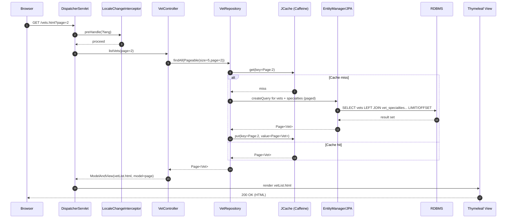

---

## Veterinarians listing (JSON, cached)

Purpose and trigger:
- API consumer retrieves vets as JSON.
- Trigger: GET /vets

Communication patterns:
- HTTP GET (synchronous)
- Spring MVC → Repository (in-process)
- JCache (Caffeine) read-through cache on VetRepository.findAll()
- JPA read-only transaction; SQL SELECT (no paging)
- Jackson serialization to JSON

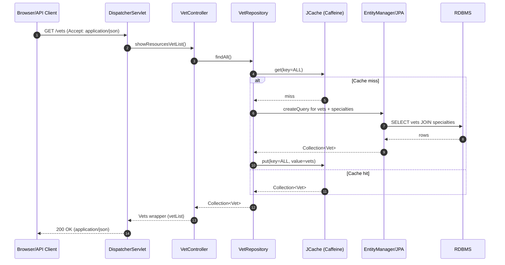

---

## Find Owners (search + pagination + redirect/empty cases)

Purpose and trigger:
- User searches owners by last name prefix; paginated listing.
- Trigger: GET /owners?page={n}&lastName={prefix}

Communication patterns:
- HTTP GET (synchronous)
- Spring MVC → Repository (in-process)
- JPA read-only transaction; SQL SELECT + COUNT for pagination
- Thymeleaf SSR

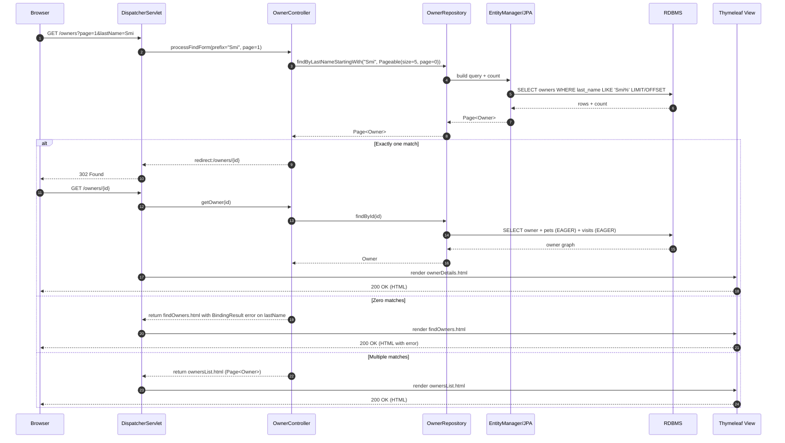

---

## Create Owner (validation + save + redirect)

Purpose and trigger:
- Create a new owner record.
- Triggers:
  - GET /owners/new for form
  - POST /owners/new to submit

Communication patterns:
- HTTP GET/POST (synchronous)
- Bean Validation (JSR 380)
- Spring MVC → Repository (in-process)
- JPA write transaction; SQL INSERT
- Redirect + Flash attribute; SSR

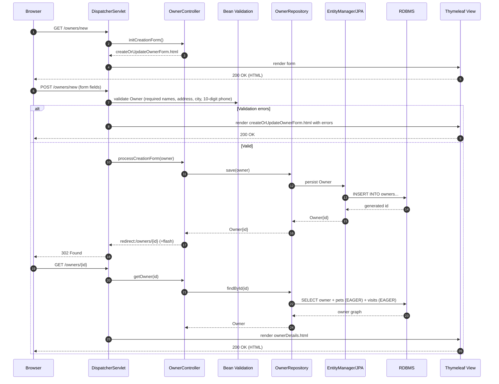

---

## Create Pet for an Owner (aggregate cascade + custom validation)

Purpose and trigger:
- Add a pet to an owner with duplicate-name and date rules.
- Triggers:
  - GET /owners/{ownerId}/pets/new
  - POST /owners/{ownerId}/pets/new

Communication patterns:
- HTTP GET/POST (synchronous)
- @ModelAttribute preloading: Owner, Pet, Types
- Custom validator (PetValidator) + duplicate-name check within owner aggregate
- Spring MVC → OwnerRepository.save(owner) with cascade to Pet
- JPA write transaction; SQL INSERT into pets
- Redirect + SSR

```mermaid
sequenceDiagram
  autonumber
  participant B as Browser
  participant D as DispatcherServlet
  participant PC as PetController
  participant R as OwnerRepository
  participant PTR as PetTypeRepository
  participant PV as PetValidator + DuplicateNameCheck
  participant JPA as EntityManager/JPA
  participant DB as RDBMS
  participant V as Thymeleaf View

  B->>D: GET /owners/7/pets/new
  D->>PC: initCreationForm(ownerId=7)
  PC->>R: findById(7)
  R->>DB: SELECT owner + pets (EAGER) + visits (EAGER)
  DB-->>R: owner graph
  R-->>PC: Owner
  PC->>PTR: findPetTypes()
  PTR->>DB: SELECT types ORDER BY name
  DB-->>PTR: types
  PC->>PC: create new Pet; owner.addPet(pet)
  D->>V: render createOrUpdatePetForm.html (owner, types, pet)
  V-->>B: 200 OK (HTML)

  B->>D: POST /owners/7/pets/new (form fields)
  D->>PC: processCreationForm(ownerId=7, pet form)
  PC->>PV: validate (name, type required on create, birthDate not future, duplicate name per owner)
  alt Validation errors
    D->>V: render createOrUpdatePetForm.html with errors
    V-->>B: 200 OK
  else Valid
    PC->>R: save(owner)  // cascade persists new Pet
    R->>JPA: persist Pet (via Owner aggregate)
    JPA->>DB: INSERT INTO pets(...)
    DB-->>JPA: generated id
    JPA-->>R: Owner with Pet{id}
    R-->>PC: Owner
    PC-->>D: redirect:/owners/7 (+flash)
    D-->>B: 302 Found
    B->>D: GET /owners/7
    D->>R: findById(7)
    R->>DB: SELECT owner + pets + visits (EAGER)
    DB-->>R: graph
    D->>V: render ownerDetails.html
    V-->>B: 200 OK (HTML)
  end
```

---

## Edit Pet (update in-aggregate + uniqueness rule)

Purpose and trigger:
- Update a pet’s fields ensuring unique name within the same owner.
- Triggers:
  - GET /owners/{ownerId}/pets/{petId}/edit
  - POST /owners/{ownerId}/pets/{petId}/edit

Communication patterns:
- HTTP GET/POST (synchronous)
- @ModelAttribute preloading: Owner, Pet, Types
- Custom validation and intra-aggregate uniqueness check excluding the current pet
- Spring MVC → OwnerRepository.save(owner) with cascade to Pet
- JPA write transaction; SQL UPDATE to pets
- Redirect + SSR

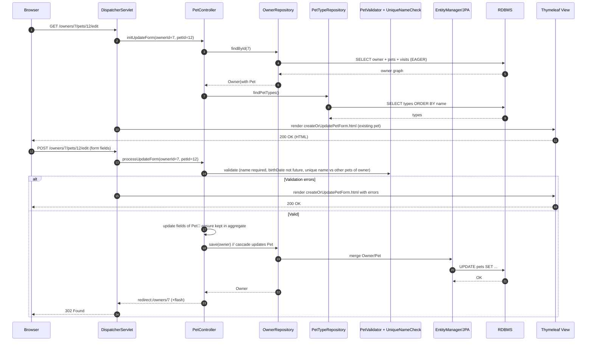

---

## Create Visit for a Pet (cascade via Owner aggregate)

Purpose and trigger:
- Add a visit for a pet; description required, date defaults to today.
- Triggers:
  - GET /owners/{ownerId}/pets/{petId}/visits/new
  - POST /owners/{ownerId}/pets/{petId}/visits/new

Communication patterns:
- HTTP GET/POST (synchronous)
- @ModelAttribute: load Owner + Pet; create Visit and add to Pet
- Bean Validation (description)
- Spring MVC → OwnerRepository.save(owner) cascade to Visit through Pet
- JPA write transaction; SQL INSERT into visits
- Redirect + SSR

```mermaid
sequenceDiagram
  autonumber
  participant B as Browser
  participant D as DispatcherServlet
  participant VC as VisitController
  participant R as OwnerRepository
  participant BV as Bean Validation
  participant JPA as EntityManager/JPA
  participant DB as RDBMS
  participant V as Thymeleaf View

  B->>D: GET /owners/7/pets/12/visits/new
  D->>VC: initNewVisitForm(ownerId=7, petId=12)
  VC->>R: findById(7)
  R->>DB: SELECT owner + pets + visits (EAGER)
  DB-->>R: owner graph
  R-->>VC: Owner(with Pet#12)
  VC->>VC: Visit v = new Visit(); owner.addVisit(12, v)
  D->>V: render createOrUpdateVisitForm.html
  V-->>B: 200 OK (HTML)

  B->>D: POST /owners/7/pets/12/visits/new (form fields)
  D->>VC: processNewVisitForm(ownerId=7, petId=12)
  VC->>BV: validate Visit (description required; date defaults to now if blank)
  alt Validation errors
    D->>V: render createOrUpdateVisitForm.html with errors
    V-->>B: 200 OK
  else Valid
    VC->>R: save(owner)  // cascade persists Visit
    R->>JPA: persist Visit via Pet aggregate
    JPA->>DB: INSERT INTO visits(...)
    DB-->>JPA: generated id
    R-->>VC: Owner
    VC-->>D: redirect:/owners/7 (+flash)
    D-->>B: 302 Found
  end
```

---

## View Owner Details (EAGER graph + error path)

Purpose and trigger:
- Display owner details including pets and visits via eager loading.
- Trigger: GET /owners/{ownerId}

Communication patterns:
- HTTP GET (synchronous)
- @ModelAttribute getOwner throws IllegalArgumentException if not found
- Spring MVC → Repository (in-process)
- JPA read-only transaction; EAGER fetch for pets and visits
- Thymeleaf SSR
- Error handling via Spring Boot error page

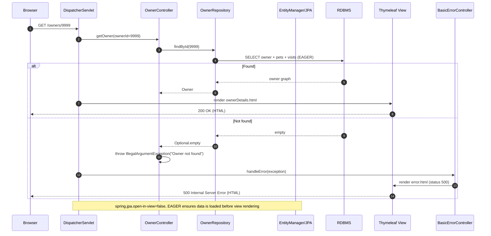

---

## Locale switch via interceptor

Purpose and trigger:
- Switch UI language for the session using ?lang=xx.
- Trigger: any GET with ?lang=es (etc.)

Communication patterns:
- HTTP GET (synchronous)
- LocaleChangeInterceptor + SessionLocaleResolver
- Thymeleaf SSR with MessageSource

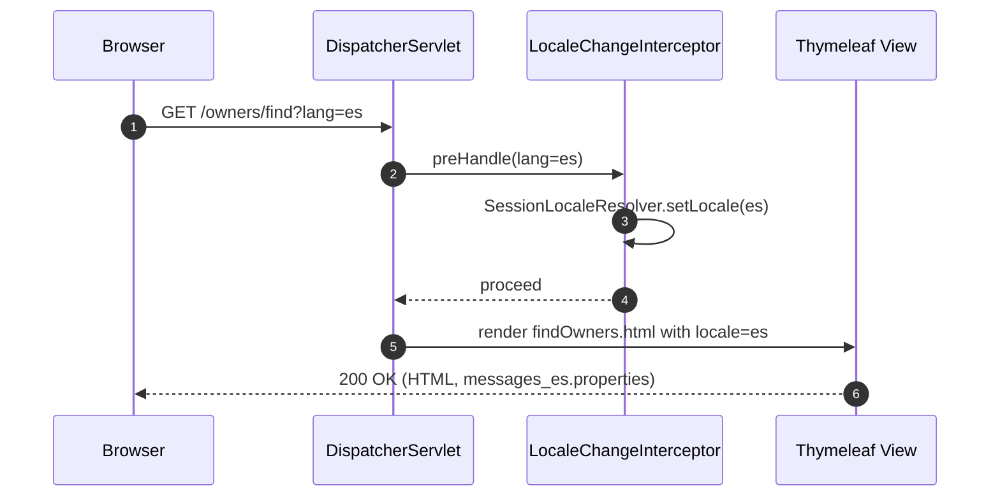

---

## Crash/error workflow (/oups)

Purpose and trigger:
- Demonstrate error handling view.
- Trigger: GET /oups

Communication patterns:
- HTTP GET (synchronous)
- Controller throws RuntimeException
- Error handling by BasicErrorController + Thymeleaf error template

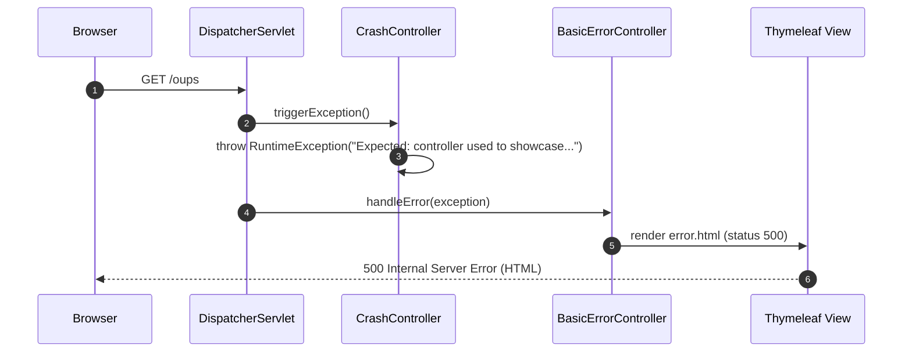

---

## Actuator readiness/liveness probes (with DB health)

Purpose and trigger:
- Kubernetes liveness/readiness checks via /livez and /readyz when enabled.
- Trigger: GET /readyz (or /livez)

Communication patterns:
- HTTP GET (synchronous)
- Actuator HealthEndpoint
- DataSourceHealthIndicator performs DB ping
- JSON response

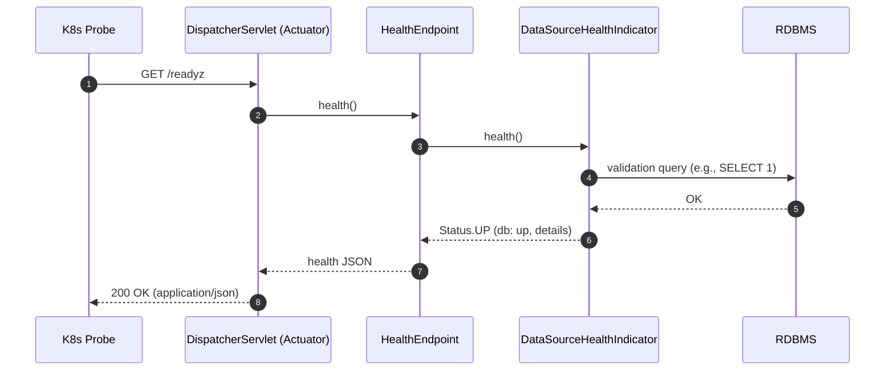

---

## Vets cache lifecycle (hit/miss and eviction)

Purpose and trigger:
- Illustrate synchronous read-through cache and eventual eviction for vets data.
- Trigger: multiple GET /vets or /vets.html requests

Communication patterns:
- Cache lookup → DB on miss → Cache put; later hit
- Eviction is internal to Caffeine (time/size), no app-level event handling

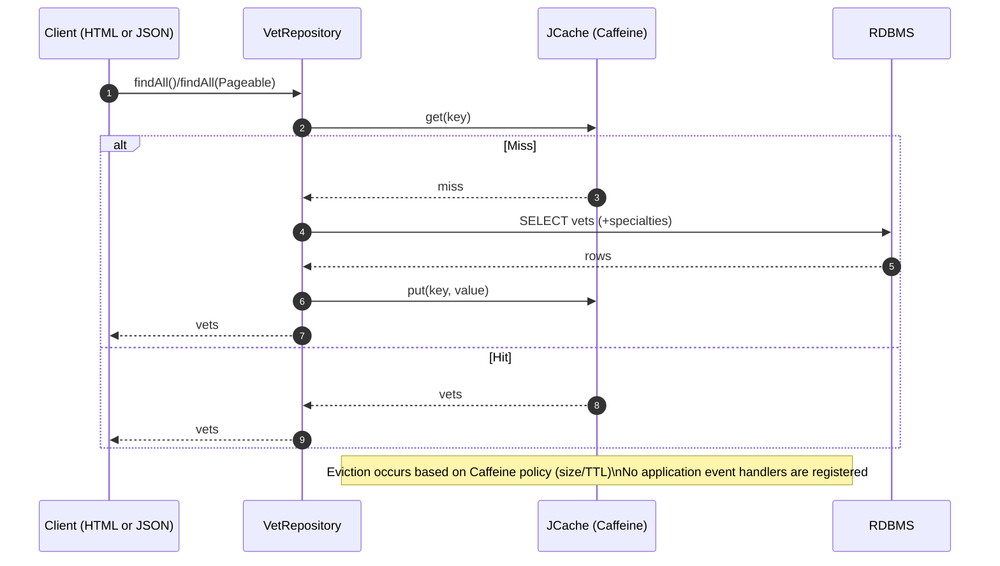

---

## Startup database initialization (profiles and service binding)

Purpose and trigger:
- Initialize schema and data on startup based on active profile/database.
- Triggers: Application boot, Spring SQL init

Communication patterns:
- Spring Boot SQL init executes schema.sql and data.sql
- Reads database configuration from properties or service binding files
- Single RDBMS connection

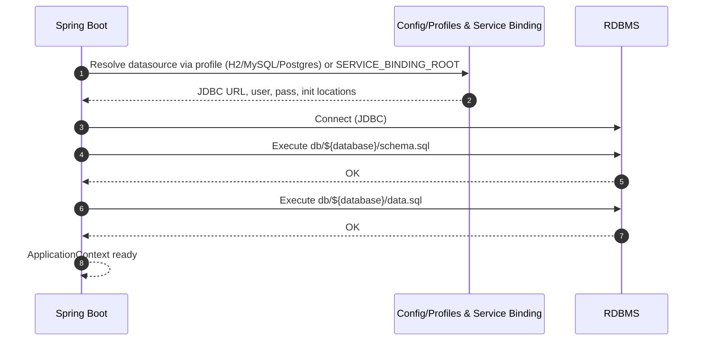

---

# Communication Patterns Summary

- Synchronous HTTP request/response for all user interactions.
- In-process synchronous calls from controllers to Spring Data repositories.
- Single relational database; JPA manages transactions (writes are transactional; reads typically read-only).
- Caching: JCache (Caffeine) read-through cache for vets; no explicit invalidation from application code.
- Validation: Bean Validation (JSR 380) and custom PetValidator with domain rules.
- i18n: LocaleChangeInterceptor + SessionLocaleResolver; views use message bundles.
- Error handling: Exceptions bubble to BasicErrorController; error.html rendered with appropriate status.