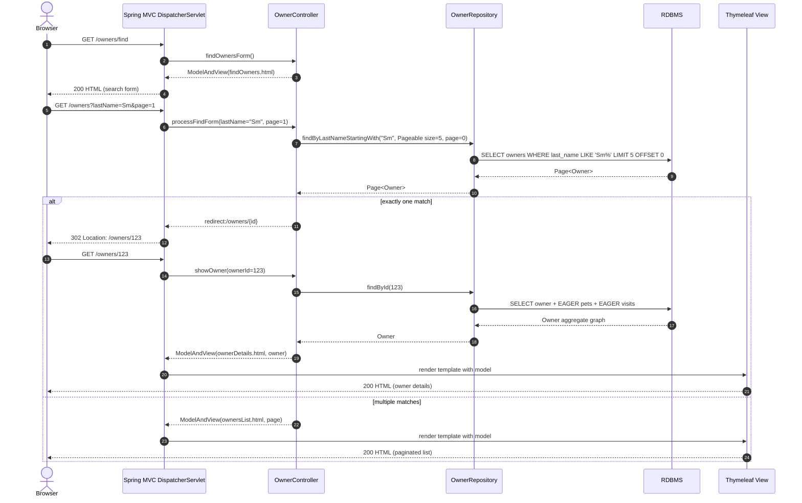
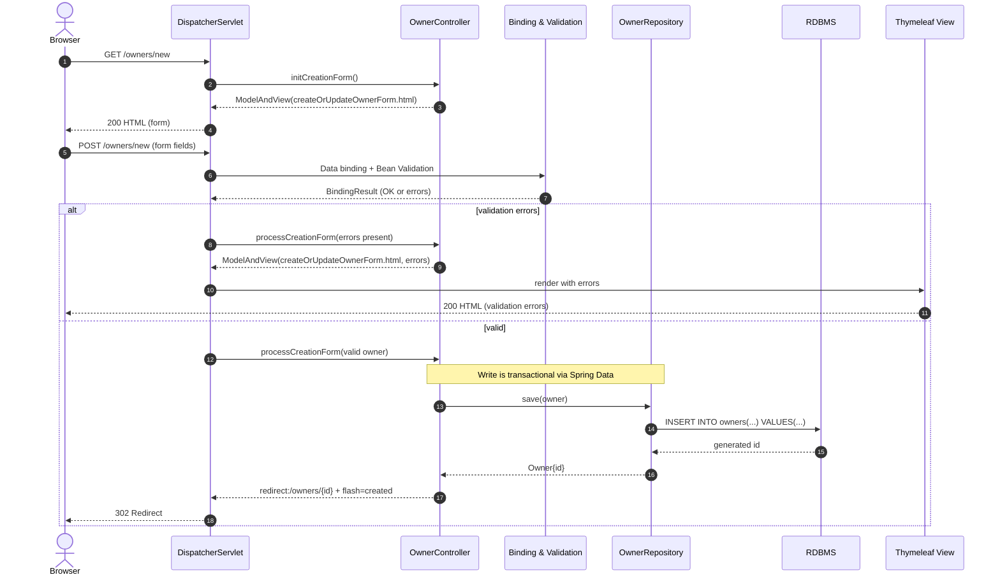
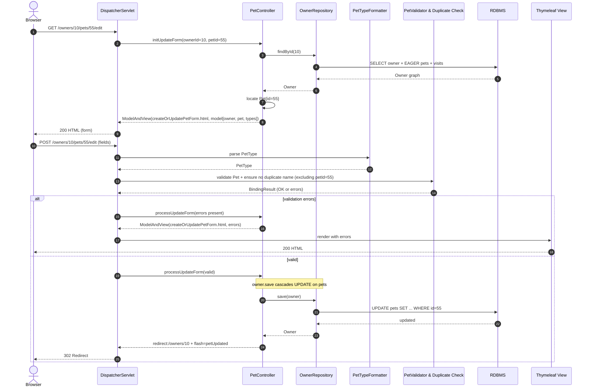
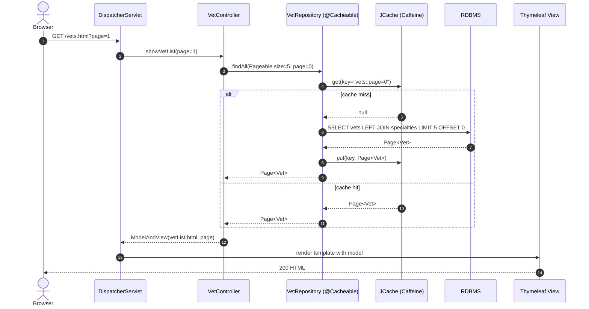
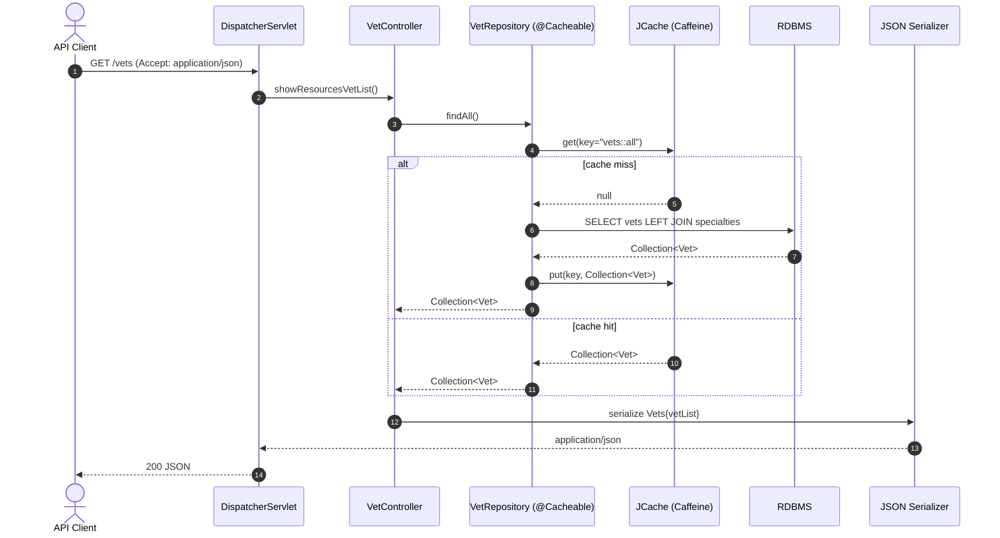
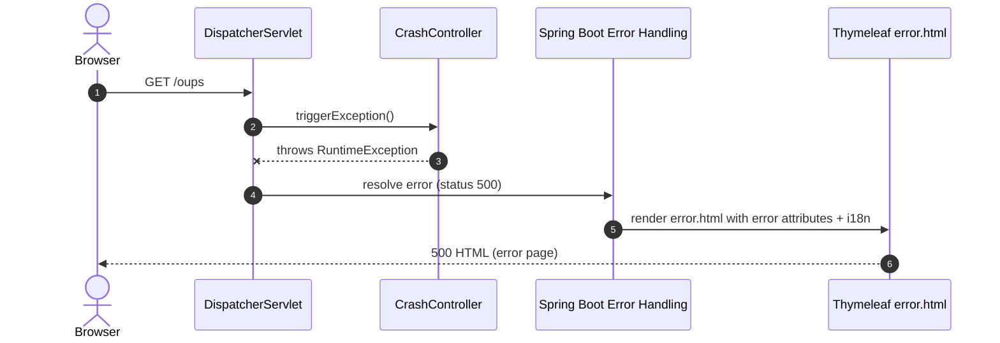
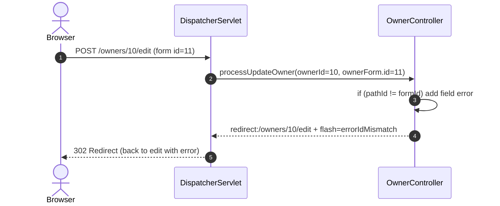
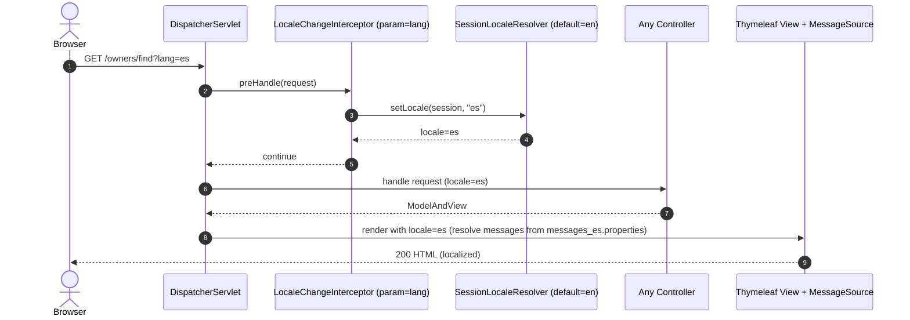

## Workflow 1: Find Owners and View Owner Details

- Purpose: Let users search for owners by last name, list paginated results, or redirect to the owner details when a single match exists. Display full owner graph (pets and visits).
- Triggers: GET /owners/find then GET /owners?lastName=..., or direct GET /owners/{ownerId}
- Communication patterns:
  - HTTP: Browser -> Spring MVC controller (synchronous)
  - Data: Spring Data JPA repository queries (read-only)
  - View: Thymeleaf server-side rendering
  - DB: Single RDBMS
  - Transactions: Read operations via repository proxies (read-only)
  - Events/Async: None
- Data flow: Controller loads Owner(s). Owner.pets and Pet.visits are EAGER, so owner details bring full graph. No lazy loading in views (spring.jpa.open-in-view=false).



---

## Workflow 2: Create Owner

- Purpose: Capture a new owner record and persist it.
- Triggers: GET /owners/new then POST /owners/new
- Communication patterns:
  - HTTP form POST -> MVC binding/validation (JSR 380)
  - Data: OwnerRepository.save (write)
  - Transactions: @Transactional on repository save
  - Events/Async: None
- Data flow: Validated Owner -> insert owners row -> redirect to owner details; flash message added.



---

## Workflow 3: Add Pet to Owner

- Purpose: Add a new pet to an existing owner with domain constraints (duplicate name prevention, type and date checks).
- Triggers: GET /owners/{ownerId}/pets/new then POST /owners/{ownerId}/pets/new
- Communication patterns:
  - HTTP form POST -> MVC binding/validation (custom PetValidator + controller checks)
  - Data: OwnerRepository.findById (read), PetTypeRepository.findPetTypes (read), OwnerRepository.save (cascade write to pets)
  - Transactions: @Transactional on save(owner)
  - Events/Async: None
- Data flow: Load Owner and PetTypes for form; bind Pet with PetType via PetTypeFormatter; validate; owner.addPet(pet); save(owner) cascades insert pet; redirect with flash.

```mermaid
sequenceDiagram
  autonumber
  actor User as Browser
  participant DS as DispatcherServlet
  participant PC as PetController
  participant OR as OwnerRepository
  participant PTR as PetTypeRepository
  participant Fmt as PetTypeFormatter
  participant Val as PetValidator & Controller Checks
  participant DB as RDBMS
  participant View as Thymeleaf View

  User->>DS: GET /owners/10/pets/new
  DS->>PC: initCreationForm(ownerId=10)
  PC->>OR: findById(10)
  OR->>DB: SELECT owner + EAGER pets + visits
  DB-->>OR: Owner graph
  OR-->>PC: Owner
  PC->>PTR: findPetTypes()
  PTR->>DB: SELECT * FROM types ORDER BY name
  DB-->>PTR: List<PetType>
  PTR-->>PC: PetTypes
  PC->>PC: new Pet(); owner.addPet(pet)
  PC-->>DS: ModelAndView(createOrUpdatePetForm.html, model[owner, pet, types])
  DS-->>User: 200 HTML (form)

  User->>DS: POST /owners/10/pets/new (name, type, birthDate)
  DS->>Fmt: parse PetType (by name)
  Fmt-->>DS: PetType
  DS->>Val: validate Pet (name, type required, birthDate not future; duplicate name per owner)
  Val-->>DS: BindingResult (OK or errors)

  alt validation errors (dup name/type/date)
    DS->>PC: processCreationForm(errors present)
    PC-->>DS: ModelAndView(createOrUpdatePetForm.html, errors)
    DS->>View: render with errors
    View-->>User: 200 HTML
  else valid
    DS->>PC: processCreationForm(valid pet)
    note over PC,OR: owner.save cascades INSERT into pets
    PC->>OR: save(owner)
    OR->>DB: INSERT INTO pets(owner_id, name, birth_date, type_id) ...
    DB-->>OR: pet id
    OR-->>PC: Owner with new Pet{id}
    PC-->>DS: redirect:/owners/10 + flash=petCreated
    DS-->>User: 302 Redirect
  end
```

---

## Workflow 4: Edit Pet

- Purpose: Update an existing pet’s fields while enforcing duplicate-name-per-owner rule.
- Triggers: GET /owners/{ownerId}/pets/{petId}/edit then POST /owners/{ownerId}/pets/{petId}/edit
- Communication patterns:
  - HTTP form POST -> MVC binding/validation
  - Data: OwnerRepository.findById (read), OwnerRepository.save (cascade update)
  - Transactions: @Transactional on save(owner)
  - Events/Async: None
- Data flow: Load owner and locate pet by ID; validate and update; save(owner) cascades to update pet.



---

## Workflow 5: Add Visit

- Purpose: Record a new visit for a pet via Owner aggregate.
- Triggers: GET /owners/{ownerId}/pets/{petId}/visits/new then POST /owners/{ownerId}/pets/{petId}/visits/new
- Communication patterns:
  - HTTP form POST -> MVC binding/validation (JSR 380)
  - Data: OwnerRepository.findById (read), owner.addVisit(petId, visit), OwnerRepository.save (cascade insert visit)
  - Transactions: @Transactional on save(owner)
  - Events/Async: None
- Data flow: ModelAttribute initializes new Visit attached to Pet; validation ensures description required; save cascades insert into visits.

```mermaid
sequenceDiagram
  autonumber
  actor User as Browser
  participant DS as DispatcherServlet
  participant VC as VisitController
  participant OR as OwnerRepository
  participant DB as RDBMS
  participant View as Thymeleaf View

  User->>DS: GET /owners/10/pets/55/visits/new
  DS->>VC: initNewVisit(ownerId=10, petId=55)
  VC->>OR: findById(10)
  OR->>DB: SELECT owner + EAGER pets + visits
  DB-->>OR: Owner graph
  OR-->>VC: Owner
  VC->>VC: new Visit(); owner.addVisit(55, visit)
  VC-->>DS: ModelAndView(createOrUpdateVisitForm.html, model[owner, pet, visit])
  DS-->>User: 200 HTML (form)

  User->>DS: POST /owners/10/pets/55/visits/new (description)
  DS->>VC: processNewVisit()
  alt validation errors (description blank)
    VC-->>DS: ModelAndView(createOrUpdateVisitForm.html, errors)
    DS->>View: render with errors
    View-->>User: 200 HTML
  else valid
    note over VC,OR: owner.save cascades INSERT into visits
    VC->>OR: save(owner)
    OR->>DB: INSERT INTO visits(pet_id, visit_date, description) ...
    DB-->>OR: visit id
    OR-->>VC: Owner with new Visit
    VC-->>DS: redirect:/owners/10 + flash=visitCreated
    DS-->>User: 302 Redirect
  end
```

---

## Workflow 6: List Veterinarians (HTML) with Cache

- Purpose: Display paginated list of vets with specialties; leverage read-through cache for performance.
- Triggers: GET /vets.html?page={n}
- Communication patterns:
  - HTTP: MVC controller
  - Data: VetRepository.findAll(Pageable) with @Cacheable("vets") via JCache/Caffeine
  - View: Thymeleaf
  - Transactions: Read-only repository method
  - Events/Async: None
- Data flow: Controller requests paged vets; cache lookup for the page key; on miss queries DB and caches result; view renders.



---

## Workflow 7: Vets JSON API with Cache

- Purpose: Provide machine-readable vets list for integration.
- Triggers: GET /vets
- Communication patterns:
  - HTTP JSON: Controller returns JSON via Jackson
  - Data: VetRepository.findAll() with @Cacheable("vets")
  - Transactions: Read-only
  - Events/Async: None
- Data flow: Cache lookup for full list; on miss query DB and cache; serialize Vets wrapper to JSON.



---

## Workflow 8: Error: CrashController and Global Error View

- Purpose: Demonstrate error handling; render unified error page on unhandled exceptions.
- Triggers: GET /oups
- Communication patterns:
  - HTTP: Controller throws RuntimeException
  - Error handling: Spring Boot error MVC -> error.html
  - Events/Async: None
- Data flow: No DB; exception flows to error handling; i18n messages used in error view.



---

## Workflow 9: Owner Edit with ID Mismatch Error Handling

- Purpose: Prevent tampering where path ID and form ID differ; provide user feedback without exception.
- Triggers: POST /owners/{ownerId}/edit with form id != ownerId
- Communication patterns:
  - HTTP: MVC binding/validation
  - Data: No DB write when mismatch
  - Events/Async: None
- Data flow: Controller compares IDs; adds error; redirects back to edit form.



---

## Workflow 10: Locale Change and i18n Resolution

- Purpose: Allow users to switch languages via query parameter.
- Triggers: Any request with ?lang=es (or other supported)
- Communication patterns:
  - HTTP: LocaleChangeInterceptor updates SessionLocaleResolver
  - View: Thymeleaf resolves messages via MessageSource bundles
  - Events/Async: None
- Data flow: Interceptor adjusts locale before controller; views render with requested locale.

