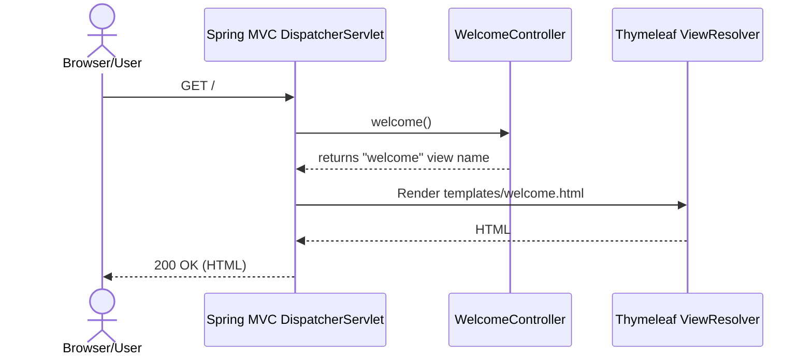
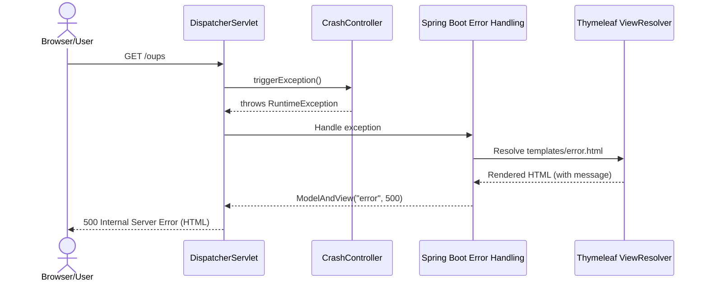

### Workflow: Home/Welcome page

Purpose and trigger
- Purpose: Serve landing page.
- Trigger: User opens GET /.

Communication patterns
- HTTP GET via Spring MVC
- Thymeleaf template rendering
- No database access




### Workflow: Find owners and list results (with pagination)

Purpose and trigger
- Purpose: Search owners by last name; show list or redirect to single result.
- Triggers:
  - GET /owners/find (show search form)
  - GET /owners?page=X&lastName=Y (execute search)

Communication patterns
- HTTP GET via Spring MVC
- Spring Data JPA repository query (JPQL)
- Database read transaction (readOnly)
- Server-side pagination (Pageable)

```mermaid
sequenceDiagram
  actor U as Browser/User
  participant D as DispatcherServlet
  participant OC as OwnerController
  participant OR as OwnerRepository (Spring Data JPA)
  participant EM as JPA/Hibernate
  database DB as RDBMS

  U->>D: GET /owners/find
  D->>OC: initFindForm()
  OC-->>D: returns view "owners/findOwners"
  D-->>U: 200 OK (HTML form)

  U->>D: GET /owners?page=1&lastName=Frank
  D->>OC: processFindForm(page, owner, result, model)
  note over OC: If owner.lastName == null -> set "" (broad search)
  OC->>OC: Pageable p = PageRequest(page-1, 5)
  OC->>OR: findByLastName(lastName, p)
  OR->>EM: Execute JPQL<br/>SELECT DISTINCT owner FROM Owner owner LEFT JOIN owner.pets WHERE owner.lastName LIKE :lastName%
  EM->>DB: Read owners (+pets due to join)
  DB-->>EM: Rows
  EM-->>OR: Page<Owner>
  OR-->>OC: Page<Owner>

  alt No owners found
    OC->>OC: result.rejectValue("lastName","notFound")
    OC-->>D: return "owners/findOwners"
    D-->>U: 200 OK (form + validation error)
  else Exactly 1 owner found
    OC-->>D: redirect:/owners/{id}
    D-->>U: 302 Redirect
  else Multiple owners
    OC-->>D: return "owners/ownersList" + pagination model
    D-->>U: 200 OK (HTML list)
  end
```


### Workflow: Show owner details

Purpose and trigger
- Purpose: Display owner, pets, and visits.
- Trigger: GET /owners/{ownerId}

Communication patterns
- HTTP GET via Spring MVC
- Spring Data JPA repository query with fetch join
- EAGER associations (Owner.pets, Pet.visits)
- Database read transaction (readOnly)

```mermaid
sequenceDiagram
  actor U as Browser/User
  participant D as DispatcherServlet
  participant OC as OwnerController
  participant OR as OwnerRepository
  participant EM as JPA/Hibernate
  database DB as RDBMS

  U->>D: GET /owners/1
  D->>OC: showOwner(ownerId)
  OC->>OR: findById(1)
  OR->>EM: Execute JPQL<br/>SELECT owner FROM Owner owner LEFT JOIN FETCH owner.pets WHERE owner.id=:id
  EM->>DB: Read Owner + Pets
  DB-->>EM: Rows
  note over EM: Pet.visits is EAGER; ORM may issue N+1 or a join depending on provider
  EM-->>OR: Owner aggregate
  OR-->>OC: Owner
  OC-->>D: return "owners/ownerDetails" with model
  D-->>U: 200 OK (HTML)
```


### Workflow: Create a new owner

Purpose and trigger
- Purpose: Add a new owner.
- Triggers:
  - GET /owners/new (show form)
  - POST /owners/new (submit form)

Communication patterns
- HTTP GET/POST via Spring MVC
- Bean Validation (JSR-380) on Owner
- Spring Data JPA save (write transaction)

Error handling
- BindingResult carries validation errors; form is re-rendered on error.

```mermaid
sequenceDiagram
  actor U as Browser/User
  participant D as DispatcherServlet
  participant OC as OwnerController
  participant OR as OwnerRepository
  participant EM as JPA/Hibernate
  database DB as RDBMS

  U->>D: GET /owners/new
  D->>OC: initCreationForm()
  OC-->>D: return "owners/createOrUpdateOwnerForm"
  D-->>U: 200 OK (HTML form)

  U->>D: POST /owners/new (form fields)
  D->>OC: processCreationForm(@Valid owner, BindingResult)
  alt Validation errors
    OC-->>D: return "owners/createOrUpdateOwnerForm"
    D-->>U: 200 OK (form + field errors)
  else Valid
    OC->>OR: save(owner)
    OR->>EM: persist owner (tx)
    EM->>DB: INSERT owners
    DB-->>EM: PK id
    EM-->>OR: managed entity
    OR-->>OC: owner with id
    OC-->>D: redirect:/owners/{id}
    D-->>U: 302 Redirect
  end
```


### Workflow: Edit an owner

Purpose and trigger
- Purpose: Update owner fields.
- Triggers:
  - GET /owners/{ownerId}/edit
  - POST /owners/{ownerId}/edit

Communication patterns
- HTTP GET/POST
- Bean Validation
- Spring Data JPA save (merge)

```mermaid
sequenceDiagram
  actor U as Browser/User
  participant D as DispatcherServlet
  participant OC as OwnerController
  participant OR as OwnerRepository
  participant EM as JPA/Hibernate
  database DB as RDBMS

  U->>D: GET /owners/1/edit
  D->>OC: initUpdateOwnerForm(1)
  OC->>OR: findById(1)
  OR->>EM: SELECT owner LEFT JOIN FETCH pets WHERE id=1
  EM->>DB: Read
  DB-->>EM: Rows
  EM-->>OR: Owner
  OR-->>OC: Owner
  OC-->>D: return "owners/createOrUpdateOwnerForm"
  D-->>U: 200 OK (prefilled form)

  U->>D: POST /owners/1/edit (form fields)
  D->>OC: processUpdateOwnerForm(@Valid owner, BindingResult, ownerId)
  alt Validation errors
    OC-->>D: return same form
    D-->>U: 200 OK
  else Valid
    OC->>OC: owner.setId(ownerId)
    OC->>OR: save(owner)
    OR->>EM: merge (tx)
    EM->>DB: UPDATE owners
    DB-->>EM: OK
    EM-->>OR: managed entity
    OR-->>OC: owner
    OC-->>D: redirect:/owners/{ownerId}
    D-->>U: 302 Redirect
  end
```


### Workflow: Add a pet to an owner

Purpose and trigger
- Purpose: Create and associate a Pet to an Owner.
- Triggers:
  - GET /owners/{ownerId}/pets/new
  - POST /owners/{ownerId}/pets/new

Communication patterns
- HTTP GET/POST
- @ModelAttribute preloading of Owner and PetType list
- Custom Validator (PetValidator)
- Cascade persistence (Owner -> Pet) via JPA

Error handling
- Duplicate pet name check
- Validation errors return to form

```mermaid
sequenceDiagram
  actor U as Browser/User
  participant D as DispatcherServlet
  participant PC as PetController
  participant OR as OwnerRepository
  participant EM as JPA/Hibernate
  database DB as RDBMS

  Note over D,PC: @ModelAttribute methods run before handler<br/>- populatePetTypes()<br/>- findOwner(ownerId)<br/>- findPet(optional petId)

  U->>D: GET /owners/1/pets/new
  D->>PC: initCreationForm(owner, model)
  PC->>PC: owner.addPet(new Pet)
  PC-->>D: return "pets/createOrUpdatePetForm"
  D-->>U: 200 OK (form with types)

  U->>D: POST /owners/1/pets/new (name,type,birthDate)
  D->>PC: processCreationForm(owner, @Valid pet, BindingResult)
  PC->>PC: Check duplicate name within owner
  alt Errors (duplicate/validation)
    PC-->>D: return "pets/createOrUpdatePetForm"
    D-->>U: 200 OK (errors)
  else OK
    PC->>PC: owner.addPet(pet)
    PC->>OR: save(owner)
    OR->>EM: persist/merge owner; cascade ALL to pets
    EM->>DB: INSERT/UPDATE pets (with owner_id)
    DB-->>EM: OK
    EM-->>OR: OK
    OR-->>PC: OK
    PC-->>D: redirect:/owners/{ownerId}
    D-->>U: 302 Redirect
  end
```


### Workflow: Edit a pet

Purpose and trigger
- Purpose: Modify pet attributes (name, birthDate, type).
- Triggers:
  - GET /owners/{ownerId}/pets/{petId}/edit
  - POST /owners/{ownerId}/pets/{petId}/edit

Communication patterns
- HTTP GET/POST
- Custom validation (PetValidator)
- Cascade save via OwnerRepository.save(owner)

```mermaid
sequenceDiagram
  actor U as Browser/User
  participant D as DispatcherServlet
  participant PC as PetController
  participant OR as OwnerRepository
  participant EM as JPA/Hibernate
  database DB as RDBMS

  U->>D: GET /owners/1/pets/7/edit
  D->>PC: initUpdateForm(owner, petId, model)
  PC->>PC: pet = owner.getPet(petId)
  PC-->>D: return "pets/createOrUpdatePetForm" (prefilled)
  D-->>U: 200 OK

  U->>D: POST /owners/1/pets/7/edit (updated fields)
  D->>PC: processUpdateForm(@Valid pet, BindingResult, owner)
  alt Validation errors
    PC-->>D: return form
    D-->>U: 200 OK
  else OK
    PC->>PC: owner.addPet(pet)
    PC->>OR: save(owner)
    OR->>EM: merge owner; cascade to pets
    EM->>DB: UPDATE pets
    DB-->>EM: OK
    EM-->>OR: OK
    OR-->>PC: OK
    PC-->>D: redirect:/owners/{ownerId}
    D-->>U: 302 Redirect
  end
```


### Workflow: Add a visit to a pet

Purpose and trigger
- Purpose: Create a new Visit for a given Pet.
- Triggers:
  - GET /owners/{ownerId}/pets/{petId}/visits/new
  - POST /owners/{ownerId}/pets/{petId}/visits/new

Communication patterns
- HTTP GET/POST
- @ModelAttribute preloading Owner and Pet; create Visit and add to Pet
- Bean Validation on Visit
- Cascade persist via OwnerRepository.save(owner) (Pet -> Visit cascade)

```mermaid
sequenceDiagram
  actor U as Browser/User
  participant D as DispatcherServlet
  participant VC as VisitController
  participant OR as OwnerRepository
  participant EM as JPA/Hibernate
  database DB as RDBMS

  Note over D,VC: @ModelAttribute loadPetWithVisit(ownerId, petId)<br/>- OR.findById(ownerId)<br/>- pet = owner.getPet(petId)<br/>- new Visit added to pet; put owner, pet, visit in model

  U->>D: GET /owners/1/pets/7/visits/new
  D->>VC: initNewVisitForm()
  VC-->>D: return "pets/createOrUpdateVisitForm"
  D-->>U: 200 OK (form with pet/owner summary)

  U->>D: POST /owners/1/pets/7/visits/new (date, description)
  D->>VC: processNewVisitForm(@ModelAttribute Owner owner, petId, @Valid visit, BindingResult)
  alt Validation errors
    VC-->>D: return form
    D-->>U: 200 OK
  else OK
    VC->>VC: owner.addVisit(petId, visit)
    VC->>OR: save(owner)
    OR->>EM: merge owner; cascade to pets->visits
    EM->>DB: INSERT visit (pet_id)
    DB-->>EM: OK
    EM-->>OR: OK
    OR-->>VC: OK
    VC-->>D: redirect:/owners/{ownerId}
    D-->>U: 302 Redirect
  end
```


### Workflow: View veterinarians (HTML with pagination) with caching

Purpose and trigger
- Purpose: Display vets list with pagination; leverage cache.
- Trigger: GET /vets.html?page=N

Communication patterns
- HTTP GET
- Spring Cache (@Cacheable("vets"))
- Repository read (Page<Vet>)
- Database read (readOnly)

```mermaid
sequenceDiagram
  actor U as Browser/User
  participant D as DispatcherServlet
  participant VC as VetController
  participant VR as VetRepository
  participant C as Cache("vets")
  participant EM as JPA/Hibernate
  database DB as RDBMS

  U->>D: GET /vets.html?page=1
  D->>VC: showVetList(page, model)
  VC->>VC: paginated = findPaginated(page)
  VC->>VR: findAll(Pageable)  <<@Cacheable("vets")>>
  alt Cache hit
    VR->>C: Lookup key(method+args)
    C-->>VR: Page<Vet>
  else Cache miss
    VR->>C: Lookup miss
    VR->>EM: SELECT vets LEFT JOIN specialties via join table
    EM->>DB: Read vets + specialties
    DB-->>EM: Rows
    EM-->>VR: Page<Vet>
    VR->>C: Put Page<Vet> in cache
  end
  VR-->>VC: Page<Vet>
  VC-->>D: return "vets/vetList" + model
  D-->>U: 200 OK (HTML)
```


### Workflow: Vets API (JSON) with caching

Purpose and trigger
- Purpose: Provide JSON representation of vets for clients.
- Trigger: GET /vets (Accept: application/json)

Communication patterns
- HTTP GET returns JSON
- Spring Cache (@Cacheable("vets"))
- Repository read (Collection<Vet>)

```mermaid
sequenceDiagram
  actor C as API Client
  participant D as DispatcherServlet
  participant VC as VetController
  participant VR as VetRepository
  participant Cc as Cache("vets")
  participant EM as JPA/Hibernate
  database DB as RDBMS

  C->>D: GET /vets (JSON)
  D->>VC: showResourcesVetList()
  VC->>VR: findAll()  <<@Cacheable("vets")>>
  alt Cache hit
    VR->>Cc: Lookup
    Cc-->>VR: Collection<Vet>
  else Cache miss
    VR->>Cc: Lookup miss
    VR->>EM: SELECT vets + join specialties
    EM->>DB: Read
    DB-->>EM: Rows
    EM-->>VR: Collection<Vet>
    VR->>Cc: Put Collection<Vet>
  end
  VR-->>VC: Collection<Vet>
  VC->>VC: Wrap into Vets DTO
  VC-->>D: JSON body
  D-->>C: 200 OK (application/json)
```


### Workflow: Forced error (CrashController) and error handling

Purpose and trigger
- Purpose: Demonstrate global error handling.
- Trigger: GET /oups

Communication patterns
- HTTP GET
- Unhandled RuntimeException
- Spring Boot error handling pipeline (BasicErrorController)
- Thymeleaf error.html view response




### Notes on cross-cutting behavior and data flow

- Binding and formatting
  - @InitBinder disallows binding to id fields, preventing mass-assignment.
  - PetTypeFormatter translates between PetType and String for forms.

- Validation
  - Bean Validation (JSR-380) for Owner and Visit; custom Validator for Pet.
  - Errors are accumulated in BindingResult; controllers return the same form view.

- Transactions
  - Repository query methods are readOnly transactional by default.
  - save(...) executes within a write transaction; cascades persist/merge to child entities per JPA annotations.

- Caching
  - Spring Cache abstraction caches VetRepository.findAll(...) (both collection and pageable variants) under cache name "vets".
  - Cache provider is configured via Spring Boot (JCache customization bean present; Boot may use Caffeine depending on runtime classpath).

- Data model cascade paths
  - Owner -> pets: CascadeType.ALL; saving Owner persists/updates Pets.
  - Pet -> visits: CascadeType.ALL; saving Owner that contains Pet with new Visit persists Visit.

- Asynchrony and events
  - All controller/repository interactions are synchronous.
  - No message brokers or domain events; @ModelAttribute methods act as request lifecycle hooks.