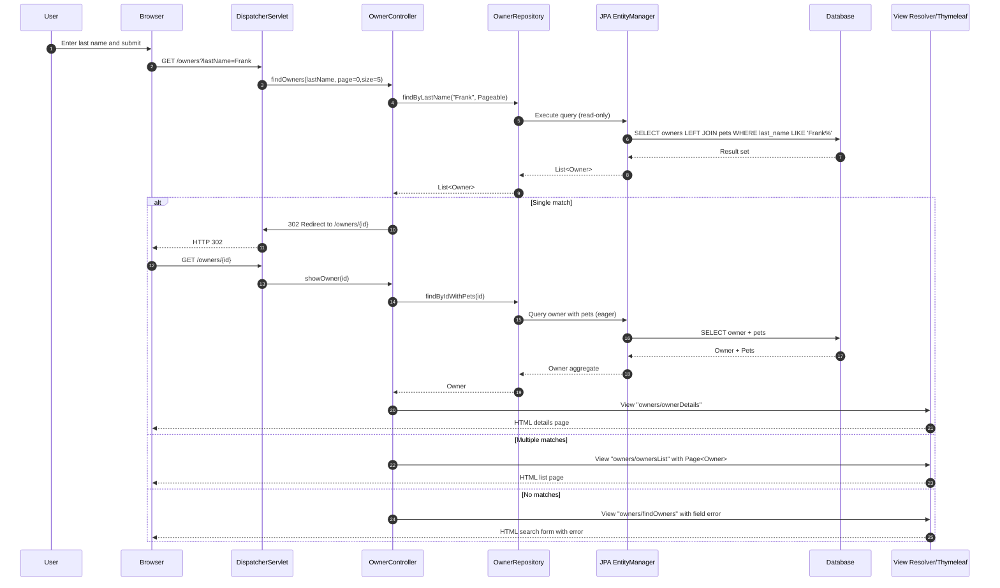
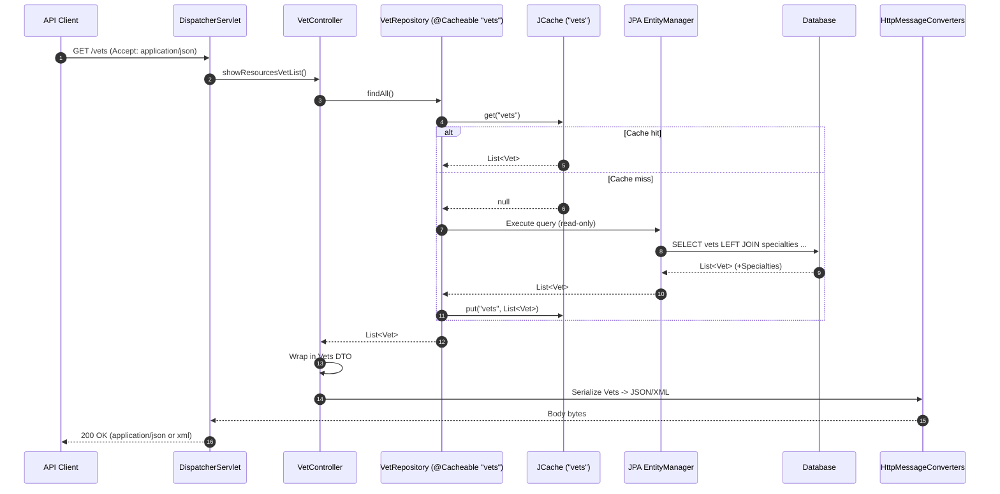
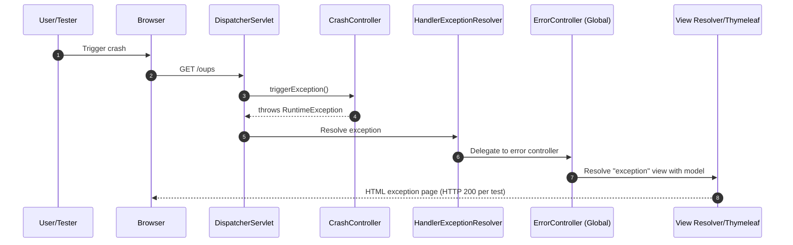

# Dynamic Interaction Flows and Sequence Diagrams for spring-petclinic

## Workflow 1: Search Owners by Last Name

- Purpose: Let staff find owners quickly; redirect to details on single match or show paginated list on multiple results.
- Trigger: User submits the Find Owners form (GET /owners?lastName={prefix}).
- Communication patterns:
  - HTTP (synchronous): Browser -> Spring MVC
  - Synchronous controller-to-repository calls (Spring Data JPA)
  - Read-only DB transaction for search
  - Server-rendered HTML (Thymeleaf)



---

## Workflow 2: Create New Owner

- Purpose: Register a new owner with contact details.
- Trigger: User opens create form (GET /owners/new) and submits (POST /owners/new).
- Communication patterns:
  - HTTP (synchronous)
  - Bean Validation (JSR-303) during data binding
  - Repository save with transactional DB write
  - Post/Redirect/Get pattern

```mermaid
sequenceDiagram
  autonumber
  participant U as User
  participant B as Browser
  participant D as DispatcherServlet
  participant C as OwnerController
  participant VB as WebDataBinder/Bean Validation
  participant R as OwnerRepository
  participant EM as JPA EntityManager
  participant DB as Database
  participant V as View Resolver/Thymeleaf

  U->>B: Navigate to add owner
  B->>D: GET /owners/new
  D->>C: initCreationForm()
  C->>V: View "owners/createOrUpdateOwnerForm"
  V-->>B: HTML form

  U->>B: Submit form data
  B->>D: POST /owners/new (form-url-encoded)
  D->>C: processCreationForm(owner)
  note right of C: Disallow binding of "id"
  C->>VB: Bind + Validate (Bean Validation)
  alt Validation errors
    C->>V: View "owners/createOrUpdateOwnerForm" with errors
    V-->>B: HTML form with field errors
  else Valid
    C->>R: save(owner)
    R->>EM: Begin TX; persist owner
    EM->>DB: INSERT INTO owners ...
    DB-->>EM: OK
    EM-->>R: Commit TX
    R-->>C: Owner with generated id
    C->>D: 302 Redirect to /owners/{id}
    D-->>B: HTTP 302
    B->>D: GET /owners/{id}
    D->>C: showOwner(id)
    C->>R: findByIdWithPets(id)
    R->>EM: SELECT owner + pets
    EM->>DB: Query
    DB-->>EM: Result
    EM-->>R: Owner aggregate
    R-->>C: Owner
    C->>V: View "owners/ownerDetails"
    V-->>B: HTML details page
  end
```

---

## Workflow 3: Add a New Pet to an Owner

- Purpose: Register a pet under an existing owner with validated attributes.
- Trigger: User opens pet create form (GET /owners/{ownerId}/pets/new) and submits (POST /owners/{ownerId}/pets/new).
- Communication patterns:
  - HTTP (synchronous)
  - Formatter: PetTypeFormatter (string <-> PetType)
  - Validator: PetValidator and unique-name rule
  - Repository save via aggregate root (Owner) with cascading to Pet
  - Transactional DB write; PRG pattern

```mermaid
sequenceDiagram
  autonumber
  participant U as User
  participant B as Browser
  participant D as DispatcherServlet
  participant C as PetController
  participant VB as WebDataBinder (Pet + PetValidator)
  participant F as PetTypeFormatter
  participant R as OwnerRepository
  participant EM as JPA EntityManager
  participant DB as Database
  participant V as View Resolver/Thymeleaf

  U->>B: Navigate to add pet
  B->>D: GET /owners/10/pets/new
  D->>C: initCreationForm(ownerId=10)
  C->>R: findByIdWithPets(10)
  R->>EM: SELECT owner + pets
  EM->>DB: Query
  DB-->>EM: Owner + Pets
  EM-->>R: Owner
  R-->>C: Owner
  C->>R: findPetTypes()
  R->>EM: SELECT pet_types ORDER BY name
  EM->>DB: Query
  DB-->>EM: PetTypes
  EM-->>R: List<PetType>
  R-->>C: List<PetType>
  C->>V: View "pets/createOrUpdatePetForm"
  V-->>B: HTML form with pet types

  U->>B: Submit pet form (name, birthDate, type="Dog")
  B->>D: POST /owners/10/pets/new
  D->>C: processCreationForm(ownerId=10, pet)
  note right of C: Disallow binding of "id"
  C->>VB: Bind fields to Pet
  VB->>F: parse("Dog") -> PetType
  alt Unknown type
    F-->>VB: ParseException
    VB-->>C: BindingResult with field error "type"
    C->>V: View "pets/createOrUpdatePetForm" with errors
    V-->>B: HTML form with errors
  else Type resolved
    VB-->>C: Bound Pet
    C->>R: findByIdWithPets(10) // to validate uniqueness and attach
    R->>EM: SELECT owner + pets
    EM->>DB: Query
    DB-->>EM: Owner + Pets
    EM-->>R: Owner
    R-->>C: Owner
    C->>C: Enforce unique name per owner
    alt Duplicate name
      C->>V: View "pets/createOrUpdatePetForm" with errors
      V-->>B: HTML form with duplicate-name error
    else Valid
      C->>C: owner.addPet(pet)
      C->>R: save(owner) // cascade persist Pet
      R->>EM: Begin TX; persist/merge
      EM->>DB: INSERT INTO pets ...
      DB-->>EM: OK
      EM-->>R: Commit TX
      R-->>C: Owner
      C->>D: 302 Redirect to /owners/10
      D-->>B: HTTP 302
      B->>D: GET /owners/10
      D->>C: (delegates to OwnerController.showOwner in app)
      note over D,C: Owner details rendering as in Workflow 1/2
  end
```

---

## Workflow 4: Record a New Visit for a Pet

- Purpose: Append a medical visit to a pet’s history (date defaults to today).
- Trigger: User opens visit form (GET /owners/{ownerId}/pets/{petId}/visits/new) and submits (POST same path).
- Communication patterns:
  - HTTP (synchronous)
  - Binding/validation for Visit
  - Save via Owner aggregate with cascade to Visit
  - Transactional DB write; PRG pattern

```mermaid
sequenceDiagram
  autonumber
  participant U as User
  participant B as Browser
  participant D as DispatcherServlet
  participant C as VisitController
  participant VB as WebDataBinder (Visit)
  participant R as OwnerRepository
  participant EM as JPA EntityManager
  participant DB as Database
  participant V as View Resolver/Thymeleaf

  U->>B: Navigate to add visit
  B->>D: GET /owners/10/pets/21/visits/new
  D->>C: initNewVisit(ownerId=10, petId=21)
  C->>R: findByIdWithPets(10)
  R->>EM: SELECT owner + pets
  EM->>DB: Query
  DB-->>EM: Owner + Pets (+ visits)
  EM-->>R: Owner
  R-->>C: Owner
  C->>C: Create Visit (date defaults to today) and associate with Pet 21
  C->>V: View "visits/createOrUpdateVisitForm"
  V-->>B: HTML form

  U->>B: Submit visit form (description, optional date)
  B->>D: POST /owners/10/pets/21/visits/new
  D->>C: processNewVisit(ownerId=10, petId=21, visit)
  C->>VB: Bind + Validate Visit
  alt Validation errors
    C->>V: View "visits/createOrUpdateVisitForm" with errors
    V-->>B: HTML form with errors
  else Valid
    C->>R: save(owner) // cascades Visit via Pet -> Owner aggregate
    R->>EM: Begin TX; persist Visit (cascade)
    EM->>DB: INSERT INTO visits ...
    DB-->>EM: OK
    EM-->>R: Commit TX
    R-->>C: Owner
    C->>D: 302 Redirect to /owners/10
    D-->>B: HTTP 302
    B->>D: GET /owners/10
    note over D: Owner details rendering
  end
```

---

## Workflow 5: List Veterinarians (API with Caching)

- Purpose: Provide an API for all vets; optimize with JCache.
- Trigger: API client requests GET /vets (JSON/XML).
- Communication patterns:
  - HTTP (synchronous)
  - Repository call with @Cacheable("vets")
  - JCache lookup/store (synchronous)
  - DB read transaction on cache miss
  - Serialization via HttpMessageConverters



---

## Workflow 6: Crash and Global Error Handling

- Purpose: Validate error handling pipeline and user-facing exception page.
- Trigger: Diagnostic endpoint GET /oups.
- Communication patterns:
  - HTTP (synchronous)
  - Exception propagation to HandlerExceptionResolver / ErrorController
  - Server-rendered error view



---

## Notes on Inter-Component Communication and Data Flow

- Synchronous HTTP requests drive all user workflows; there are no asynchronous message brokers or domain events in this codebase.
- Controllers delegate to Spring Data repositories; repositories use JPA EntityManager for DB access.
- Aggregate boundaries:
  - Owner is the aggregate root for Pets and Visits. Persisting Owner cascades changes to Pets and Visits within a single transaction.
- Validation and conversion:
  - Bean Validation guards Owner fields.
  - PetValidator enforces Pet-specific rules.
  - PetTypeFormatter converts between form text and PetType entities; parse failures surface as binding errors.
- Caching:
  - JCache “vets” cache intercepts repository reads for /vets API; cache interaction is synchronous.
- Error handling:
  - Validation errors: Controllers re-render forms with field errors (no state changes).
  - CrashController demonstrates global error path resolving to a friendly “exception” page.
  - WebDataBinder disallows “id” binding to prevent mass-assignment.