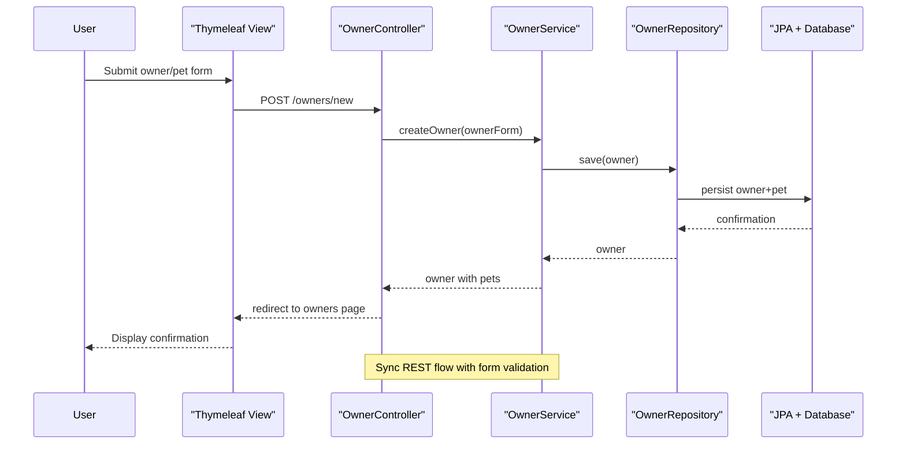
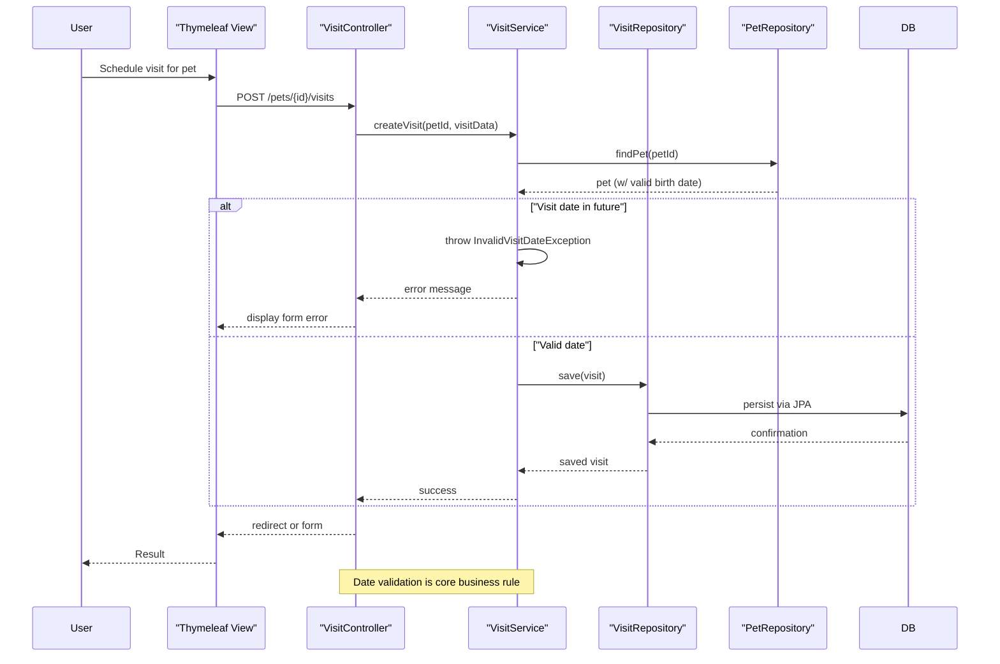
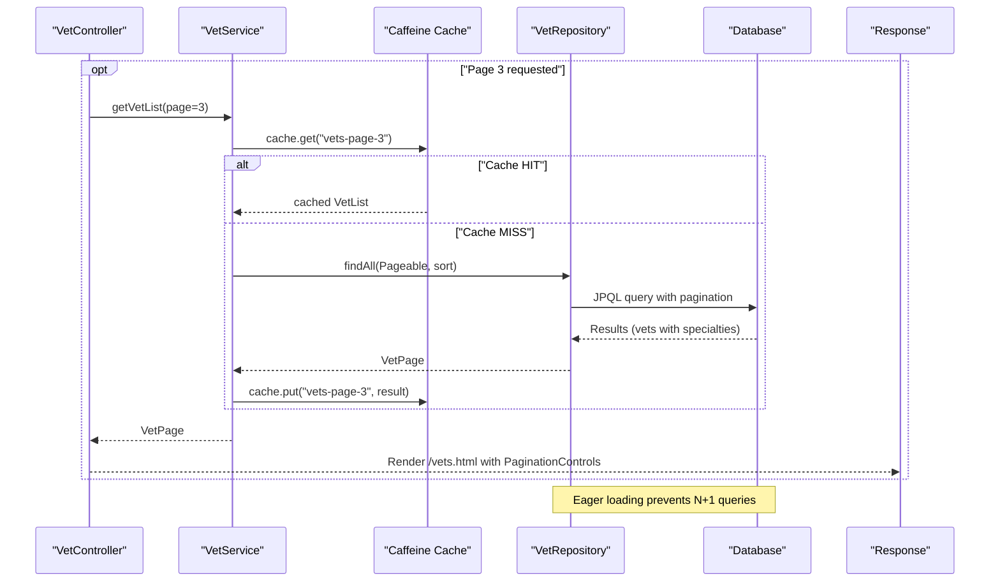
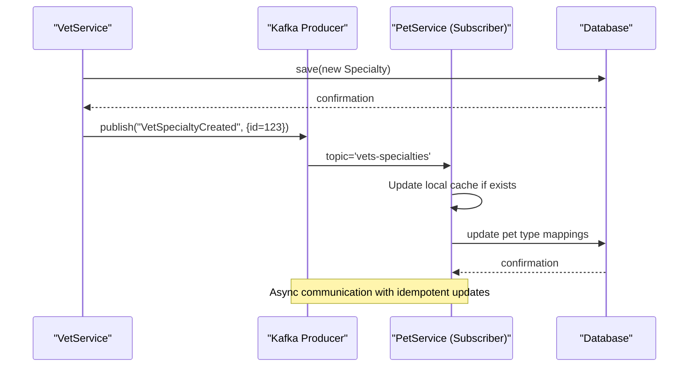
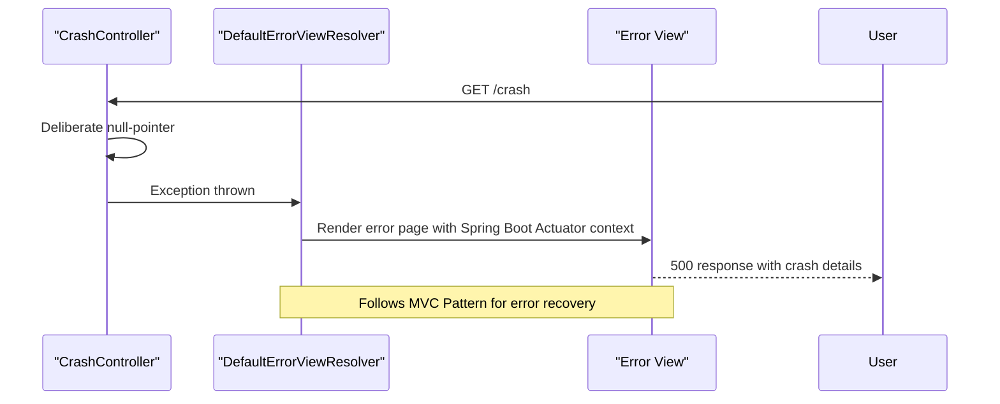

<think>
Okay, let's see what the user is asking me to do. They want an analysis of the Spring PetClinic codebase summary to create dynamic interaction flows and sequence diagrams focusing on user workflows, component communication, data flow, event-driven interactions, and error handling. And they want this in Mermaid format with detailed steps and communication patterns.

First, I need to understand the major workflows in the application. The codebase summary mentions key components like Owner, Vet, Pet, Visit, and specialties. The workflows likely involve creating an owner with a pet, scheduling a visit, and listing vets with their specialties.

Starting with creating an owner and pet. The user would interact with the OwnerController, which would communicate with the OwnerService and OwnerRepository. The service would handle the business logic, save the owner, and pet into the database. So I need to outline the sequence from HTTP request to database transaction.

Next, scheduling a visit. This would involve the VisitController, VisitService, and VisitRepository. The visit is associated with a pet and owner, so there might be interactions with Pet and Owner repositories as well to ensure the pet exists. This is a synchronous REST call, and there's a validation step for the visit date.

For listing vets, it's about retrieving all vets with their specialties. The VetController would use the VetService to fetch data, which includes sorting and pagination. Caffeine caching is mentioned here, so that's an important step to include in the sequence diagram.

Error handling is another key part. For asynchronous events, maybe when a vet specialty is created, an event is published. Other services might subscribe to this event. For synchronous errors, like invalid form submissions, the Controller would return exceptions that are handled and rendered as a view.

I need to make sure each sequence diagram captures the correct components and their interactions. Also, identifying the communication patterns: REST for the first two workflows, maybe events for the asynchronous case. Highlighting synchronous vs. asynchronous steps, database transactions, and error recovery like returning the right HTTP status or error views.

Let me check the detailed components in the codebase summary again. The Owner creation uses OwnerRepository, which uses JPA. The Visit validation includes checking the date, which is a business rule. The Vet listing includes pagination and caching. Error handling is done through exceptions and error views, like the CrashController.

Each workflow's sequence diagram should have the user interface (view), controller, service, repository, and the database. For the asynchronous case, an event bus/message queue would be involved. The error handling diagram would include exceptions and error pages.

I need to structure the Mermaid diagrams with actors like "User" and components as participants. The steps need to be in order, showing the creation of objects, service interactions, database access, and response back.

Wait, the user also asked for error handling and recovery. For example, when a vet specialty is unavailable during a visit, the system should return an error message. That would be part of the synchronous flow, with exception handling in the service layer and appropriate responses rendered by the controller.

I need to make sure that each diagram is detailed enough, including methods, like "POST /owners/new", calls to service methods, repository methods for saving, and any validation logic. Also, for the asynchronous workflow, the event publication and message consumption between services.

Let me outline each major workflow:

1. **Create an Owner with a New Pet**
   - User submits form to OwnerController
   - Controller validates input
   - OwnerService creates owner and pet
   - OwnerRepository saves to DB
   - Returns response to user

2. **Schedule a Vet Visit for a Pet**
   - User creates a visit via VisitController
   - VisitService checks pet exists and date is valid
   - VisitRepository saves the visit
   - DB transaction
   - Response returned

3. **List All Vets with Specialties**
   - VetController requests data
   - VetService retrieves and sorts, using cache
   - If cache miss, fetch from DB
   - Returns paginated results

4. **Asynchronous Specialty Update Event**
   - VetService creates a specialty
   - Publishes event to message queue
   - Other services subscribe and update data if necessary

5. **Error Handling for Invalid Visit Date**
   - User submits invalid date
   - VisitService throws exception
   - Controller catches and returns error page

Each of these diagrams should have Mermaid syntax, specifying participants (View, Controller, Service, Repository, DB, Event Bus, etc.), and steps with arrows showing the flow.

Now, I need to make sure I cover all the points from the user's query: user workflows, communication patterns, data flow, events, error handling. Each diagram should be accompanied by a brief description and communication details like REST calls or events.
</think>

