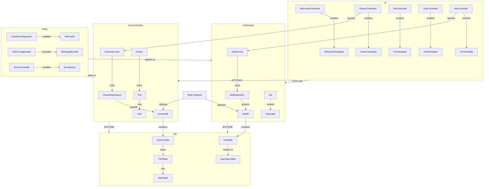

<think>
Okay, let's tackle this problem. The user wants a component-level architecture diagram (Mermaid graph TB) and a rationale based on the provided codebase summary. First, I need to parse the information from the chunks.

From the summary chunks, I see the system is a Spring PetClinic application. The key components mentioned are Owners, Pets, Visits, Vets, and Specialty. There are controllers like WelcomeController, VisitController, VetController, each handling different endpoints. The repositories include OwnerRepository, VetRepository, etc., for database access. The models are Owner, Pet, Visit, Vet, and specialty.

The entities have relationships: Owner has Pets and Visits; Vet has Specialties. The communication is via REST APIs, with controllers interacting with services and repositories. Also, there's Thymeleaf for front-end templates, internationalization for multi-language support, and caching for Vet data.

I need to map these into components. Let's see:

1. **User Interface (UI)**: Thymeleaf templates and controllers that handle HTTP requests.
2. **Vet Management**: VetController, VetRepository, Vet, Specialty.
3. **Owner Management**: OwnerController, OwnerRepository, Owner, Pet, Visit.
4. **Database**: H2/MySQL/PostgreSQL for data persistence.
5. **Util/Configuration**: Caching, internationalization, error handling, and configuration files.
6. **Tests**: Integration tests using Spring Boot, Testcontainers, etc.

Interactions: Controllers call services/repos, repos interact with the database. UI communicates with controllers via HTTP. Testing components might interact with the DB and others.

Now, for the Mermaid graph, I'll list components and their interactions. Make sure to use graph TB syntax. Also, check for clear boundaries and communication patterns in the rationale.

Rationale should explain why components are grouped that way. UI handles presentation, business logic in services/repos, data in DB, and utilities/config handle cross-cutting concerns. Communication is via REST/HTTP, JPA, and caching.

Need to ensure the Mermaid syntax is correct with proper components and directed edges. All components from the summary should be included but grouped into logical modules.
</think>



```markdown
The architecture separates concerns into **UI controllers**, **business modules** (Vet/Owner), **database integration**, and **cross-cutting utilities**. Communication follows a layered pattern: controllers call service/repositories, which interact with the database via Spring Data JPA. Caching (Vet data) and internationalization are implemented as shared utilities. Components reuse base classes like `BaseEntity` and `NamedEntity` for consistency. TestContainer enables integration tests with external DBs like MySQL/PostgreSQL, while H2 is used for in-memory execution. This structure supports modular decompositions such as separating Owner/Pet/Visit and Vet/Specialty into distinct microservices.