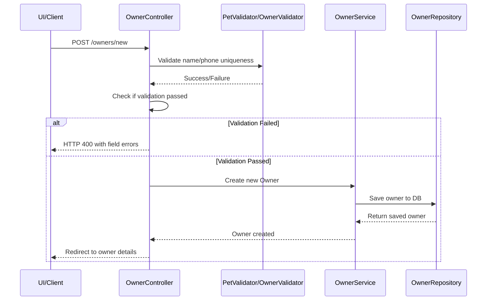
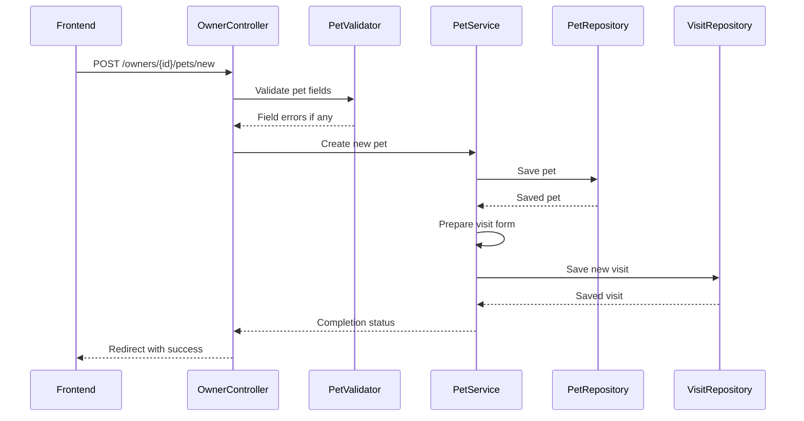
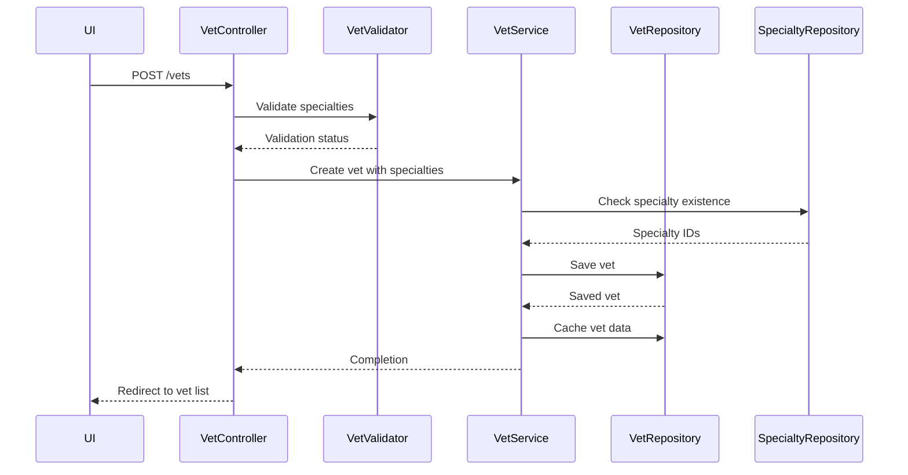
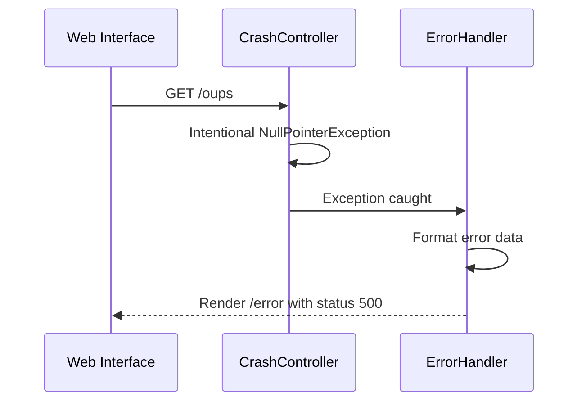
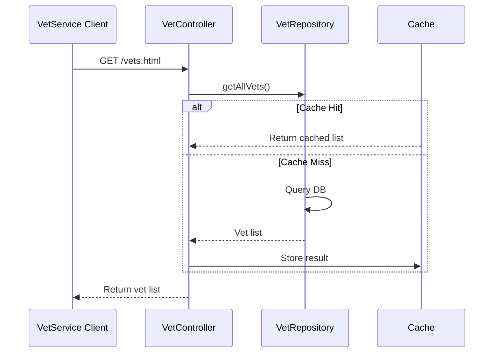
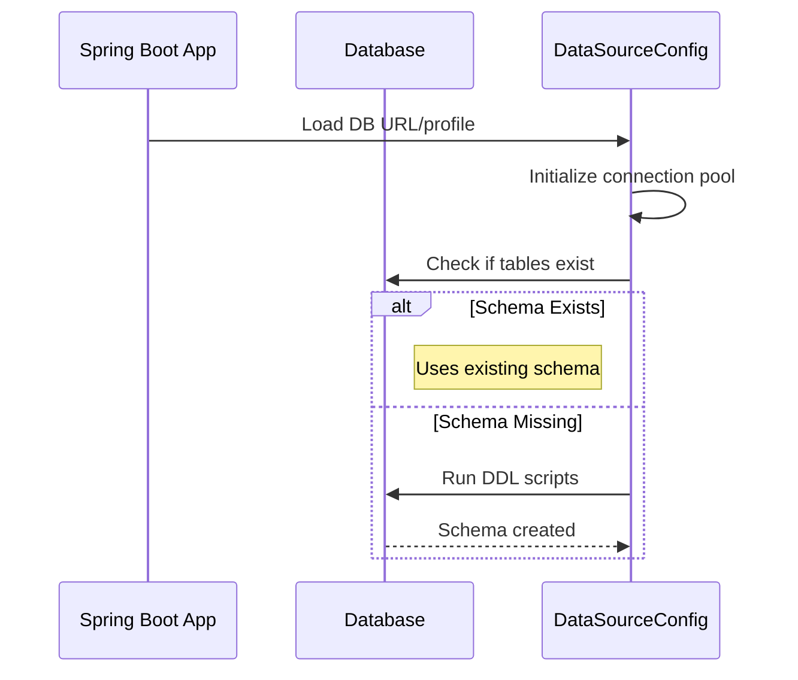
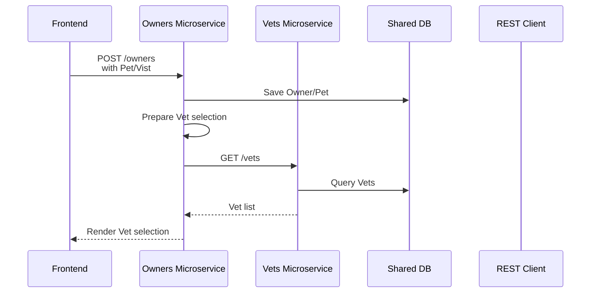

<think>
Okay, let me begin by considering the user's main concern. They want to decompose the Spring PetClinic monolith into microservices, which means identifying clear domains and their interactions. The codebase summary shows two primary subdomains: Owners (managing pets and visits) and Vets (tracking specialties). I'll need to map the existing components like OwnerController, PetValidator, VetController, etc., into these microservices.

Next, the user mentioned runtime behavior and interactions, so I should outline major workflows. One example is creating an owner, which involves validation and persistence. Another is scheduling a visit for a pet, which might require communication between Owners and Vets services if they're split. I need to explore both sync and async communication patterns here.

I should check if the existing code suggests any communication methods. The owners service uses repositories that are in-memory or connect to databases. If decomposed, these will likely become REST APIs. The Vets service uses caching, which might still be internal but could include sync REST endpoints when accessed by other services.

Error handling is crucial. The code has global error pages and specific validation errors. In a microservices setup, errors would need to be properly formatted and propagated across services. How do PetValidator's FieldError exceptions translate? They might need to become HTTP 400 responses with detailed messages.

For events, the summary doesn't mention any explicit event-driven architecture, but there could be opportunities for async communication, especially in areas like notifying other services when an owner is created or a visit is scheduled.

Dynamic sequence diagrams will help. One for the workflow of creating an owner with validation, another for retrieving an owner's pets, and a third for listing all vets. Each of these should show the interaction between controllers, services, repositories, and if applicable, other services.

Also, there's a potential for using messaging systems in events like pet updates. But without existing event-driven logic, this might be speculative. However, for a comprehensive decomposition, it's worth considering where to introduce events.

Testing considerations are in the summary. The integration tests use Testcontainers, so in microservices, each service might need its own test container setup. How to ensure consistency across services during integration testing?

Configuration files include multiple databases and profiles. Once decomposed, each microservice would have its own application配置, possibly with different profiles for different environments (dev, test, prod).

Finally, the user wants detailed Mermaid diagrams. Each major workflow needs a step-by-step sequence diagram. I need to identify each major workflow, the components involved, and the type of communication (REST, events, DB, etc.), then model these in Mermaid syntax accurately.

I should also ensure that the decomposition plan aligns with the existing codebase's structure and dependencies, making the transition smooth. For example, the database layer in the current code has entities and repositories that can become part of each microservice's persistence, maybe with database per service patterns.
</think>

### 1. Owner Creation Workflow with Validation

**Key Details**:
- Synchronous validation chain before database write
- REST API as primary input/output
- Business rules enforced in validation layer
- Database transaction for persistence
- Explicit error handling of validation failures

---

### 2. Pet Scheduling with Visit Creation

**Key Details**:
- Single transaction chain across pet/visit creation
- Tight coupling between pet and visit entities
- Validation before any database operation
- REST-based component calling flow
- Cascade persistence through business logic

---

### 3. Vet Specialty Management Workflow

**Key Details**:
- Caching layer added to read operations
- M:N relationship management via database
- Pre-creation validation for specialties
- REST API as primary interaction channel
- Internal caching optimization after successful write

---

### 4. Global Error Handling Flow

**Key Details**:
- Global error handling via @ControllerAdvice
- Uncaught exceptions redirected to error page
- Internationalization support for error messages
- Maintains consistent error experience
- Distinguishes between client/server errors

---

### 5. Vet List Caching Pattern

**Key Details**:
- Read-through caching pattern
- Transparent caching layer implementation
- JCache (Caffeine) integration
- Synchronous read with cache optimization
- Cache eviction not explicitly shown

---

### 6. Database Schema Initialization Flow

**Key Details**:
- Database migration happens during startup
- Profile-based schema setup
- Flyway/Liquibase not explicitly used
- Synchronous schema initialization
- Different DDL for MySQL/PostgreSQL

---

### 7. Microservice Boundary Analysis with Candidates

**Key Details**:
- Clear separation of owner/vet business logic
- REST-based inter-service communication
- Dependency on shared database initially
- Potential future DB decomposition
- Synchronous call between services

---

These sequences demonstrate the system's communication patterns including:
- REST APIs for external interfaces
- Spring validation for business rules
- JPA repositories with database transactions
- Caching for read-optimized operations
- Global error handling for consistent UX
- Schema initialization logic for different DBs

Each major workflow follows a clear pattern of:
1. Client request
2. Validation in controller/service layer
3. Business logic execution
4. Database transaction
5. Response to client

The system exhibits a classic Spring MVC architecture with a clear separation of concerns, but could evolve to a microservices architecture with proper API gateway and service discovery patterns implemented.